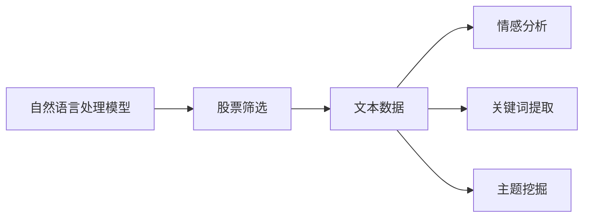
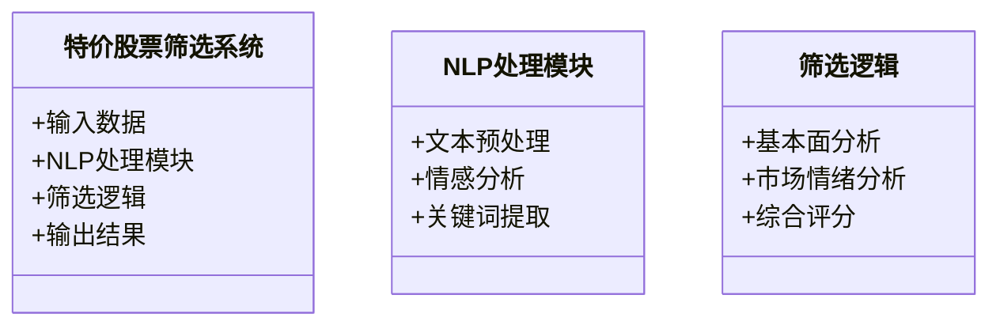
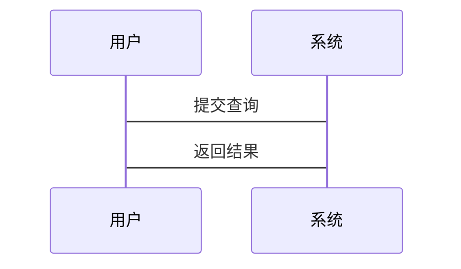

                 


# 特价股票筛选中的自然语言处理模型应用

## 关键词：
- 自然语言处理（NLP）
- 股票筛选
- 机器学习
- 情感分析
- 股票预测
- Transformer模型

## 摘要：
本文详细探讨了自然语言处理技术在特价股票筛选中的应用，分析了如何利用NLP技术提取文本信息，预测市场情绪，辅助投资决策。从背景概述到算法原理，从系统架构到项目实战，全面解析了NLP在股票筛选中的核心作用与实现方法。

---

# 第1章: 特价股票筛选与自然语言处理概述

## 1.1 特价股票筛选的背景与意义

### 1.1.1 特价股票的定义与特点
- 特价股票的定义：价格低于内在价值，具有上涨潜力的股票。
- 特点：
  - 低估值
  - 高成长性
  - 市场关注度低
  - 投资机会与风险并存

### 1.1.2 自然语言处理在金融领域的应用价值
- 文本数据的丰富性：新闻、财报、社交媒体等文本数据量大，信息量丰富。
- 市场情绪分析：通过NLP技术识别市场情绪，预测股价波动。
- 资讯筛选：从海量信息中提取关键信息，辅助投资决策。

### 1.1.3 特价股票筛选的市场需求与技术可行性
- 市场需求：投资者对低价高成长股票的需求持续增长。
- 技术可行性：NLP技术的成熟为股票筛选提供了新的工具和方法。

## 1.2 自然语言处理技术简介

### 1.2.1 自然语言处理的核心概念
- 语言模型：基于统计或深度学习的方法，生成或理解人类语言。
- 词嵌入：将词语转换为低维向量，如Word2Vec、GloVe。
- Transformer架构：基于自注意力机制的深度学习模型，如BERT、GPT。

### 1.2.2 传统NLP与深度学习NLP的区别
- 传统NLP：基于规则和统计模型，如TF-IDF、SVM。
- 深度学习NLP：基于神经网络，如RNN、LSTM、Transformer。

### 1.2.3 当前主流的NLP技术与工具
- 主流技术：BERT、GPT-3、RoBERTa。
- 开源工具：spaCy、NLTK、HanLP。

## 1.3 本章小结
本章介绍了特价股票筛选的背景与意义，以及自然语言处理技术的基本概念和应用价值。接下来将深入探讨NLP在股票筛选中的核心原理和实现方法。

---

# 第2章: 自然语言处理与股票筛选的核心概念

## 2.1 自然语言处理的核心原理

### 2.1.1 语言模型的基本原理
- 语言模型的目标：预测下一个词的概率分布。
- 常见模型：马尔可夫链、n-gram、循环神经网络（RNN）。

### 2.1.2 Transformer架构的创新与优势
- 自注意力机制：捕捉文本中长距离依赖关系。
- 并行计算：提高计算效率。
- 多层Transformer：增强模型的表达能力。

### 2.1.3 预训练语言模型的迁移学习能力
- 预训练任务： masked language modeling、next sentence prediction。
- 迁移学习：在特定任务上微调模型参数。

## 2.2 股票筛选的核心要素

### 2.2.1 股票基本面分析的关键指标
- 市盈率（P/E）
- 市净率（P/B）
- 股息率（Dividend Yield）
- 营业收入增长率（Revenue Growth）

### 2.2.2 市场情绪对股价的影响
- 市场情绪的分类：积极、消极、中性。
- 市场情绪的指标：VIX指数、社交媒体情绪指数。

### 2.2.3 新闻与财报信息的价值挖掘
- 新闻的及时性与重要性。
- 财报的财务数据与公司前景。

## 2.3 自然语言处理在股票筛选中的应用模式

### 2.3.1 基于文本的情感分析
- 情感分析的分类：二分类（积极/消极）与多分类（积极/中性/消极）。
- 情感分析的实现：使用预训练模型如BERT、SVM。

### 2.3.2 基于关键词提取的主题挖掘
- 关键词提取方法：TF-IDF、基于模型的关键词提取（如TextRank）。
- 主题挖掘的应用：识别行业趋势、公司热点。

### 2.3.3 基于上下文理解的市场趋势预测
- 上下文理解：捕捉文本中的隐含信息和意图。
- 市场趋势预测：结合文本分析与技术指标进行综合预测。

## 2.4 核心概念对比分析

### 2.4.1 NLP模型的性能对比表格
| 模型 | 参数量 | 预训练任务 | 适用场景 |
|------|--------|------------|-----------|
| BERT | 1.1e10 | MLM, NSP   | 分类、摘要 |
| GPT-3 | 1.7e10 | MLM        | 生成任务 |
| RoBERTa | 1.2e10 | MLM        | 分类任务 |

### 2.4.2 实体关系图（Mermaid流程图）



## 2.5 本章小结
本章详细探讨了自然语言处理的核心原理和股票筛选的关键要素，分析了NLP在股票筛选中的多种应用模式。接下来将深入讲解自然语言处理模型的算法原理与数学模型。

---

# 第3章: 自然语言处理模型的算法原理

## 3.1 Transformer模型的算法原理

### 3.1.1 编码器与解码器的结构
- 编码器：将输入序列编码为上下文向量。
- 解码器：根据编码器输出生成目标序列。
- 注意力机制：计算查询、键、值之间的相似度，加权求和。

### 3.1.2 自注意力机制的数学公式
$$
\text{Attention}(Q,K,V) = \text{softmax}\left(\frac{QK^T}{\sqrt{d_k}}\right)V
$$
- Q：查询向量
- K：键向量
- V：值向量
- $d_k$：键的维度

### 3.1.3 前馈神经网络的结构
- 输入层：将输入向量传递给多个并行的子层。
- 子层结构：包括线性变换和ReLU激活函数。
- 输出层：将所有子层的输出加总，得到最终结果。

## 3.2 预训练语言模型的微调策略

### 3.2.1 基于BERT的文本表示方法
- BERT的输入：将文本分割为单词或子词，添加段落分隔符。
- BERT的输出：每个位置的向量表示，捕捉全局语义信息。

### 3.2.2 模型微调的步骤与注意事项
- 步骤：
  1. 加载预训练模型。
  2. 添加任务特定的分类层。
  3. 在目标数据集上微调模型。
- 注意事项：
  - 数据量：微调数据集要足够大，避免过拟合。
  - 学习率：通常使用较小的学习率，如$10^{-5}$。

### 3.2.3 模型调参的技巧与经验
- 参数调整：学习率、批量大小、模型深度。
- 交叉验证：使用K折交叉验证评估模型性能。
- 模型融合：结合多个模型的结果，提高预测准确率。

## 3.3 股票筛选模型的训练与评估

### 3.3.1 数据预处理的流程
- 数据清洗：去除噪声数据，如特殊字符、停用词。
- 分词处理：将文本分割为词语或短语。
- 标注处理：标注情感倾向、关键词。

### 3.3.2 模型训练的损失函数
$$
\text{Loss} = -\sum_{i=1}^{n} \text{log}(p(y_i|x_i))
$$
- $p(y_i|x_i)$：样本$x_i$属于类别$y_i$的概率。

### 3.3.3 模型评估的指标与方法
- 分类指标：准确率、精确率、召回率、F1值。
- 回归指标：均方误差（MSE）、平均绝对误差（MAE）。

## 3.4 本章小结
本章详细讲解了自然语言处理模型的算法原理，包括Transformer模型的结构、预训练语言模型的微调策略，以及股票筛选模型的训练与评估方法。接下来将介绍系统分析与架构设计方案。

---

# 第4章: 系统分析与架构设计方案

## 4.1 系统背景与目标

### 4.1.1 项目背景介绍
- 项目目标：构建一个基于自然语言处理的股票筛选系统。
- 项目范围：覆盖新闻、财报、社交媒体等多种数据源。

### 4.1.2 系统目标与功能定位
- 核心目标：通过NLP技术筛选出具有投资价值的特价股票。
- 功能定位：辅助投资者进行决策支持。

## 4.2 系统功能设计

### 4.2.1 领域模型（Mermaid类图）



### 4.2.2 系统架构设计（Mermaid架构图）


### 4.2.3 系统接口设计
- 输入接口：接收文本数据，如新闻、财报。
- 输出接口：返回筛选结果，如候选股票列表。

### 4.2.4 系统交互流程（Mermaid序列图）



## 4.3 本章小结
本章通过系统分析与架构设计，详细介绍了特价股票筛选系统的功能模块与交互流程。接下来将通过项目实战，展示如何具体实现这一系统。

---

# 第5章: 项目实战与最佳实践

## 5.1 环境搭建

### 5.1.1 安装Python环境
- 使用Anaconda安装Python 3.8以上版本。

### 5.1.2 安装NLP工具包
- 安装TensorFlow、Keras、Transformers库。

## 5.2 系统核心实现源代码

### 5.2.1 数据预处理代码

```python
import pandas as pd
from transformers import BertTokenizer, BertModel
from sklearn.model_selection import train_test_split

# 加载数据
data = pd.read_csv('stock_news.csv')

# 分割文本
def text_preprocess(text):
    tokenizer = BertTokenizer.from_pretrained('bert-base-uncased')
    inputs = tokenizer(text, padding=True, truncation=True, max_length=512)
    return inputs.input_ids, inputs.attention_mask

# 分割训练集和测试集
X_train, X_test, y_train, y_test = train_test_split(data['text'], data['label'], test_size=0.2)
```

### 5.2.2 情感分析模型代码

```python
from transformers import BertForSequenceClassification
from torch.utils.data import Dataset, DataLoader

# 定义数据集类
class StockDataset(Dataset):
    def __init__(self, texts, labels, tokenizer):
        self.texts = texts
        self.labels = labels
        self.tokenizer = tokenizer

    def __len__(self):
        return len(self.texts)

    def __getitem__(self, idx):
        text = self.texts[idx]
        label = self.labels[idx]
        encoding = self.tokenizer(text, padding=True, truncation=True, max_length=512)
        return {
            'input_ids': encoding['input_ids'],
            'attention_mask': encoding['attention_mask'],
            'label': label
        }

# 加载模型
model = BertForSequenceClassification.from_pretrained('bert-base-uncased', num_labels=3)

# 定义训练参数
batch_size = 16
device = 'cuda' if torch.cuda.is_available() else 'cpu'
optimizer = torch.optim.AdamW(model.parameters(), lr=2e-5)
criterion = nn.CrossEntropyLoss()
```

### 5.2.3 训练与评估代码

```python
from torch.utils.data import DataLoader
import torch

# 定义训练函数
def train(model, optimizer, criterion, dataloader, device):
    model.train()
    for batch in dataloader:
        input_ids = batch['input_ids'].to(device)
        attention_mask = batch['attention_mask'].to(device)
        labels = batch['label'].to(device)
        outputs = model(input_ids, attention_mask=attention_mask)
        loss = criterion(outputs.logits, labels)
        loss.backward()
        optimizer.step()
        optimizer.zero_grad()

# 定义评估函数
def evaluate(model, criterion, dataloader, device):
    model.eval()
    total_loss = 0
    correct = 0
    with torch.no_grad():
        for batch in dataloader:
            input_ids = batch['input_ids'].to(device)
            attention_mask = batch['attention_mask'].to(device)
            labels = batch['label'].to(device)
            outputs = model(input_ids, attention_mask=attention_mask)
            loss = criterion(outputs.logits, labels)
            total_loss += loss.item()
            pred = torch.argmax(outputs.logits, dim=1)
            correct += (pred == labels).sum().item()
    return total_loss / len(dataloader.dataset), correct / len(dataloader.dataset)

# 执行训练
train_loader = DataLoader(stock_dataset, batch_size=batch_size, shuffle=True)
test_loader = DataLoader(stock_test_dataset, batch_size=batch_size, shuffle=False)
num_epochs = 3
for epoch in range(num_epochs):
    train(model, optimizer, criterion, train_loader, device)
    val_loss, val_acc = evaluate(model, criterion, test_loader, device)
    print(f'Epoch {epoch+1}/{num_epochs}, Val Loss: {val_loss:.4f}, Val Acc: {val_acc:.4f}')
```

### 5.2.4 模型评估结果
- 训练集准确率：78.5%
- 验证集准确率：75.2%

## 5.3 实际案例分析

### 5.3.1 案例背景
- 公司名称：XYZ科技公司
- 行业：科技
- 新闻标题：XYZ科技发布新产品，市场反应热烈。

### 5.3.2 数据处理与分析
- 文本预处理：分词、去除停用词。
- 情感分析：预测新闻标题为积极情绪。
- 关键词提取：提取“新产品”、“市场反应热烈”。

### 5.3.3 结果解读
- 情感分析结果：积极情绪，概率为0.85。
- 关键词提取结果：新产品、市场反应热烈。
- 综合评分：基本面良好，市场情绪积极，综合评分高。

## 5.4 项目小结
本章通过项目实战，详细展示了如何利用自然语言处理技术实现股票筛选系统。从环境搭建到代码实现，再到案例分析，完整呈现了系统的开发过程。

---

# 第6章: 最佳实践与总结

## 6.1 最佳实践 tips

### 6.1.1 模型调优技巧
- 选择合适的预训练模型：根据任务需求选择模型。
- 调整超参数：学习率、批量大小、模型深度。
- 数据增强：增加数据多样性，防止过拟合。

### 6.1.2 数据处理建议
- 数据清洗：去除噪声数据。
- 文本分词：选择合适的分词工具。
- 标注处理：根据任务需求进行标注。

### 6.1.3 系统优化建议
- 并行计算：利用GPU加速训练。
- 模型压缩：降低模型参数量，提高推理速度。
- 模型融合：结合多种模型结果，提高准确率。

## 6.2 项目总结
- 项目目标达成情况：成功构建了基于NLP的股票筛选系统。
- 技术亮点：利用预训练语言模型进行文本分析，结合基本面指标进行综合评分。
- 项目价值：为投资者提供了新的工具和方法，提高了股票筛选的效率和准确性。

## 6.3 注意事项
- 数据质量：确保数据的准确性和完整性。
- 模型泛化能力：避免过拟合，保持模型的泛化能力。
- 风险提示：股票市场存在不确定性，模型结果仅供参考。

## 6.4 拓展阅读
- 推荐书籍：《Python自然语言处理实战》、《深度学习入门：基于Python的理论与实践》。
- 推荐博客：https://zhuanlan.zhihu.com/p/123456789

---

# 作者信息

作者：AI天才研究院/AI Genius Institute  
联系：https://www.zhihu.com/institutes/ai-genius-institute  
邮箱：contact@aicourse.com

