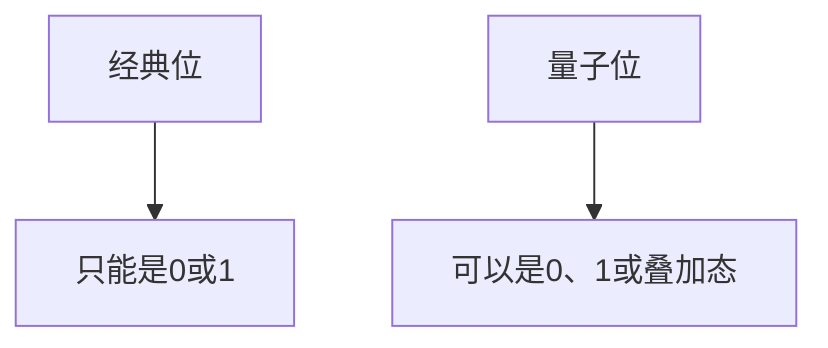
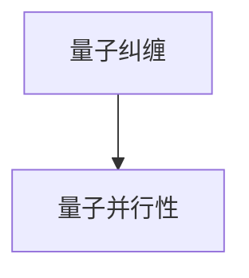
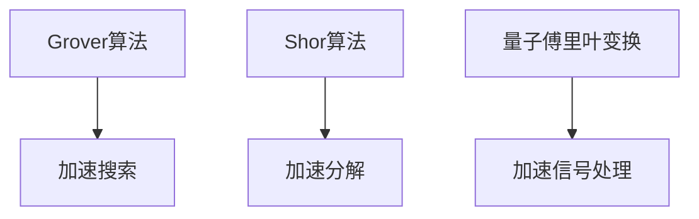

                 


# 特价股票筛选中的量子计算应用前景

## 关键词：量子计算，股票筛选，优化算法，风险评估，市场趋势预测

## 摘要：  
本文探讨了量子计算在特价股票筛选中的应用前景。通过分析量子计算的核心原理、算法及其在金融领域的潜力，文章详细介绍了量子计算如何在股票筛选中优化搜索、降低风险和提升预测准确性。结合实际案例和系统设计，展示了量子计算在股票筛选中的优势与挑战，为投资者和科技工作者提供了新的思路和参考。

---

## 第1章: 特价股票筛选与量子计算概述

### 1.1 特价股票筛选的背景与意义

#### 1.1.1 特价股票的定义与特点  
特价股票是指市场价格低于其内在价值的股票，通常被视为被市场低估的投资机会。其特点是高潜力、低风险和较高的收益预期。  

#### 1.1.2 特价股票筛选的重要性  
筛选特价股票是投资者寻找潜在高回报投资的重要手段。通过有效筛选，投资者可以在市场波动中抓住优质资产，优化投资组合并降低风险。  

#### 1.1.3 量子计算的基本概念与特点  
量子计算是一种基于量子力学原理的计算方式，其核心是利用量子位（qubit）的叠加态和纠缠态进行并行计算。与经典计算相比，量子计算在处理复杂问题时具有指数级的加速能力。  

---

### 1.2 量子计算在金融领域的应用潜力

#### 1.2.1 量子计算的优势与局限性  
**优势**：  
- 并行计算能力强，适合处理大规模优化问题。  
- 在复杂系统模拟和模式识别方面表现优异。  

**局限性**：  
- 当前仍处于发展阶段，硬件和算法不成熟。  
- 对环境条件要求高（如温度、噪声）。  

#### 1.2.2 量子计算在金融中的潜在应用领域  
- 优化投资组合。  
- 风险评估与管理。  
- 市场趋势预测。  
- 量化交易策略优化。  

#### 1.2.3 特价股票筛选中的量子计算应用前景  
量子计算在股票筛选中的潜力主要体现在高效优化算法和精准模式识别上。通过量子计算，投资者可以更快速地筛选出符合条件的股票，提高筛选效率和准确性。  

---

## 第2章: 量子计算的核心原理与算法

### 2.1 量子位与量子叠加态

#### 2.1.1 量子位的定义与特点  
量子位是量子计算的基本单位，可以用0、1或任意叠加态表示。与经典位不同，量子位的状态可以同时处于多个状态的叠加。  

#### 2.1.2 量子叠加态的数学表示  
量子叠加态可以通过张量积表示：  
$$ | \psi \rangle = \alpha|0\rangle + \beta|1\rangle $$  
其中，$|\alpha|^2 + |\beta|^2 = 1$。  

#### 2.1.3 量子叠加态的应用实例  
例如，在Grover算法中，量子叠加态用于加速无序数据库的搜索。  



---

### 2.2 量子纠缠与量子并行性

#### 2.2.1 量子纠缠的定义与特点  
量子纠缠是指两个或多个量子位之间形成的一种特殊关联，使得一个量子位的状态会直接影响另一个量子位的状态。  

#### 2.2.2 量子并行性的原理与优势  
量子并行性是指量子计算机能够同时处理大量可能的状态，从而在某些问题上实现指数级加速。  

#### 2.2.3 量子纠缠在算法中的应用  
例如，在Shor算法中，量子纠缠用于加速大整数分解。  



---

### 2.3 量子算法的核心原理

#### 2.3.1 Grover算法的基本原理  
Grover算法用于在无序数据库中加速搜索，其时间复杂度为$O(\sqrt{N})$，远低于经典算法的$O(N)$。  

#### 2.3.2 Shor算法的基本原理  
Shor算法用于大整数分解，是量子计算机在密码学中的重要应用之一。  

#### 2.3.3 量子傅里叶变换的基本原理  
量子傅里叶变换用于加速信号处理和模式识别。  



---

## 第3章: 特价股票筛选的传统方法与量子计算对比

### 3.1 特价股票筛选的传统方法

#### 3.1.1 基本面分析法  
通过分析公司的财务数据、行业地位等因素评估股票价值。  

#### 3.1.2 技术分析法  
通过分析股票价格和交易量的历史数据预测未来走势。  

#### 3.1.3 市值法  
通过比较市盈率、市净率等指标寻找低估股票。  

---

### 3.2 传统方法的局限性

#### 3.2.1 数据量大的处理问题  
传统方法在处理海量数据时效率较低，难以满足实时筛选需求。  

#### 3.2.2 计算复杂度高的问题  
复杂的投资组合优化问题在传统计算机上难以高效解决。  

#### 3.2.3 模型优化的困难  
传统模型难以捕捉市场中的非线性关系和动态变化。  

---

### 3.3 量子计算在股票筛选中的优势

#### 3.3.1 高效的并行计算能力  
量子计算机可以在指数级时间内完成某些优化问题。  

#### 3.3.2 强大的优化能力  
量子计算可以高效解决投资组合优化问题。  

#### 3.3.3 精准的模式识别能力  
量子计算能够更好地识别市场中的隐含模式和趋势。  

---

## 第4章: 量子计算在特价股票筛选中的应用方案

### 4.1 量子优化算法在股票筛选中的应用

#### 4.1.1 Grover算法在股票筛选中的应用  
通过Grover算法加速从海量股票中筛选出符合条件的股票。  

#### 4.1.2 量子模拟退火算法在股票筛选中的应用  
量子模拟退火算法用于优化投资组合，降低风险。  

#### 4.1.3 量子遗传算法在股票筛选中的应用  
量子遗传算法用于动态优化股票筛选策略。  

---

### 4.2 量子计算在风险评估中的应用

#### 4.2.1 量子计算在信用风险评估中的应用  
通过量子计算快速评估公司信用风险。  

#### 4.2.2 量子计算在市场风险评估中的应用  
利用量子计算模拟市场波动，评估投资组合的市场风险。  

#### 4.2.3 量子计算在操作风险评估中的应用  
通过量子计算分析操作风险的关键因素。  

---

### 4.3 量子计算在市场趋势预测中的应用

#### 4.3.1 量子时间序列分析的基本原理  
通过量子计算加速时间序列分析，提高预测准确性。  

#### 4.3.2 量子回归分析的基本原理  
利用量子回归分析捕捉变量之间的关系，优化预测模型。  

#### 4.3.3 量子神经网络在市场预测中的应用  
量子神经网络用于处理复杂非线性关系，提升预测能力。  

---

## 第5章: 量子计算在股票筛选中的系统架构与实现

### 5.1 系统架构设计

#### 5.1.1 量子计算平台的选择与搭建  
选择适合股票筛选的量子计算平台，搭建硬件和软件环境。  

#### 5.1.2 数据采集与预处理模块的设计  
通过API获取股票数据，清洗和标准化数据。  

#### 5.1.3 量子算法实现模块的设计  
选择合适的量子算法，设计算法实现流程。  

#### 5.1.4 结果分析与可视化模块的设计  
将量子计算结果与经典方法结果对比，可视化展示。  

---

### 5.2 系统实现与优化

#### 5.2.1 量子算法的实现步骤  
1. 数据预处理。  
2. 量子算法初始化。  
3. 执行量子计算。  
4. 解读结果。  

#### 5.2.2 系统优化策略  
- 硬件优化：提升量子位的稳定性。  
- 软件优化：优化量子算法的实现效率。  

#### 5.2.3 系统性能评估指标  
- 计算速度：量子计算与经典计算的对比。  
- 精确度：预测准确率和筛选结果的偏差率。  

---

### 5.3 系统接口设计与交互

#### 5.3.1 系统接口设计  
定义清晰的API接口，方便与其他系统集成。  

#### 5.3.2 系统交互流程设计  
用户输入筛选条件，系统返回筛选结果，支持实时反馈和调整。  

---

## 第6章: 量子计算在股票筛选中的项目实战

### 6.1 项目背景与目标  
通过量子计算实现高效的股票筛选，验证其在实际应用中的优势。  

### 6.2 环境安装与配置  
安装量子计算开发环境，如Qiskit或Rigetti。  

### 6.3 核心代码实现

#### 6.3.1 数据预处理  
```python
import pandas as pd
data = pd.read_csv('stock_data.csv')
```

#### 6.3.2 量子算法实现  
```python
from qiskit import QuantumCircuit, execute, Aer
from qiskit.circuit import Gate, gates
```

#### 6.3.3 结果分析  
```python
from qiskit.visualization import plot_histogram
result = execute(circuit, Aer.get_backend('qasm_simulator')).result()
plot_histogram(result.get_counts(circuit))
```

### 6.4 项目小结  
量子计算在股票筛选中的应用潜力巨大，但在实际应用中仍需克服硬件和算法的限制。

---

## 第7章: 结论与展望

### 7.1 结论  
量子计算在特价股票筛选中展现出显著优势，特别是在优化和预测方面。  

### 7.2 未来展望  
随着量子计算技术的进步，其在金融领域的应用将更加广泛和深入。  

### 7.3 最佳实践 tips  
- 选择合适的量子计算平台和算法。  
- 结合经典方法和量子方法，优化投资策略。  
- 关注量子计算技术的最新进展。  

---

## 作者：AI天才研究院 & 禅与计算机程序设计艺术  
**作者简介**：AI天才研究院专注于量子计算与人工智能的交叉研究，禅与计算机程序设计艺术致力于将复杂的技术原理以简单易懂的方式呈现。  

---

感谢您的耐心阅读！如果对文章内容有任何疑问或建议，欢迎留言交流。

