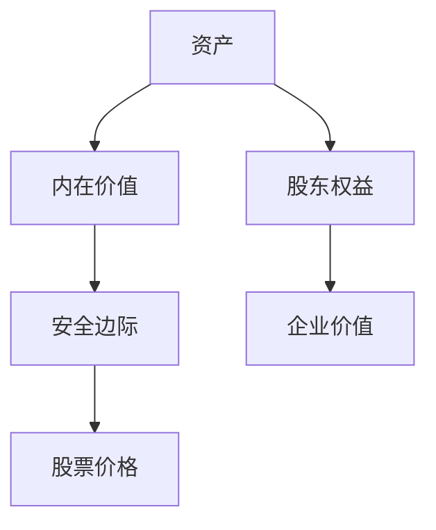
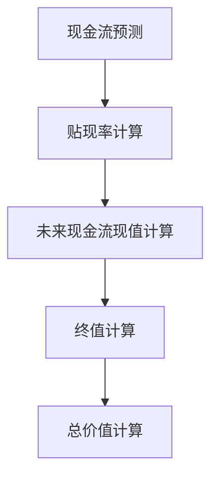
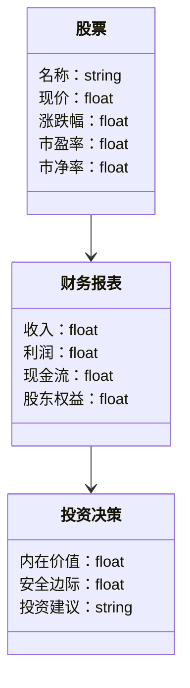
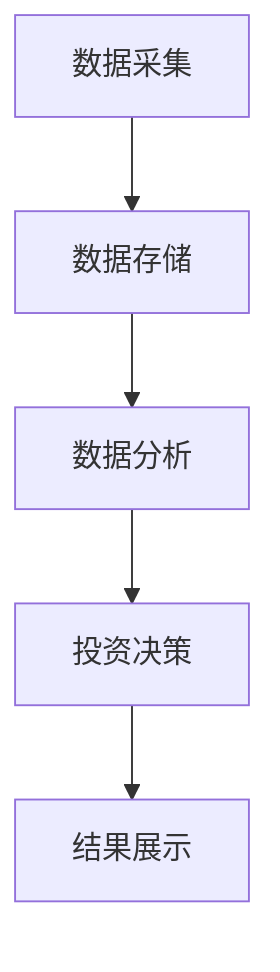
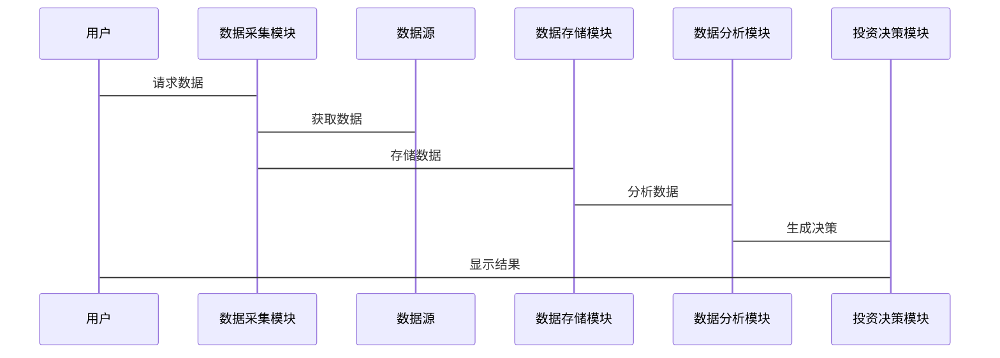

                 


# 玛丽·巴芙的全球价值投资策略

> 关键词：价值投资，玛丽·巴芙，现金流折现模型，内在价值，安全边际

> 摘要：本文深入探讨了玛丽·巴芙的全球价值投资策略，从其核心理念、数学模型到系统架构进行了全面分析。文章详细讲解了价值投资的背景、核心概念、算法原理、数学模型、系统架构、项目实战及最佳实践，帮助读者全面理解并应用这一经典投资策略。

---

## 第一部分: 全球价值投资策略的背景与核心理念

### 第1章: 价值投资的起源与发展

#### 1.1 价值投资的起源
##### 1.1.1 价值投资的定义与核心理念
价值投资是一种以基本面分析为基础的投资策略，其核心理念是寻找市场低估的资产并长期持有，以实现超额收益。玛丽·巴芙（Mary Buffett）作为价值投资的代表人物，继承并发展了其导师本杰明·格雷厄姆（Benjamin Graham）的价值投资理论。

##### 1.1.2 玛丽·巴芙的贡献与投资哲学
玛丽·巴芙以其独特的投资哲学闻名，她强调安全边际、长期投资和复利效应。她认为，投资者应关注企业的内在价值，而非市场的短期波动。她的投资哲学的核心在于“买Cheap，卖Dear”，即以低于内在价值的价格买入，以高于内在价值的价格卖出。

##### 1.1.3 价值投资与现代金融理论的结合
价值投资并非孤立的理论，它与现代金融理论有诸多交集。例如，现金流折现模型（DCF）是价值投资的重要工具，而CAPM（资本资产定价模型）则为评估股票的合理定价提供了理论支持。通过将价值投资与现代金融理论结合，投资者可以更科学地进行投资决策。

#### 1.2 玛丽·巴芙的投资理念
##### 1.2.1 长期投资与复利效应
玛丽·巴芙强调长期投资的重要性。她认为，复利效应是投资收益的最重要驱动力，而长期持有优质资产是实现复利效应的最佳方式。

##### 1.2.2 安全边际的概念与应用
安全边际是价值投资的核心概念之一。玛丽·巴芙认为，投资者应以低于内在价值的价格买入资产，以确保在市场波动时仍能获得超额收益。安全边际的计算通常基于对企业基本面的深入分析。

##### 1.2.3 股票估值的核心要素
玛丽·巴芙提出了股票估值的核心要素，包括企业的盈利能力、成长能力、财务健康状况和行业地位。她认为，只有全面分析这些要素，才能准确评估企业的内在价值。

#### 1.3 价值投资的适用性与局限性
##### 1.3.1 价值投资的适用场景
价值投资适用于那些市场低估、基本面良好、行业地位稳固的企业。在市场低迷或熊市中，价值投资策略往往表现更为优异。

##### 1.3.2 价值投资的局限性与挑战
尽管价值投资具有显著的优势，但也存在一些局限性。例如，市场短期波动可能会影响价值投资的收益，而对企业基本面的误判也可能导致投资失败。

##### 1.3.3 价值投资与市场周期的关系
价值投资与市场周期密切相关。在市场繁荣时，价值投资可能表现不佳，但在市场低迷时，价值投资往往能够捕捉到被低估的资产。

#### 1.4 本章小结
本章从价值投资的起源、玛丽·巴芙的投资哲学及其核心理念出发，详细阐述了价值投资的基本概念和适用场景。通过分析安全边际和股票估值的核心要素，读者可以更好地理解价值投资的内在逻辑。

---

### 第2章: 价值投资的核心概念与联系

#### 2.1 价值投资的核心概念
##### 2.1.1 资产的内在价值
资产的内在价值是其未来现金流的现值。玛丽·巴芙认为，内在价值是决定资产价格的唯一标准，而市场价只是对内在价值的短期偏离。

##### 2.1.2 安全边际的计算方法
安全边际是内在价值与市场价格之间的差额。通过计算安全边际，投资者可以确定何时买入或卖出资产。例如，如果一只股票的内在价值为100元，市场价格为80元，安全边际为20元。

##### 2.1.3 股东权益与企业价值的关系
股东权益是企业净资产的体现，而企业价值则是企业整体价值的评估。玛丽·巴芙认为，股东权益是评估企业价值的重要指标，而企业价值则是决定股票价格的关键因素。

#### 2.2 核心概念的联系与对比
##### 2.2.1 价值投资与成长型投资的对比
价值投资注重资产的内在价值，而成长型投资注重企业的成长潜力。两者的核心区别在于，价值投资者关注低估资产，而成长投资者关注高增长企业。

##### 2.2.2 价值投资与趋势投资的对比
价值投资强调基本面分析，而趋势投资强调技术分析。两者的核心区别在于，价值投资者关注资产的内在价值，而趋势投资者关注市场的短期走势。

##### 2.2.3 价值投资与股息投资的对比
价值投资注重资产的长期收益，而股息投资注重短期分红。两者的核心区别在于，价值投资者关注企业的整体价值，而股息投资者关注企业的分红能力。

#### 2.3 实体关系图（ER图）


#### 2.4 本章小结
本章通过分析价值投资的核心概念，包括资产的内在价值、安全边际和股东权益，帮助读者理解这些概念之间的联系。通过对比价值投资与其他投资策略，读者可以更好地把握价值投资的独特性。

---

### 第3章: 价值投资的数学模型与算法原理

#### 3.1 股票估值的数学模型
##### 3.1.1 现金流折现模型（DCF）
现金流折现模型是价值投资的核心工具之一。DCF模型通过预测企业的未来现金流，并将其折现为现值，以评估企业的内在价值。

##### 3.1.2 市盈率与市净率模型
市盈率（P/E）和市净率（P/B）是常用的估值指标。市盈率反映了企业的盈利能力和市场估值，而市净率反映了企业的资产质量和市场估值。

##### 3.1.3 内在价值的计算公式
资产的内在价值可以通过以下公式计算：
$$
\text{内在价值} = \sum_{t=1}^{n} \frac{\text{现金流}_t}{(1 + r)^t}
$$
其中，\( r \) 是折现率，\( \text{现金流}_t \) 是第 \( t \) 年的现金流。

#### 3.2 现金流折现模型（DCF）的算法原理
##### 3.2.1 算法流程图


##### 3.2.2 Python代码实现
以下是一个现金流折现模型的Python代码示例：
```python
def discounted_cash_flow(cash_flows, discount_rate):
    present_value = sum(cash_flow / (1 + discount_rate)**i for i, cash_flow in enumerate(cash_flows))
    return present_value

cash_flows = [100, 200, 300, 400]
discount_rate = 0.05
intrinsic_value = discounted_cash_flow(cash_flows, discount_rate)
print("内在价值为：", intrinsic_value)
```

##### 3.2.3 通俗易懂的举例说明
假设一家企业未来四年的现金流分别为100万元、200万元、300万元和400万元，折现率为5%。根据DCF模型，其内在价值为：
$$
\text{内在价值} = \frac{100}{1.05} + \frac{200}{1.05^2} + \frac{300}{1.05^3} + \frac{400}{1.05^4}
$$
计算结果为：
$$
\text{内在价值} \approx 735.81 \text{万元}
$$

#### 3.3 数学模型的扩展与应用
##### 3.3.1 市盈率与市净率的计算公式
市盈率（P/E）的计算公式为：
$$
\text{市盈率} = \frac{\text{股价}}{\text{每股收益}}
$$
市净率（P/B）的计算公式为：
$$
\text{市净率} = \frac{\text{股价}}{\text{每股净资产}}
$$

##### 3.3.2 现金流折现模型的优缺点
现金流折现模型的优点在于其科学性和准确性，缺点在于其对折现率的敏感性和对现金流预测的依赖性。

#### 3.4 本章小结
本章通过详细讲解价值投资的数学模型，包括现金流折现模型和市盈率、市净率模型，帮助读者掌握了这些模型的原理和应用。通过Python代码示例和实际案例分析，读者可以更好地理解这些模型的计算过程和实际应用。

---

## 第二部分: 价值投资的系统架构与项目实战

### 第4章: 系统分析与架构设计方案

#### 4.1 问题场景介绍
在实际投资过程中，投资者需要面对海量数据和复杂决策。因此，构建一个高效的投资决策支持系统显得尤为重要。

#### 4.2 系统功能设计
##### 4.2.1 领域模型（领域模型mermaid类图）


##### 4.2.2 系统架构设计（系统架构mermaid架构图）


##### 4.2.3 系统接口设计
系统接口设计包括数据接口和用户接口。数据接口负责与数据源交互，用户接口负责与用户交互。

##### 4.2.4 系统交互（系统交互mermaid序列图）


#### 4.3 本章小结
本章通过系统分析与架构设计，帮助读者构建了一个高效的投资决策支持系统。通过领域模型、系统架构图和系统交互图，读者可以更好地理解系统的运作流程。

### 第5章: 项目实战

#### 5.1 环境安装与配置
##### 5.1.1 安装必要的Python库
读者需要安装以下Python库：
```
pip install pandas numpy matplotlib
```

#### 5.2 系统核心实现
##### 5.2.1 现金流折现模型的实现
以下是现金流折现模型的Python代码实现：
```python
import numpy as np
import pandas as pd

def discounted_cash_flow(cash_flows, discount_rate):
    return np.npv(discount_rate, cash_flows)

cash_flows = np.array([100, 200, 300, 400])
discount_rate = 0.05
intrinsic_value = discounted_cash_flow(cash_flows, discount_rate)
print("内在价值为：", intrinsic_value)
```

##### 5.2.2 投资决策系统的实现
以下是投资决策系统的Python代码实现：
```python
import pandas as pd
import numpy as np

def calculate_intrinsic_value(financial_data, discount_rate):
    cash_flows = financial_data['现金流'].values
    return np.npv(discount_rate, cash_flows)

def calculate_margin_of_safety(price, intrinsic_value):
    return intrinsic_value - price

# 示例数据
financial_data = pd.DataFrame({
    '现金流': [100, 200, 300, 400]
})
price = 80
discount_rate = 0.05

intrinsic_value = calculate_intrinsic_value(financial_data, discount_rate)
margin_of_safety = calculate_margin_of_safety(price, intrinsic_value)

print("内在价值为：", intrinsic_value)
print("安全边际为：", margin_of_safety)
```

#### 5.3 代码应用解读与分析
##### 5.3.1 现金流折现模型的代码解读
现金流折现模型的代码通过计算未来现金流的现值，评估企业的内在价值。代码使用了numpy的npv函数，计算过程简单直观。

##### 5.3.2 投资决策系统的代码解读
投资决策系统的代码通过读取企业的财务数据，计算其内在价值和安全边际，从而生成投资建议。代码结构清晰，易于扩展。

#### 5.4 实际案例分析与详细讲解
##### 5.4.1 案例背景介绍
假设我们有一家企业的财务数据如下：
```
现金流（万元）：100, 200, 300, 400
折现率：5%
市场价格：80万元
```

##### 5.4.2 计算内在价值
根据现金流折现模型，企业的内在价值为：
$$
\text{内在价值} = \frac{100}{1.05} + \frac{200}{1.05^2} + \frac{300}{1.05^3} + \frac{400}{1.05^4} \approx 735.81 \text{万元}
$$

##### 5.4.3 计算安全边际
安全边际为：
$$
\text{安全边际} = 735.81 - 80 = 655.81 \text{万元}
$$

##### 5.4.4 投资建议
由于安全边际为正，且市场价格远低于内在价值，建议买入该股票。

#### 5.5 本章小结
本章通过实际案例分析，详细讲解了价值投资策略的应用。通过代码实现和案例分析，读者可以更好地掌握价值投资的实践方法。

---

## 第三部分: 总结与最佳实践

### 第6章: 总结与最佳实践

#### 6.1 本章小结
本文从背景介绍、核心概念、算法原理、数学模型、系统架构到项目实战，全面分析了玛丽·巴芙的全球价值投资策略。通过理论与实践相结合，读者可以更好地理解并应用这一经典投资策略。

#### 6.2 最佳实践 tips
##### 6.2.1 投资策略的注意事项
投资者在实际操作中，应注重以下几点：
1. **长期投资**：避免频繁交易，降低交易成本。
2. **安全边际**：确保买入价格低于内在价值。
3. **基本面分析**：深入分析企业的财务数据和行业地位。
4. **市场周期**：关注市场周期，灵活调整投资策略。

##### 6.2.2 投资系统的维护与优化
投资系统的维护与优化包括：
1. **数据更新**：及时更新企业的财务数据。
2. **模型优化**：根据市场变化，优化现金流折现模型。
3. **系统升级**：根据技术发展，升级投资决策支持系统。

#### 6.3 拓展阅读
##### 6.3.1 经典书籍推荐
1. 《投资之道》（The Intelligent Investor）—— 本杰明·格雷厄姆
2. 《巴菲特致股东的信》（Letters to Shareholders）—— 巴菲特
3. 《价值投资实战策略》（Value Investing: A Practical Approach）—— 玛丽·巴芙

##### 6.3.2 网络资源与工具
1. **投资论坛**：雪球、东方财富网
2. **投资工具**：Morningstar、FactSet
3. **数据分析工具**：Python、R、Excel

#### 6.4 本章小结
本章通过总结与最佳实践，帮助读者更好地掌握了玛丽·巴芙的价值投资策略。通过注意事项、系统维护与优化以及拓展阅读，读者可以进一步提升自己的投资能力。

---

## 作者：AI天才研究院/AI Genius Institute & 禅与计算机程序设计艺术/Zen And The Art of Computer Programming

