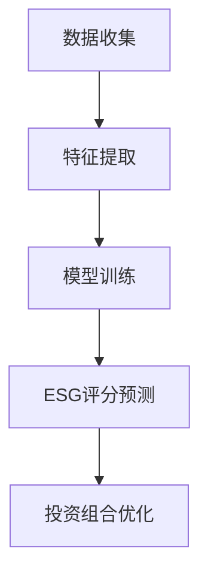
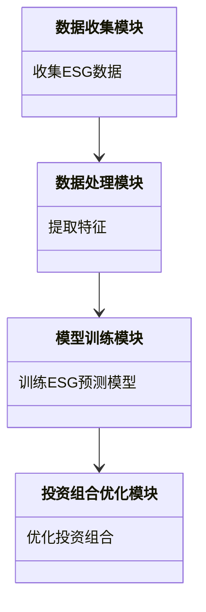

                 


# 玛丽·巴芙的可持续发展投资策略

## 关键词
- 可持续投资
- 玛丽·巴芙
- ESG
- 投资策略
- 算法原理
- 数学模型
- 系统架构

## 摘要
本文深入分析了玛丽·巴芙的可持续发展投资策略，探讨了其在投资决策中的核心作用。通过背景介绍、核心概念、算法原理、数学模型、系统架构和项目实战，本文详细解读了可持续投资的背景、ESG评估方法、量化模型及系统实现。结合实际案例，本文展示了如何将玛丽·巴芙的投资理念应用于实践，并总结了最佳实践和未来展望。

---

## 第一部分：背景介绍

### 第1章：可持续发展投资的背景

#### 1.1 可持续投资的背景与现状
- **1.1.1 可持续投资的定义与内涵**
  可持续投资（Sustainable Investment）是一种关注环境、社会和治理（ESG）因素的投资策略，旨在在追求财务回报的同时，促进社会和环境的可持续发展。

- **1.1.2 当前全球投资环境中的可持续发展趋势**
  随着全球对气候变化、社会责任和公司治理的关注增加，可持续投资已成为全球投资领域的重要趋势。越来越多的投资者意识到，将ESG因素纳入投资决策可以降低风险，提高长期收益。

- **1.1.3 可持续投资与传统投资的对比分析**
  传统投资主要关注财务回报，而可持续投资则在财务回报之外，考虑公司的环境影响、社会责任和治理结构。这种区别使得可持续投资在风险管理和长期收益方面具有独特优势。

#### 1.2 玛丽·巴芙的投资理念
- **1.2.1 玛丽·巴芙的长期价值投资策略**
  玛丽·巴芙强调长期价值投资，认为投资应着眼于公司的基本面和长期发展潜力，而非短期市场波动。

- **1.2.2 玛丽·巴芙对ESG（环境、社会、治理）因素的重视**
  玛丽·巴芙认为，公司的环境表现、社会责任和治理结构是衡量其可持续性和长期价值的重要指标。她通过关注这些因素，筛选出具有长期发展潜力的公司。

- **1.2.3 玛丽·巴芙投资哲学的核心要素**
  玛丽·巴芙的投资哲学包括长期持有、价值发现和风险管理。她通过深入研究公司的财务状况、行业地位和管理层质量，识别出具有竞争优势的公司。

---

## 第二部分：核心概念与联系

### 第2章：可持续发展投资的核心概念

#### 2.1 可持续发展投资的原理
- **2.1.1 ESG（环境、社会、治理）的定义与标准**
  ESG是可持续投资的重要组成部分，分别代表环境、社会和治理三个维度。环境（E）关注公司的资源使用效率和环境影响；社会（S）关注公司与社会的互动及其社会责任；治理（G）关注公司治理结构和管理透明度。

- **2.1.2 可持续发展投资的评估方法**
  可持续投资的评估方法包括定量分析和定性分析。定量分析通过ESG评分、碳排放数据等指标进行评估；定性分析则通过公司治理结构、社会责任报告等进行评估。

#### 2.2 核心概念对比表
- **传统投资与可持续投资的核心要素对比**

| 对比维度 | 传统投资 | 可持续投资 |
|----------|----------|------------|
| 投资目标 | 财务回报 | 财务回报+可持续性 |
| 关注因素 | 财务指标 | ESG+财务指标 |
| 风险管理 | 传统财务风险 | 包括ESG风险 |

- **使用Mermaid绘制的流程图**
```mermaid
graph TD
    A[投资决策] --> B[评估ESG因素]
    B --> C[环境影响评估]
    B --> D[社会责任评估]
    B --> E[治理结构评估]
    C --> F[环境评分]
    D --> G[社会评分]
    E --> H[治理评分]
    F, G, H --> I[综合ESG评分]
    I --> J[投资组合优化]
```

---

## 第三部分：算法原理讲解

### 第3章：可持续发展投资的算法原理

#### 3.1 可持续投资的量化评估方法
- **3.1.1 基于机器学习的ESG预测模型**
  使用机器学习模型，如随机森林或神经网络，预测公司的ESG评分。数据来源包括公司的ESG报告、新闻媒体和第三方评级机构。

- **3.1.2 ESG评分的加权算法**
  使用加权算法，根据环境、社会和治理的重要性，计算综合ESG评分。权重可以根据行业特点或投资者偏好调整。

#### 3.2 使用Mermaid绘制的流程图


#### 3.3 Python核心代码实现
```python
import pandas as pd
from sklearn.ensemble import RandomForestRegressor

# 加载数据
data = pd.read_csv('esg_data.csv')

# 特征提取
features = ['E', 'S', 'G']
target = 'ESG_score'

# 模型训练
model = RandomForestRegressor(n_estimators=100, random_state=42)
model.fit(data[features], data[target])

# 预测ESG评分
new_data = pd.DataFrame({'E': [0.8, 0.6], 'S': [0.7, 0.5], 'G': [0.9, 0.8]})
predictions = model.predict(new_data[features])

print("预测的ESG评分：", predictions)
```

---

## 第四部分：数学模型和公式

### 第4章：可持续投资的数学模型

#### 4.1 ESG评分模型
- **4.1.1 ESG评分公式**
  $$ESG\_score = \alpha \times E + \beta \times S + \gamma \times G$$
  其中，$\alpha$, $\beta$, $\gamma$为权重系数，取值范围为0到1，总和为1。

#### 4.2 投资组合优化模型
- **4.2.1 投资组合优化公式**
  $$\text{最大化} \quad \sum_{i=1}^{n} w_i \times R_i$$
  $$\text{约束} \quad \sum_{i=1}^{n} w_i = 1, \quad w_i \geq 0, \quad \sum_{i=1}^{n} w_i \times ESG_i \geq \text{目标ESG评分}$$
  其中，$w_i$为投资比例，$R_i$为预期收益，$ESG_i$为公司i的ESG评分。

---

## 第五部分：系统分析与架构设计方案

### 第5章：可持续投资系统的架构设计

#### 5.1 系统功能设计
- **5.1.1 领域模型**
  使用Mermaid类图展示系统模块之间的关系。


#### 5.2 系统架构设计
- **5.2.1 系统架构图**


---

## 第六部分：项目实战

### 第6章：可持续投资系统的项目实战

#### 6.1 环境安装
- 安装Python和相关库（如pandas、scikit-learn）。
- 数据收集：从公开数据源获取ESG数据，如MSCI或晨星的数据。

#### 6.2 核心代码实现
```python
import pandas as pd
from sklearn.ensemble import RandomForestRegressor

# 加载数据
data = pd.read_csv('esg_data.csv')

# 特征提取
features = ['E', 'S', 'G']
target = 'ESG_score'

# 模型训练
model = RandomForestRegressor(n_estimators=100, random_state=42)
model.fit(data[features], data[target])

# 预测ESG评分
new_data = pd.DataFrame({'E': [0.8, 0.6], 'S': [0.7, 0.5], 'G': [0.9, 0.8]})
predictions = model.predict(new_data[features])

print("预测的ESG评分：", predictions)
```

#### 6.3 案例分析
- **案例：构建ESG评分模型**
  使用真实数据训练模型，并对目标公司进行ESG评分预测。分析预测结果，评估模型的准确性和稳定性。

---

## 总结与展望

### 7.1 最佳实践
- 在投资决策中，始终关注环境、社会和治理因素，选择具有长期价值的公司。
- 使用量化模型和系统工具，提高投资决策的科学性和效率。

### 7.2 小结
本文详细解读了玛丽·巴芙的可持续发展投资策略，从背景、概念、算法、数学模型到系统实现，全面分析了可持续投资的关键要素和应用方法。

### 7.3 注意事项
- 投资者需结合市场环境和公司实际情况，灵活调整投资策略。
- 数据质量和模型准确性对投资结果有重要影响，需谨慎选择数据源和模型。

### 7.4 拓展阅读
- 建议进一步研究机器学习在投资中的应用，以及ESG评分的动态调整方法。

---

## 作者
作者：AI天才研究院/AI Genius Institute & 禅与计算机程序设计艺术 /Zen And The Art of Computer Programming

