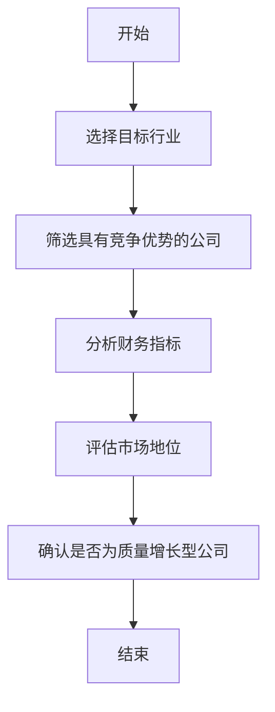
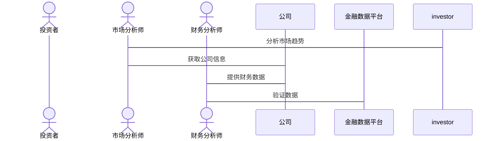
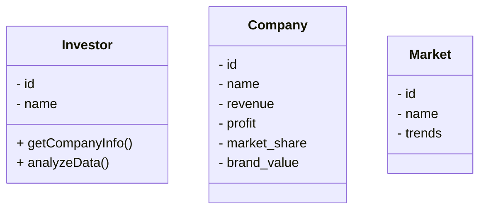

                 


# 玛丽·巴芙的质量增长型公司特征

> **关键词**：玛丽·巴芙，质量增长型公司，投资策略，财务指标，竞争优势

> **摘要**：本文深入探讨了玛丽·巴芙的质量增长型公司特征，分析了其核心概念、算法原理、系统架构及实际应用，为投资者提供了全面的指导。

---

## 第一部分：质量增长型公司的背景与定义

### 第1章：质量增长型公司的背景介绍

#### 1.1 玛丽·巴芙与质量增长型投资
玛丽·巴芙是一位著名的投资者，专注于寻找具有质量增长型特征的公司。质量增长型公司指的是那些在市场中具有持续竞争优势、财务健康且能够稳定增长的企业。这种投资策略强调长期价值而非短期收益，适合希望获得稳定回报的投资者。

#### 1.2 质量增长型公司的定义与核心要素
质量增长型公司具有以下核心特征：
1. **可持续竞争优势**：公司拥有独特的竞争优势，能够在市场中长期保持领先地位。
2. **财务健康**：公司具备健康的财务状况，如高ROE（净资产收益率）、稳定的现金流等。
3. **市场地位与品牌价值**：公司在市场中具有强大的品牌影响力和较高的市场份额。

#### 1.3 质量增长型投资的背景与重要性
随着市场环境的不断变化，投资者越来越关注公司的长期增长潜力。质量增长型公司因其稳定的业绩和持续的创新能力，成为长期投资的理想选择。

---

## 第二部分：质量增长型公司的核心概念与特征

### 第2章：质量增长型公司的核心概念与特征

#### 2.1 核心概念与原理
质量增长型公司的核心在于其可持续竞争优势。这种优势可能来自于技术创新、成本优势、品牌影响力或市场准入壁垒。例如，苹果公司通过其强大的品牌和技术创新，形成了独特的竞争优势。

#### 2.2 质量增长型公司特征对比表
以下是质量增长型公司与其他类型公司的对比：

| 特征                | 质量增长型公司          | 其他类型公司         |
|---------------------|-----------------------|--------------------|
| 可持续竞争优势      | 强                     | 弱或无             |
| 财务健康             | 高ROE、稳定现金流      | 低ROE、现金流不稳定|
| 市场地位与品牌价值    | 高、知名品牌           | 低、无品牌或知名度低|

#### 2.3 质量增长型公司的ER实体关系图
以下是质量增长型公司的ER实体关系图：

```mermaid
er
actor Investor {
  id
  name
}
actor Market {
  id
  name
}
actor Company {
  id
  name
  revenue
  profit
  market_share
  brand_value
}
```

---

## 第三部分：质量增长型公司的算法与数学模型

### 第3章：质量增长型公司的算法与数学模型

#### 3.1 算法原理与流程图
以下是质量增长型公司识别算法的流程图：



#### 3.2 数学模型与公式
以下是质量增长型公司评估的数学模型：

$$ \text{ROE} = \frac{\text{净利润}}{\text{股东权益}} $$

$$ \text{ROA} = \frac{\text{净利润}}{\text{总资产}} $$

---

## 第四部分：质量增长型公司的系统分析与架构设计

### 第4章：质量增长型公司的系统分析与架构设计

#### 4.1 系统分析
质量增长型公司的分析需要考虑市场、财务和竞争等多个因素。以下是系统分析场景的介绍：



#### 4.2 系统架构设计
以下是系统架构设计的类图：



---

## 第五部分：质量增长型公司的项目实战

### 第5章：质量增长型公司的项目实战

#### 5.1 环境安装与数据准备
以下是项目实战的环境安装步骤：

1. **数据收集工具**：使用金融数据平台获取公司数据。
2. **数据清洗与预处理**：去除无效数据，填充缺失值。

#### 5.2 核心实现代码
以下是质量增长型公司识别算法的Python代码：

```python
import pandas as pd

# 数据加载
df = pd.read_csv('companies.csv')

# 财务指标计算
df['ROE'] = df['净利润'] / df['股东权益']
df['ROA'] = df['净利润'] / df['总资产']

# 竞争优势筛选
df = df[df['ROE'] > 10]
df = df[df['ROA'] > 5]
```

#### 5.3 实际案例分析
以下是对苹果和谷歌的分析：

- **苹果**：ROE和ROA均高于行业平均水平，具有强大的品牌影响力。
- **谷歌**：ROE和ROA表现优异，市场地位稳固。

---

## 第六部分：质量增长型公司的最佳实践与小结

### 第6章：质量增长型公司的最佳实践与小结

#### 6.1 投资策略与注意事项
1. **长期投资**：关注公司的长期增长潜力。
2. **风险控制**：分散投资，避免过度集中。

#### 6.2 项目总结与未来展望
通过本文的分析，读者可以更好地理解质量增长型公司的特征和评估方法。未来的研究可以进一步探讨更多行业中的案例。

---

## 作者：AI天才研究院/AI Genius Institute & 禅与计算机程序设计艺术 /Zen And The Art of Computer Programming

---

希望这篇文章能为投资者提供有价值的信息，帮助他们更好地理解和应用质量增长型公司的特征。

