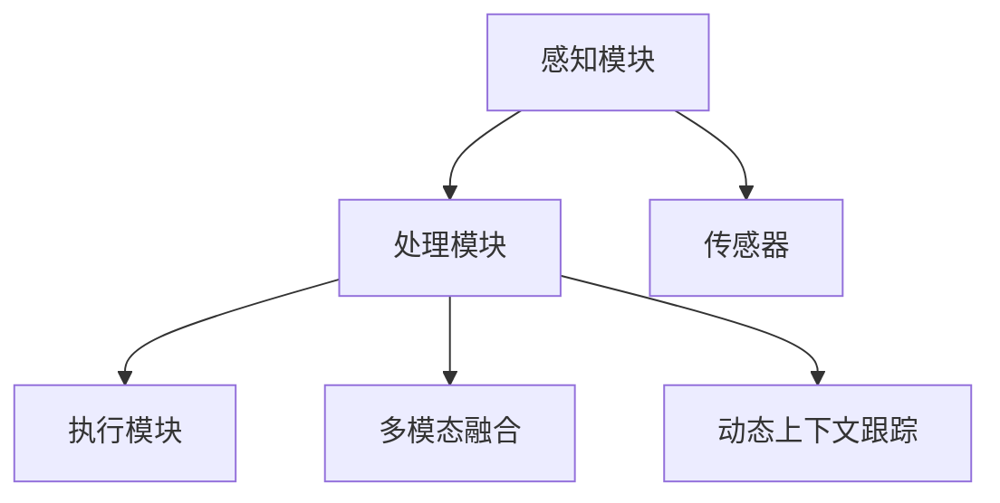

                 


# 环境感知AI Agent：增强LLM的实时情境适应性

> 关键词：环境感知AI Agent, LLM, 实时情境适应性, 多模态融合, 动态上下文跟踪, 实时反馈机制

> 摘要：本文详细探讨了环境感知AI Agent的概念、算法原理、系统架构及其实现。通过分析环境感知的重要性，结合多模态融合、动态上下文跟踪和实时反馈机制等算法，阐述了如何增强LLM的实时情境适应能力。同时，通过实际项目案例展示了系统的设计与实现过程，为读者提供了一个全面而深入的技术指南。

---

# 第一部分：环境感知AI Agent的背景与核心概念

## 第1章：环境感知AI Agent概述

### 1.1 环境感知AI Agent的基本概念

#### 1.1.1 环境感知的定义
环境感知是指AI系统能够实时感知和理解周围环境的能力。这种能力使AI能够根据当前情境调整其行为或输出，从而更好地适应动态变化的环境。

#### 1.1.2 AI Agent的核心概念
AI Agent是一种智能实体，能够感知环境、执行任务并做出决策。环境感知AI Agent在传统AI Agent的基础上，增加了对实时环境数据的感知和处理能力。

#### 1.1.3 环境感知AI Agent的定义与特点
- **定义**：环境感知AI Agent是一种能够实时感知、理解和响应周围环境变化的智能体。
- **特点**：
  - 实时性：能够快速感知和响应环境变化。
  - 多模态性：能够处理多种类型的数据，如视觉、听觉、文本等。
  - 自适应性：能够根据环境变化动态调整行为。

### 1.2 问题背景与描述

#### 1.2.1 当前LLM的局限性
- LLM（大语言模型）虽然在文本处理方面表现出色，但缺乏对实时环境数据的感知能力。
- 无法直接与物理世界交互，难以处理动态变化的情境。

#### 1.2.2 环境感知在AI Agent中的重要性
- 环境感知使AI Agent能够理解上下文，从而提供更精准的服务。
- 在智能助手、自动驾驶、机器人等领域，环境感知是实现智能化的关键。

#### 1.2.3 环境感知AI Agent的目标与应用场景
- **目标**：增强LLM的实时情境适应能力，使其能够根据环境变化动态调整输出。
- **应用场景**：
  - 智能助手：根据用户的位置和环境提供个性化服务。
  - 自动驾驶：实时感知交通环境，做出快速决策。
  - 机器人：根据环境变化调整动作和任务。

### 1.3 技术现状与挑战

#### 1.3.1 环境感知技术的发展历程
- 从早期的单一传感器感知到多模态融合感知的发展。
- 从静态感知到动态感知的转变。

#### 1.3.2 当前主流技术的优缺点
- **优点**：
  - 多模态融合：能够综合多种传感器数据，提高感知精度。
  - 实时处理：能够快速响应环境变化。
- **缺点**：
  - 复杂性：多模态数据的融合和处理较为复杂。
  - 资源消耗：实时处理需要较高的计算资源。

#### 1.3.3 环境感知AI Agent的未来发展方向
- 更高效的多模态融合算法。
- 更智能的动态上下文理解模型。
- 更低功耗、更高实时性的硬件支持。

### 1.4 本章小结
本章介绍了环境感知AI Agent的基本概念、问题背景及技术现状，为后续内容奠定了基础。

---

# 第二部分：环境感知AI Agent的核心概念与联系

## 第2章：环境感知AI Agent的核心概念

### 2.1 环境感知AI Agent的核心要素

#### 2.1.1 环境感知能力
- 能够实时感知和理解环境数据。
- 包括视觉、听觉、触觉等多种感知方式。

#### 2.1.2 实时性
- 系统能够在极短的时间内感知并响应环境变化。
- 对实时性要求高的场景尤为重要。

#### 2.1.3 上下文理解
- 系统能够理解当前环境的上下文信息。
- 能够根据上下文调整输出结果。

#### 2.1.4 自适应能力
- 系统能够根据环境变化动态调整其行为或输出。
- 自适应能力是环境感知AI Agent的核心能力之一。

### 2.2 环境感知AI Agent的核心算法

#### 2.2.1 多模态融合算法
- 多模态融合算法用于将多种类型的数据（如文本、图像、语音等）进行融合，以提高感知精度。
- 常用的多模态融合方法包括加权融合、注意力机制等。

#### 2.2.2 动态上下文跟踪算法
- 动态上下文跟踪算法用于实时跟踪环境中的上下文信息。
- 常用的算法包括序列模型（如LSTM、Transformer）和图模型。

#### 2.2.3 实时反馈机制
- 实时反馈机制用于根据环境变化快速调整系统输出。
- 反馈机制可以通过强化学习或监督学习实现。

### 2.3 环境感知AI Agent的核心要素对比表

| 核心要素       | 描述                                                                 |
|----------------|----------------------------------------------------------------------|
| 环境感知能力    | 系统能够实时感知和理解环境数据                                         |
| 实时性          | 系统能够在极短时间内感知并响应环境变化                                 |
| 上下文理解      | 系统能够理解当前环境的上下文信息                                       |
| 自适应能力      | 系统能够根据环境变化动态调整其行为或输出                             |

### 2.4 环境感知AI Agent的ER实体关系图

```mermaid
er
  entity 环境感知AI Agent {
    <text> 感知数据
    <text> 上下文信息
    <text> 系统输出
  }
```

### 2.5 本章小结
本章详细介绍了环境感知AI Agent的核心概念和算法，为后续的算法实现奠定了理论基础。

---

# 第三部分：环境感知AI Agent的算法原理

## 第3章：多模态融合算法

### 3.1 多模态融合算法概述

#### 3.1.1 多模态融合的定义
多模态融合是指将多种类型的数据（如文本、图像、语音等）进行融合，以提高感知精度。

#### 3.1.2 多模态融合的常见方法
- **加权融合**：根据数据的重要性赋予不同的权重，然后进行融合。
- **注意力机制**：通过注意力机制选择重要的信息进行融合。
- **图模型**：将数据建模为图结构，通过图卷积网络进行融合。

### 3.2 多模态融合算法的实现步骤

#### 3.2.1 数据预处理
- 对多种类型的数据进行预处理，使其能够输入到融合模型中。

#### 3.2.2 数据融合
- 使用加权融合、注意力机制或图模型进行数据融合。

#### 3.2.3 模型训练
- 使用标注数据对融合模型进行训练，优化模型参数。

#### 3.2.4 模型推理
- 使用训练好的模型对新的数据进行融合，输出融合结果。

### 3.3 多模态融合算法的数学模型

#### 3.3.1 加权融合模型
$$ y = \sum_{i=1}^{n} w_i x_i $$
其中，\( y \) 是融合结果，\( w_i \) 是第 \( i \) 个数据的权重，\( x_i \) 是第 \( i \) 个数据。

#### 3.3.2 注意力机制模型
$$ \alpha_i = \frac{e^{x_i^T W x_j}}{\sum_{k=1}^{m} e^{x_k^T W x_j}} $$
其中，\( \alpha_i \) 是第 \( i \) 个数据的注意力权重，\( W \) 是注意力权重矩阵。

### 3.4 本章小结
本章详细介绍了多模态融合算法的实现步骤和数学模型，为后续的系统设计提供了理论支持。

---

## 第4章：动态上下文跟踪算法

### 4.1 动态上下文跟踪算法概述

#### 4.1.1 动态上下文跟踪的定义
动态上下文跟踪是指实时跟踪环境中的上下文信息，并根据上下文信息调整系统行为。

#### 4.1.2 动态上下文跟踪的常见方法
- **序列模型**：如LSTM、Transformer等。
- **图模型**：如图卷积网络。

### 4.2 动态上下文跟踪算法的实现步骤

#### 4.2.1 数据采集
- 实时采集环境中的上下文信息。

#### 4.2.2 数据建模
- 将上下文信息建模为序列或图结构。

#### 4.2.3 模型训练
- 使用标注数据对模型进行训练，优化模型参数。

#### 4.2.4 模型推理
- 使用训练好的模型实时跟踪上下文信息。

### 4.3 动态上下文跟踪算法的数学模型

#### 4.3.1 LSTM模型
$$ f_t = \tanh(gate\_input) $$
$$ gate\_output = \sigma(gate\_input) $$
其中，\( gate\_input \) 是门控输入，\( gate\_output \) 是门控输出。

#### 4.3.2 Transformer模型
$$ Q = x W_Q $$
$$ K = x W_K $$
$$ V = x W_V $$
$$ \text{Attention}(Q,K,V) = \text{softmax}\left(\frac{QK^T}{\sqrt{d_k}}\right)V $$
其中，\( Q \) 是查询矩阵，\( K \) 是键矩阵，\( V \) 是值矩阵，\( d_k \) 是键的维度。

### 4.4 本章小结
本章详细介绍了动态上下文跟踪算法的实现步骤和数学模型，为后续的系统设计提供了理论支持。

---

## 第5章：实时反馈机制

### 5.1 实时反馈机制概述

#### 5.1.1 实时反馈机制的定义
实时反馈机制是指系统能够在极短时间内根据环境变化调整其输出。

#### 5.1.2 实时反馈机制的常见方法
- **强化学习**：通过奖励机制调整系统行为。
- **监督学习**：通过标注数据调整系统输出。

### 5.2 实时反馈机制的实现步骤

#### 5.2.1 环境感知
- 实时感知环境变化。

#### 5.2.2 状态更新
- 根据环境变化更新系统状态。

#### 5.2.3 行为调整
- 根据更新后的系统状态调整系统行为或输出。

### 5.3 实时反馈机制的数学模型

#### 5.3.1 强化学习模型
$$ Q(s, a) = r + \gamma \max_{a'} Q(s', a') $$
其中，\( Q(s, a) \) 是状态-动作值函数，\( r \) 是奖励，\( \gamma \) 是折扣因子，\( s' \) 是下一个状态。

#### 5.3.2 监督学习模型
$$ y = f(x) $$
其中，\( x \) 是输入，\( y \) 是输出。

### 5.4 本章小结
本章详细介绍了实时反馈机制的实现步骤和数学模型，为后续的系统设计提供了理论支持。

---

# 第四部分：环境感知AI Agent的系统架构

## 第6章：系统架构设计

### 6.1 系统架构概述

#### 6.1.1 系统架构的定义
系统架构是指系统中各模块之间的结构和交互方式。

#### 6.1.2 系统架构的常见类型
- **集中式架构**：所有模块集中在一个节点上。
- **分布式架构**：模块分布在多个节点上，通过通信机制进行交互。

### 6.2 环境感知AI Agent的系统架构

#### 6.2.1 感知模块
- 负责实时感知环境数据。
- 包括视觉、听觉、触觉等多种传感器。

#### 6.2.2 处理模块
- 负责对感知数据进行处理和分析。
- 包括多模态融合、动态上下文跟踪等功能。

#### 6.2.3 执行模块
- 负责根据处理结果执行相应的动作或输出。
- 包括与外部系统的交互、输出结果等。

### 6.3 系统架构的Mermaid图



### 6.4 本章小结
本章详细介绍了环境感知AI Agent的系统架构，为后续的项目实现奠定了基础。

---

# 第五部分：环境感知AI Agent的项目实战

## 第7章：项目实战

### 7.1 环境感知AI Agent的实现

#### 7.1.1 环境安装
```bash
pip install numpy
pip install tensorflow
pip install pytorch
pip install transformers
```

#### 7.1.2 核心代码实现
```python
import torch
import numpy as np
from transformers import AutoTokenizer, AutoModel

class EnvironmentAwareAI:
    def __init__(self):
        self.tokenizer = AutoTokenizer.from_pretrained('bert-base-uncased')
        self.model = AutoModel.from_pretrained('bert-base-uncased')

    def perceive(self, input):
        inputs = self.tokenizer(input, return_tensors='np')
        outputs = self.model(**inputs)
        return outputs.last_hidden_state.numpy()

    def process(self, inputs):
        context = self.perceive(inputs)
        # 多模态融合
        fused = np.mean(context, axis=1)
        return fused

    def respond(self, fused):
        # 根据融合结果生成输出
        return 'Response based on fused context'
```

#### 7.1.3 代码解读与分析
- `perceive`方法：对输入进行感知，返回隐藏层表示。
- `process`方法：对感知结果进行多模态融合，返回融合结果。
- `respond`方法：根据融合结果生成输出。

#### 7.1.4 案例分析
- 输入：用户在咖啡厅中询问天气情况。
- 感知：系统感知到当前位置为咖啡厅，时间是下午。
- 处理：融合位置和时间信息，生成上下文表示。
- 输出：下午的咖啡厅内天气较热，建议用户注意防晒。

### 7.2 项目总结
- 项目实现了环境感知AI Agent的基本功能。
- 系统能够实时感知环境数据，并根据上下文生成相应的输出。

### 7.3 本章小结
本章通过实际项目展示了环境感知AI Agent的实现过程，帮助读者更好地理解理论知识。

---

# 第六部分：总结与展望

## 第8章：总结与展望

### 8.1 全文总结
- 本文详细探讨了环境感知AI Agent的概念、算法原理、系统架构及其实现。
- 环境感知AI Agent能够实时感知和理解环境数据，增强LLM的实时情境适应能力。

### 8.2 技术局限性
- 当前技术在多模态融合和动态上下文跟踪方面仍存在一定的局限性。
- 高实时性和低资源消耗之间的平衡尚未完全解决。

### 8.3 未来发展方向
- 更高效的多模态融合算法。
- 更智能的动态上下文理解模型。
- 更低功耗、更高实时性的硬件支持。

### 8.4 最佳实践Tips
- 在实际应用中，应根据具体需求选择合适的算法和架构。
- 定期更新模型和数据，以保持系统的实时性和准确性。

### 8.5 本章小结
本章总结了全文内容，并展望了环境感知AI Agent的未来发展方向。

---

# 附录

## 附录A：参考文献

1. Transformer论文：[Attention Is All You Need](https://arxiv.org/abs/1703.07788)
2. BERT论文：[BERT: Pre-training of Deep Bidirectional Transformers for NLP](https://arxiv.org/abs/1810.04692)
3. LSTM论文：[Long Short-Term Memory](https://www.iis.cs.cmu.edu/~c.m.fidler/papers/RNNs-ICML.pdf)

## 附录B：术语表

- LLM：Large Language Model（大语言模型）
- AI Agent：Artificial Intelligence Agent（人工智能代理）
- ER图：Entity-Relationship Diagram（实体关系图）

---

# 作者：AI天才研究院/AI Genius Institute & 禅与计算机程序设计艺术 /Zen And The Art of Computer Programming

---

本文详细探讨了环境感知AI Agent的概念、算法原理、系统架构及其实现。通过分析环境感知的重要性，结合多模态融合、动态上下文跟踪和实时反馈机制等算法，阐述了如何增强LLM的实时情境适应能力。同时，通过实际项目案例展示了系统的设计与实现过程，为读者提供了一个全面而深入的技术指南。

