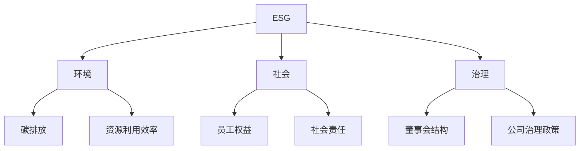
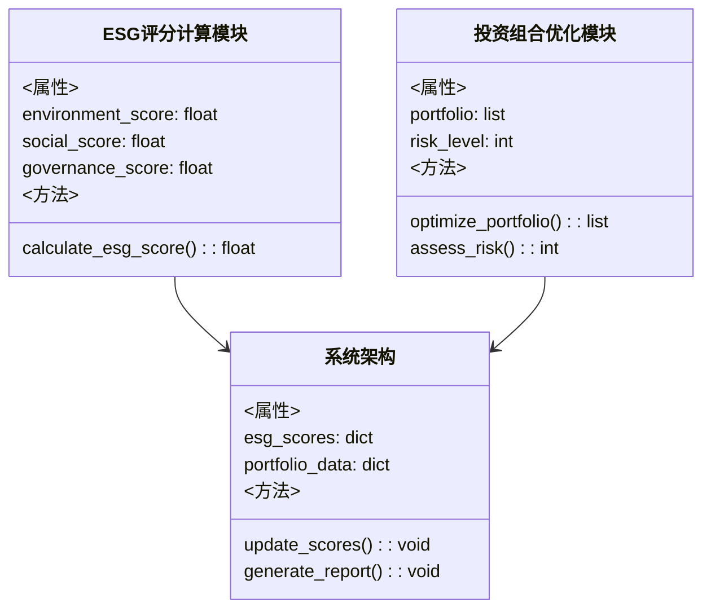
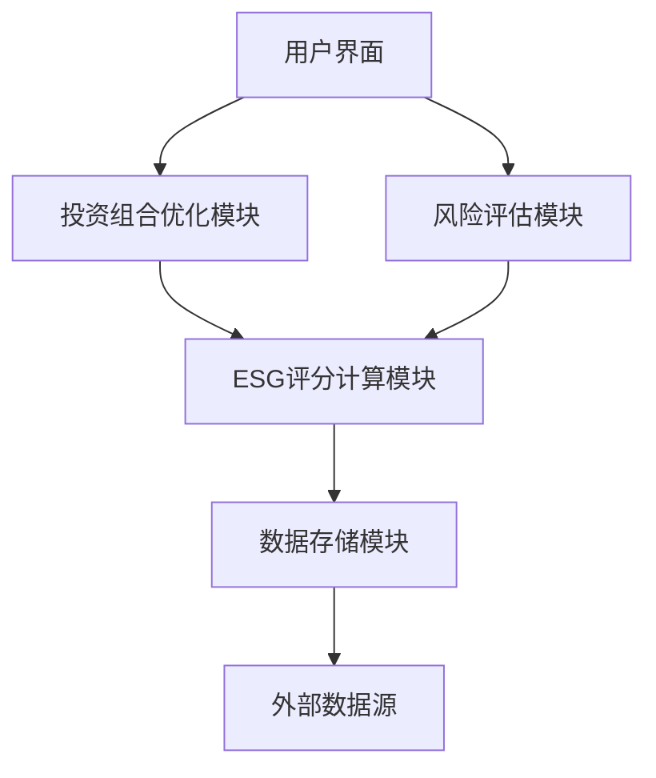

                 


# 珍妮·沙德洛的ESG价值投资：将可持续发展纳入考量

---

## 关键词：
ESG投资、可持续发展、价值投资、环境、社会、治理、风险管理、投资组合优化

---

## 摘要：
本文深入探讨了ESG（环境、社会、治理）价值投资的核心理念、数学模型、系统架构及实际应用。通过结合技术分析与可持续发展理念，详细阐述了如何将ESG因素纳入投资决策过程，构建高效、稳健的投资组合。文章内容涵盖从背景介绍到系统设计的全过程，并通过Python代码实例，展示了如何利用技术手段实现ESG价值投资的量化分析与优化。

---

## 第一部分: ESG价值投资的背景与核心概念

### 第1章: ESG价值投资的背景与意义

#### 1.1 ESG的定义与起源
- **环境（Environmental）**：指企业在运营过程中对环境资源的利用和保护，包括碳排放、资源消耗、污染治理等方面。
- **社会（Social）**：关注企业在社会中的责任履行，包括员工权益、社会责任、社区关系等方面。
- **治理（Governance）**：涉及公司治理结构和政策，包括董事会构成、高管薪酬、股东权益保护等方面。

#### 1.2 ESG投资的兴起与重要性
- **可持续发展理念的推动**：随着全球气候变化和资源枯竭问题的加剧，可持续发展理念逐渐成为投资领域的核心考量。
- **全球ESG投资趋势**：近年来，全球范围内ESG投资规模快速增长，越来越多的投资者开始关注企业的长期价值和社会责任。
- **ESG对传统投资的补充作用**：传统价值投资主要关注财务指标，而ESG投资则引入了非财务因素，帮助投资者更全面地评估企业价值。

#### 1.3 ESG与传统价值投资的对比
- **传统价值投资的核心理念**：以基本面分析为核心，关注企业的财务状况、盈利能力和发展潜力。
- **ESG投资的独特视角**：从环境、社会和治理三个维度评估企业，强调长期可持续发展。
- **两者的结合与互补**：ESG投资可以作为传统价值投资的补充，帮助投资者在选择标的时考虑更多维度的因素。

---

### 第2章: ESG的核心概念与联系

#### 2.1 ESG核心概念的原理
- **环境维度的核心要素**：
  - 碳排放：企业的碳足迹及其减少措施。
  - 资源利用效率：企业在生产和运营中的资源消耗情况。
- **社会维度的核心要素**：
  - 员工权益：员工的福利、工作条件和劳动关系。
  - 社会责任：企业对社区、公益事业的投入和贡献。
- **治理维度的核心要素**：
  - 董事会结构：董事会的独立性、多样性及决策效率。
  - 公司治理政策：股东权益保护、内部控制和风险管理。

#### 2.2 ESG核心概念的特征对比
| 维度 | 环境（Environmental） | 社会（Social） | 治理（Governance） |
|------|-----------------------|----------------|---------------------|
| 核心要素 | 碳排放、资源利用     | 员工权益、社会责任 | 董事会结构、治理政策 |
| 评估指标 | CO2排放量、能源效率   | 员工满意度、社会责任支出 | 董事会独立性、高管薪酬透明度 |
| 影响因素 | 政策法规、技术进步     | 社会舆论、行业规范 | 公司治理框架、股东结构 |

#### 2.3 ESG核心概念的ER实体关系图


---

### 第3章: ESG价值投资的数学模型与算法原理

#### 3.1 ESG评分的数学模型
- **ESG评分公式**：
  $$ESG\_score = \alpha \cdot E + \beta \cdot S + \gamma \cdot G$$
  其中，$\alpha$、$\beta$、$\gamma$为各维度的权重系数，通常根据具体行业和投资策略进行调整。
- **权重分配方法**：
  - 环境（E）：权重为40%，反映企业对环境资源的利用和保护。
  - 社会（S）：权重为30%，关注企业在社会责任和员工权益方面的表现。
  - 治理（G）：权重为30%，强调公司治理结构和政策的合理性。

#### 3.2 投资组合优化的算法原理
- **现金流贴现模型的改进**：
  $$DCF = \sum_{t=1}^{n} \frac{CF_t}{(1 + r)^t}$$
  其中，$CF_t$为第t年的现金流，$r$为折现率，考虑了ESG评分对企业价值的影响。
- **风险调整后的收益模型**：
  $$Risk\_adjusted\_return = R - (V \cdot r)$$
  其中，$R$为预期收益率，$V$为风险因子，$r$为风险调整系数。

#### 3.3 实例分析与代码实现
- **Python代码实现ESG评分计算**：
  ```python
  def calculate_esg_score(environment, social, governance):
      alpha = 0.4
      beta = 0.3
      gamma = 0.3
      return alpha * environment + beta * social + gamma * governance
  
  # 示例数据
  envir = 80  # 环境得分，满分100
  soci = 75   # 社会得分，满分100
  gوفي = 85   # 治理得分，满分100
  
  esg_score = calculate_esg_score(envir, soci, gover)
  print(f"ESG综合得分为：{esg_score}")
  ```

---

## 第二部分: ESG价值投资的系统分析与架构设计

### 第4章: ESG价值投资的系统架构

#### 4.1 问题场景介绍
- **目标**：构建一个基于ESG评分的投资决策系统，帮助投资者实现可持续价值投资。
- **用户角色**：机构投资者、个人投资者、投资顾问。
- **核心需求**：
  - 提供实时ESG评分。
  - 支持多维度的投资组合优化。
  - 提供风险预警和投资建议。

#### 4.2 系统功能设计


#### 4.3 系统架构设计


---

## 第三部分: ESG价值投资的项目实战

### 第5章: 项目实战与案例分析

#### 5.1 项目环境与依赖安装
- **安装依赖**：
  ```bash
  pip install pandas numpy matplotlib
  ```

#### 5.2 核心代码实现
- **ESG评分计算**：
  ```python
  import pandas as pd
  import numpy as np

  def calculate_esg_score(environment, social, governance):
      alpha = 0.4
      beta = 0.3
      gamma = 0.3
      return alpha * environment + beta * social + gamma * governance
  
  # 读取数据
  df = pd.read_csv('esg_data.csv')
  # 计算ESG评分
  esg_scores = []
  for index, row in df.iterrows():
      envir = row['environment']
      soci = row['social']
      gover = row['governance']
      score = calculate_esg_score(envir, soci, gover)
      esg_scores.append(score)
  
  # 可视化
  import matplotlib.pyplot as plt
  plt.hist(esg_scores, bins=10)
  plt.xlabel('ESG评分')
  plt.ylabel('频数')
  plt.show()
  ```

#### 5.3 案例分析：苹果公司的ESG价值投资
- **背景**：苹果公司在环境方面的表现尤为突出，但其供应链管理存在争议。
- **分析**：
  - 环境：苹果在可再生能源和环保产品设计方面表现优异。
  - 社会：员工待遇和劳工权益受到关注。
  - 治理：董事会结构合理，但高管薪酬透明度有待提高。
- **投资建议**：结合ESG评分和DCF模型，建议投资者长期持有苹果股票。

---

## 第四部分: 总结与展望

### 第6章: 总结与最佳实践

#### 6.1 小结
- ESG价值投资是一种结合可持续发展理念和传统投资方法的新兴策略。
- 通过量化ESG评分和优化投资组合，投资者可以在追求财务回报的同时，推动社会和环境的可持续发展。

#### 6.2 注意事项
- 数据质量：确保ESG数据的准确性和完整性。
- 模型优化：根据市场变化和企业特征，动态调整权重和模型参数。
- 风险管理：结合市场波动和企业风险，制定合理的投资策略。

#### 6.3 扩展阅读
- 《可持续金融：理论与实践》
- 《ESG投资手册：从入门到精通》
- 《Python金融数据分析实战》

---

## 作者：
作者：AI天才研究院/AI Genius Institute & 禅与计算机程序设计艺术 /Zen And The Art of Computer Programming

