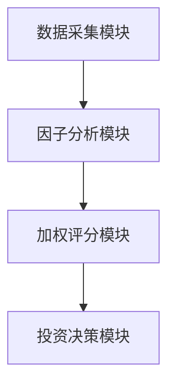

                 


# 《珍妮·沙德洛的可持续价值投资：ESG因素的整合》

## 关键词：ESG投资、环境、社会、治理、可持续价值

## 摘要：本文探讨了珍妮·沙德洛在可持续价值投资中的创新方法，重点分析了如何将ESG因素整合到投资决策中。通过详细分析环境、社会和治理维度，本文展示了如何利用这些因素构建更高效的投资模型。结合实际案例和系统设计，本文为投资者提供了实用的策略和工具，帮助他们在投资中实现长期价值。

---

# 第一部分：背景介绍

## 第1章：ESG的基本概念与背景

### 1.1 什么是ESG

#### 1.1.1 环境（Environmental）的定义与核心要素
环境因素关注企业的资源使用效率和对生态系统的负面影响。核心要素包括碳排放、能源消耗、废弃物处理、水资源管理等。

#### 1.1.2 社会（Social）的定义与核心要素
社会因素关注企业在员工权益、社区关系、社会责任等方面的表现。核心要素包括员工福利、劳动条件、社会公益、供应链管理等。

#### 1.1.3 治理（Governance）的定义与核心要素
治理因素关注企业的管理结构和决策过程。核心要素包括董事会结构、高管薪酬、股东权利、透明度和合规性等。

### 1.2 ESG的起源与发展

#### 1.2.1 ESG概念的提出与演变
ESG概念起源于20世纪60年代的环境运动，随着社会对可持续发展的关注增加，逐步发展为一种投资策略。

#### 1.2.2 ESG在投资领域的应用历史
从早期的环境因素关注，逐步扩展到社会和治理维度，形成了完整的ESG投资框架。

#### 1.2.3 当前ESG投资的全球发展趋势
全球范围内，ESG投资越来越受到重视，成为衡量企业价值的重要标准。

### 1.3 ESG的重要性与投资价值

#### 1.3.1 ESG对投资决策的影响
ESG因素可以帮助投资者识别企业风险，优化投资组合，提高长期收益。

#### 1.3.2 ESG与企业长期价值的关系
企业良好的ESG表现通常与较高的财务绩效相关，体现了企业可持续发展的能力。

#### 1.3.3 ESG与传统投资理念的结合
通过将ESG整合到传统投资分析中，投资者可以更全面地评估企业价值。

### 1.4 ESG的整合模式

#### 1.4.1 单独考虑ESG因素
在投资决策中，单独评估企业的ESG表现，作为筛选标准之一。

#### 1.4.2 将ESG整合到投资分析框架
将ESG因素纳入财务分析模型，作为企业估值的一部分。

#### 1.4.3 ESG作为投资筛选标准
根据企业的ESG评分，筛选出符合可持续发展理念的企业进行投资。

---

# 第2章：ESG的核心概念与联系

## 2.1 ESG的维度分析

### 2.1.1 环境维度的关键指标
- 碳排放量
- 能源使用效率
- 可再生能源使用比例
- 环境污染治理措施

### 2.1.2 社会维度的关键指标
- 员工权益保护
- 社区参与和公益项目
- 供应链社会责任
- 员工满意度

### 2.1.3 治理维度的关键指标
- 董事会多样性
- 高管薪酬结构
- 股东权利
- 企业透明度

## 2.2 ESG与其他投资策略的对比

### 2.2.1 传统价值投资与ESG的异同
- 传统价值投资注重企业基本面，ESG注重企业可持续性。
- 两者都关注企业长期价值，但侧重点不同。

### 2.2.2 成长投资与ESG的结合
- 成长投资关注高增长企业，ESG可以筛选出具有可持续增长潜力的企业。

### 2.2.3 投资组合中ESG的权重分配
- 根据投资目标和风险偏好，调整ESG因素在投资组合中的权重。

## 2.3 ESG的实体关系图

```mermaid
graph TD
    ESG[ESG] --> Environmental[环境]
    ESG --> Social[社会]
    ESG --> Governance[治理]
    Environmental --> {碳排放, 能源使用, 污染物排放}
    Social --> {员工权益, 社区关系, 供应链管理}
    Governance --> {董事会结构, 高管薪酬, 透明度}
```

---

# 第3章：ESG的算法与数学模型

## 3.1 ESG评分模型的构建

### 3.1.1 因子分析法
- 通过因子分析提取ESG的核心因素，构建评分模型。

### 3.1.2 加权评分法
- 根据各维度的重要性，赋予不同的权重，计算综合评分。

## 3.2 算法实现

### 3.2.1 数据预处理
- 收集企业的ESG数据，清洗和标准化。

### 3.2.2 因子分析
- 使用Python的scikit-learn库进行因子分析，提取主成分。

### 3.2.3 加权评分
- 根据各因子的重要性，计算企业的ESG评分。

## 3.3 数学模型

### 3.3.1 因子分析模型
$$
F = \sum_{i=1}^{n} w_i x_i
$$
其中，\( F \) 是因子得分，\( w_i \) 是因子权重，\( x_i \) 是原始数据。

### 3.3.2 加权评分模型
$$
S = \sum_{j=1}^{m} w_j F_j
$$
其中，\( S \) 是综合评分，\( w_j \) 是各因子的权重，\( F_j \) 是各因子得分。

---

# 第4章：系统分析与架构设计

## 4.1 系统架构设计

### 4.1.1 系统功能设计
- 数据采集模块：收集企业ESG数据。
- 评分计算模块：进行因子分析和加权评分。
- 投资决策模块：根据评分结果优化投资组合。

### 4.1.2 系统架构图



## 4.2 接口设计与交互流程

### 4.2.1 数据接口
- 数据来源：企业公开披露的ESG报告、第三方评级机构数据。

### 4.2.2 用户接口
- 提供ESG评分查询、投资组合优化等功能。

---

# 第5章：项目实战

## 5.1 环境安装

### 5.1.1 Python环境安装
- 安装Python 3.8以上版本。
- 安装相关库：pandas, numpy, scikit-learn.

## 5.2 核心代码实现

### 5.2.1 数据预处理
```python
import pandas as pd

# 读取ESG数据
data = pd.read_csv('esg_data.csv')

# 数据清洗
data = data.dropna()
data = data[~data['Company'].duplicated()]
```

### 5.2.2 因子分析
```python
from sklearn.decomposition import PCA

# 初始化PCA模型
pca = PCA(n_components=3)

# 拟合数据
pca.fit(data[['Factor1', 'Factor2', 'Factor3', 'Factor4']])

# 计算因子得分
factor_scores = pca.transform(data[['Factor1', 'Factor2', 'Factor3', 'Factor4']])
```

### 5.2.3 加权评分
```python
import numpy as np

# 定义权重
weights = np.array([0.4, 0.3, 0.2, 0.1])

# 计算加权评分
weighted_scores = np.dot(factor_scores, weights)
```

## 5.3 案例分析

### 5.3.1 实际案例分析
分析某企业的ESG评分，优化投资组合。

### 5.3.2 代码实现解读
详细解释代码的功能和实现逻辑。

## 5.4 项目总结

### 5.4.1 项目小结
总结项目的实现过程和成果。

### 5.4.2 经验分享
分享在项目中遇到的问题及解决方案。

---

# 第6章：最佳实践与小结

## 6.1 小结

## 6.2 注意事项

## 6.3 未来趋势

## 6.4 拓展阅读

---

# 作者：AI天才研究院/AI Genius Institute & 禅与计算机程序设计艺术 /Zen And The Art of Computer Programming

