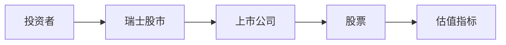
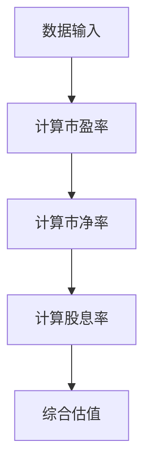
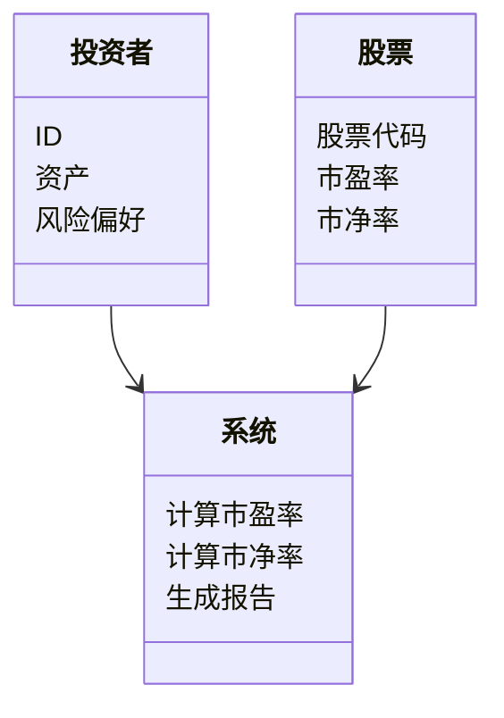

                 


# 瑞士股市估值:避险天堂的市场特点

**关键词**：瑞士股市，股市估值，避险天堂，市场特点，股票分析，金融稳定性

**摘要**：本文详细探讨了瑞士股市的估值方法及其作为避险天堂的独特市场特点。通过分析瑞士股市的历史背景、估值核心概念、算法原理、系统架构以及实际项目案例，本文为投资者提供了全面的视角来理解和评估瑞士股市的投资价值。

---

# 第1章: 瑞士股市估值的背景与特点

## 1.1 瑞士股市的概述
### 1.1.1 瑞士股市的起源与发展
瑞士股市起源于19世纪，经历了从地方性交易所到国际化金融市场的演变。其稳定性得益于瑞士政治中立和严格的金融监管。

### 1.1.2 瑞士股市的避险功能
作为避险天堂，瑞士股市在全球经济波动中表现稳定，吸引了大量国际投资者。

### 1.1.3 瑞士股市的市场结构
主要由苏黎世证券交易所和瑞士股票交易所组成，涵盖多个行业，国际化程度高。

## 1.2 瑞士股市作为避险天堂的形成
### 1.2.1 稳定的政治与经济环境
瑞士的中立政策和强大的经济基础为股市提供了稳定的环境。

### 1.2.2 严格的金融监管体系
瑞士金融监管机构确保市场的透明性和安全性，增强了投资者信心。

### 1.2.3 低波动性与高稳定性
与其他市场相比，瑞士股市波动较小，表现出较高的稳定性。

## 1.3 瑞士股市的市场特点
### 1.3.1 主要交易所介绍
包括苏黎世证券交易所和瑞士股票交易所，提供多样化的投资选择。

### 1.3.2 行业分布特点
瑞士股市涵盖金融、制药、制造等多个行业，尤其是制药和金融行业占比较大。

### 1.3.3 国际化与多样性
吸引大量国际企业上市，提供丰富的投资标的。

---

# 第2章: 瑞士股市估值的核心概念与联系

## 2.1 瑞士股市估值的核心概念
### 2.1.1 市场估值的基本概念
介绍市盈率、市净率等基本指标，解释其在估值中的作用。

### 2.1.2 瑞士股市估值的独特性
强调瑞士股市的低波动性和稳定性对估值的影响。

### 2.1.3 估值指标的核心要素
市盈率、市净率、股息率等指标的综合应用。

## 2.2 瑞士股市估值的核心原理
### 2.2.1 市盈率与市净率的计算方法
详细讲解市盈率和市净率的计算公式，并举例说明。

### 2.2.2 股息率与股息收益率的分析
解释股息率的计算方法及其在估值中的应用。

### 2.2.3 风险调整后的收益评估
考虑市场风险对估值的影响，引入CAPM模型。

## 2.3 瑞士股市估值与其他市场的对比
### 2.3.1 瑞士股市与欧美市场的对比
分析市盈率、市净率等指标的差异。

### 2.3.2 瑞士股市与亚洲市场的对比
比较行业分布和市场波动性。

### 2.3.3 瑞士股市与新兴市场的对比
探讨稳定性与增长性的不同。

## 2.4 瑞士股市估值的实体关系图


---

# 第3章: 瑞士股市估值的算法原理与数学模型

## 3.1 常用股票估值算法
### 3.1.1 市盈率模型
$$ P/E = \frac{Price}{Earnings} $$
### 3.1.2 市净率模型
$$ P/B = \frac{Price}{Book\ Value} $$
### 3.1.3 股息贴现模型
$$ DDM = \frac{D}{r - g} $$

## 3.2 市盈率模型的详细分析
### 3.2.1 公式解释
市盈率反映了市场对每股收益的定价，低市盈率可能意味着低估。

### 3.2.2 行业对比
不同行业的合理市盈率差异较大，需结合行业特点分析。

### 3.2.3 示例计算
以某公司为例，计算其市盈率并进行分析。

## 3.3 股息贴现模型的实现
### 3.3.1 模型假设
假设股息增长率恒定，贴现率合理。

### 3.3.2 模型实现步骤
1. 收集历史股息数据。
2. 估计未来股息增长率。
3. 计算内在价值。

## 3.4 瑞士股市估值的算法实现


---

# 第4章: 瑞士股市估值的系统分析

## 4.1 问题场景介绍
### 4.1.1 投资者面临的挑战
如何在波动性低的市场中找到投资机会。

### 4.1.2 系统目标
构建一个可靠的股票估值系统，帮助投资者做出决策。

## 4.2 系统功能设计
### 4.2.1 领域模型


### 4.2.2 系统架构设计


## 4.3 接口设计与交互
### 4.3.1 API接口
提供RESTful API，供投资者查询股票估值数据。

### 4.3.2 交互流程
投资者提交查询请求，系统返回估值报告。

---

# 第5章: 瑞士股市估值的项目实战

## 5.1 环境安装
### 5.1.1 安装Python
使用Anaconda安装Python 3.8以上版本。

### 5.1.2 安装必要的库
安装pandas、numpy、scipy等库。

## 5.2 系统核心实现
### 5.2.1 读取数据
使用pandas读取CSV格式的股票数据。

### 5.2.2 计算市盈率和市净率
编写代码计算并存储结果。

### 5.2.3 可视化分析
使用matplotlib绘制图表，展示市盈率分布。

## 5.3 代码实现
```python
import pandas as pd
import matplotlib.pyplot as plt

# 读取数据
data = pd.read_csv('stocks.csv')

# 计算市盈率和市净率
data['P/E'] = data['Price'] / data['Earnings']
data['P/B'] = data['Price'] / data['Book Value']

# 可视化市盈率分布
plt.hist(data['P/E'], bins=10)
plt.xlabel('P/E Ratio')
plt.ylabel('Frequency')
plt.title('Distribution of P/E Ratios in Swiss Stock Market')
plt.show()
```

## 5.4 案例分析与解读
以某制药公司为例，分析其市盈率和市净率，并评估其投资价值。

## 5.5 项目小结
总结项目实施过程中的关键点和经验教训。

---

# 第6章: 最佳实践与总结

## 6.1 小结
总结瑞士股市估值的核心要点和方法。

## 6.2 注意事项
提示投资者在实际操作中需要注意的风险和事项。

## 6.3 拓展阅读
推荐相关书籍和资源，供进一步学习。

---

**作者**：AI天才研究院/AI Genius Institute & 禅与计算机程序设计艺术 /Zen And The Art of Computer Programming

