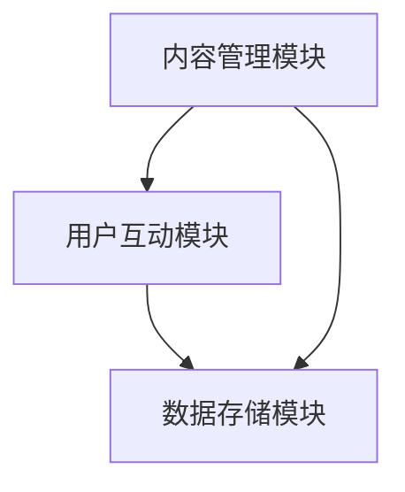
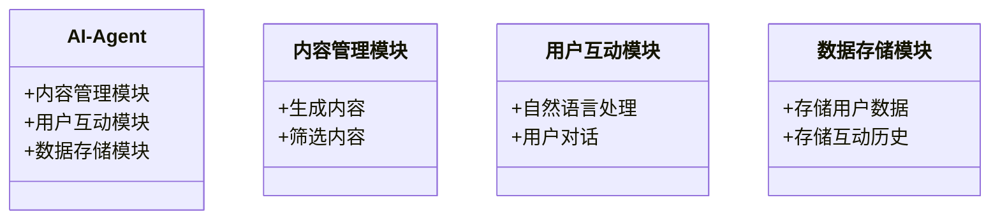

                 


# 社交媒体 AI Agent：LLM 辅助内容管理与互动

## 关键词：AI Agent、LLM、社交媒体、内容管理、用户互动、自然语言处理、大语言模型

## 摘要：  
本文探讨了社交媒体 AI Agent 的概念、技术基础及其在内容管理和用户互动中的应用。通过分析大语言模型（LLM）的核心原理，结合实际案例，展示了如何利用LLM优化社交媒体的内容管理与用户互动体验。文章还详细讲解了系统架构设计和项目实现过程，并提出了未来的发展方向和优化建议。

---

## 目录大纲

1. [摘要](#摘要)  
2. [关键词](#关键词)  
3. [目录](#目录)  
4. [正文](#正文)  
   - [1. 社交媒体 AI Agent 的背景与基础](#1-社交媒体-ai-agent-的背景与基础)  
     - [1.1 社交媒体的演变与挑战](#1.1-社交媒体的演变与挑战)  
     - [1.2 AI Agent 的核心概念](#1.2-ai-agent-的核心概念)  
     - [1.3 LLM 的技术基础](#1.3-llm-的技术基础)  
   - [2. LLM 的技术原理](#2-llm-的技术原理)  
     - [2.1 大语言模型的概述](#2.1-大语言模型的概述)  
     - [2.2 LLM 的核心算法](#2.2-llm-的核心算法)  
   - [3. 社交媒体 AI Agent 的系统架构设计](#3-社交媒体-ai-agent-的系统架构设计)  
     - [3.1 系统功能设计](#3.1-系统功能设计)  
     - [3.2 系统架构设计](#3.2-系统架构设计)  
   - [4. 项目实战：基于 LLM 的社交媒体 AI Agent 实现](#4-项目实战基于-llm-的社交媒体-ai-agent-实现)  
     - [4.1 环境搭建与依赖安装](#4.1-环境搭建与依赖安装)  
     - [4.2 核心功能实现](#4.2-核心功能实现)  
     - [4.3 测试与优化](#4.3-测试与优化)  
   - [5. 最佳实践与未来展望](#5-最佳实践与未来展望)  
     - [5.1 优化建议](#5.1-优化建议)  
     - [5.2 未来发展趋势](#5.2-未来发展趋势)  
5. [作者](#作者)  

---

## 正文

### 1. 社交媒体 AI Agent 的背景与基础

#### 1.1 社交媒体的演变与挑战

社交媒体作为信息传播和用户互动的重要平台，其规模和复杂性正在快速增长。然而，随之而来的问题也日益显著：

- **内容过载**：用户每天面对海量信息，难以有效筛选和管理。
- **互动效率**：用户与平台之间的互动效率低下，用户体验差。
- **内容质量**：低质量或有害内容的泛滥对用户和社会造成负面影响。

社交媒体 AI Agent 的出现，旨在通过智能化手段解决这些问题，优化内容管理和提升用户互动体验。

#### 1.2 AI Agent 的核心概念

AI Agent 是一种能够感知环境并采取行动以实现目标的智能体。在社交媒体场景中，AI Agent 的核心功能包括：

- **内容生成**：自动生成高质量内容，如文章、评论等。
- **内容筛选**：识别和过滤有害或低质量内容。
- **用户互动**：通过自然语言处理与用户进行实时对话。

**AI Agent 的核心属性**：

| 属性 | 描述 |
|------|------|
| 感知能力 | 通过传感器或API获取环境信息 |
| 行动能力 | 执行任务，如发布内容、回复评论 |
| 学习能力 | 通过反馈优化行为 |
| 决策能力 | 根据目标选择最优行动 |

#### 1.3 LLM 的技术基础

大语言模型（LLM）是社交媒体 AI Agent 的核心技术。其主要特点包括：

- **基于 Transformer 的架构**：通过自注意力机制捕捉上下文信息。
- **预训练与微调**：利用大规模数据进行预训练，并针对特定任务进行微调。

**LLM 的数学模型**

- **自注意力机制**：  
  $$ \text{Attention}(Q, K, V) = \text{softmax}\left(\frac{QK^T}{\sqrt{d_k}}\right)V $$
  
- **损失函数**：  
  $$ \mathcal{L} = -\sum_{i=1}^{n} y_i \log p(y_i) $$

### 2. LLM 的技术原理

#### 2.1 大语言模型的概述

- **模型结构**：由编码器和解码器组成，支持序列生成任务。
- **训练方法**：利用监督学习和强化学习优化模型性能。
- **推理机制**：通过贪心搜索或采样生成输出。

#### 2.2 LLM 的核心算法

- **注意力机制**：  
  $$ \text{score}(i, j) = Q_i K_j^T $$
  
- **损失函数**：  
  $$ \mathcal{L} = -\sum_{i=1}^{n} \log p(y_i|x_i) $$

### 3. 社交媒体 AI Agent 的系统架构设计

#### 3.1 系统功能设计

- **内容管理模块**：负责内容的生成、筛选和分类。
- **用户互动模块**：实现与用户的自然语言对话。
- **数据存储模块**：存储用户数据和互动历史。

**系统功能模块关系**：



#### 3.2 系统架构设计

- **模块划分**：AI Agent 包含内容管理模块、用户互动模块和数据存储模块。
- **数据流设计**：用户输入 -> 内容管理模块 -> 数据存储模块 -> 用户输出。

**系统架构设计图**：



### 4. 项目实战：基于 LLM 的社交媒体 AI Agent 实现

#### 4.1 环境搭建与依赖安装

```bash
pip install transformers torch
```

#### 4.2 核心功能实现

```python
from transformers import AutoModelForCausalLM, AutoTokenizer

class SocialAIAssistant:
    def __init__(self, model_name):
        self.tokenizer = AutoTokenizer.from_pretrained(model_name)
        self.model = AutoModelForCausalLM.from_pretrained(model_name)

    def generate_response(self, input_text):
        inputs = self.tokenizer.encode(input_text, return_tensors="pt")
        outputs = self.model.generate(inputs, max_length=50, do_sample=True)
        response = self.tokenizer.decode(outputs[0], skip_special_tokens=True)
        return response

# 使用示例
assistant = SocialAIAssistant("facebook/opt-125m")
response = assistant.generate_response("今天天气真好，")
print(response)  # 输出生成的回复
```

#### 4.3 测试与优化

- **测试内容**：验证生成内容的质量和相关性。
- **优化方向**：通过微调模型提升任务特定性能。

### 5. 最佳实践与未来展望

#### 5.1 优化建议

- **模型选择**：根据任务需求选择合适的模型。
- **数据预处理**：优化数据质量以提升模型性能。
- **实时反馈**：通过用户反馈优化AI Agent 的行为。

#### 5.2 未来发展趋势

- **多模态集成**：结合图像和视频等多模态数据，提升互动体验。
- **伦理与隐私**：关注AI Agent 使用中的伦理问题和数据隐私保护。
- **个性化服务**：通过个性化模型提供更精准的服务。

---

## 作者

作者：AI天才研究院/AI Genius Institute & 禅与计算机程序设计艺术 /Zen And The Art of Computer Programming

---

# 结语

社交媒体 AI Agent 的发展将极大地改变内容管理和用户互动的方式。通过结合大语言模型的强大能力，我们能够实现更高效、更智能的社交媒体体验。未来，随着技术的不断进步，AI Agent 将在更多领域发挥重要作用。

