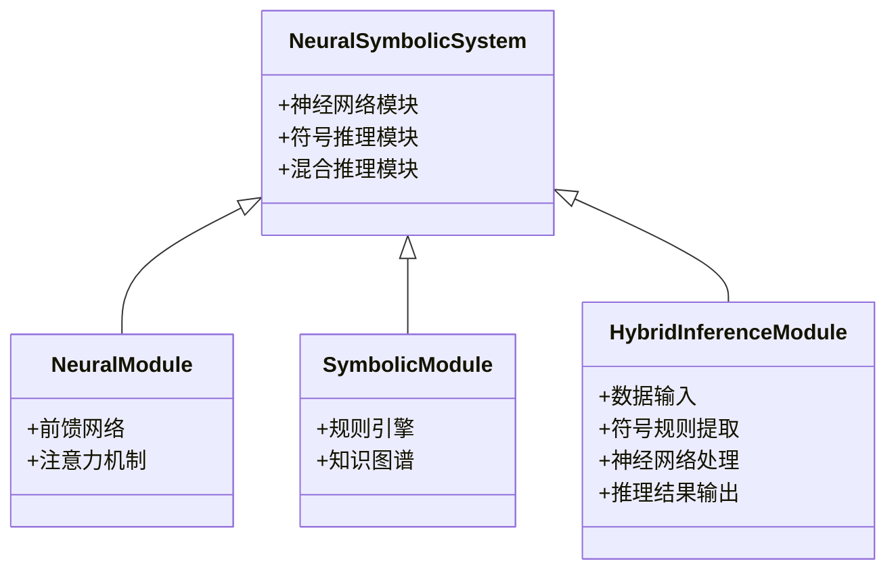
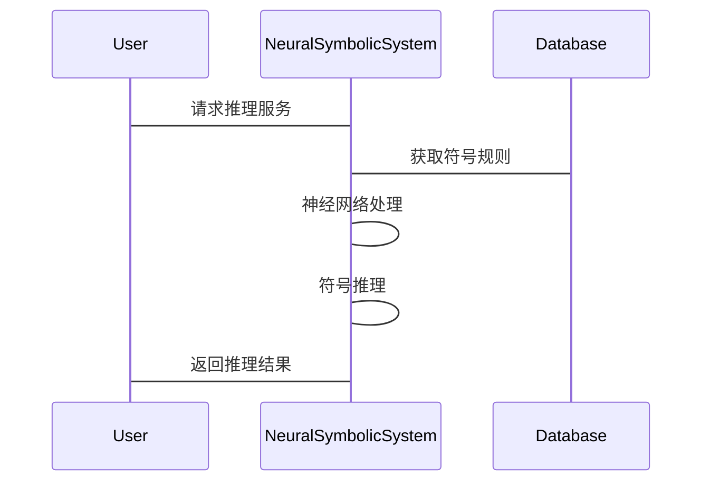

                 


# 神经符号融合：增强AI Agent的推理能力

---

## 关键词  
神经符号融合, AI Agent, 推理能力, 神经网络, 符号推理, 知识图谱, 混合推理

---

## 摘要  
神经符号融合（Neural-Symbolic Integration）是一种结合神经网络和符号推理的新兴技术，旨在增强AI Agent的推理能力。本文从背景、原理到应用，系统地介绍了神经符号融合的核心概念、技术原理和实际应用。通过结合神经网络的强大学习能力和符号推理的逻辑严谨性，神经符号融合为AI Agent在复杂任务中的推理能力提供了新的解决方案。本文还详细探讨了神经符号融合的实现方法、系统架构设计以及未来发展方向，为读者提供了全面的技术视角。

---

# 第1章 神经符号融合的背景与概念

## 1.1 背景介绍  
### 1.1.1 符号推理的局限性  
符号推理在逻辑推理方面表现出色，但难以处理复杂的数据和不确定性问题。  
### 1.1.2 神经网络的崛起  
神经网络在感知和模式识别方面表现出色，但缺乏逻辑推理能力。  
### 1.1.3 神经符号融合的提出  
为了解决神经网络和符号推理的互补性问题，神经符号融合应运而生。  

## 1.2 神经符号融合的定义与特点  
### 1.2.1 定义  
神经符号融合是一种结合神经网络和符号推理的技术，旨在增强AI Agent的推理能力。  
### 1.2.2 核心特点  
- **结合性**：将符号表示与神经网络的感知能力结合。  
- **可解释性**：符号推理提供逻辑解释，神经网络提供数据驱动的支持。  
- **泛化能力**：能够处理复杂和动态的推理任务。  

## 1.3 神经符号融合的应用领域  
### 1.3.1 自然语言处理  
- 语义理解、对话系统。  
### 1.3.2 图形推理  
- 图形识别、路径规划。  
### 1.3.3 机器人控制  
- 复杂环境中的决策与推理。  

---

# 第2章 符号推理基础

## 2.1 符号逻辑与规则推理  
### 2.1.1 符号逻辑的基本概念  
- 命题逻辑、谓词逻辑。  
### 2.1.2 规则引擎的工作原理  
- 规则定义、规则匹配、推理过程。  
### 2.1.3 知识图谱的构建与应用  
- 实体关系、语义网络。  

## 2.2 神经网络基础  
### 2.2.1 神经网络的基本原理  
- 前馈神经网络、卷积神经网络、循环神经网络。  
### 2.2.2 常见神经网络结构  
- Transformer、BERT、ResNet。  
### 2.2.3 神经网络的训练方法  
- 监督学习、无监督学习、强化学习。  

## 2.3 符号与神经网络的结合  
### 2.3.1 符号表示与神经网络的关系  
- 符号作为输入，神经网络作为推理工具。  
### 2.3.2 神经符号融合的优势  
- 强大的数据处理能力与逻辑推理能力结合。  
### 2.3.3 神经符号融合的挑战  
- 跨界问题、计算复杂性。  

---

# 第3章 神经符号融合的核心模型

## 3.1 符号增强的神经网络模型  
### 3.1.1 基于符号注意力机制的模型  
- 注意力机制结合符号规则。  
### 3.1.2 符号增强的编码器-解码器结构  
- 符号规则嵌入到编码器和解码器中。  
### 3.1.3 神经符号融合的训练方法  
- 端到端训练、符号规则监督。  

## 3.2 神经符号混合推理模型  
### 3.2.1 神经网络与符号推理的结合  
- 神经网络负责感知，符号推理负责逻辑。  
### 3.2.2 混合推理的流程  
- 数据感知 → 符号规则推理 → 最终决策。  
### 3.2.3 混合推理的优缺点  
- 优势：结合感知与逻辑；劣势：计算复杂性。  

## 3.3 神经符号融合的数学模型  
### 3.3.1 符号表示的数学形式  
- 符号规则用逻辑表达式表示。  
### 3.3.2 神经符号融合的数学公式  
$$ y = f_{\text{neural}}(f_{\text{symbol}}(x)) $$  
其中，$x$ 是输入，$f_{\text{symbol}}$ 是符号处理函数，$f_{\text{neural}}$ 是神经网络函数。  
### 3.3.3 神经符号融合的优化算法  
- 结合符号规则的优化目标函数。  

---

# 第4章 系统架构与设计

## 4.1 问题场景介绍  
- 神经符号融合系统的设计目标与应用场景。  

## 4.2 系统功能设计  
### 4.2.1 领域模型设计  
- 使用Mermaid类图描述系统模块之间的关系。  



### 4.2.2 系统架构设计  
- 使用Mermaid架构图描述系统架构。  


### 4.2.3 系统接口设计  
- 接口定义：输入接口、输出接口、符号规则接口。  

### 4.2.4 系统交互设计  
- 使用Mermaid序列图描述系统交互流程。  



---

# 第5章 项目实战

## 5.1 环境安装与配置  
- 安装Python、TensorFlow、Keras、符号推理库（如Rete）。  

## 5.2 神经符号融合系统核心实现  
### 5.2.1 神经网络模块实现  
```python
import tensorflow as tf
from tensorflow.keras import layers

class NeuralModule(tf.keras.Model):
    def __init__(self):
        super(NeuralModule, self).__init__()
        self.conv1 = layers.Conv2D(32, (3,3), activation='relu')
        self.pool1 = layers.MaxPooling2D((2,2))
        self.flatten = layers.Flatten()
        self.dense = layers.Dense(128, activation='relu')
```

### 5.2.2 符号推理模块实现  
```python
from rete import Engine

class SymbolicModule:
    def __init__(self):
        self.engine = Engine()
        self.engine.add_rules([Rule1, Rule2, Rule3])
```

### 5.2.3 混合推理模块实现  
```python
class HybridInferenceModule:
    def __init__(self, neural_module, symbolic_module):
        self.neural_module = neural_module
        self.symbolic_module = symbolic_module
    
    def infer(self, input_data):
        symbolic_output = self.symbolic_module.infer(input_data)
        neural_output = self.neural_module.predict(symbolic_output)
        return neural_output
```

## 5.3 案例分析与实现解读  
### 5.3.1 案例介绍  
- 使用神经符号融合进行图像识别与逻辑推理。  
### 5.3.2 代码实现解读  
- 神经网络部分：图像特征提取。  
- 符号推理部分：基于特征的逻辑推理。  
### 5.3.3 实验结果与分析  
- 精度对比：神经符号融合优于单一神经网络或符号推理。  

## 5.4 项目总结  
- 项目实现的关键点：模块化设计、符号规则嵌入、混合推理优化。  

---

# 第6章 高级主题与未来展望

## 6.1 可解释性与透明性  
- 神经符号融合的可解释性问题。  

## 6.2 神经符号融合的鲁棒性  
- 面对噪声和不确定性时的表现。  

## 6.3 动态符号推理  
- 实时更新符号规则的能力。  

## 6.4 神经符号融合的未来发展方向  
- 更强大的符号表示能力。  
- 更高效的混合推理算法。  
- 更广泛的应用场景探索。  

---

# 第7章 结论与参考文献

## 7.1 研究总结  
- 神经符号融合的核心思想与优势。  

## 7.2 参考文献  
1. [文献1] 神经符号融合的理论基础。  
2. [文献2] 神经符号融合在自然语言处理中的应用。  
3. [文献3] 神经符号融合在机器人控制中的应用。  

---

## 作者：AI天才研究院 & 禅与计算机程序设计艺术

