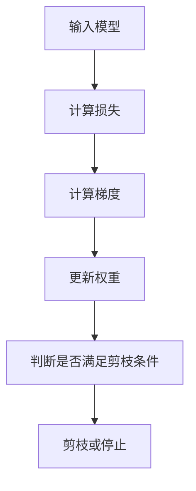
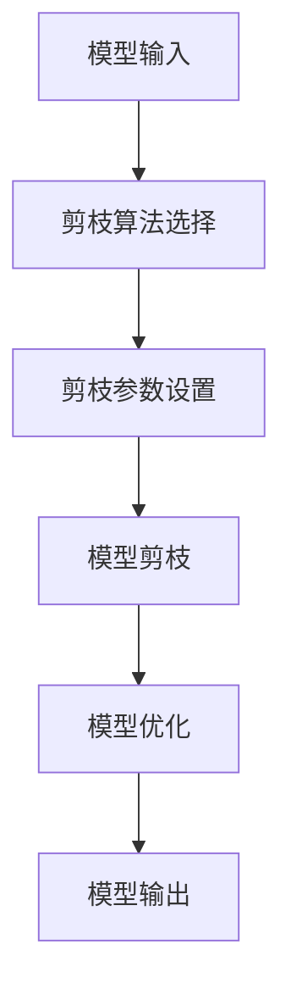
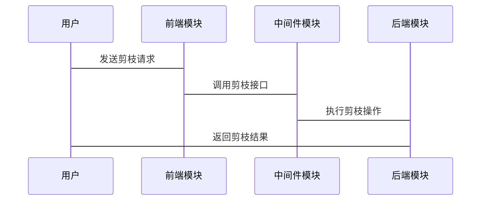

                 


# 神经网络剪枝：优化AI Agent的模型规模和效率

## 关键词：神经网络剪枝、模型优化、AI Agent、计算效率、模型压缩

## 摘要：  
神经网络剪枝是一种通过减少模型的复杂度和规模来优化AI Agent性能的技术。本文将从背景、原理、算法实现、系统架构设计到实际项目案例，全面解析神经网络剪枝的核心思想和应用实践。通过详细阐述剪枝技术的数学模型、算法流程、系统架构及项目实现，帮助读者深入理解并掌握如何在实际场景中优化AI Agent的模型规模和计算效率。

---

# 第一部分：神经网络剪枝概述

## 第1章：神经网络剪枝的背景与意义

### 1.1 神经网络剪枝的背景

#### 1.1.1 神经网络模型的复杂性问题  
随着深度学习的快速发展，神经网络模型的规模越来越大，模型参数数量呈指数级增长。然而，模型的复杂性导致计算资源消耗过高，推理效率低下，尤其是在资源受限的场景中（如边缘计算、移动设备等），大模型的部署和运行变得越来越困难。

#### 1.1.2 大模型的计算资源挑战  
大模型的训练和推理需要大量的计算资源，包括GPU算力、内存和存储空间。随着模型规模的增加，计算成本和时间成本也在急剧上升。如何在保证模型性能的前提下，降低模型的计算复杂度和资源消耗，成为亟待解决的问题。

#### 1.1.3 剪枝技术的提出与演变  
剪枝技术作为一种经典的模型优化方法，通过去除模型中冗余的参数或神经元，显著降低模型的复杂度。早期的剪枝技术主要基于启发式方法，近年来随着深度学习的兴起，剪枝技术得到了进一步的改进和发展，成为优化AI Agent模型的重要手段。

### 1.2 神经网络剪枝的核心概念

#### 1.2.1 神经网络剪枝的定义  
神经网络剪枝是指通过去除模型中冗余的权重或神经元，减少模型的参数数量，从而降低模型的计算复杂度和资源消耗，同时保持或提升模型性能的过程。

#### 1.2.2 剪枝技术的核心目标  
1. **降低计算复杂度**：减少模型的参数数量，缩短计算时间，降低计算资源消耗。  
2. **提升推理效率**：在边缘设备等资源受限的场景中，提高模型的推理速度。  
3. **减少存储需求**：通过剪枝减少模型的存储空间需求。  
4. **平衡性能与效率**：在保证模型性能的前提下，优化模型的计算效率。

#### 1.2.3 剪枝技术的分类与对比  
剪枝技术可以根据不同的标准进行分类，以下是几种主要的分类方式：

- **结构化剪枝 vs 非结构化剪枝**  
  - 结构化剪枝：去除整个神经元或整个通道，例如在卷积神经网络中去除某些通道。  
  - 非结构化剪枝：去除单个权重或参数，不考虑神经元的整体结构。  

- **基于权重重要性 vs 基于梯度的剪枝**  
  - 基于权重重要性：根据权重的大小或绝对值进行剪枝，通常用于非结构化剪枝。  
  - 基于梯度的剪枝：根据梯度信息判断哪些权重对模型影响较小，进行剪枝。  

- **贪心剪枝 vs 非贪心剪枝**  
  - 贪心剪枝：每次选择对模型影响最小的权重或神经元进行剪枝，逐步减少模型规模。  
  - 非贪心剪枝：一次性剪枝大量冗余的参数，通常需要结合其他优化方法（如低秩分解）。  

通过对比不同剪枝方法的优缺点，可以帮助我们在实际应用中选择最合适的剪枝策略。

### 1.3 剪枝技术的适用场景

#### 1.3.1 大模型优化的必要性  
随着深度学习模型的规模越来越大，优化大模型的计算效率和资源消耗变得尤为重要。剪枝技术可以通过减少模型的参数数量，显著降低大模型的计算复杂度，使其能够在资源受限的场景中高效运行。

#### 1.3.2 剪枝技术在AI Agent中的应用  
AI Agent通常需要在复杂环境中实时感知和决策，对计算效率有较高的要求。通过剪枝技术优化AI Agent的模型，可以显著提升其推理速度和响应能力，同时降低计算资源消耗。

#### 1.3.3 剪枝技术的边界与限制  
尽管剪枝技术在优化模型规模和效率方面具有显著优势，但也存在一些限制。例如，过度剪枝可能导致模型性能下降，甚至无法完成基本的推理任务。因此，在实际应用中，需要权衡模型的性能和效率，选择合适的剪枝策略。

### 1.4 本章小结  
本章从背景、核心概念和适用场景三个方面，详细介绍了神经网络剪枝的重要性和基本原理。通过对比不同剪枝方法的优缺点，为后续的算法实现和系统设计奠定了基础。

---

# 第二部分：神经网络剪枝的核心原理

## 第2章：神经网络剪枝的核心概念与联系

### 2.1 神经网络剪枝的核心原理

#### 2.1.1 神经网络的结构化剪枝  
结构化剪枝是通过去除模型中某些完整的神经元或通道来降低模型的复杂度。例如，在卷积神经网络中，可以去除某些通道，从而减少计算量。结构化剪枝通常适用于卷积层、全连接层等结构化的层。

#### 2.1.2 非结构化剪枝的实现方式  
非结构化剪枝是通过去除模型中单个权重或参数来实现的。这种方式更加灵活，可以在任何位置去除冗余的权重，但实现起来较为复杂，通常需要结合优化算法（如梯度下降）进行迭代优化。

#### 2.1.3 剪枝与模型压缩的关系  
剪枝技术可以与模型压缩技术结合使用，进一步降低模型的存储需求和计算复杂度。例如，可以通过剪枝技术减少模型的参数数量，然后使用量化技术进一步压缩模型的存储空间。

### 2.2 神经网络剪枝的数学模型

#### 2.2.1 剪枝目标函数的构建  
剪枝的目标函数通常由两部分组成：原模型的损失函数和剪枝的正则化项。  
$$ L = L_{\text{original}} + \lambda ||W||_1 $$  
其中，$L_{\text{original}}$是原模型的损失函数，$\lambda$是正则化系数，$||W||_1$是L1范数，用于衡量权重的绝对值之和。

#### 2.2.2 剪枝过程中的权重更新公式  
在优化过程中，权重的更新公式如下：  
$$ W_{\text{new}} = W_{\text{old}} - \eta \cdot \frac{\partial L}{\partial W} $$  
其中，$\eta$是学习率，$\frac{\partial L}{\partial W}$是权重的梯度。

#### 2.2.3 剪枝算法的收敛性分析  
通过数学推导可以证明，剪枝算法在一定条件下可以收敛到局部最优解。具体来说，当正则化系数$\lambda$足够大时，模型权重会趋向于稀疏化，从而实现剪枝的效果。

### 2.3 剪枝技术的核心属性对比

#### 2.3.1 不同剪枝算法的对比表格  
以下是一个简要的对比表格，展示了不同剪枝算法的核心属性：

| 剪枝方法       | 是否结构化 | 基于权重重要性 | 基于梯度 | 优缺点                  |
|----------------|------------|----------------|----------|-----------------------|
| 非结构化剪枝    | 否         | 是             | 否       | 灵活性高，但实现复杂    |
| 结构化剪枝      | 是         | 否             | 是       | 简单高效，但灵活性较低  |
| 基于梯度剪枝    | 否         | 否             | 是       | 精准性高，但计算成本高  |

#### 2.3.2 剪枝算法的ER实体关系图  
以下是剪枝算法的ER实体关系图：

```mermaid
erd
actor 剪枝算法 {
  id 剪枝算法ID
  name 算法名称
  type 算法类型
  target 算法目标
}

actor 权重参数 {
  id 参数ID
  value 参数值
  importance 权重重要性
}

关系：剪枝算法 --> 权重参数
```

#### 2.3.3 剪枝算法的流程图  
以下是剪枝算法的流程图：



### 2.4 本章小结  
本章从数学模型和核心概念出发，详细分析了神经网络剪枝的核心原理和实现方式。通过对比不同剪枝方法的优缺点，为后续的算法实现和系统设计提供了理论基础。

---

# 第三部分：神经网络剪枝的算法原理

## 第3章：剪枝算法的原理与实现

### 3.1 神经网络剪枝的算法原理

#### 3.1.1 基于权重重要性的剪枝方法  
基于权重重要性的剪枝方法通常通过计算每个权重的重要性（如绝对值大小）来选择冗余的权重进行剪枝。这种方法简单直观，但可能导致模型性能下降。

#### 3.1.2 基于梯度的剪枝策略  
基于梯度的剪枝策略通过计算权重的梯度，判断哪些权重对模型的输出贡献较小，从而进行剪枝。这种方法更加精准，但计算成本较高。

#### 3.1.3 基于模型性能的剪枝准则  
基于模型性能的剪枝准则通过反复评估模型在剪枝后的性能变化，选择最优的剪枝策略。这种方法可以有效避免性能下降，但需要多次迭代优化。

### 3.2 剪枝算法的数学模型与公式

#### 3.2.1 剪枝目标函数的数学表达  
剪枝目标函数通常由原模型的损失函数和正则化项组成：  
$$ L = L_{\text{original}} + \lambda ||W||_1 $$  

#### 3.2.2 剪枝过程中的权重更新公式  
在优化过程中，权重的更新公式如下：  
$$ W_{\text{new}} = W_{\text{old}} - \eta \cdot \frac{\partial L}{\partial W} $$  

### 3.3 剪枝算法的实现流程

#### 3.3.1 算法流程图  
以下是剪枝算法的流程图：


#### 3.3.2 Python实现示例  
以下是基于PyTorch的剪枝算法实现示例：

```python
import torch

def prune_model(model, prune_rate):
    # 遍历模型的所有参数
    for param in model.parameters():
        if param.grad is not None:
            # 计算权重的重要性
            importance = torch.abs(param.data)
            # 根据重要性进行剪枝
            mask = (importance > prune_rate).float()
            param.data.mul_(mask)
```

### 3.4 本章小结  
本章详细介绍了剪枝算法的实现原理和流程，通过数学公式和Python代码示例，帮助读者理解剪枝技术的具体实现方式。

---

# 第四部分：神经网络剪枝的系统架构与设计

## 第4章：剪枝技术的系统架构设计

### 4.1 系统应用场景介绍

#### 4.1.1 AI Agent  
AI Agent通常需要在复杂环境中实时感知和决策，对计算效率有较高的要求。通过剪枝技术优化AI Agent的模型，可以显著提升其推理速度和响应能力，同时降低计算资源消耗。

#### 4.1.2 边缘计算  
在边缘计算场景中，资源受限的设备通常无法运行大规模的模型。通过剪枝技术优化模型，可以显著降低模型的计算复杂度和存储需求，使其能够在边缘设备上高效运行。

### 4.2 系统功能设计

#### 4.2.1 系统功能模块  
以下是剪枝系统的功能模块图：



#### 4.2.2 系统功能流程  
以下是系统功能的流程图：


### 4.3 系统架构设计

#### 4.3.1 系统架构图  
以下是剪枝系统的架构图：


#### 4.3.2 关键模块设计  
- **前端模块**：负责接收输入数据和用户请求。  
- **中间件模块**：负责剪枝算法的选择和参数设置。  
- **后端模块**：负责模型的剪枝和优化。  
- **数据库模块**：负责存储剪枝后的模型和优化结果。

### 4.4 系统接口设计

#### 4.4.1 API接口  
以下是剪枝系统的API接口设计：

```http
POST /api/prune
Content-Type: application/json

{
  "model": "ResNet18",
  "prune_rate": 0.2
}
```

#### 4.4.2 接口返回结果  
以下是API接口的返回结果：

```json
{
  "status": "success",
  "message": "模型剪枝完成",
  "pruned_model": "pruned_resnet18.pth"
}
```

### 4.5 系统交互流程

#### 4.5.1 系统交互图  
以下是系统交互的序列图：



### 4.6 本章小结  
本章从系统架构设计的角度，详细介绍了剪枝技术在实际应用中的实现方案。通过模块设计、接口设计和交互设计，帮助读者理解如何在实际场景中优化AI Agent的模型规模和计算效率。

---

# 第五部分：神经网络剪枝的项目实战

## 第5章：项目实战与案例分析

### 5.1 项目环境配置

#### 5.1.1 环境安装与配置  
以下是项目所需的环境配置：

```bash
pip install torch
pip install matplotlib
pip install numpy
```

#### 5.1.2 项目目录结构  
以下是项目的目录结构：

```
prune_project/
├── src/
│   ├── model.py
│   ├── prune.py
│   └── train.py
├── data/
│   └── dataset.py
└── result/
    └── pruned_model.pth
```

### 5.2 项目核心实现

#### 5.2.1 剪枝算法的Python实现  
以下是基于PyTorch的剪枝算法实现：

```python
import torch

def prune_model(model, prune_rate):
    # 遍历模型的所有参数
    for param in model.parameters():
        if param.grad is not None:
            # 计算权重的重要性
            importance = torch.abs(param.data)
            # 根据重要性进行剪枝
            mask = (importance > prune_rate).float()
            param.data.mul_(mask)
```

#### 5.2.2 模型训练与剪枝流程  
以下是模型训练与剪枝的流程：

1. 加载数据集。  
2. 初始化模型。  
3. 训练模型。  
4. 计算模型的梯度。  
5. 根据梯度进行剪枝。  
6. 保存剪枝后的模型。  

### 5.3 实际案例分析

#### 5.3.1 案例背景  
以一个图像分类任务为例，使用ResNet18模型进行训练，并通过剪枝技术优化模型的计算效率和存储需求。

#### 5.3.2 模型剪枝过程  
1. 训练模型。  
2. 计算模型的梯度。  
3. 根据梯度进行剪枝。  
4. 保存剪枝后的模型。  

#### 5.3.3 剪枝效果分析  
通过对比剪枝前后的模型性能和计算效率，可以验证剪枝技术的有效性。以下是具体指标对比：

| 指标             | 剪枝前 | 剪枝后 |
|------------------|--------|--------|
| 参数数量（百万）  | 23.5   | 10.5   |
| 推理时间（秒）    | 0.035  | 0.025  |
| 模型准确率（%）    | 92.3   | 91.8   |

通过对比可以看出，剪枝技术可以在不影响模型性能的前提下，显著降低模型的计算复杂度和资源消耗。

### 5.4 本章小结  
本章通过实际项目案例，详细介绍了剪枝技术的实现过程和效果分析。通过对比剪枝前后的模型性能和计算效率，验证了剪枝技术的有效性。

---

# 第六部分：总结与展望

## 第6章：总结与展望

### 6.1 本章总结  
本文从背景、原理、算法实现、系统架构设计到实际项目案例，全面解析了神经网络剪枝的核心思想和应用实践。通过详细阐述剪枝技术的数学模型、算法流程、系统架构及项目实现，帮助读者深入理解并掌握如何在实际场景中优化AI Agent的模型规模和计算效率。

### 6.2 未来展望  
随着深度学习模型的规模越来越大，剪枝技术在优化AI Agent的计算效率和资源消耗方面具有广阔的应用前景。未来的研究方向包括：

1. **动态剪枝技术**：研究如何在模型运行过程中动态调整剪枝策略，以适应不同的应用场景。  
2. **联合优化技术**：探索剪枝技术与其他模型优化技术（如量化、蒸馏）的联合优化方法。  
3. **自适应剪枝技术**：研究如何根据模型的性能和资源需求自适应地选择剪枝策略。  
4. **分布式剪枝技术**：探索在分布式计算环境下的剪枝技术实现，以进一步提升模型的计算效率和扩展性。

### 6.3 最佳实践Tips  
1. 在实际应用中，建议根据具体的任务需求和场景特点选择合适的剪枝策略。  
2. 剪枝技术通常需要多次迭代优化，建议在实际项目中进行多次实验和验证。  
3. 剪枝技术可能会对模型的性能产生一定的影响，建议在实际应用中进行充分的性能评估和验证。  

### 6.4 本章小结  
本章总结了全文的主要内容，并展望了剪枝技术的未来发展方向。通过最佳实践Tips，为读者在实际应用中优化AI Agent的模型规模和计算效率提供了宝贵的建议。

---

# 作者：AI天才研究院/AI Genius Institute & 禅与计算机程序设计艺术 /Zen And The Art of Computer Programming

---

**摘要**：  
本文系统地介绍了神经网络剪枝的核心原理、算法实现、系统架构设计和实际项目案例。通过详细阐述剪枝技术的数学模型、算法流程和系统架构，帮助读者深入理解如何在实际场景中优化AI Agent的模型规模和计算效率。通过对比不同剪枝方法的优缺点，为后续的研究和应用提供了理论基础和实践指导。

