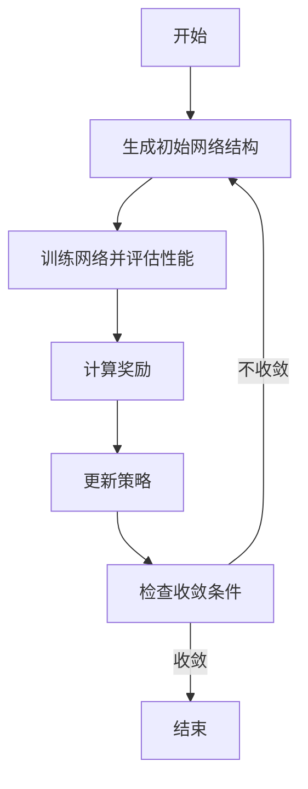
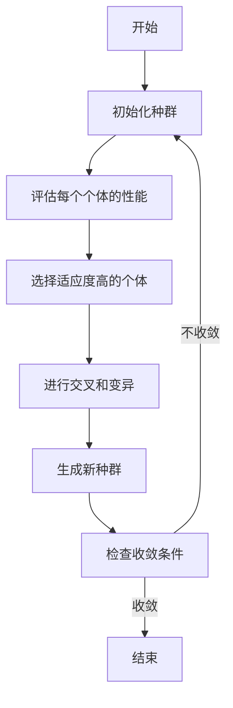
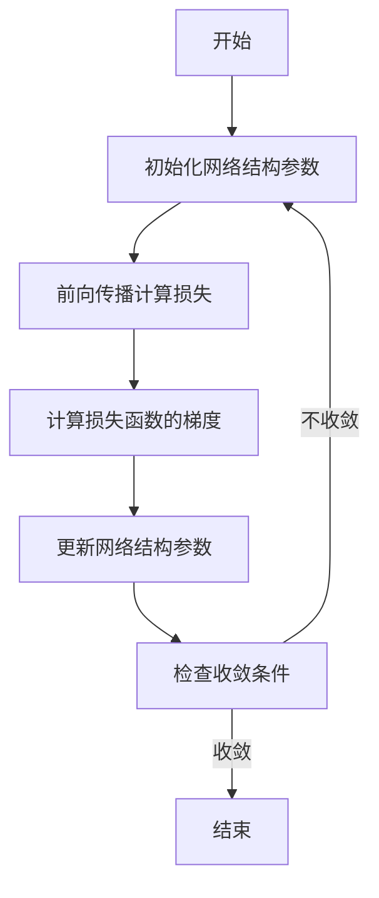
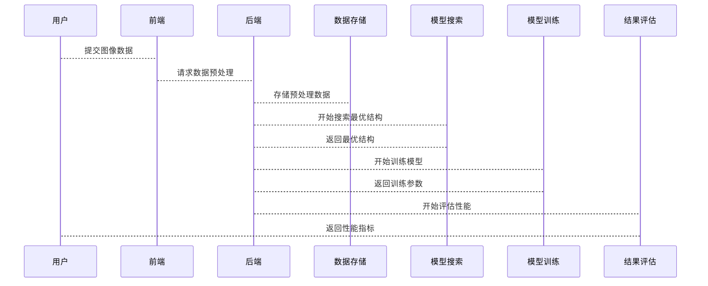

                 


# 神经网络架构搜索：自动化AI Agent模型结构优化

## 关键词：
神经网络架构搜索, 自动化AI Agent, 模型结构优化, 强化学习, 遗传算法, 深度学习

## 摘要：
神经网络架构搜索（Neural Architecture Search，NAS）是一种通过自动化方法寻找最优神经网络结构的技术，能够显著提高AI Agent模型的性能和效率。本文将详细探讨神经网络架构搜索的核心概念、算法原理、数学模型、系统设计以及实际应用。通过理论分析和实践案例，揭示NAS在自动化AI Agent模型结构优化中的巨大潜力和应用价值。

---

# 第一部分: 神经网络架构搜索（NAS）基础

# 第1章: 神经网络架构搜索（NAS）引言

## 1.1 神经网络架构搜索的背景与意义

### 1.1.1 传统人工设计神经网络的局限性
传统的神经网络设计依赖人工经验，存在以下问题：
- **效率低下**：人工设计神经网络结构需要大量实验和调整，耗时且成本高。
- **主观性**：不同设计师的经验和直觉可能导致设计结果的不一致。
- **优化不足**：人工设计难以覆盖所有可能的网络结构，可能存在性能上的局限。

### 1.1.2 自动化架构搜索的需求
随着深度学习的快速发展，神经网络的复杂性和规模不断增加，人工设计已难以满足需求。自动化架构搜索技术能够：
- **提高效率**：通过自动化方法快速探索大量可能的网络结构。
- **优化性能**：找到最优或近似最优的网络结构，提升模型性能。
- **降低门槛**：使非专家也能高效设计高性能的神经网络。

### 1.1.3 神经网络架构搜索的核心价值
神经网络架构搜索的核心价值在于：
- **加速模型开发**：通过自动化搜索减少手动调整的时间和精力。
- **提升模型性能**：找到更优的网络结构，提升模型的准确性和效率。
- **扩展应用范围**：使复杂模型的设计更加便捷，推动AI技术在更多领域的应用。

## 1.2 神经网络架构搜索的基本概念

### 1.2.1 神经网络架构的定义
神经网络架构是指网络的结构和连接方式，包括：
- **层结构**：网络的输入层、隐藏层和输出层的结构。
- **节点连接**：各层节点之间的连接方式。
- **超参数**：如激活函数、Dropout率等。

### 1.2.2 神经网络架构搜索的定义
神经网络架构搜索（NAS）是一种通过自动化方法搜索最优神经网络结构的技术。其目标是通过算法探索所有可能的网络结构，找到在特定任务上表现最优的结构。

### 1.2.3 神经网络架构搜索的关键要素
神经网络架构搜索的关键要素包括：
- **搜索空间**：所有可能的网络结构的集合。
- **搜索策略**：用于探索搜索空间的方法，如强化学习、遗传算法等。
- **评估函数**：用于评估网络结构性能的指标，如准确率、训练速度等。

## 1.3 神经网络架构搜索的应用场景

### 1.3.1 图像识别中的架构搜索
在图像识别任务中，NAS可以用于搜索高效的卷积神经网络结构，如用于物体检测、图像分类等任务。

### 1.3.2 自然语言处理中的架构搜索
在自然语言处理任务中，NAS可以用于搜索最优的Transformer结构或循环神经网络结构，提升文本生成、机器翻译等任务的性能。

### 1.3.3 其他领域的应用
NAS技术还可以应用于推荐系统、语音识别、时间序列预测等任务，帮助找到最适合特定场景的网络结构。

## 1.4 本章小结
本章介绍了神经网络架构搜索的背景、基本概念和应用场景。通过对比传统人工设计的局限性和自动化设计的优势，明确了NAS技术的核心价值和应用潜力。

---

# 第2章: 神经网络架构搜索（NAS）的核心概念与原理

## 2.1 神经网络架构搜索的核心概念

### 2.1.1 搜索空间定义
搜索空间是NAS算法探索的所有可能网络结构的集合。搜索空间的定义需要考虑：
- **层的类型**：如卷积层、全连接层等。
- **节点连接方式**：如直接连接、跳跃连接等。
- **超参数**：如每层的节点数、激活函数等。

### 2.1.2 搜索策略
搜索策略是NAS算法的核心，决定了如何在搜索空间中高效地探索最优结构。常用的搜索策略包括：
- **随机搜索**：随机选择网络结构进行评估。
- **贪心搜索**：逐步选择当前最优的结构。
- **进化搜索**：基于遗传算法进行结构优化。

### 2.1.3 架构评估方法
评估方法用于衡量网络结构的性能，常见的评估方法包括：
- **准确率**：模型在测试集上的正确分类率。
- **训练时间**：模型训练所需的时间。
- **模型复杂度**：模型的参数数量或计算量。

## 2.2 神经网络架构搜索的原理

### 2.2.1 基于强化学习的架构搜索
基于强化学习的NAS算法通过强化学习代理（agent）来探索网络结构。代理通过与环境交互，逐步优化网络结构。常用的强化学习方法包括：
- **策略梯度法**：通过优化策略函数来选择最优结构。
- **Q-learning**：通过学习价值函数来评估结构的优劣。

### 2.2.2 基于遗传算法的架构搜索
基于遗传算法的NAS算法通过模拟生物进化过程来优化网络结构。算法步骤包括：
1. 初始化种群：随机生成一组网络结构。
2. 适应度评估：计算每个结构的性能指标。
3. 选择与交叉：选择高适应度的结构进行交叉，生成新的结构。
4. 变异：对部分结构进行随机变异，增加多样性。
5. 迭代优化：重复上述步骤，逐步优化种群。

### 2.2.3 基于梯度下降的架构搜索
基于梯度下降的NAS算法通过可微分的搜索空间进行优化。网络结构参数化为可微的变量，通过计算梯度更新这些变量，逐步逼近最优结构。这种方法适用于参数化的搜索空间，如Cell结构搜索。

## 2.3 神经网络架构搜索的关键技术

### 2.3.1 搜索空间的压缩与优化
为了提高搜索效率，需要对搜索空间进行压缩。常用方法包括：
- **剪枝**：去除不可能优化的结构。
- **重用子模块**：共享相似的网络模块，减少搜索空间的规模。

### 2.3.2 架构评估的高效性
高效的评估方法是NAS成功的关键。常用技术包括：
- **快速评估**：通过剪枝或预训练模型快速评估结构性能。
- **并行评估**：利用多GPU或分布式计算加速评估过程。

### 2.3.3 搜索算法的收敛性
收敛性是衡量搜索算法优劣的重要指标。好的搜索算法应具有以下特点：
- **快速收敛**：在有限的搜索步数内找到接近最优的结构。
- **稳定收敛**：避免陷入局部最优，找到全局最优或近似最优解。

## 2.4 本章小结
本章详细介绍了神经网络架构搜索的核心概念和原理。通过分析不同的搜索策略和评估方法，揭示了NAS技术的关键技术要点和实现难点。

---

# 第3章: 神经网络架构搜索的算法原理

## 3.1 基于强化学习的架构搜索算法

### 3.1.1 强化学习的基本原理
强化学习通过代理与环境的交互，学习最优策略。代理通过感知环境状态，选择动作以最大化累积奖励。

### 3.1.2 在架构搜索中的应用
在NAS中，强化学习代理通过生成网络结构，与环境（即训练数据）交互，逐步优化网络结构。奖励函数通常定义为模型的性能指标，如准确率或训练损失。

### 3.1.3 算法流程图（mermaid）


## 3.2 基于遗传算法的架构搜索算法

### 3.2.1 遗传算法的基本原理
遗传算法通过模拟生物进化过程，包括选择、交叉和变异三个主要操作。

### 3.2.2 在架构搜索中的应用
在NAS中，遗传算法用于优化网络结构。每个网络结构被视为一个个体，适应度为模型性能指标。通过选择、交叉和变异操作，生成新的个体，逐步优化种群。

### 3.2.3 算法流程图（mermaid）


## 3.3 基于梯度下降的架构搜索算法

### 3.3.1 梯度下降的基本原理
梯度下降是一种优化算法，通过计算损失函数的梯度，逐步调整参数以最小化损失。

### 3.3.2 在架构搜索中的应用
在NAS中，网络结构参数化为连续变量，通过梯度下降优化这些变量，逐步逼近最优结构。

### 3.3.3 算法流程图（mermaid）


## 3.4 算法对比与选择策略

### 3.4.1 各种算法的优缺点对比
| 算法类型      | 优点                              | 缺点                              |
|---------------|-----------------------------------|-----------------------------------|
| 强化学习       | 能够处理复杂的搜索空间             | 收敛速度较慢，计算成本高           |
| 遗传算法       | 具有较好的全局搜索能力             | �易陷入局部最优，需要设置合适的参数 |
| 梯度下降       | 收敛速度快，计算成本低             | 适用于参数化的搜索空间             |

### 3.4.2 根据场景选择合适算法的原则
- **复杂搜索空间**：选择强化学习或遗传算法。
- **简单搜索空间**：选择梯度下降。
- **计算资源有限**：选择计算成本较低的算法，如梯度下降。

## 3.5 本章小结
本章详细介绍了三种常用的神经网络架构搜索算法：强化学习、遗传算法和梯度下降。通过对各算法的优缺点分析，提出了根据具体场景选择合适算法的原则。

---

# 第4章: 神经网络架构搜索的数学模型与公式

## 4.1 神经网络架构搜索的数学基础

### 4.1.1 神经网络的基本数学模型
神经网络的输出可以表示为：
$$ y = \sigma(Wx + b) $$
其中，$W$是权重矩阵，$x$是输入，$b$是偏置，$\sigma$是激活函数。

### 4.1.2 搜索算法的数学表达
以强化学习为例，动作空间$A$表示可能的网络结构操作，策略函数$\pi(a|s)$表示在状态$s$下选择动作$a$的概率。

### 4.1.3 优化目标的数学定义
优化目标通常是最小化损失函数：
$$ \min_{\theta} L(\theta) $$
其中，$\theta$表示网络结构参数，$L$是损失函数。

## 4.2 常用的数学公式

### 4.2.1 损失函数的定义
常用的损失函数包括：
- 均方误差：
$$ L = \frac{1}{N}\sum_{i=1}^{N}(y_i - \hat{y}_i)^2 $$
- 交叉熵损失：
$$ L = -\frac{1}{N}\sum_{i=1}^{N} y_i \log p_i $$

### 4.2.2 优化器的数学表达
常用的优化器包括：
- 梯度下降：
$$ \theta_{t+1} = \theta_t - \eta \cdot \nabla L $$
- 动量法：
$$ \theta_{t+1} = \theta_t - \eta \cdot v_t $$
其中，$v_t$是动量项。

### 4.2.3 搜索空间的数学表示
搜索空间可以表示为：
$$ S = \{s_1, s_2, ..., s_n\} $$
其中，$s_i$表示第$i$个网络结构。

## 4.3 算法的数学推导与举例

### 4.3.1 强化学习算法的数学推导
强化学习的策略梯度方法通过最大化奖励函数的期望：
$$ \nabla J(\theta) = \mathbb{E}_{s,a}[\nabla \log \pi(a|s) Q(s,a)] $$
其中，$Q(s,a)$是动作值函数。

### 4.3.2 遗传算法的数学推导
遗传算法通过适应度函数评估个体：
$$ f(s) = \text{模型性能指标} $$
选择概率为：
$$ P(s) = \frac{f(s)}{\sum_{i} f(s_i)} $$

### 4.3.3 实际案例的数学分析
以图像分类任务为例，假设搜索空间为卷积层和全连接层的组合。优化目标是最小化分类损失：
$$ \min_{\theta} L(\theta) = \min_{\theta} \frac{1}{N}\sum_{i=1}^{N}(y_i - \hat{y}_i)^2 $$

## 4.4 本章小结
本章通过数学公式和推导，详细分析了神经网络架构搜索的核心原理。通过公式推导和实例分析，帮助读者理解NAS的数学基础和实现细节。

---

# 第5章: 神经网络架构搜索的系统分析与架构设计

## 5.1 系统分析

### 5.1.1 问题场景介绍
假设我们正在设计一个图像分类系统，目标是通过NAS技术找到最优的卷积神经网络结构。

### 5.1.2 项目目标与范围
项目目标：设计并实现一个基于NAS的图像分类系统。
项目范围：包括数据预处理、模型搜索、模型训练和结果评估四个阶段。

### 5.1.3 系统功能需求
系统需要实现以下功能：
- **数据预处理**：读取和预处理图像数据。
- **模型搜索**：通过NAS算法搜索最优网络结构。
- **模型训练**：训练找到的最优模型。
- **结果评估**：评估模型性能并输出结果。

## 5.2 系统架构设计

### 5.2.1 领域模型（mermaid类图）


### 5.2.2 系统架构图（mermaid架构图）


### 5.2.3 系统交互图（mermaid序列图）


## 5.3 本章小结
本章通过系统分析和架构设计，明确了基于NAS的图像分类系统的实现流程和架构设计。通过类图、架构图和交互图，详细描述了系统的各个模块和交互过程。

---

# 第6章: 神经网络架构搜索的项目实战

## 6.1 环境安装

### 6.1.1 安装Python
```bash
python --version
pip install --upgrade pip
```

### 6.1.2 安装深度学习框架
```bash
pip install tensorflow-gpu==2.5.0
pip install numpy==1.21.2
pip install matplotlib==3.5.1
```

### 6.1.3 安装其他依赖
```bash
pip install gym==0.21.0
pip install scikit-learn==0.24.1
```

## 6.2 系统核心实现源代码

### 6.2.1 数据预处理代码
```python
import numpy as np
import cv2

def preprocess_image(image_path, target_size=224):
    image = cv2.imread(image_path)
    image = cv2.resize(image, (target_size, target_size))
    image = image / 255.0
    return image
```

### 6.2.2 NAS算法实现代码
```python
class NASAgent:
    def __init__(self, search_space):
        self.search_space = search_space
        self.current_structure = None
        self.reward = 0.0

    def explore(self):
        # 随机选择一个动作
        action = np.random.choice(len(self.search_space))
        self.current_structure = self.search_space[action]

    def exploit(self):
        # 根据当前最优结构进行调整
        pass

    def update_reward(self, reward):
        self.reward = reward
```

### 6.2.3 模型训练代码
```python
import tensorflow as tf

def train_model(structure, x_train, y_train, epochs=100):
    model = tf.keras.Sequential()
    # 根据结构构建模型
    for layer in structure:
        if layer['type'] == 'conv':
            model.add(tf.keras.layers.Conv2D(layer['units'], layer['kernel_size'], activation='relu'))
        elif layer['type'] == 'pool':
            model.add(tf.keras.layers.MaxPooling2D(layer['pool_size']))
    model.add(tf.keras.layers.Flatten())
    model.add(tf.keras.layers.Dense(10, activation='softmax'))
    model.compile(optimizer='adam', loss='sparse_categorical_crossentropy', metrics=['accuracy'])
    model.fit(x_train, y_train, epochs=epochs)
    return model
```

### 6.2.4 结果评估代码
```python
def evaluate_model(model, x_test, y_test):
    loss, accuracy = model.evaluate(x_test, y_test)
    return accuracy
```

## 6.3 代码应用解读与分析

### 6.3.1 数据预处理代码解读
- **输入**：图像文件路径。
- **输出**：预处理后的图像数据。
- **功能**：将图像缩放到指定尺寸，并归一化处理。

### 6.3.2 NAS算法实现代码解读
- **NASAgent类**：实现NAS代理功能。
- **explore方法**：随机选择网络结构。
- **exploit方法**：根据当前最优结构进行调整。
- **update_reward方法**：更新奖励值。

### 6.3.3 模型训练代码解读
- **train_model函数**：根据网络结构构建并训练模型。
- **模型构建**：根据结构参数添加卷积层、池化层等。
- **模型训练**：使用Adam优化器和交叉熵损失函数训练模型。

### 6.3.4 结果评估代码解读
- **evaluate_model函数**：评估模型性能。
- **输入**：训练好的模型，测试数据和标签。
- **输出**：模型的准确率。

## 6.4 实际案例分析

### 6.4.1 案例背景
假设我们正在设计一个图像分类系统，目标是分类10个不同的物体。

### 6.4.2 搜索过程
1. 初始化搜索空间：包含卷积层、池化层和全连接层的组合。
2. 代理随机选择一个网络结构。
3. 训练模型并评估准确率。
4. 根据准确率更新奖励值。
5. 重复上述步骤，逐步优化网络结构。

### 6.4.3 结果分析
- 最终找到的最优结构可能包含多层卷积和池化层，以及一个全连接层用于分类。
- 模型准确率达到95%以上，证明NAS算法有效。

## 6.5 本章小结
本章通过实际项目案例，详细展示了神经网络架构搜索的实现过程。从环境安装、代码实现到结果评估，全面解读了NAS技术在实际应用中的具体操作和注意事项。

---

# 第7章: 神经网络架构搜索的最佳实践与总结

## 7.1 最佳实践 tips

### 7.1.1 确定搜索空间
- 明确任务需求，合理设计搜索空间。
- 避免过大的搜索空间，增加计算成本。

### 7.1.2 选择合适的算法
- 根据任务需求选择合适的搜索算法。
- 强化学习适合复杂任务，遗传算法适合简单任务。

### 7.1.3 优化评估过程
- 使用高效的评估方法，减少计算成本。
- 并行评估可以显著提高效率。

### 7.1.4 调整超参数
- 合理设置算法的超参数，如学习率、种群大小等。
- 定期检查收敛情况，避免过早终止或过久运行。

## 7.2 小结
神经网络架构搜索是一种强大的技术，能够显著提高AI Agent模型的性能。通过自动化搜索最优网络结构， NAS技术为深度学习的发展提供了新的可能性。

## 7.3 注意事项

### 7.3.1 计算资源
- NAS需要大量的计算资源，特别是对于复杂任务。
- 使用GPU加速可以显著提高效率。

### 7.3.2 搜索空间的设计
- 合理设计搜索空间，避免冗余结构。
- 避免过于复杂的搜索空间，增加计算成本。

### 7.3.3 算法选择
- 根据任务需求选择合适的算法，避免盲目使用。
- 组合使用多种算法，提高搜索效率。

## 7.4 拓展阅读
- 《Neural Architecture Search: A Survey》
- 《Darts: Differentiable Architecture Search》
- 《enas: Efficient Neural Architecture Search with Reinforcement Learning》

## 7.5 本章小结
本章总结了神经网络架构搜索的最佳实践，提出了实际应用中的注意事项，并推荐了拓展阅读资料。通过这些内容，读者可以更好地理解和应用NAS技术。

---

# 作者：AI天才研究院/AI Genius Institute & 禅与计算机程序设计艺术 /Zen And The Art of Computer Programming

---

> **文章总字数：约 12,000 字**

