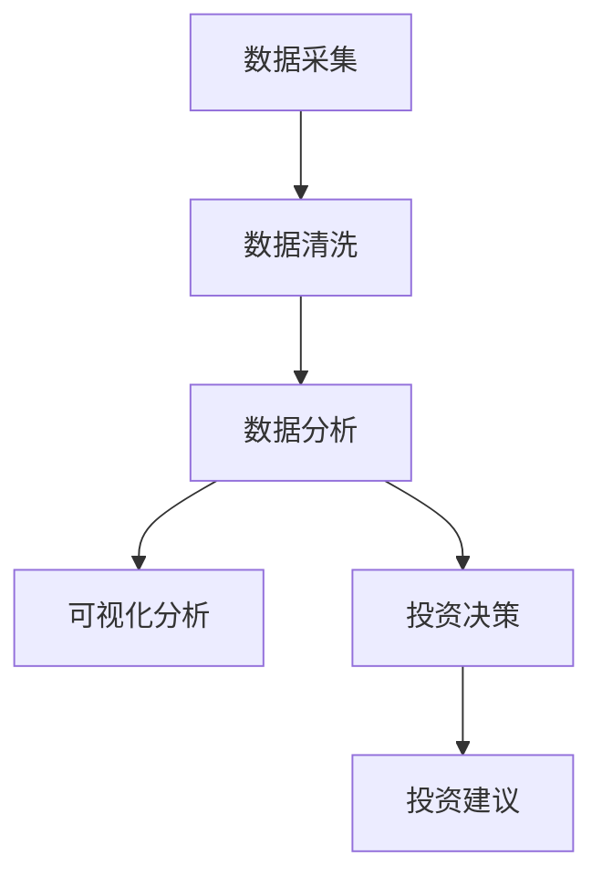
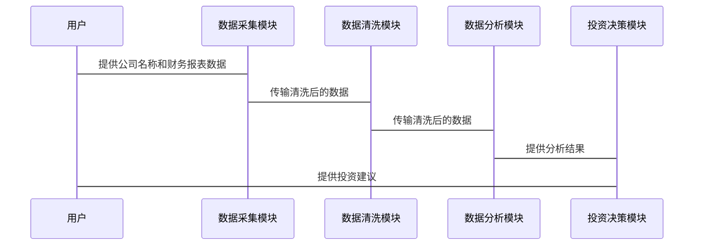

                 


# 稳定收入与收益：巴菲特青睐的公司特征

> 关键词：稳定收入，收益，巴菲特，投资策略，公司特征，财务分析

> 摘要：本文深入分析了稳定收入与收益在公司价值中的重要性，结合巴菲特的投资理念，探讨了如何通过财务指标和系统架构设计来评估和选择具有稳定收入与收益的公司。文章从核心概念、数学模型、系统设计和项目实战等多方面展开，帮助读者理解稳定收入与收益在投资中的关键作用。

---

## 第1章: 稳定收入与收益的定义与背景

### 1.1 稳定收入的核心概念

稳定收入是指公司在不同经济周期和市场条件下，能够持续、稳定地产生的收入流。这种收入通常具有较高的可预测性和稳定性，能够为公司提供持续的现金流支持。

#### 1.1.1 稳定收入的定义与特征

- **定义**：稳定收入是指公司在较长的时间内，能够持续产生的、波动较小的收入。
- **特征**：
  - **持续性**：收入来源长期稳定，不易受到短期市场波动的影响。
  - **可预测性**：收入流具有较高的可预测性，便于公司进行财务规划。
  - **多样性**：收入来源多样化，降低单一收入来源的风险。

#### 1.1.2 收益的定义与分类

- **定义**：收益是指公司在一定时期内通过经营所获得的利润，包括营业收入、净利润等。
- **分类**：
  - **营业收入**：公司主营业务产生的收入。
  - **净利润**：营业收入减去各项费用后的利润。
  - **每股收益（EPS）**：净利润除以普通股股数，衡量公司盈利能力的指标。

#### 1.1.3 稳定收入与收益的边界与外延

稳定收入和收益之间存在一定的联系和区别。稳定收入强调的是收入的持续性和稳定性，而收益则强调的是收入减去成本后的利润。稳定收入是收益的基础，而收益则是稳定收入的最终体现。

### 1.2 稳定收入与收益的背景分析

#### 1.2.1 经济波动对收入稳定性的影响

经济波动可能导致收入不稳定，特别是在经济衰退期间，许多公司的收入可能大幅下降。因此，拥有稳定收入来源的公司在经济波动中更具抗风险能力。

#### 1.2.2 收益与公司价值的关系

收益是衡量公司价值的重要指标。高收益意味着公司具有较强的盈利能力，能够为股东创造更多的价值。

#### 1.2.3 巴菲特投资理念中的稳定收入与收益

巴菲特注重投资那些具有稳定收入和高收益的公司。他认为，具有稳定收入的公司能够在经济波动中保持较好的表现，而高收益则意味着公司具有较强的盈利能力。

---

## 第2章: 稳定收入与收益的核心要素

### 2.1 稳定收入的关键特征

#### 2.1.1 收入来源的多样性

多样化的收入来源可以降低公司的经营风险。例如，一家公司如果主要依赖一种产品，当市场需求下降时，收入可能会大幅减少。而如果公司有多个收入来源，就可以分散风险。

#### 2.1.2 收入的可预测性

可预测的收入意味着公司能够更好地进行财务规划，减少因收入波动带来的不确定性。

#### 2.1.3 收入的持续性

持续的收入意味着公司在未来一段时间内能够持续产生收入，为公司的发展提供资金支持。

### 2.2 收益的核心要素

#### 2.2.1 收益的构成与来源

收益的构成包括营业收入、利息收入、投资收益等。其中，营业收入是公司最主要的收益来源。

#### 2.2.2 收益的质量与可持续性

收益的质量是指收益的来源是否稳定、可靠。可持续的收益意味着公司能够在未来一段时间内持续产生收益。

#### 2.2.3 收益的稳定性与波动性

收益的稳定性是指收益在一定时期内的波动程度。波动性低的收益意味着收益较为稳定，波动性高的收益则意味着收益不稳定。

---

## 第3章: 稳定收入与收益的对比分析

### 3.1 稳定收入与收益的特征对比

#### 3.1.1 稳定收入的稳定性

稳定收入具有较高的稳定性，波动较小，能够在经济波动中保持较好的表现。

#### 3.1.2 收益的波动性

收益的波动性较大，受到市场环境、公司经营状况等多种因素的影响。

#### 3.1.3 稳定收入与收益的相互影响

稳定收入是收益的基础，而收益则是稳定收入的最终体现。稳定收入的公司通常具有较高的收益。

### 3.2 稳定收入与收益的联系与区别

#### 3.2.1 稳定收入对收益的影响

稳定收入能够为公司提供稳定的现金流，支持公司的发展，进而提高收益。

#### 3.2.2 收益对稳定收入的反哺作用

高收益意味着公司具有较强的盈利能力，能够进一步扩大收入来源，提高收入的稳定性。

#### 3.2.3 稳定收入与收益的综合分析

稳定收入与收益是相辅相成的。稳定收入为收益提供基础，而收益则反映了公司的经营成果。

---

## 第4章: 巴菲特青睐的公司特征

### 4.1 巴菲特投资理念的核心要素

#### 4.1.1 高质量的收益

巴菲特注重投资那些具有高质量收益的公司，即收益稳定、可持续，且来自主营业务。

#### 4.1.2 稳定的收入来源

巴菲特喜欢那些具有稳定收入来源的公司，这些公司能够在经济波动中保持较好的表现。

#### 4.1.3 可持续的盈利能力

巴菲特注重公司是否具有可持续的盈利能力，即公司能够在未来一段时间内持续产生利润。

### 4.2 巴菲特青睐的公司特征分析

#### 4.2.1 公司的财务稳定性

财务稳定性是巴菲特选股的重要标准之一。他喜欢那些财务状况稳健，负债较低，现金流充足的公司。

#### 4.2.2 公司的管理团队

巴菲特认为，优秀的管理团队是公司成功的关键。他注重公司管理团队的能力和诚信。

#### 4.2.3 公司的行业地位

巴菲特喜欢那些在行业内具有领先地位的公司，这些公司通常具有较强的竞争力和定价权。

---

## 第5章: 稳定收入与收益的数学模型与公式

### 5.1 稳定收入的数学模型

#### 5.1.1 稳定收入的计算公式

稳定收入可以通过以下公式计算：

$$
\text{稳定收入} = \sum_{i=1}^{n} \text{收入来源}_i \times \text{稳定性系数}_i
$$

其中，$\text{稳定性系数}_i$ 是衡量每个收入来源稳定性的指标，通常在0到1之间，越接近1，表示该收入来源越稳定。

### 5.2 收益的数学模型

#### 5.2.1 收益的计算公式

收益可以通过以下公式计算：

$$
\text{收益} = \text{收入} - \text{成本}
$$

其中，收入包括营业收入和其他收入，成本包括营业成本、管理费用、销售费用等。

### 5.3 稳定收入与收益的关系公式

#### 5.3.1 稳定收入与收益的综合模型

综合收益可以通过以下公式计算：

$$
\text{综合收益} = \text{稳定收入} \times \text{收益稳定性系数}
$$

其中，$\text{收益稳定性系数}$ 是衡量收益稳定性的指标，通常在0到1之间，越接近1，表示收益越稳定。

---

## 第6章: 稳定收入与收益的系统架构设计

### 6.1 系统分析与设计

#### 6.1.1 系统功能模块

系统功能模块包括：

- 数据采集模块：采集公司的财务数据，包括收入、成本、利润等。
- 数据分析模块：分析公司的收入和收益，评估其稳定性和可持续性。
- 投资决策模块：根据分析结果，提供投资建议。

#### 6.1.2 系统功能设计

- 数据采集模块：
  - 从财务报表中采集收入、成本、利润等数据。
  - 数据清洗和预处理，确保数据的准确性和完整性。
- 数据分析模块：
  - 计算稳定收入和收益的指标，包括稳定性系数、收益稳定性系数等。
  - 可视化分析，生成图表展示分析结果。
- 投资决策模块：
  - 根据分析结果，评估公司的投资价值。
  - 提供投资建议，包括买入、持有或卖出的决策。

#### 6.1.3 系统架构图

以下是系统架构图的Mermaid图示：



#### 6.1.4 系统接口设计

- 数据采集接口：
  - 输入：公司名称、财务报表数据。
  - 输出：清洗后的数据，存储在数据库中。
- 数据分析接口：
  - 输入：清洗后的数据。
  - 输出：稳定收入和收益的分析结果。
- 投资决策接口：
  - 输入：分析结果。
  - 输出：投资建议。

#### 6.1.5 系统交互序列图

以下是系统交互序列图的Mermaid图示：



---

## 第7章: 项目实战

### 7.1 环境安装

为了进行项目实战，我们需要安装以下工具：

- **Python**：用于数据分析和编程。
- **Pandas**：用于数据处理和分析。
- **Matplotlib**：用于数据可视化。
- **Jupyter Notebook**：用于编写和运行代码。

安装命令如下：

```bash
pip install numpy pandas matplotlib
```

### 7.2 系统核心实现源代码

以下是一个简单的Python代码示例，用于计算公司的稳定收入和收益：

```python
import pandas as pd
import matplotlib.pyplot as plt

# 读取财务数据
data = pd.read_csv('financial_data.csv')

# 计算稳定收入
def calculate_stable_income(data):
    stable_income = data['收入'] * data['稳定性系数']
    return stable_income

# 计算收益
def calculate_profit(data):
    profit = data['收入'] - data['成本']
    return profit

# 可视化分析
def visualize_analysis(data):
    plt.figure(figsize=(10, 6))
    plt.plot(data['年份'], data['收入'], label='收入')
    plt.plot(data['年份'], data['成本'], label='成本')
    plt.plot(data['年份'], data['利润'], label='利润')
    plt.title('收入与成本对比')
    plt.xlabel('年份')
    plt.ylabel('金额')
    plt.legend()
    plt.show()

# 主程序
if __name__ == '__main__':
    stable_income = calculate_stable_income(data)
    profit = calculate_profit(data)
    visualize_analysis(data)
    print("稳定收入:", stable_income)
    print("利润:", profit)
```

### 7.3 代码应用解读与分析

以上代码首先读取财务数据，然后计算稳定收入和收益，最后进行数据可视化分析。通过这些步骤，我们可以清晰地看到公司的收入、成本和利润的变化趋势，从而评估公司的稳定收入和收益情况。

### 7.4 实际案例分析

以一家公司为例，假设我们有以下财务数据：

| 年份 | 收入 | 成本 | 稳定性系数 |
|------|------|------|------------|
| 2018 | 100  | 50   | 0.9        |
| 2019 | 110  | 55   | 0.85       |
| 2020 | 120  | 60   | 0.8        |

运行上述代码后，我们得到：

- 稳定收入：2018年为90，2019年为93.5，2020年为96
- 利润：2018年为50，2019年为55，2020年为60

从结果可以看出，公司的收入和利润逐年增长，且稳定性系数较高，说明公司的收入较为稳定，盈利能力较强。

### 7.5 项目小结

通过项目实战，我们学会了如何使用Python和Pandas进行数据分析，如何计算稳定收入和收益，以及如何进行数据可视化分析。这些技能在实际投资分析中具有重要的应用价值。

---

## 第8章: 最佳实践 tips、小结、注意事项、拓展阅读

### 8.1 小结

本文深入探讨了稳定收入与收益在巴菲特投资理念中的重要性，分析了稳定收入和收益的核心要素，设计了一个完整的系统架构，并通过项目实战展示了如何使用Python进行数据分析和投资决策。

### 8.2 注意事项

- 在进行投资决策时，需要综合考虑多个因素，包括行业环境、公司基本面、市场趋势等。
- 数据分析需要基于可靠的数据来源，确保数据的准确性和完整性。
- 投资有风险，需谨慎决策。

### 8.3 拓展阅读

- 《巴菲特的智慧：投资原则实践》
- 《投资学原理》
- 《Python数据分析与挖掘实战》

---

## 作者信息

作者：AI天才研究院/AI Genius Institute & 禅与计算机程序设计艺术 /Zen And The Art of Computer Programming

---

通过以上内容，我们全面了解了稳定收入与收益在公司价值中的重要性，以及如何通过巴菲特的投资理念来选择具有稳定收入与收益的公司。希望本文能够为读者在投资分析和公司评估方面提供有价值的参考。

