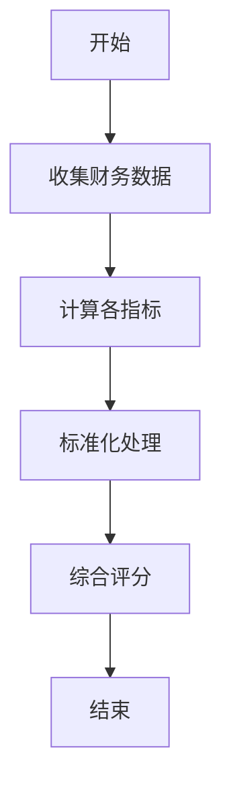

                 


# 约瑟夫·皮奥特罗斯基的F-Score：量化价值投资的尝试

> 关键词：F-Score，价值投资，量化分析，财务指标，投资策略

> 摘要：本文深入探讨了约瑟夫·皮奥特罗斯基提出的F-Score模型，详细分析其在价值投资中的应用。通过介绍F-Score的核心概念、算法原理、系统设计以及实际案例，本文为投资者提供了一种量化评估公司财务健康状况的工具，帮助做出更明智的投资决策。

---

## 第一部分：F-Score的背景与理论基础

### 第1章：价值投资与F-Score的起源

#### 1.1 价值投资的定义与核心理念

##### 1.1.1 价值投资的定义

价值投资是一种投资策略，旨在通过识别市场中被低估的股票，长期持有以实现资本增值。其核心在于分析公司的基本面，寻找具有强大财务表现和良好前景的企业。

##### 1.1.2 价值投资的核心理念

- 购买价格低于内在价值。
- 长期持有优质资产。
- 重点分析公司的财务报表、行业地位和管理团队。

##### 1.1.3 价值投资与基本面分析的关系

基本面分析是价值投资的核心工具，通过研究公司的财务数据、行业地位和宏观经济环境，评估其内在价值。F-Score正是基于基本面分析，提供了一种量化评估方法。

#### 1.2 F-Score的提出与背景

##### 1.2.1 约瑟夫·皮奥特罗斯基的学术背景

约瑟夫·皮奥特罗斯基是美国著名的投资专家，以其在价值投资领域的研究闻名。他的F-Score模型是其研究成果之一，旨在量化公司的财务健康状况。

##### 1.2.2 F-Score的提出动机

传统价值投资依赖于主观判断，而F-Score通过量化方法，将复杂的财务指标转化为可操作的评分，帮助投资者更客观地评估公司。

##### 1.2.3 F-Score在学术界的影响

F-Score已被广泛应用于学术研究和投资实践中，成为量化分析的重要工具之一。

#### 1.3 F-Score的核心思想

##### 1.3.1 F-Score的核心概念

F-Score是一种评分系统，通过综合多个财务指标，评估公司的财务健康状况，进而预测其未来表现。

##### 1.3.2 F-Score的理论基础

F-Score基于财务指标的时间序列分析，通过计算多个指标的变化趋势，评估公司的增长潜力和财务稳定性。

##### 1.3.3 F-Score在投资决策中的作用

F-Score帮助投资者识别具有持续增长潜力和财务健康状况良好的公司，从而做出更明智的投资决策。

---

## 第二部分：F-Score的核心指标与计算方法

### 第2章：F-Score的核心指标

#### 2.1 F-Score的核心指标

##### 2.1.1 营业收入增长率

$$\text{营业收入增长率} = \frac{\text{本期营业收入} - \text{上期营业收入}}{\text{上期营业收入}} \times 100\%$$

##### 2.1.2 净利润增长率

$$\text{净利润增长率} = \frac{\text{本期净利润} - \text{上期净利润}}{\text{上期净利润}} \times 100\%$$

##### 2.1.3 营业利润率

$$\text{营业利润率} = \frac{\text{净利润}}{\text{营业收入}} \times 100\%$$

##### 2.1.4 资产周转率

$$\text{资产周转率} = \frac{\text{营业收入}}{\text{平均资产总额}}$$

##### 2.1.5 现金流健康度

现金流健康度衡量公司维持日常运营和偿还债务的能力，具体包括经营活动现金流净额、投资活动现金流净额和筹资活动现金流净额的分析。

#### 2.2 F-Score的计算步骤

##### 2.2.1 数据收集与整理

收集过去几年的财务报表数据，确保数据的完整性和准确性。

##### 2.2.2 指标计算与标准化

计算每个指标的值，并将其标准化到0-10分的区间。

##### 2.2.3 综合评分与分类

将各个指标的评分加总，得到总分，并根据总分将公司分为不同的类别。

#### 2.3 F-Score的优缺点分析

##### 2.3.1 F-Score的优点

- 客观性：基于定量分析，减少主观判断。
- 系统性：综合多个指标，全面评估公司财务状况。
- 可比性：适用于不同行业和规模的公司。

##### 2.3.2 F-Score的缺点

- 简化性：可能忽略某些重要的财务指标。
- 时间性：依赖于历史数据，未来表现可能变化。
- 行业差异：不同行业的财务指标权重可能不同。

##### 2.3.3 F-Score与其他投资评分模型的对比

与Altman Z-score相比，F-Score更关注公司的成长性和盈利能力，而Altman Z-score主要用于预测破产风险。

---

## 第三部分：F-Score的算法原理与数学模型

### 第3章：F-Score的算法原理

#### 3.1 F-Score的计算流程



#### 3.2 F-Score的数学模型

##### 3.2.1 综合评分公式

$$\text{F-Score} = w_1 \times \text{营业收入增长率} + w_2 \times \text{净利润增长率} + w_3 \times \text{营业利润率} + w_4 \times \text{资产周转率} + w_5 \times \text{现金流健康度}$$

其中，$w_1, w_2, w_3, w_4, w_5$是各指标的权重，通常根据经验或统计方法确定。

---

## 第四部分：F-Score的系统分析与架构设计

### 第4章：F-Score的系统分析

#### 4.1 问题场景介绍

F-Score模型的应用场景包括股票筛选、投资组合优化和风险评估。

#### 4.2 系统功能设计

##### 4.2.1 数据采集模块

负责收集公司财务数据，包括营业收入、净利润等。

##### 4.2.2 指标计算模块

计算各财务指标的值，并进行标准化处理。

##### 4.2.3 综合评分模块

根据权重计算F-Score评分，并生成分类结果。

#### 4.3 系统架构设计


#### 4.4 接口设计与交互流程

##### 4.4.1 数据接口

通过API接口获取公司财务数据。

##### 4.4.2 用户交互

用户输入公司名称，系统返回F-Score评分和分析结果。

---

## 第五部分：F-Score的项目实战

### 第5章：F-Score的项目实战

#### 5.1 环境配置

安装必要的Python库，如pandas、numpy和scikit-learn。

#### 5.2 核心代码实现

##### 5.2.1 数据读取与预处理

```python
import pandas as pd

# 读取数据
data = pd.read_csv('financial_data.csv')

# 数据预处理
data = data.dropna()
```

##### 5.2.2 指标计算

```python
# 计算营业收入增长率
data['revenue_growth'] = (data['revenue'] - data['revenue'].shift(1)) / data['revenue'].shift(1) * 100

# 计算净利润增长率
data['net_profit_growth'] = (data['net_profit'] - data['net_profit'].shift(1)) / data['net_profit'].shift(1) * 100
```

##### 5.2.3 综合评分

```python
# 定义F-Score评分函数
def calculate_f_score(data):
    # 计算各指标
    revenue_growth = data['revenue_growth'].mean()
    net_profit_growth = data['net_profit_growth'].mean()
    return (revenue_growth + net_profit_growth) / 2

# 应用评分函数
f_score = calculate_f_score(data)
```

#### 5.3 案例分析

以具体公司为例，展示如何应用F-Score进行投资决策。

#### 5.4 项目小结

总结项目实现的关键步骤和注意事项，强调F-Score在实际应用中的优势。

---

## 第六部分：总结与展望

### 第6章：总结与展望

#### 6.1 F-Score的重要性和应用价值

F-Score为投资者提供了一种量化评估公司财务健康状况的工具，帮助做出更明智的投资决策。

#### 6.2 F-Score的未来发展方向

- 结合其他模型（如机器学习）提升预测精度。
- 扩展应用领域，如风险评估和投资组合管理。
- 开发实时监控工具，动态评估公司财务状况。

#### 6.3 最佳实践 tips

- 数据质量是关键，确保数据的准确性和完整性。
- 根据具体需求调整指标权重和计算方法。
- 结合其他分析方法，全面评估投资目标。

---

## 作者：AI天才研究院/AI Genius Institute & 禅与计算机程序设计艺术 /Zen And The Art of Computer Programming

---

以上内容是关于F-Score的详细介绍，涵盖了其背景、核心概念、算法原理、系统设计和实际应用。通过本文，读者可以全面理解F-Score的价值和应用方法，为量化投资决策提供有力支持。

