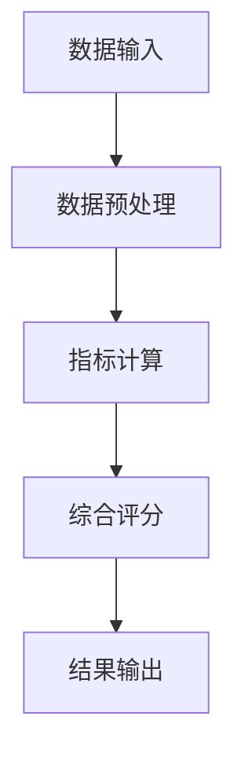
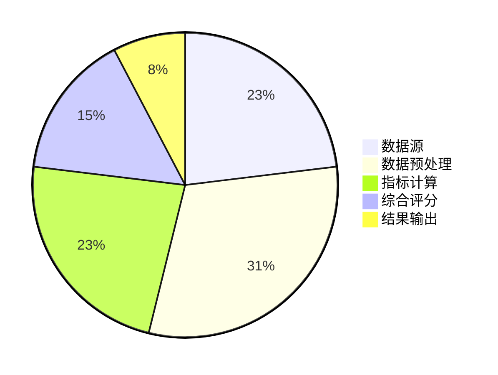
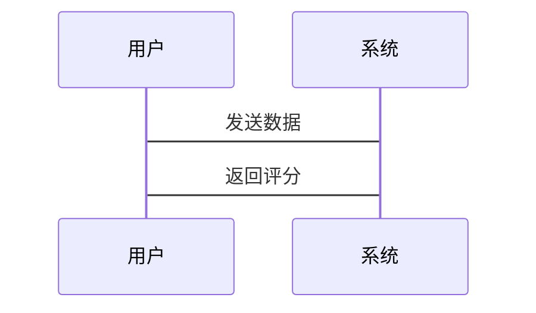

                 


# 约瑟夫·皮奥特罗斯基的基本面量化价值投资：F-Score应用

## 关键词：F-Score, 基本面量化投资, 价值投资, 股票评估, 算法实现

## 摘要：本文深入探讨了约瑟夫·皮奥特罗斯基提出的F-Score基本面量化价值投资方法，从其数学模型、算法原理到实际应用进行了详细分析。通过系统设计与项目实战，展示了F-Score在投资决策中的强大能力。

---

# 第一部分: 基本面量化价值投资与F-Score概述

## 第1章: 基本面量化价值投资的背景与概念

### 1.1 价值投资的起源与发展

#### 1.1.1 价值投资的定义与核心理念
价值投资是一种长期投资策略，强调以低于公平价值的价格购买优质资产。其核心理念是通过深入分析企业的基本面，寻找被市场低估的投资标的。

#### 1.1.2 价值投资与基本面分析的关系
基本面分析是价值投资的核心，涉及对企业财务状况、行业地位、管理团队和市场环境的分析。通过基本面分析，投资者可以评估企业的内在价值。

#### 1.1.3 现代量化投资的演变
现代投资学的发展使得价值投资逐步量化，利用数学模型和算法优化投资决策。F-Score正是这一趋势的产物，它将基本面分析与量化方法相结合。

### 1.2 F-Score的基本概念与核心要素

#### 1.2.1 F-Score的定义与背景
F-Score是由约瑟夫·皮奥特罗斯基提出的一种基本面量化指标，用于评估企业的财务健康状况和投资价值。它通过多个财务指标的加权评分，提供一个综合评分来判断企业的投资价值。

#### 1.2.2 F-Score的核心要素与计算方法
F-Score的核心要素包括盈利能力、成长能力、运营效率、偿债能力和市场表现五大类。每个类别下有具体的财务指标，如ROE、ROA、净利率等。F-Score通过这些指标的加权计算，得出综合评分。

#### 1.2.3 F-Score与传统价值投资的区别
与传统价值投资相比，F-Score的优势在于量化和系统化。它通过数学模型将复杂的财务分析转化为可操作的评分，帮助投资者快速评估投资标的的价值。

## 1.3 本章小结
本章介绍了价值投资的背景和F-Score的基本概念，强调了F-Score在量化投资中的重要性。

---

# 第二部分: F-Score的数学模型与算法原理

## 第2章: F-Score的数学模型与公式

### 2.1 F-Score的核心数学模型

#### 2.1.1 F-Score的计算公式
$$F\text{-Score} = \sum_{i=1}^{n} w_i \cdot x_i$$

其中，$w_i$ 是第 $i$ 个指标的权重，$x_i$ 是第 $i$ 个指标的评分。

#### 2.1.2 权重的确定
权重的确定是F-Score模型的重要部分，通常基于历史数据和统计分析。每个指标的权重反映了其对投资决策的影响程度。

### 2.2 F-Score的算法流程

#### 2.2.1 数据输入与预处理
数据输入包括企业的财务报表数据，如收入、利润、资产等。预处理步骤包括数据清洗和标准化。

#### 2.2.2 各项指标的计算
计算每个指标的评分，如ROE、ROA等。评分通常基于标准化后的数据，确保不同指标的可比性。

#### 2.2.3 综合评分的计算与结果输出
将各指标的评分按权重加总，得出综合评分，并根据评分结果进行投资决策。

### 2.3 F-Score的算法优化与改进

#### 2.3.1 算法优化的必要性
随着市场环境的变化，F-Score模型需要不断优化，以适应新的数据和市场趋势。

#### 2.3.2 基于权重调整的优化方法
通过历史回测和机器学习方法，优化各指标的权重，提高模型的准确性和稳定性。

#### 2.3.3 算法的鲁棒性与稳定性分析
评估模型在不同市场环境下的表现，确保其稳定性和鲁棒性。

### 2.4 本章小结
本章详细讲解了F-Score的数学模型和算法流程，为后续的系统设计和实现奠定了基础。

---

# 第三部分: F-Score在投资系统中的应用与实现

## 第3章: 投资系统的系统分析与架构设计

### 3.1 系统功能需求分析

#### 3.1.1 系统目标与功能模块划分
系统目标是实现F-Score评分的自动化计算和投资决策支持。功能模块包括数据输入、预处理、指标计算、评分计算和结果输出。

#### 3.1.2 系统输入与输出的定义
输入包括企业的财务数据和市场数据，输出是F-Score评分和投资建议。

#### 3.1.3 系统功能流程图（Mermaid）



### 3.2 系统架构设计

#### 3.2.1 系统架构图（Mermaid）



#### 3.2.2 系统架构设计
系统分为数据输入、数据处理、计算模块和输出模块。各模块之间通过接口交互，确保数据流的顺畅。

### 3.3 系统接口设计

#### 3.3.1 系统接口设计
系统接口包括数据输入接口、计算接口和结果输出接口。每个接口定义了输入和输出的数据格式。

#### 3.3.2 系统交互序列图（Mermaid）



## 第3.4 本章小结
本章分析了投资系统的功能需求和架构设计，展示了F-Score在实际系统中的应用。

---

## 第4章: 项目实战——F-Score评分系统实现

### 4.1 项目背景与目标

#### 4.1.1 项目背景
本项目旨在实现一个基于F-Score的股票评分系统，帮助投资者快速评估股票的投资价值。

### 4.2 项目环境与工具

#### 4.2.1 环境安装
需要安装Python、Pandas、NumPy等库。

### 4.3 系统核心实现源代码

#### 4.3.1 数据获取与预处理
```python
import pandas as pd
import numpy as np

# 获取数据
data = pd.read_csv('stock_data.csv')

# 数据预处理
data = data.dropna()
data = (data - data.mean()) / data.std()
```

#### 4.3.2 F-Score计算
```python
def calculate_f_score(data):
    # 计算各项指标
    roe = data['ROE']
    roa = data['ROA']
    net_profit_margin = data['Net Profit Margin']
    current_ratio = data['Current Ratio']
    debt_to_equity = data['Debt/Equity']
    
    # 确定权重
    weights = [0.3, 0.2, 0.2, 0.15, 0.15]
    
    # 计算评分
    f_score = weights[0] * roe + weights[1] * roa + weights[2] * net_profit_margin + weights[3] * current_ratio + weights[4] * debt_to_equity
    return f_score
```

### 4.4 项目小结
本章通过一个具体的项目实战，展示了F-Score评分系统的实现过程，帮助读者理解其实际应用。

---

## 第5章: F-Score应用中的最佳实践与注意事项

### 5.1 最佳实践

#### 5.1.1 数据来源的可靠性
确保数据来源可靠，避免因数据错误影响评分结果。

#### 5.1.2 模型的持续优化
定期更新模型，根据市场变化调整权重和指标。

### 5.2 注意事项

#### 5.2.1 模型的局限性
F-Score模型基于历史数据，无法预测未来市场的突发情况。

#### 5.2.2 风险控制
在实际投资中，应结合其他指标和市场分析，避免过度依赖单一模型。

### 5.3 拓展阅读
推荐进一步阅读相关文献，深入了解F-Score的应用和改进方法。

---

## 作者：AI天才研究院/AI Genius Institute & 禅与计算机程序设计艺术 /Zen And The Art of Computer Programming

---

这篇文章系统地介绍了F-Score的基本概念、算法原理和实际应用，结合了理论分析和项目实战，帮助读者全面掌握F-Score的基本面量化价值投资方法。

