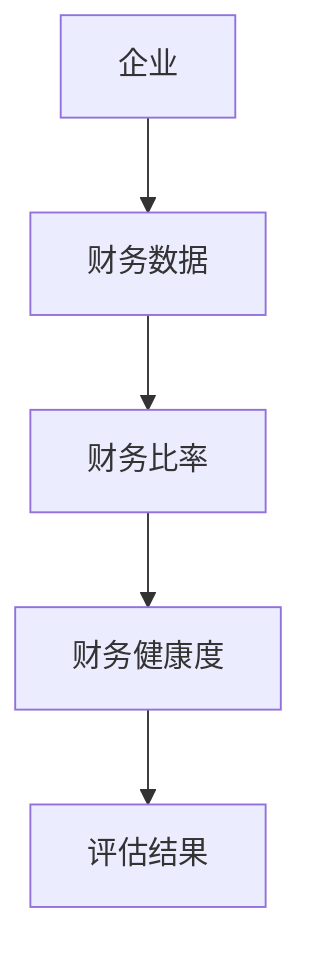
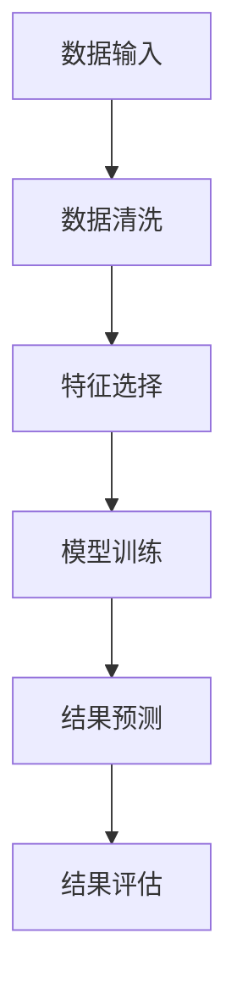
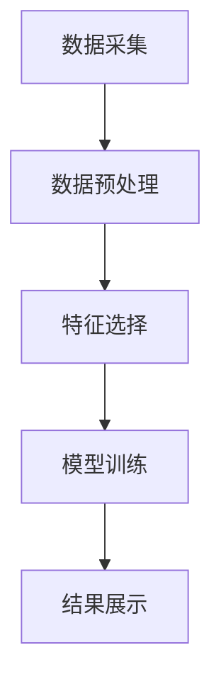

                 


# 约瑟夫·皮奥特罗斯基的财务健康度评估模型

## 关键词：财务健康度评估，约瑟夫·皮奥特罗斯基，企业财务分析，机器学习，风险管理

## 摘要：  
本文深入探讨了约瑟夫·皮奥特罗斯基的财务健康度评估模型，从模型的背景、核心概念、算法原理、系统架构设计到项目实战，详细阐述了该模型的理论基础和实际应用。通过分析财务比率、企业生命周期与财务健康度的关系，结合机器学习算法，本文为读者提供了从理论到实践的全面指导，帮助投资者和企业管理人员更好地理解和应用该模型，以实现稳健的财务管理和风险控制。

---

## 第一部分：约瑟夫·皮奥特罗斯基的财务健康度评估模型概述

### 第1章：财务健康度评估模型的背景与意义

#### 1.1 企业财务健康度的定义  
企业财务健康度是指企业在一定时期内，通过合理的财务管理和资源配置，维持正常经营、承担偿债责任、实现可持续发展的能力。它是衡量企业财务状况的重要指标，直接关系到企业的生存与发展。

#### 1.2 财务健康度评估的重要性  
- **投资决策**：投资者通过评估企业的财务健康度，判断其投资风险和回报潜力。  
- **风险管理**：企业通过财务健康度评估，识别潜在的财务问题，及时采取措施。  
- **经营优化**：财务健康度评估帮助企业发现经营中的问题，优化资源配置。  

#### 1.3 约瑟夫·皮奥特罗斯基模型的起源与应用  
约瑟夫·皮奥特罗斯基是财务健康度评估领域的先驱，其模型结合了传统的财务比率分析和现代的数据挖掘技术，通过对企业财务数据的深度挖掘，预测企业的财务健康状况，为投资者和管理层提供决策支持。

---

### 第2章：约瑟夫·皮奥特罗斯基模型的核心概念与联系

#### 2.1 模型的核心原理  
约瑟夫·皮奥特罗斯基模型基于以下核心原理：  
1. **财务比率分析**：通过分析企业的偿债能力、营运能力、盈利能力等关键财务比率，评估企业的财务健康状况。  
2. **企业生命周期理论**：不同生命周期阶段的企业，其财务健康度的评估标准和侧重点不同。  
3. **数据驱动方法**：利用机器学习算法，从企业的财务数据中提取特征，构建预测模型。

#### 2.2 核心概念的属性特征对比  
以下表格对比了传统财务比率分析和约瑟夫·皮奥特罗斯基模型的核心特征：  

| **特征维度** | **传统财务比率分析** | **约瑟夫·皮奥特罗斯基模型** |
|--------------|------------------------|-----------------------------|
| **数据来源** | 财务报表数据            | 财务报表数据 + 其他数据源    |
| **分析方法** | 纯粹定量分析            | 结合定量与定性分析          |
| **模型复杂度** | 较低                   | 较高，引入机器学习算法      |
| **应用场景** | 单独使用                | 结合企业生命周期进行预测      |

#### 2.3 ER实体关系图  
以下是一个简化的ER实体关系图，展示了约瑟夫·皮奥特罗斯基模型的核心数据结构：  



---

### 第3章：模型的算法原理与实现

#### 3.1 算法原理概述  
约瑟夫·皮奥特罗斯基模型的核心算法基于随机森林（Random Forest）分类器，结合以下步骤：  
1. **数据预处理**：清洗数据，处理缺失值和异常值。  
2. **特征选择**：从财务比率中选择最具预测能力的特征。  
3. **模型训练**：使用随机森林算法对模型进行训练。  
4. **结果预测**：基于训练好的模型，预测企业的财务健康度。  
5. **结果评估**：通过准确率、召回率等指标评估模型的性能。

#### 3.2 算法实现流程图  
以下是一个简化的算法实现流程图：  



#### 3.3 算法实现代码示例  
以下是一个完整的Python代码示例，展示了约瑟夫·皮奥特罗斯基模型的实现过程：  

```python
import pandas as pd
from sklearn.ensemble import RandomForestClassifier
from sklearn.metrics import accuracy_score, classification_report

# 数据加载与预处理
data = pd.read_csv('financial_data.csv')
data = data.dropna()  # 删除缺失值
data = data[~(data['revenue'].isin([0]))]  # 去除收入为0的异常值

# 特征选择
features = ['current_assets', 'total_liabilities', 'operating_income', 'net_profit']
target = 'financial_health'

X = data[features]
y = data[target]

# 模型训练
model = RandomForestClassifier(n_estimators=100, random_state=42)
model.fit(X, y)

# 模型预测
y_pred = model.predict(X)

# 模型评估
print(f'Accuracy: {accuracy_score(y, y_pred)}')
print(classification_report(y, y_pred))
```

---

### 第4章：数学模型与公式解析

#### 4.1 核心财务比率的数学表达  
以下是一些关键财务比率的数学表达式：  
1. **资产负债率**：  
   $$ \text{资产负债率} = \frac{\text{总负债}}{\text{总资产}} $$  
2. **净利率**：  
   $$ \text{净利率} = \frac{\text{净利润}}{\text{营业收入}} $$  
3. **应收账款周转率**：  
   $$ \text{应收账款周转率} = \frac{\text{营业收入}}{\text{应收账款}} $$  

#### 4.2 模型的评估指标  
1. **准确率**：  
   $$ \text{准确率} = \frac{\text{正确预测数}}{\text{总样本数}} $$  
2. **召回率**：  
   $$ \text{召回率} = \frac{\text{正确预测的阳性样本数}}{\text{实际阳性样本数}} $$  
3. **F1分数**：  
   $$ \text{F1分数} = \frac{2 \times \text{准确率} \times \text{召回率}}{\text{准确率} + \text{召回率}} $$  

---

### 第5章：系统架构设计

#### 5.1 系统功能设计  
约瑟夫·皮奥特罗斯基模型的系统架构包括以下几个模块：  
1. **数据采集模块**：从财务报表中提取相关数据。  
2. **数据预处理模块**：清洗和标准化数据。  
3. **特征选择模块**：筛选关键财务比率。  
4. **模型训练模块**：构建并训练随机森林模型。  
5. **结果展示模块**：输出财务健康度评估结果。  

#### 5.2 系统架构图  
以下是一个简化的系统架构图：  



---

### 第6章：项目实战

#### 6.1 环境安装  
需要安装以下Python库：  
- `pandas`：用于数据处理。  
- `scikit-learn`：用于机器学习算法。  
- `mermaid`：用于绘制流程图。  

#### 6.2 核心代码实现  
以下是一个完整的项目实现代码示例：  

```python
import pandas as pd
from sklearn.ensemble import RandomForestClassifier
from sklearn.metrics import accuracy_score, classification_report
from sklearn.model_selection import train_test_split

# 数据加载与预处理
data = pd.read_csv('financial_data.csv')
data = data.dropna()
data = data[~(data['revenue'].isin([0]))]

# 特征选择
features = ['current_assets', 'total_liabilities', 'operating_income', 'net_profit']
target = 'financial_health'

X = data[features]
y = data[target]

# 数据分割
X_train, X_test, y_train, y_test = train_test_split(X, y, test_size=0.2, random_state=42)

# 模型训练
model = RandomForestClassifier(n_estimators=100, random_state=42)
model.fit(X_train, y_train)

# 模型预测
y_pred = model.predict(X_test)

# 模型评估
print(f'Accuracy: {accuracy_score(y_test, y_pred)}')
print(classification_report(y_test, y_pred))
```

---

## 第七章：最佳实践、小结与注意事项

#### 7.1 最佳实践  
1. **数据质量**：确保数据的完整性和准确性，避免异常值和缺失值的影响。  
2. **模型调优**：通过参数调整和特征工程优化模型性能。  
3. **结果解读**：结合企业的实际情况，深入分析模型预测结果，避免机械式应用。  

#### 7.2 小结  
约瑟夫·皮奥特罗斯基的财务健康度评估模型通过结合传统财务分析和现代机器学习技术，为企业提供了有效的财务健康度评估工具。该模型不仅能够帮助投资者和管理层做出明智的决策，还能通过持续优化和改进，不断提升评估的准确性和实用性。

#### 7.3 注意事项  
1. **数据依赖性**：模型的准确性高度依赖于数据的质量和完整性。  
2. **模型解释性**：随机森林模型的解释性较差，可能影响实际应用中的理解。  
3. **动态更新**：企业的财务状况是动态变化的，模型需要定期更新和维护。  

---

## 作者：AI天才研究院/AI Genius Institute & 禅与计算机程序设计艺术 /Zen And The Art of Computer Programming

