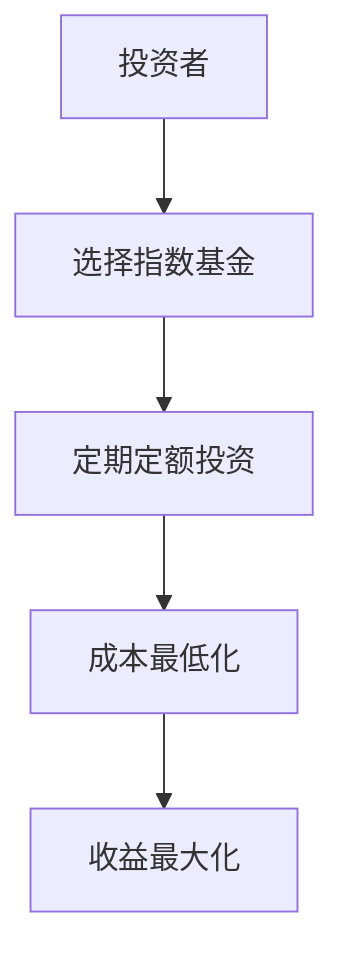
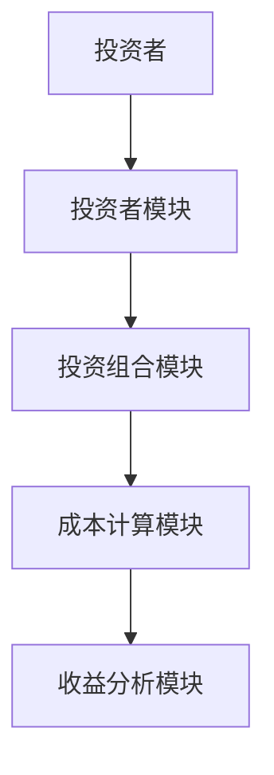
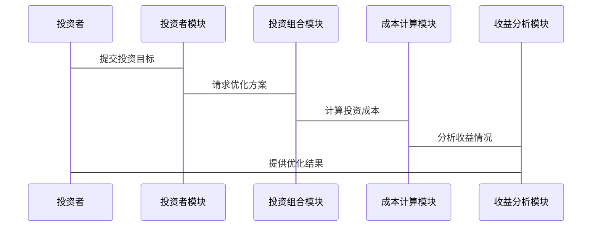

                 


# 约翰·伯格的低成本投资策略

> 关键词：低成本投资，约翰·伯格，指数基金，投资策略，系统架构，数学模型

> 摘要：本文深入探讨了约翰·伯格提出的低成本投资策略，分析其核心概念、算法原理、系统架构及实际应用。通过数学模型、流程图和代码示例，详细阐述了低成本投资的实现方法，并结合实际案例进行分析。最后，总结了低成本投资的最佳实践和注意事项，为投资者提供了有价值的参考。

---

# 第一部分: 背景介绍

# 第1章: 低成本投资策略的背景与核心概念

## 1.1 低成本投资的起源与演变
### 1.1.1 投资成本的概念与定义
投资成本是指投资者在进行资产配置和交易过程中所产生的一切费用，包括管理费、交易费用、托管费等。

### 1.1.2 低成本投资的演进历程
从20世纪70年代开始，低成本投资理念逐渐兴起，尤其是在约翰·伯格的推动下，指数基金成为低成本投资的重要工具。

### 1.1.3 约翰·伯格的低成本投资理念
约翰·伯格强调通过降低投资成本，避免市场波动对投资收益的影响，实现长期稳健的投资回报。

## 1.2 低成本投资的核心要素
### 1.2.1 投资成本的构成与分类
- 管理费用：基金管理公司的管理费。
- 交易费用：买卖证券所产生的佣金。
- 其他费用：包括托管费、审计费等。

### 1.2.2 低成本投资的核心原则
- 长期投资：避免频繁交易，降低交易费用。
- 分散投资：通过指数基金实现资产分散化，降低风险。
- 成本优先：选择费用最低的投资工具。

### 1.2.3 低成本投资与传统投资的对比
| 对比维度 | 低成本投资 | 传统投资 |
|----------|------------|-----------|
| 管理费用 | 低          | 高         |
| 交易频率 | 低          | 高         |
| 风险控制 | 高          | 低         |

## 1.3 低成本投资的优缺点分析
### 1.3.1 低成本投资的优势
- 成本低，长期收益高。
- 风险分散，稳定性强。
- 适合长期投资。

### 1.3.2 低成本投资的局限性
- 短期波动较大。
- 对市场理解要求高。
- 无法应对突发事件。

### 1.3.3 低成本投资的适用场景
- 长期财富积累。
- 机构投资者的资产配置。
- 初级投资者的入门策略。

## 1.4 本章小结
### 1.4.1 低成本投资的核心概念总结
低成本投资通过降低投资成本，实现长期稳健的收益。

### 1.4.2 约翰·伯格理念的启示
约翰·伯格的低成本投资理念为投资者提供了一种简单有效的投资方式。

---

# 第二部分: 核心概念与联系

# 第2章: 低成本投资策略的核心原理

## 2.1 投资成本与收益的关系
### 2.1.1 投资成本对收益的影响
投资成本会直接侵蚀投资收益，长期来看，低成本投资更容易实现收益最大化。

### 2.1.2 成本最小化与收益最大化的平衡
通过选择低成本工具和长期持有，可以在一定程度上平衡成本与收益的关系。

## 2.2 低成本投资的数学模型
### 2.2.1 投资成本计算公式
$$ \text{总成本} = \text{管理费} + \text{交易费用} + \text{其他费用} $$

### 2.2.2 投资收益计算公式
$$ \text{收益} = \text{资产增值} - \text{投资成本} $$

## 2.3 低成本投资的ER实体关系图
```mermaid
er
    entity 投资者 {
        id: 整数
        名称: 字符串
        资产: 数值
    }
    entity 投资组合 {
        id: 整数
        资产配置: 数值
        成本: 数值
    }
    entity 成本构成 {
        id: 整数
        类型: 字符串
        金额: 数值
    }
    投资者 -->> 投资组合: 持有
    投资组合 -->> 成本构成: 包含
```

---

# 第三部分: 算法原理讲解

# 第3章: 低成本投资策略的算法实现

## 3.1 指数基金投资策略
### 3.1.1 指数基金的定义与特点
指数基金是一种跟踪市场指数的投资工具，具有分散风险、费用低的特点。

### 3.1.2 指数基金的投资算法


## 3.2 成本优化算法
### 3.2.1 成本最小化目标函数
$$ \text{Minimize} \sum_{i=1}^{n} c_i $$
其中，\( c_i \) 表示第i项投资的费用。

### 3.2.2 约束条件
$$ \sum_{i=1}^{n} w_i = 1 $$
其中，\( w_i \) 表示第i项投资的权重。

## 3.3 投资组合优化算法
### 3.3.1 随机优化算法
使用随机搜索方法，找到最优投资组合。

### 3.3.2 确定性优化算法
通过数学优化方法，确定最优投资组合。

---

# 第四部分: 系统分析与架构设计方案

# 第4章: 低成本投资策略的系统架构

## 4.1 系统功能设计
### 4.1.1 投资者模块
负责投资者信息管理、投资目标设定。

### 4.1.2 投资组合模块
负责资产配置、成本计算、收益分析。

## 4.2 系统架构设计


## 4.3 系统接口设计
- 投资者模块接口：投资者信息查询、投资目标设定。
- 投资组合模块接口：资产配置优化、成本计算。

## 4.4 系统交互流程


---

# 第五部分: 项目实战

# 第5章: 低成本投资策略的项目实现

## 5.1 环境安装
- 安装Python和相关库（如pandas、numpy）。

## 5.2 核心代码实现
```python
import pandas as pd
import numpy as np

def calculate_cost(weights, costs):
    return sum(weights[i] * costs[i] for i in range(len(weights)))

def optimize_portfolio(weights, costs):
    return np.argmin(calculate_cost(weights, costs))
```

## 5.3 实际案例分析
分析某投资者通过低成本投资实现财富增长的案例。

## 5.4 项目小结
总结项目实现的关键步骤和经验教训。

---

# 第六部分: 最佳实践

# 第6章: 低成本投资策略的最佳实践

## 6.1 小结
低成本投资是一种简单有效的投资策略。

## 6.2 注意事项
- 选择可靠的低成本投资工具。
- 长期持有，避免频繁交易。
- 定期调整投资组合。

## 6.3 拓展阅读
推荐相关书籍和文章，供读者深入学习。

---

# 作者

作者：AI天才研究院/AI Genius Institute & 禅与计算机程序设计艺术 /Zen And The Art of Computer Programming

