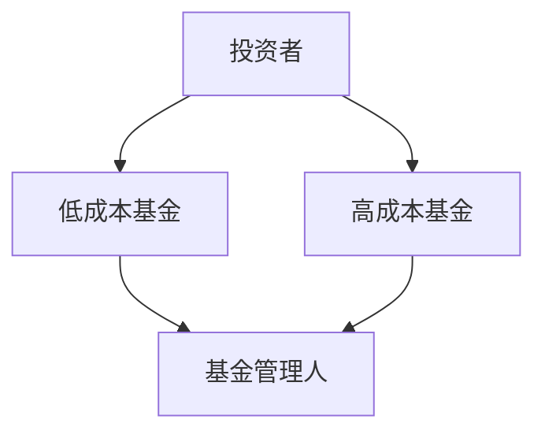
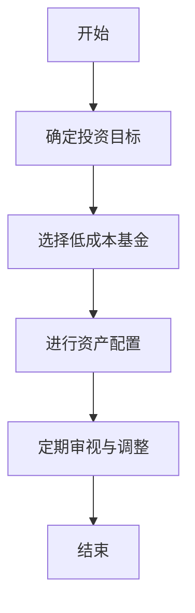
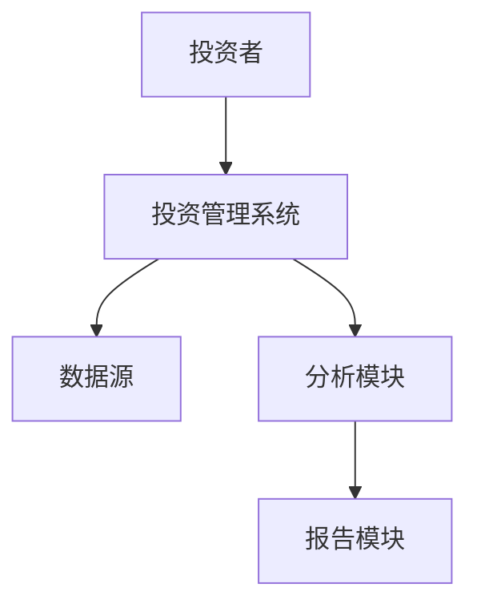

                 


# 约翰·伯格的低成本投资策略

> 关键词：低成本投资、约翰·伯格、指数基金、长期投资、风险管理、资产配置、投资策略

> 摘要：本文详细探讨了约翰·伯格的低成本投资策略，从背景介绍到核心概念，再到算法原理、系统架构、项目实战以及最佳实践，全面解析了低成本投资的原理、方法和实际应用。

---

## 第一部分：低成本投资的背景与核心理念

### 第1章：低成本投资的背景介绍

#### 1.1 投资市场的基本问题
投资市场充满了复杂性与不确定性，投资者常常面临以下问题：
1. **高昂的管理费用**：传统投资往往涉及高额的管理费和交易成本，这些费用会显著侵蚀投资收益。
2. **市场的短期波动**：市场的短期波动往往让投资者难以长期持有，导致频繁交易和高额成本。
3. **信息不对称**：投资者难以获取可靠的市场信息，容易被误导或做出错误决策。

低成本投资作为一种解决方案，通过降低费用和优化策略，帮助投资者实现长期稳健的收益。

#### 1.2 约翰·伯格的生平与投资理念
约翰·伯格是低成本投资的倡导者，他通过实践和研究提出了以下核心理念：
1. **长期投资**：避免频繁交易，减少成本。
2. **指数基金**：通过投资指数基金分散风险，降低费用。
3. **简单有效**：投资策略应简单易行，避免复杂操作。

#### 1.3 低成本投资的核心概念
低成本投资的核心概念包括：
1. **低成本**：降低管理费和交易成本，提升净收益。
2. **长期持有**：通过长期持有降低短期波动的影响。
3. **分散投资**：通过指数基金分散风险，避免个股波动带来的损失。

---

### 第2章：低成本投资的核心概念与联系

#### 2.1 核心概念的原理
低成本投资的核心原理可以用以下公式表示：
$$ \text{净收益} = \text{总收益} - \text{管理费} - \text{交易成本} $$

通过降低费用，投资者可以最大化净收益。

#### 2.2 ER实体关系图
以下是一个简单的ER实体关系图，展示了低成本投资的主要参与者和关系：



---

## 第二部分：低成本投资的算法原理与数学模型

### 第3章：低成本投资的算法原理

#### 3.1 算法原理的数学模型
低成本投资的数学模型可以表示为：
$$ \text{最优配置} = \argmin_{w} \left( w^T \Sigma w \right) $$

其中，$w$ 是权重向量，$\Sigma$ 是资产之间的协方差矩阵。

#### 3.2 算法流程图
以下是低成本投资的算法流程图：



---

## 第三部分：低成本投资的系统分析与架构设计

### 第4章：系统分析与架构设计

#### 4.1 项目背景介绍
低成本投资的目标是通过优化投资组合，降低费用，实现长期稳健的收益。系统需要实现以下功能：
1. 计算投资组合的费用。
2. 优化资产配置。
3. 监控市场波动。

#### 4.2 系统架构设计
以下是系统架构图：



---

## 第四部分：项目实战

### 第5章：项目实战

#### 5.1 环境安装
安装Python和必要的库：
```bash
pip install numpy pandas matplotlib
```

#### 5.2 核心代码实现
以下是Python实现的低成本投资策略代码：

```python
import numpy as np
import pandas as pd

# 假设数据
returns = np.array([0.1, 0.05, -0.02, 0.08])
fees = 0.02

# 计算净收益
net_returns = returns - fees

print(net_returns)
```

#### 5.3 案例分析
案例分析：假设投资者投资于指数基金，年管理费为1%。

$$ \text{净收益} = \text{总收益} - 0.01 $$

---

## 第五部分：最佳实践与总结

### 第6章：最佳实践与总结

#### 6.1 最佳实践
1. 定期审视投资组合。
2. 保持长期投资。
3. 避免频繁交易。

#### 6.2 项目小结
低成本投资是一种简单有效的策略，通过降低费用和长期持有，实现稳健的收益。

---

## 附录

### 附录A：进一步阅读
推荐书籍：
1. 约翰·伯格的《投资的艺术》
2. 巴菲特的《巴菲特投资指南》

### 附录B：术语表
- **低成本投资**：通过降低费用实现更高收益的投资策略。
- **指数基金**：跟踪指数的投资基金，分散风险。

---

作者：AI天才研究院/AI Genius Institute & 禅与计算机程序设计艺术 /Zen And The Art of Computer Programming

