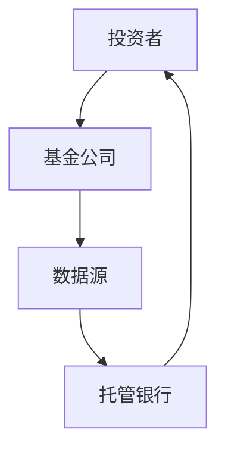

                 


# 约翰·伯格的基金业批评

> 关键词：约翰·伯格，基金业，价值投资，夏普比率，CAPM模型，系统架构

> 摘要：本文深入分析了约翰·伯格对基金行业的批评，探讨了基金业的现状与问题，伯格的价值投资理念，以及基金业的核心概念与联系。通过数学模型、系统架构和实际案例的分析，本文揭示了基金行业的不足，并提出了改进建议。

---

## 第1章：基金业的现状与问题

### 1.1 基金业的基本情况

#### 1.1.1 基金行业的定义与分类
基金行业是指通过集合投资者资金，由专业管理人进行投资运作，以实现资产增值的金融行业。基金可以分为公募基金和私募基金，主要投资于股票、债券、货币市场工具等。

#### 1.1.2 基金行业的市场规模与发展现状
近年来，全球基金市场规模持续增长，尤其是在中国，公募基金规模已超过20万亿元人民币。然而，行业快速发展的同时，也暴露出诸多问题。

#### 1.1.3 基金行业的参与者与角色分析
主要参与者包括基金公司、托管银行、投资者等。基金公司负责投资运作，托管银行负责资金保管，投资者则通过购买基金份额参与投资。

### 1.2 基金业存在的问题

#### 1.2.1 基金行业的费用问题
高昂的管理费用降低了投资者的实际收益，尤其是对于中小投资者而言，费用负担较重。

#### 1.2.2 基金行业的透明度问题
部分基金公司存在信息披露不透明的问题，投资者难以了解基金的具体投资组合和运作情况。

#### 1.2.3 基金行业的短期主义倾向
许多基金管理人追求短期收益，忽视长期投资价值，导致投资策略不稳定。

---

## 第2章：约翰·伯格的批评观点

### 2.1 伯格的价值投资理念

#### 2.1.1 价值投资的定义与核心原则
价值投资强调购买低于内在价值的股票，注重长期持有，追求安全边际。伯格认为，市场波动和短期趋势不可预测，投资应基于基本面分析。

#### 2.1.2 伯格的价值投资方法论
伯格强调投资于那些具有持续盈利能力和良好管理的公司，避免短期市场波动的影响。他倡导分散投资，降低风险。

#### 2.1.3 伯格对市场有效性的看法
伯格认为市场通常是有效的，但长期来看，价值投资仍能创造超额收益。

### 2.2 伯格对基金行业的批评

#### 2.2.1 伯格对主动管理的质疑
伯格批评许多主动管理型基金的表现不佳，且收费过高。他认为，被动指数基金更能为投资者创造价值。

#### 2.2.2 伯格对基金费用的批评
伯格指出，高昂的管理费用侵蚀了投资者的收益，尤其是当基金表现不佳时，费用显得尤为不合理。

#### 2.2.3 伯格对短期主义的批评
伯格批评行业普遍存在短期主义，基金经理过于关注短期业绩，忽视长期投资价值。

---

## 第3章：基金业的核心概念与联系

### 3.1 基金业的核心概念

#### 3.1.1 基金的类型与特点
- **股票型基金**：主要投资于股票，风险高，收益高。
- **债券型基金**：主要投资于债券，风险较低，收益稳定。
- **混合型基金**：同时投资股票和债券，风险和收益介于两者之间。

#### 3.1.2 基金管理人的角色与责任
基金管理人负责基金的投资决策和日常管理，确保基金按合同规定运作。

#### 3.1.3 基金投资者的行为与决策
投资者需要根据自身风险承受能力和投资目标选择合适的基金。

### 3.2 核心概念的对比分析

#### 3.2.1 传统基金与现代基金的对比
| 特性 | 传统基金 | 现代基金 |
|------|----------|----------|
| 投资策略 | 主动管理为主 | 被动管理为主 |
| 费用 | 较高 | 较低 |
| 风险 | 较高 | 较低 |

#### 3.2.2 主动管理与被动管理的对比
| 特性 | 主动管理 | 被动管理 |
|------|----------|----------|
| 目标 | 超越市场指数 | 恒定复制市场指数 |
| 成本 | 高 | 低 |
| 风险 | 高 | 低 |

#### 3.2.3 短期投资与长期投资的对比
| 特性 | 短期投资 | 长期投资 |
|------|----------|----------|
| 风险 | 高 | 低 |
| 收益 | 不稳定 | 稳定 |

---

## 第4章：基金业的算法原理

### 4.1 基金业的数学模型与公式

#### 4.1.1 基金的夏普比率计算公式
$$
\text{夏普比率} = \frac{E(R_p) - R_f}{\sigma_p}
$$
其中，$E(R_p)$是基金的期望收益，$R_f$是无风险利率，$\sigma_p$是基金收益的标准差。

#### 4.1.2 基金的CAPM模型
$$
E(R_i) = R_f + \beta_i (E(R_m) - R_f)
$$
其中，$E(R_i)$是资产的期望收益，$R_f$是无风险利率，$\beta_i$是资产的贝塔系数，$E(R_m)$是市场期望收益。

#### 4.1.3 基金的风险调整回报计算
风险调整回报考虑了基金的风险水平，常用夏普比率或特雷纳比率来衡量。

### 4.2 算法原理的详细讲解

#### 4.2.1 夏普比率的计算与应用
夏普比率衡量基金单位风险所获得的超额收益。计算步骤如下：
1. 计算基金的平均收益。
2. 计算基金收益的标准差。
3. 计算无风险利率。
4. 计算夏普比率。

#### 4.2.2 CAPM模型的原理与应用
CAPM模型用于估计资产的期望收益，帮助投资者评估资产是否被高估或低估。

#### 4.2.3 风险调整回报的计算与应用
通过比较不同基金的风险调整回报，投资者可以更好地选择适合自己的基金。

---

## 第5章：基金业的系统分析与架构设计

### 5.1 系统功能设计

#### 5.1.1 投资者与基金的交互流程
1. 投资者选择基金。
2. 投资者购买基金份额。
3. 基金管理人管理基金。
4. 投资者赎回基金份额。

#### 5.1.2 基金管理人的决策流程
1. 分析市场趋势。
2. 调整投资组合。
3. 公布基金净值。

#### 5.1.3 基金市场的数据流分析
市场数据通过托管银行流向基金管理人，再流向投资者。

### 5.2 系统架构设计


---

## 第6章：基金业的项目实战

### 6.1 项目实战：环境安装与代码实现

#### 6.1.1 环境安装
安装Python和必要的库，如pandas和numpy。

#### 6.1.2 代码实现
```python
import numpy as np
import pandas as pd

def calculate_sharpe_ratio(returns, risk_free_rate):
    excess_returns = returns - risk_free_rate
    sharpe_ratio = np.mean(excess_returns) / np.std(excess_returns)
    return sharpe_ratio

# 示例数据
returns = pd.Series([0.05, 0.02, 0.03, 0.01, 0.04])
risk_free_rate = 0.01

print("夏普比率:", calculate_sharpe_ratio(returns, risk_free_rate))
```

### 6.2 实际案例分析
分析伯格的某只基金，计算其夏普比率，评估其风险调整回报。

---

## 第7章：最佳实践、小结、注意事项和拓展阅读

### 7.1 最佳实践
- 选择费用低、风险可控的基金。
- 长期持有，避免频繁交易。

### 7.2 小结
本文深入分析了约翰·伯格对基金行业的批评，揭示了基金业的问题，并提出了改进建议。

### 7.3 注意事项
- 投资需谨慎，注意市场风险。
- 定期评估投资组合，及时调整。

### 7.4 拓展阅读
推荐阅读《投资最重要的简单真理》和《证券分析》。

---

作者：AI天才研究院/AI Genius Institute & 禅与计算机程序设计艺术 /Zen And The Art of Computer Programming

---

这篇文章系统地分析了约翰·伯格对基金行业的批评，通过详细的分析和实例，揭示了基金业的问题，并提供了改进建议。希望对读者有所帮助。

