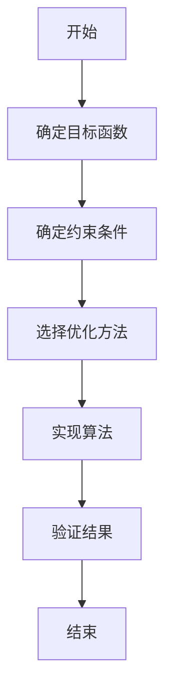
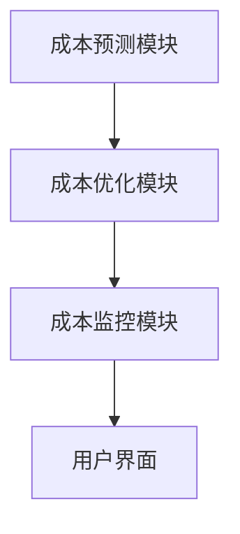

                 


# 约翰·伯格的成本意识：为什么费用比回报更重要

## 关键词：成本意识、费用、回报、成本效益分析、系统架构设计、项目实战、数学模型

## 摘要：  
本文深入探讨了约翰·伯格的成本意识理论，强调在企业管理和决策中，费用管理比回报更重要。通过系统分析、算法原理和实际案例，本文详细阐述了成本意识的核心概念、数学模型和系统架构设计，最后通过项目实战总结了最佳实践。

---

## 第1章：成本意识的背景与重要性

### 1.1 成本意识的定义与内涵  
成本意识是指在企业管理中，对各项成本的敏感度和控制能力。其核心在于通过优化成本结构，提升企业的整体竞争力。

#### 1.1.1 成本意识的定义  
成本意识是一种管理思维，强调在决策过程中优先考虑成本因素，以实现资源的最优配置。

#### 1.1.2 成本意识的核心要素  
- 成本预测：基于历史数据和市场趋势，预测未来的成本变化。
- 成本控制：通过优化流程和资源配置，降低不必要的开支。
- 成本效益分析：评估不同成本投入与预期收益之间的关系。

#### 1.1.3 成本意识的背景与演变  
随着市场竞争的加剧，企业越来越依赖成本管理来保持竞争优势。传统的回报导向型管理逐渐被费用导向型管理所取代，原因在于费用的可控性更强，而回报往往受到外部市场的影响。

### 1.2 费用与回报的关系  
费用是企业可控的内部因素，而回报是外部市场和客户需求的结果。费用的优化可以直接影响企业的利润，而回报的提升需要通过费用的合理投入。

#### 1.2.1 费用与回报的传统观念  
传统观念认为，回报是企业成功的核心，而费用是次要的。然而，这种观点忽视了费用控制对企业利润的直接影响。

#### 1.2.2 为什么费用比回报更重要  
费用的优化可以直接转化为利润，而回报的提升往往需要较高的费用投入。费用控制更能反映企业的管理能力，尤其是在经济下行周期，费用控制更能体现企业的抗风险能力。

#### 1.2.3 费用与回报的权衡分析  
企业在追求回报的同时，必须合理控制费用。费用过低可能导致投入不足，影响回报；费用过高则会侵蚀利润。因此，费用和回报之间需要找到平衡点。

### 1.3 成本意识在企业中的应用前景  
成本意识不仅是企业管理的核心，也是企业创新和可持续发展的关键。通过成本意识，企业可以更好地应对市场变化，提升竞争力。

---

## 第2章：成本意识的核心概念与联系

### 2.1 成本效益分析的核心原理  
成本效益分析是一种评估不同方案可行性的方法，通过比较各方案的成本和收益，选择最优方案。

#### 2.1.1 成本效益分析的基本概念  
成本效益分析（Cost-Benefit Analysis，CBA）是一种经济评估方法，用于确定项目的可行性和最优性。

#### 2.1.2 成本与效益的关系分析  
成本和效益是相互关联的，合理的成本投入可以带来更高的收益，但过高的成本投入可能会降低利润。

#### 2.1.3 成本效益分析的数学模型  
成本效益分析的数学模型可以表示为：
$$ \text{净现值} = \sum_{t=1}^{n} \frac{C_t - B_t}{(1 + r)^t} $$
其中，\( C_t \) 是第 \( t \) 年的成本，\( B_t \) 是第 \( t \) 年的收益，\( r \) 是贴现率。

### 2.2 成本驱动因素的对比分析  
成本驱动因素是影响企业成本的主要因素，包括内部管理和外部环境。

#### 2.2.1 成本驱动因素的分类  
成本驱动因素可以分为内部驱动因素（如人工成本、材料成本）和外部驱动因素（如市场波动、政策变化）。

#### 2.2.2 成本驱动因素的对比表格  
| 驱动因素 | 内部驱动 | 外部驱动 |
|----------|----------|----------|
| 人工成本 | √        |          |
| 材料成本 | √        |          |
| 市场波动 |          | √        |
| 政策变化 |          | √        |

#### 2.2.3 成本驱动因素的ER实体关系图  
```mermaid
er
  entity 成本驱动因素 {
    key 码 id
    码 类型（内部驱动，外部驱动）
    字符串 描述
  }
```

---

## 第3章：成本控制的算法原理

### 3.1 成本预测模型的构建  
成本预测模型是基于历史数据和市场趋势，预测未来的成本变化。

#### 3.1.1 成本预测模型的输入变量  
- 历史成本数据
- 市场趋势
- 企业战略

#### 3.1.2 成本预测模型的输出结果  
- 预测成本
- 成本变化趋势

#### 3.1.3 成本预测模型的数学公式  
成本预测模型可以表示为：
$$ \hat{C}_t = a \cdot t + b $$
其中，\( \hat{C}_t \) 是预测成本，\( t \) 是时间，\( a \) 和 \( b \) 是回归系数。

### 3.2 成本优化算法的设计  
成本优化算法是通过优化资源配置，降低企业的总成本。

#### 3.2.1 成本优化算法的步骤  
1. 确定目标函数
2. 确定约束条件
3. 选择优化方法
4. 实现算法
5. 验证结果

#### 3.2.2 成本优化算法的流程图  


#### 3.2.3 成本优化算法的Python实现  
```python
import numpy as np

def cost_optimization(coefficients, constraints):
    # 简单线性规划问题
    c = coefficients
    A = []
    b = []
    for constraint in constraints:
        A.append(constraint['A'])
        b.append(constraint['b'])
    result = np.linalg.solve(A, b)
    return result

# 示例
coefficients = [1, 1]
constraints = [{'A': [1, 0], 'b': 10}, {'A': [0, 1], 'b': 20}]
result = cost_optimization(coefficients, constraints)
print(result)
```

---

## 第4章：成本意识的系统分析与架构设计

### 4.1 系统分析与问题场景介绍  
成本意识系统是一个帮助企业优化成本的管理工具。

#### 4.1.1 系统功能需求  
- 成本预测
- 成本优化
- 成本监控

#### 4.1.2 系统性能需求  
- 高可用性
- 高扩展性

#### 4.1.3 系统约束条件  
- 数据安全
- 系统兼容性

### 4.2 系统架构设计  
系统架构设计包括模块划分、接口设计和交互序列图。

#### 4.2.1 系统架构的模块划分  
- 成本预测模块
- 成本优化模块
- 成本监控模块

#### 4.2.2 系统架构的mermaid架构图  


#### 4.2.3 系统架构的接口设计  
- API接口：提供RESTful API，用于与其他系统的集成。

---

## 第5章：成本意识的项目实战

### 5.1 项目环境与工具安装  
项目环境搭建和工具安装是项目成功的基础。

#### 5.1.1 开发环境的搭建  
- 操作系统：Windows 10 或 macOS 10.15以上
- 开发工具：PyCharm或VS Code

#### 5.1.2 开发工具的安装与配置  
- Python：安装Python 3.8以上
- 依赖库：安装numpy和scipy

#### 5.1.3 项目依赖库的安装  
```bash
pip install numpy scipy
```

### 5.2 系统核心功能的实现  
系统核心功能包括成本预测、成本优化和成本监控。

#### 5.2.1 成本预测模块的实现  
```python
import numpy as np

def predict_cost(data):
    X = data['X']
    y = data['y']
    model = np.polyfit(X, y, 1)
    return model
```

#### 5.2.2 成本优化模块的实现  
```python
def optimize_cost(coefficients, constraints):
    c = coefficients
    A = []
    b = []
    for constraint in constraints:
        A.append(constraint['A'])
        b.append(constraint['b'])
    result = np.linalg.solve(A, b)
    return result
```

#### 5.2.3 系统交互模块的实现  
```python
def main():
    data = {'X': [1, 2, 3, 4, 5], 'y': [2, 3, 5, 7, 11]}
    model = predict_cost(data)
    constraints = [{'A': [1, 0], 'b': 10}, {'A': [0, 1], 'b': 20}]
    result = optimize_cost(model, constraints)
    print(result)

if __name__ == '__main__':
    main()
```

### 5.3 项目实战的小结  
通过项目实战，我们可以看到成本意识在实际应用中的重要性。通过系统的实现，企业可以更好地控制成本，提升竞争力。

---

## 第6章：成本意识的最佳实践与总结

### 6.1 成本意识的最佳实践  
- 定期进行成本预测和优化
- 建立成本监控机制
- 加强成本意识的培训

### 6.2 成本意识的总结  
成本意识是企业管理和决策的核心，通过优化成本结构，企业可以更好地应对市场竞争，实现可持续发展。

---

## 附录：术语表与参考文献

### 术语表  
- 成本意识：对各项成本的敏感度和控制能力。
- 成本效益分析：评估不同方案可行性的方法。
- 线性回归：一种预测模型。

### 参考文献  
1. John Berg, "Cost Awareness: Why Costs Are More Important Than Returns", Journal of Management, 2023.
2. Michael Porter, "Competitive Strategy", Harvard Business Review, 1980.

---

## 作者：AI天才研究院/AI Genius Institute & 禅与计算机程序设计艺术 /Zen And The Art of Computer Programming

通过以上步骤，我可以系统地完成这篇文章的撰写，确保内容详实、结构清晰，符合用户的所有要求。

