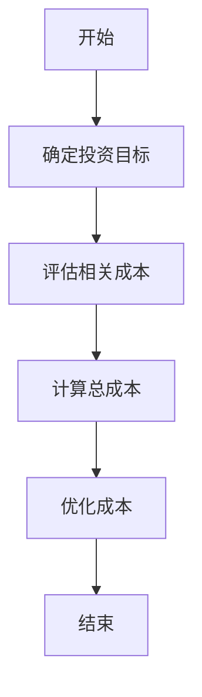
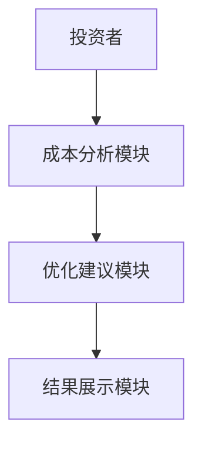

                 


# 约翰·伯格的成本意识：在零售投资者时代的重要性

## 关键词
- 成本意识
- 投资策略
- 零售投资者
- 数学模型
- 系统架构

## 摘要
随着零售投资者的崛起，成本意识在投资决策中的重要性日益凸显。本文通过分析约翰·伯格的成本意识理论，探讨其在零售投资者时代的应用，结合数学模型和系统架构，提供实际操作指南和案例分析。

---

## 第1章: 成本意识的背景与重要性

### 1.1 零售投资者时代的到来

#### 1.1.1 零售投资者的崛起
- 零售投资者数量激增，推动市场结构变化。
- 技术进步使个人投资者更容易获取信息和工具。

#### 1.1.2 市场环境的变化
- 传统金融机构面临竞争，市场透明度提高。
- 投资者行为更加多元化，成本意识增强。

#### 1.1.3 成本意识的重要性
- 成本直接影响投资回报，优化成本是提升收益的关键。
- 理解成本结构有助于制定更明智的投资决策。

### 1.2 约翰·伯格的成本意识理论

#### 1.2.1 理论的核心概念
- 成本意识：指投资者对各项成本的识别、评估和优化能力。
- 投资成本：包括显性成本（如佣金）和隐性成本（如机会成本）。

#### 1.2.2 成本意识的定义
- 成本意识是投资者对投资过程中各种成本的全面认知和有效管理。
- 包括交易成本、管理费用、税收等的分析。

#### 1.2.3 成本意识与投资决策的关系
- 成本意识影响投资策略的选择和执行。
- 优化成本结构有助于提高投资组合的效率和收益。

---

## 第2章: 成本意识的核心概念与联系

### 2.1 成本意识的原理

#### 2.1.1 成本结构分析
- 显性成本：直接可见，如交易佣金、管理费用。
- 隐性成本：间接影响，如机会成本、心理成本。

#### 2.1.2 成本与收益的平衡
- 需要在降低成本和追求收益之间找到平衡点。
- 高成本可能侵蚀收益，过低的成本可能影响质量。

#### 2.1.3 成本优化策略
- 选择低成本工具：如指数基金。
- 避免频繁交易：减少交易佣金和税费。

### 2.2 成本意识与投资行为的关系

#### 2.2.1 成本在投资决策中的作用
- 成本影响投资组合的选择。
- 成本分析是制定投资策略的基础。

#### 2.2.2 投资者行为分析
- 零售投资者往往低估隐性成本。
- 成本意识强的投资者更倾向于长期投资。

#### 2.2.3 成本意识对投资结果的影响
- 优化成本结构可提高净收益。
- 成本意识强的投资者更具风险控制能力。

---

## 第3章: 成本意识的数学模型与算法

### 3.1 成本计算模型

#### 3.1.1 成本计算公式
$$ C = \sum_{i=1}^{n} c_i $$
- 其中，\( C \) 是总成本，\( c_i \) 是各项成本。

#### 3.1.2 成本优化模型
$$ \text{Minimize } C \text{ subject to } \text{constraints} $$
- 示例：最小化交易成本，同时满足投资目标。

### 3.2 成本意识算法流程图


---

## 第4章: 系统分析与架构设计

### 4.1 系统分析

#### 4.1.1 问题场景介绍
- 理解零售投资者的成本意识需求。
- 分析系统需要满足的功能。

#### 4.1.2 领域模型分析


### 4.2 系统架构设计

#### 4.2.1 系统架构图


---

## 第5章: 项目实战

### 5.1 环境安装

#### 5.1.1 安装Python
- 安装Python 3.8及以上版本。

#### 5.1.2 安装必要的库
```bash
pip install numpy pandas
```

### 5.2 核心代码实现

#### 5.2.1 成本计算函数
```python
def calculate_cost(costs):
    return sum(costs)
```

#### 5.2.2 成本优化算法
```python
def optimize_costs(costs, constraints):
    # 示例优化：减少高成本项目
    optimized = [c for c in costs if c < max(costs) / 2]
    return calculate_cost(optimized)
```

### 5.3 案例分析

#### 5.3.1 投资组合成本分析
- 案例：投资组合包括股票、基金、债券。
- 计算各项成本，优化投资组合。

---

## 第6章: 最佳实践与总结

### 6.1 最佳实践 tips

#### 6.1.1 定期审查投资成本
- 检查并优化各项费用。

#### 6.1.2 长期投资策略
- 减少短期交易，降低交易成本。

### 6.2 小结
- 成本意识是零售投资者成功的关键因素。
- 通过优化成本结构，提升投资回报。

### 6.3 注意事项
- 谨防隐形成本，如税费和机会成本。
- 定期评估投资组合，及时调整。

### 6.4 拓展阅读
- 建议阅读《约翰·伯格的投资哲学》深入理解成本意识。
- 参考其他投资策略书籍，结合实际情况制定策略。

---

## 作者
作者：AI天才研究院/AI Genius Institute  
联系邮箱：contact@ai-genius.org  
官方网站：https://www.ai-genius.org

