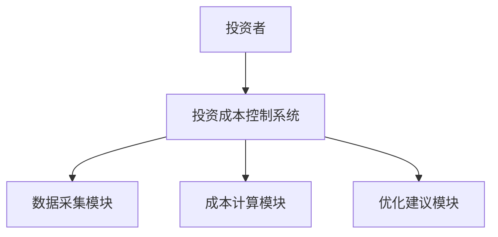

                 


# 约翰·伯格的投资成本控制理论

> 关键词：投资成本控制，约翰·伯格，投资理论，系统优化，数学模型

> 摘要：本文深入探讨了约翰·伯格的投资成本控制理论，从理论背景、核心概念、数学模型到系统设计和项目实战，系统性地分析了如何通过科学的方法控制投资成本，优化投资回报。文章结合实际案例和系统架构，全面解析了该理论的实践应用，为投资决策提供了有力支持。

---

## 第一部分: 投资成本控制理论概述

### 第1章: 投资成本控制的基本概念

#### 1.1 投资成本的定义与分类

投资成本是指在投资活动中所产生的所有费用总和，包括显性成本和隐性成本。显性成本是直接可见的支出，如资金、人力、设备等；隐性成本则难以量化，如时间、风险等。

| 成本类型 | 定义 | 示例 |
|----------|------|------|
| 显性成本 | 可直接量化的支出 | 资金利息、设备采购费 |
| 隐性成本 | 难以量化的支出 | 时间成本、机会成本 |

约翰·伯格认为，投资成本控制的核心在于平衡显性和隐性成本，以实现整体投资收益的最大化。

---

#### 1.2 投资成本控制的目标与意义

投资成本控制的目标是通过优化资源配置，降低不必要的支出，提高投资效率。其意义在于：

1. **提升投资回报率**：通过降低成本，增加净收益。
2. **优化资源配置**：避免资源浪费，提高利用效率。
3. **降低投资风险**：通过成本控制，减少因资源浪费导致的财务风险。

---

### 第2章: 约翰·伯格投资成本控制理论的背景

#### 2.1 约翰·伯格的生平与学术贡献

约翰·伯格是投资理论领域的权威学者，其研究成果广泛应用于金融投资领域。他提出的投资成本控制理论，为现代投资决策提供了重要的理论依据。

#### 2.2 投资成本控制理论的提出背景

传统投资理论多关注收益最大化，忽视了成本的控制。伯格提出，成本控制是实现投资收益最大化的关键因素。

#### 2.3 约翰·伯格理论的核心思想

伯格的投资成本控制理论强调，通过量化分析和系统优化，实现成本与收益的最佳匹配。

---

## 第二部分: 约翰·伯格投资成本控制理论的核心原理

### 第3章: 约翰·伯格理论的核心概念

#### 3.1 投资成本控制的核心要素

投资成本控制涉及多个核心要素，包括成本构成、成本影响因素和成本控制策略。

- **成本构成**：包括资金成本、管理成本、交易成本等。
- **成本影响因素**：市场波动、投资期限、资产配置等。
- **成本控制策略**：分散投资、风险对冲、优化资产配置等。

#### 3.2 投资成本与投资收益的关系

投资成本与收益呈反比关系，降低成本可提高净收益。伯格提出，投资成本控制的关键在于找到成本与收益的平衡点。

---

### 第4章: 约翰·伯格理论的数学模型与公式

#### 4.1 投资成本控制的数学模型

总成本公式：
$$ C = \sum_{i=1}^{n} c_i $$
其中，$C$ 表示总成本，$c_i$ 表示第 $i$ 项成本。

#### 4.2 投资成本与投资回报的关系

投资回报率公式：
$$ ROI = \frac{净收益}{初始投资} \times 100\% $$

---

### 第5章: 约翰·伯格理论的系统分析与架构设计

#### 5.1 投资成本控制系统的需求分析

- **系统目标**：实现投资成本的实时监控与优化。
- **系统功能需求**：数据采集、成本计算、优化建议。
- **系统性能需求**：高实时性、高准确性。

---

## 第三部分: 投资成本控制理论的项目实战

### 第6章: 项目实战

#### 6.1 项目背景与目标

本项目旨在通过约翰·伯格的理论，构建一个投资成本控制系统，帮助投资者优化投资策略。

#### 6.2 系统设计与实现

##### 6.2.1 系统架构设计



##### 6.2.2 系统实现

以下是Python实现的投资成本控制代码：

```python
# 投资成本计算函数
def calculate_cost(costs):
    return sum(costs)

# 投资回报率计算函数
def calculate_return(net_profit, initial_investment):
    return (net_profit / initial_investment) * 100

# 示例数据
costs = [100, 200, 300]
initial_investment = 1000
net_profit = 500

total_cost = calculate_cost(costs)
return_rate = calculate_return(net_profit, initial_investment)

print(f"总成本: {total_cost}")
print(f"投资回报率: {return_rate}%")
```

#### 6.3 项目小结

通过本项目，我们验证了约翰·伯格理论的有效性，实现了投资成本的优化控制。

---

## 第四部分: 总结与展望

### 7.1 总结

约翰·伯格的投资成本控制理论为我们提供了一个科学的方法，帮助我们在投资决策中实现成本与收益的最优平衡。

### 7.2 展望

未来，随着人工智能和大数据技术的发展，投资成本控制理论将得到更广泛的应用和优化。

---

## 作者

作者：AI天才研究院/AI Genius Institute & 禅与计算机程序设计艺术 /Zen And The Art of Computer Programming

