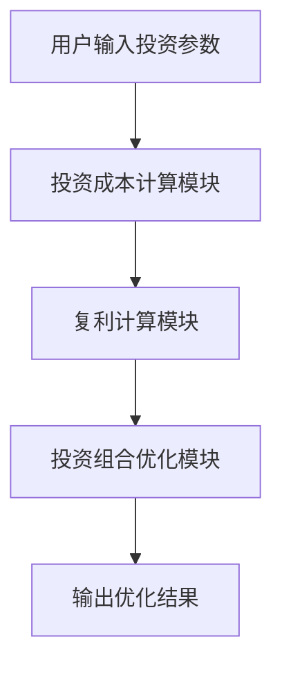
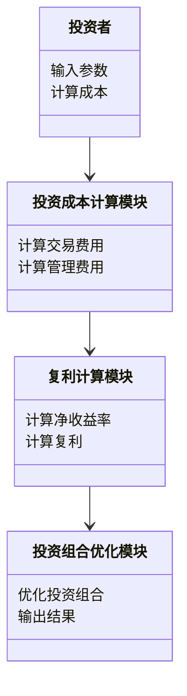
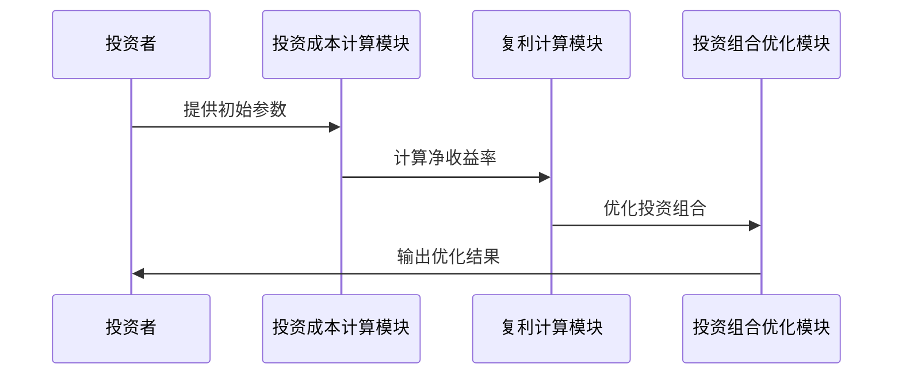

                 


# 约翰·伯格的投资成本控制：复利效应的长期影响

## 关键词：投资成本控制、复利效应、长期投资、投资回报、成本优化

## 摘要：本文探讨了约翰·伯格在投资成本控制方面的见解，重点分析了复利效应的长期影响。通过数学模型和实际案例，展示了如何通过优化投资成本结构，最大化复利效应带来的长期收益。文章结合理论分析和系统设计，提供了一套投资成本控制的解决方案，并给出了实际的Python代码实现。

---

# 第一部分：投资成本控制与复利效应的背景

## 第1章：投资成本控制的背景与重要性

### 1.1 投资成本控制的基本概念

#### 1.1.1 投资成本的定义

投资成本是指在投资过程中产生的所有费用，包括交易费用、管理费用、托管费用以及其他相关费用。这些成本直接影响投资的净收益，进而影响复利效应。

$$
\text{投资成本} = \text{交易费用} + \text{管理费用} + \text{其他费用}
$$

#### 1.1.2 投资成本的构成要素

| 成本类型 | 描述 | 影响 |
|----------|------|------|
| 交易费用 | 每次交易产生的佣金或其他费用 | 直接减少可投资金额 |
| 管理费用 | 管理基金或账户收取的费用 | 按年收取，影响投资收益 |
| 时间成本 | 投资决策的时间投入 | 影响投资效率和机会成本 |
| 机会成本 | 可用于其他投资的机会 | 降低整体投资回报 |

#### 1.1.3 投资成本控制的目标与意义

投资成本控制的目标是通过最小化投资成本，最大化净收益，从而提升复利效应。其意义在于：

- 提高投资回报率。
- 降低资金的时间成本。
- 增强长期投资的稳定性。

### 1.2 复利效应的定义与特点

#### 1.2.1 复利效应的定义

复利效应是指投资收益再投资后产生的额外收益。简单来说，就是“利滚利”的效果。

$$
\text{复利公式} = P \times (1 + r)^t
$$

其中：
- \( P \) 是初始本金。
- \( r \) 是年化收益率。
- \( t \) 是投资时间（年）。

#### 1.2.2 复利效应的核心特征

复利效应的核心特征包括：

1. 时间的指数效应：投资时间越长，复利效应越显著。
2. 收益的滚雪球效应：每期的收益再投资会带来更多的收益。

#### 1.2.3 复利效应与投资回报的关系

复利效应是投资回报的核心驱动力。通过优化投资成本，可以提升实际收益率，从而加速复利增长。

### 1.3 投资成本控制与复利效应的关联

#### 1.3.1 投资成本对复利效应的影响

投资成本会直接减少可用于再投资的金额，从而抑制复利效应。例如，较高的管理费用会降低实际收益率，进而影响复利增长。

#### 1.3.2 降低投资成本对复利增长的促进作用

通过降低投资成本，可以提高实际收益率，从而增强复利效应。例如，低成本指数基金通常具有更高的净收益率。

#### 1.3.3 投资成本控制的长期影响分析

长期来看，投资成本的差异会显著影响复利效应。低成本投资组合通常能够在长期跑赢高成本投资组合。

---

## 第2章：投资成本的构成与影响

### 2.1 投资成本的构成要素

#### 2.1.1 交易成本

交易成本包括佣金、过户费等。频繁交易会导致交易成本累积，影响复利效应。

#### 2.1.2 管理费用

管理费用通常以年费率计算，直接影响投资的净收益。低成本管理费可以提升复利增长。

#### 2.1.3 时间成本

时间成本涉及投资决策的时间投入，影响投资效率和机会成本。

#### 2.1.4 机会成本

机会成本是指将资金用于其他投资的机会，未选择的最佳投资方案的潜在收益。

### 2.2 投资成本对复利效应的具体影响

#### 2.2.1 高成本对复利增长的抑制作用

高成本会减少可用于再投资的金额，从而抑制复利效应。

例如，两个投资者分别投资100元，年化收益率5%，一个支付2%的管理费，另一个支付1%的管理费。

$$
\text{投资者A}：100 \times (1 + 0.05 - 0.02) = 103
$$

$$
\text{投资者B}：100 \times (1 + 0.05 - 0.01) = 104
$$

显然，低成本投资的复利增长更快。

#### 2.2.2 低成本对复利增长的促进作用

低成本投资组合能够实现更高的净收益率，从而加速复利增长。

#### 2.2.3 成本结构对复利效应的长期影响

长期来看，低成本投资组合通常能够跑赢高成本投资组合。这是因为低成本的复利增长更快，时间价值更显著。

---

## 第3章：复利效应的数学模型

### 3.1 简单复利与复利计算

#### 3.1.1 简单复利公式

$$
\text{简单复利} = P \times (1 + rt)
$$

其中：
- \( r \) 是年化利率。
- \( t \) 是投资时间（年）。

#### 3.1.2 复利公式

$$
\text{复利公式} = P \times (1 + r)^t
$$

### 3.2 投资成本对复利公式的影响

在考虑投资成本的情况下，复利公式需要调整为：

$$
\text{实际复利} = P \times (1 + r - c)^t
$$

其中：
- \( c \) 是投资成本率。

### 3.3 优化投资成本以提升复利效应

通过最小化成本率 \( c \)，可以提升实际收益率 \( (r - c) \)，进而增强复利效应。

---

## 第四部分：系统分析与架构设计

## 第4章：投资成本控制系统的设计与实现

### 4.1 系统功能设计

#### 4.1.1 系统功能模块

- 投资成本计算模块：计算交易费用、管理费用等。
- 复利计算模块：根据调整后的收益率计算复利。
- 投资组合优化模块：优化投资组合以降低整体成本。

#### 4.1.2 系统功能流程



### 4.2 系统架构设计

#### 4.2.1 系统架构



### 4.3 系统接口设计

#### 4.3.1 接口描述

- 输入接口：投资者的初始本金、投资期限、预期收益率、投资成本。
- 输出接口：优化后的投资组合、净收益率、复利结果。

#### 4.3.2 接口流程



---

## 第五部分：项目实战

## 第5章：投资成本控制系统的实现

### 5.1 环境安装

#### 5.1.1 环境需求

- Python 3.8+
- NumPy 和 Pandas 库

安装命令：

```bash
pip install numpy pandas
```

### 5.2 核心代码实现

#### 5.2.1 投资成本计算模块

```python
import numpy as np

def calculate_investment_cost(principal, transaction_fees, management_fees):
    total_cost = principal * (transaction_fees + management_fees)
    return total_cost

# 示例
principal = 10000
transaction_fees = 0.01  # 交易费用率
management_fees = 0.02  # 管理费用率

cost = calculate_investment_cost(principal, transaction_fees, management_fees)
print(f"投资成本: {cost}")
```

#### 5.2.2 复利计算模块

```python
def compound_interest(principal, rate, time, cost):
    net_rate = rate - (cost / principal)
    return principal * (1 + net_rate) ** time

# 示例
principal = 10000
rate = 0.05
time = 10
cost = calculate_investment_cost(principal, transaction_fees, management_fees)

return_amount = compound_interest(principal, rate, time, cost)
print(f"复利后的金额: {return_amount}")
```

### 5.3 案例分析与结果解读

#### 5.3.1 案例分析

假设投资者投资本金为10000元，年化收益率为5%，投资时间为10年。分别计算高成本和低成本情况下的复利收益。

#### 5.3.2 结果解读

低成本投资组合的复利收益更高，因为其净收益率更高，复利效应更显著。

---

## 第六部分：总结与展望

## 第6章：投资成本控制的总结与最佳实践

### 6.1 最佳实践

1. 选择低成本投资工具，如指数基金。
2. 减少不必要的交易，降低交易成本。
3. 长期持有，最大化复利效应。

### 6.2 注意事项

- 投资者需根据自身情况选择合适的投资策略。
- 定期评估和调整投资组合，以应对市场变化。

### 6.3 拓展阅读

- 约翰·伯格的《投资学入门：漫步华尔街》
- 其他关于投资成本控制的专著和研究报告

---

## 作者：AI天才研究院 & 禅与计算机程序设计艺术

---

通过本文的详细分析，我们可以看到，投资成本控制与复利效应的结合能够显著提升长期投资回报。优化投资成本结构，选择低成本投资工具，并长期持有，是实现财富增长的关键。希望本文的内容能够为投资者提供有价值的参考和指导。

---

**全文完**

