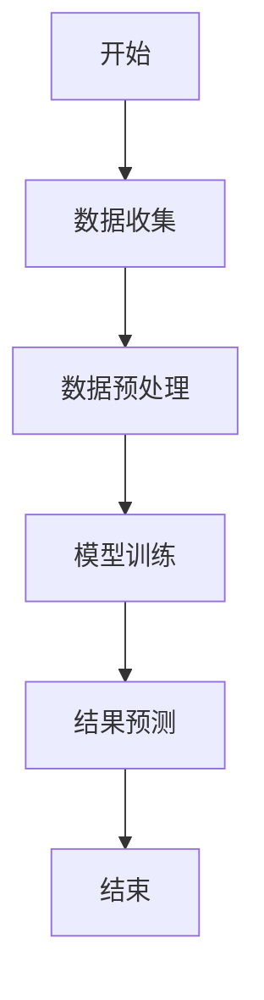
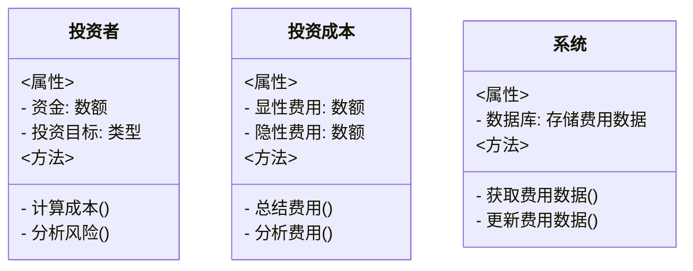

                 


# 约翰·伯格的投资成本控制：应对隐性费用上升的挑战

> 关键词：投资成本控制，隐性费用，约翰·伯格，成本优化，费用分析

> 摘要：本文详细探讨了投资成本控制的重要性，特别是隐性费用上升对企业投资的影响。通过分析隐性费用的构成、算法预测方法、系统架构设计和项目实战，提出了有效的应对策略。结合理论与实践，为投资者提供实用的优化建议。

---

## 第一部分：投资成本控制的背景与挑战

### 第1章：投资成本控制的背景介绍

#### 1.1 投资成本控制的定义与重要性
- **投资成本控制**是指在投资过程中，通过科学管理和优化策略，降低不必要的开支，提高资金使用效率。其重要性体现在增强企业竞争力、优化资源配置和提升投资回报率上。

#### 1.2 隐性费用的定义与特征
- **隐性费用**是指在投资活动中未直接记录的费用，如交易成本、机会成本和管理费用。
- **特征**：隐藏性、间接性、累积性。

#### 1.3 隐性费用上升的背景与挑战
- **经济环境变化**：通货膨胀导致费用增加。
- **行业竞争加剧**：企业间竞争加剧，隐性费用也随之上升。
- **技术进步**：新技术应用带来的新费用。

### 第2章：投资成本控制的核心概念与联系

#### 2.1 核心概念原理
- **隐性费用的构成**：交易费用、管理费用、机会成本。
- **显性费用与隐性费用的区别**：显性费用即时发生，隐性费用间接发生。

#### 2.2 隐性费用与显性费用的对比分析
- **对比表格**：
  | 特性       | 显性费用       | 隐性费用       |
  |------------|----------------|----------------|
  | 发生时间   | 即时           | 事后           |
  | 可控性     | 容易           | 较难           |
  | 透明度     | 高             | 低             |
- **ER实体关系图**：
```mermaid
er
actor(投资者) --> InvestmentCost: 投资成本
InvestmentCost --> ExplicitCost: 显性费用
InvestmentCost --> ImplicitCost: 隐性费用
```

### 第3章：投资成本控制的算法原理

#### 3.1 隐性费用预测与控制算法
- **数据收集与预处理**：收集历史投资数据，清洗和转换。
- **算法选择与实现**：使用线性回归模型预测隐性费用。
- **流程图**：


#### 3.2 算法实现代码
```python
import pandas as pd
from sklearn.model_selection import train_test_split
from sklearn.linear_model import LinearRegression

# 数据加载
data = pd.read_csv('investment_cost.csv')

# 数据预处理
X = data[['explicit_cost', 'market_condition']]
y = data['implicit_cost']

# 划分训练集和测试集
X_train, X_test, y_train, y_test = train_test_split(X, y, test_size=0.2, random_state=42)

# 模型训练
model = LinearRegression()
model.fit(X_train, y_train)

# 预测
y_pred = model.predict(X_test)
```

---

## 第二部分：系统分析与架构设计

### 第4章：系统功能设计

#### 4.1 领域模型类图


#### 4.2 系统架构设计


---

## 第三部分：项目实战

### 第5章：项目实战

#### 5.1 环境安装
- **安装Python和必要的库**：如Pandas、Scikit-learn。

#### 5.2 核心实现
```python
# 数据准备
data = pd.read_csv('investment.csv')
data['total_cost'] = data['explicit_cost'] + data['implicit_cost']

# 可视化
import matplotlib.pyplot as plt
plt.scatter(data['explicit_cost'], data['implicit_cost'])
plt.xlabel('显性费用')
plt.ylabel('隐性费用')
plt.show()
```

#### 5.3 实例分析
- **案例分析**：通过具体数据，展示隐性费用的预测和优化过程。

---

## 结论

投资成本控制是企业成功的关键，隐性费用的管理尤为重要。通过算法和系统优化，企业可以有效降低隐性费用，提升投资回报。未来，随着技术进步，投资成本控制将更加智能化和精准化。

---

**作者：AI天才研究院 & 禅与计算机程序设计艺术**

