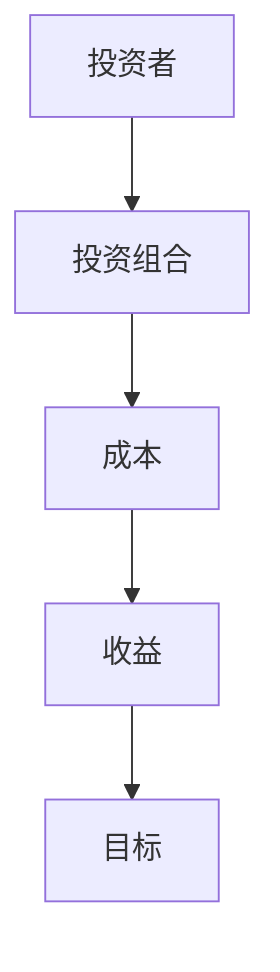
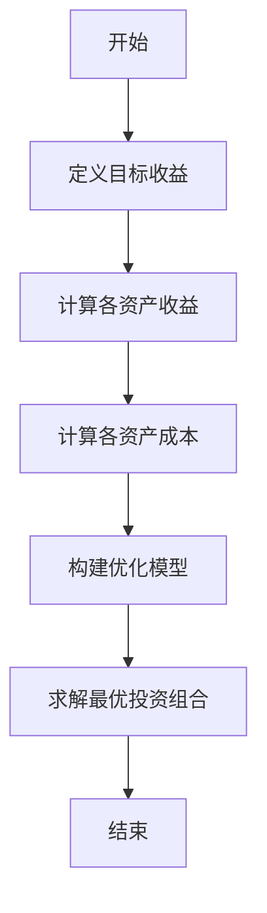
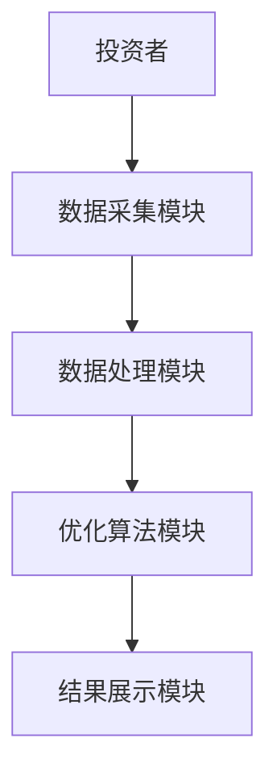
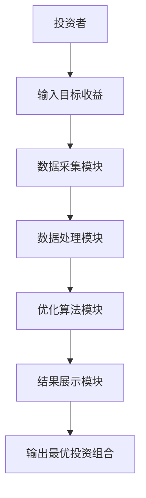

                 


# 约翰·伯格的投资成本最小化理论

## 关键词：投资成本，最小化理论，约翰·伯格，投资组合优化，成本优化

## 摘要：约翰·伯格的投资成本最小化理论是一种系统性优化投资组合的方法，旨在通过最小化投资成本来提高投资收益。本文将详细阐述该理论的背景、核心概念、数学模型、算法原理、系统设计与项目实战。

---

# 第1部分：投资成本最小化理论的背景与核心概念

## 第1章：投资成本的定义与影响

### 1.1 投资成本的定义

#### 1.1.1 投资成本的内涵
投资成本是指在投资过程中产生的所有费用，包括显性成本和隐性成本。显性成本是直接可见的费用，如交易佣金、管理费用；隐性成本是间接费用，如时间成本和机会成本。

#### 1.1.2 投资成本的外延
投资成本不仅包括直接的交易费用，还包括因投资决策而产生的机会成本。例如，将资金用于某项投资而放弃其他投资机会的成本。

#### 1.1.3 投资成本与投资回报的关系
投资成本直接影响投资回报。较高的投资成本会降低净收益，而有效的成本控制可以提高投资回报率。

### 1.2 投资成本的分类

#### 1.2.1 显性成本
显性成本是直接与交易相关的费用，包括：
- 交易佣金
- 管理费用
- 托管费用

#### 1.2.2 隐性成本
隐性成本是间接产生的费用，包括：
- 时间成本
- 研究成本
- 决策成本

#### 1.2.3 机会成本
机会成本是指因选择某项投资而放弃其他投资机会的潜在收益。

### 1.3 投资成本对投资决策的影响

#### 1.3.1 成本对投资组合的影响
高成本的投资组合可能会影响资产配置和投资策略的选择。

#### 1.3.2 成本对投资风险的影响
较高的投资成本会降低投资组合的净收益，从而增加投资风险。

#### 1.3.3 成本对投资收益的影响
通过最小化投资成本，可以提高投资组合的整体收益。

## 第2章：约翰·伯格的投资成本最小化理论

### 2.1 伯格理论的核心观点

#### 2.1.1 投资成本最小化的目标
通过最小化投资成本，提高投资组合的净收益。

#### 2.1.2 伯格理论的基本假设
- 投资市场是有效的。
- 投资者的目标是最大化收益，同时最小化成本。

#### 2.1.3 伯格理论的适用范围
适用于长期投资和被动投资策略。

### 2.2 伯格理论的数学模型

#### 2.2.1 投资成本的数学表达式
$$ C = \sum_{i=1}^{n} c_i \cdot x_i $$
其中，$C$ 是总成本，$c_i$ 是第 $i$ 项资产的成本，$x_i$ 是投资于第 $i$ 项资产的比例。

#### 2.2.2 投资收益的数学表达式
$$ R = \sum_{i=1}^{n} r_i \cdot x_i $$
其中，$R$ 是总收益，$r_i$ 是第 $i$ 项资产的预期收益，$x_i$ 是投资比例。

#### 2.2.3 成本最小化的目标函数
$$ \min_{x} C \quad \text{subject to} \quad R \geq R_{\text{target}} $$
其中，$R_{\text{target}}$ 是目标收益。

### 2.3 伯格理论的优化算法

#### 2.3.1 线性规划模型
通过线性规划优化投资组合，使得在满足收益约束的前提下，最小化总成本。

#### 2.3.2 最小二乘法的应用
使用最小二乘法拟合最优投资组合，最小化预测收益与实际收益的误差平方和。

#### 2.3.3 动态规划的优化策略
通过动态规划方法，逐步优化投资组合，降低整体成本。

## 第3章：投资成本最小化的核心概念与联系

### 3.1 核心概念原理

#### 3.1.1 成本与收益的权衡关系
高成本可能降低投资收益，而低成本可能增加风险。

#### 3.1.2 投资组合的优化策略
通过调整投资比例，优化投资组合的成本和收益。

#### 3.1.3 风险与收益的平衡点
在伯格理论中，通过最小化成本来平衡风险与收益。

### 3.2 概念属性特征对比表格

| 概念 | 属性 | 特征 |
|------|------|------|
| 投资成本 | 显性成本 | 交易费用、管理费用 |
| 隐性成本 | 时间成本 | 研究成本、决策成本 |
| 机会成本 | 无形成本 | 未投资的机会损失 |

### 3.3 ER实体关系图（Mermaid流程图）



---

# 第2部分：投资成本最小化理论的算法原理

## 第4章：算法原理讲解

### 4.1 算法原理

#### 4.1.1 线性规划模型
通过线性规划优化投资组合，使得在满足收益约束的前提下，最小化总成本。

#### 4.1.2 最小二乘法的应用
使用最小二乘法拟合最优投资组合，最小化预测收益与实际收益的误差平方和。

#### 4.1.3 动态规划的优化策略
通过动态规划方法，逐步优化投资组合，降低整体成本。

### 4.2 算法流程图（Mermaid）



### 4.3 算法代码实现

```python
import numpy as np

def cost_minimization_model(r, c, R_target):
    n = len(r)
    # 线性规划问题
    # 目标函数：min c^T x
    # 约束条件：r^T x >= R_target，sum x = 1，x >= 0
    from scipy.optimize import linprog
    # 转换目标函数和约束为标准形式
    # 目标函数：min c^T x
    # 约束：r^T x >= R_target
    A = -r
    b = -R_target
    bounds = [(0, 1) for _ in range(n)]
    res = linprog(c, A_ineq=A, b_ineq=b, bounds=bounds, method='highs')
    if res.success:
        x = res.x
        return x
    else:
        return None

# 示例数据
r = np.array([0.1, 0.12, 0.08])
c = np.array([0.02, 0.015, 0.03])
R_target = 0.1

x = cost_minimization_model(r, c, R_target)
print("最优投资比例:", x)
```

---

# 第3部分：投资成本最小化理论的数学模型与优化

## 第5章：数学模型与优化

### 5.1 数学模型

#### 5.1.1 投资成本函数
$$ C(x) = \sum_{i=1}^{n} c_i x_i $$

#### 5.1.2 投资收益函数
$$ R(x) = \sum_{i=1}^{n} r_i x_i $$

#### 5.1.3 优化目标
$$ \min_x C(x) \quad \text{subject to} \quad R(x) \geq R_{\text{target}}, \sum_{i=1}^{n} x_i = 1, x_i \geq 0 $$

### 5.2 优化方法

#### 5.2.1 线性规划优化
使用线性规划方法，构建目标函数和约束条件，求解最优投资组合。

#### 5.2.2 最小二乘法优化
通过最小化预测收益与实际收益的误差平方和，优化投资组合。

### 5.3 数学推导

#### 5.3.1 线性规划推导
通过线性规划模型，将目标函数和约束条件转化为标准形式，求解最优解。

#### 5.3.2 最小二乘法推导
通过数学推导，证明最小二乘法的最优性条件。

---

# 第4部分：系统分析与架构设计

## 第6章：系统分析与架构设计

### 6.1 系统分析

#### 6.1.1 问题场景
投资者希望通过优化投资组合，最小化投资成本，提高投资收益。

#### 6.1.2 系统功能需求
- 数据采集与处理
- 投资组合优化
- 成本分析与可视化

### 6.2 系统架构设计

#### 6.2.1 系统架构图（Mermaid）



#### 6.2.2 系统交互流程图（Mermaid）



### 6.3 系统接口设计

#### 6.3.1 数据接口
- 输入：目标收益、资产收益、成本数据
- 输出：最优投资组合

#### 6.3.2 算法接口
- 输入：优化目标、约束条件
- 输出：优化结果

---

# 第5部分：项目实战

## 第7章：项目实战

### 7.1 环境安装

#### 7.1.1 安装Python和依赖库
安装Python和必要的库，如numpy、scipy、matplotlib。

### 7.2 系统核心实现源代码

#### 7.2.1 投资组合优化代码

```python
import numpy as np
from scipy.optimize import linprog

def optimize_portfolio(r, c, R_target):
    n = len(r)
    # 线性规划问题
    # 目标函数：min c^T x
    # 约束条件：r^T x >= R_target，sum x = 1，x >= 0
    A = -r
    b = -R_target
    bounds = [(0, 1) for _ in range(n)]
    res = linprog(c, A_ineq=A, b_ineq=b, bounds=bounds, method='highs')
    if res.success:
        x = res.x
        return x
    else:
        return None

# 示例数据
r = np.array([0.1, 0.12, 0.08])
c = np.array([0.02, 0.015, 0.03])
R_target = 0.1

x = optimize_portfolio(r, c, R_target)
print("最优投资比例:", x)
```

#### 7.2.2 成本分析与可视化代码

```python
import matplotlib.pyplot as plt

def visualize_results(x, r, c):
    plt.figure(figsize=(10, 6))
    plt.bar(range(len(x)), x, label='最优投资比例')
    plt.ylabel('比例')
    plt.title('最优投资组合')
    plt.xticks(range(len(x)), ['资产1', '资产2', '资产3'])
    plt.legend()
    plt.show()

visualize_results(x, r, c)
```

### 7.3 实际案例分析

#### 7.3.1 案例背景
假设投资者有三个资产选择，目标收益为10%。

#### 7.3.2 数据准备
- 资产收益：[0.1, 0.12, 0.08]
- 资产成本：[0.02, 0.015, 0.03]

#### 7.3.3 数据分析与优化
运行优化代码，得到最优投资比例。

#### 7.3.4 结果解读
分析最优投资比例，解释如何通过成本最小化提高投资收益。

---

# 第6部分：总结与展望

## 第8章：总结与展望

### 8.1 总结

#### 8.1.1 核心要点回顾
- 投资成本最小化理论的目标是通过优化投资组合，最小化成本，提高收益。
- 约翰·伯格理论提供了系统的优化方法和数学模型。

#### 8.1.2 实际应用价值
- 适用于长期投资和被动投资策略。
- 帮助投资者降低投资成本，提高净收益。

### 8.2 未来展望

#### 8.2.1 研究方向
- 动态调整优化模型，适应市场变化。
- 探索多目标优化问题，平衡成本和风险。

#### 8.2.2 拓展应用
- 结合机器学习，提高优化效率。
- 应用到更复杂的金融产品，如ETF和指数基金。

## 作者信息

作者：AI天才研究院/AI Genius Institute & 禅与计算机程序设计艺术 /Zen And The Art of Computer Programming

---

通过以上结构化的内容，我们可以清晰地看到，约翰·伯格的投资成本最小化理论不仅是一种优化方法，更是一种系统性的投资策略。通过理论与实践的结合，投资者可以更好地控制成本，提高投资收益。

