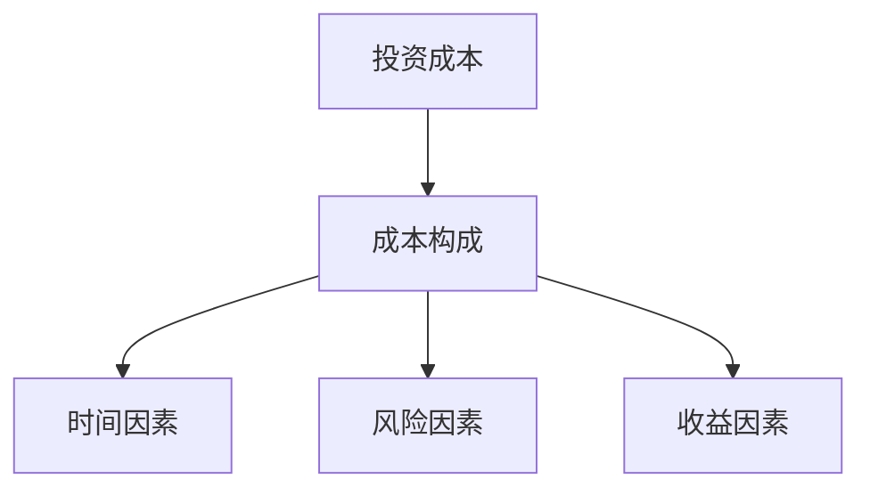
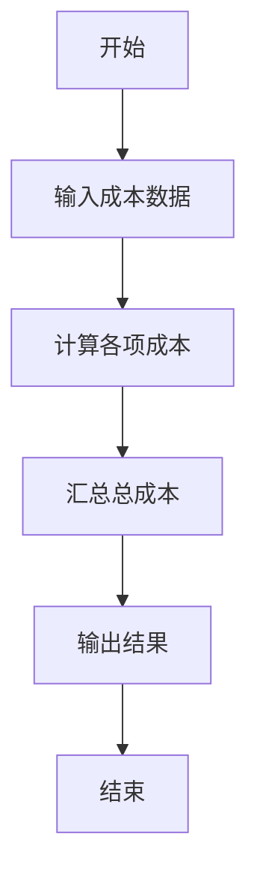
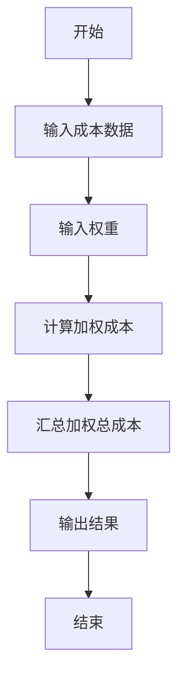
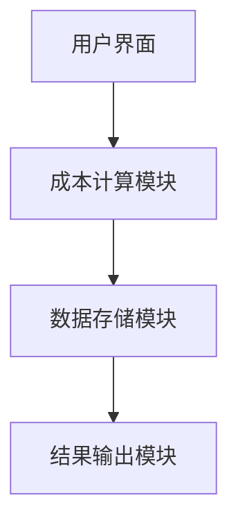
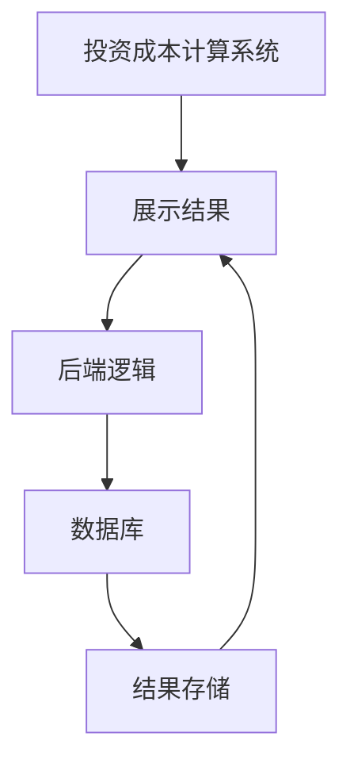
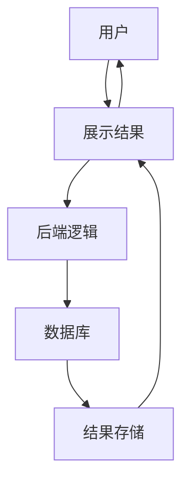

                 


# 约翰·伯格的投资成本计算方法

> 关键词：投资成本计算、成本构成、投资收益、投资风险、约翰·伯格、算法流程

摘要：本文系统地介绍了约翰·伯格的投资成本计算方法，涵盖投资成本的基本概念、核心概念与联系、算法原理、系统分析与架构设计、项目实战以及最佳实践。通过详细分析投资成本的构成、计算方法及其与投资收益和风险的关系，结合数学模型、算法流程图和Python代码实现，帮助读者全面理解并掌握投资成本计算的核心方法。

---

# 第一部分: 投资成本计算方法概述

## 第1章: 投资成本的基本概念

### 1.1 投资成本的定义与分类

#### 1.1.1 投资成本的定义
投资成本是指在投资活动中所涉及的所有费用，包括显性成本和隐性成本。显性成本是直接可见的支出，如资金的时间价值、管理费用等；隐性成本则是间接产生的费用，如机会成本、风险成本等。

#### 1.1.2 投资成本的分类
投资成本可以分为以下几类：
- **显性成本**：直接支出，如购买资产的本金、交易费用、管理费用等。
- **隐性成本**：间接支出，如机会成本、时间成本、风险成本等。
- **固定成本**：在一定范围内不变的成本，如租金、 salaries。
- **可变成本**：随业务量变化的成本，如原材料、劳动力成本。

#### 1.1.3 投资成本的核心要素
投资成本的核心要素包括：
- 资金的时间价值
- 交易费用
- 管理费用
- 风险成本
- 机会成本

### 1.2 投资成本计算的基本原理

#### 1.2.1 投资成本计算的基本方法
投资成本计算的基本方法包括：
- 简单加总法
- 加权平均法
- 折旧与摊销法

#### 1.2.2 投资成本与投资收益的关系
投资成本与投资收益密切相关。高成本不一定带来高收益，但成本是收益的必要条件。通过合理控制成本，可以提高投资收益。

#### 1.2.3 投资成本计算的边界与外延
投资成本的边界包括直接相关费用，而外延则包括间接相关费用，如税收、通货膨胀等。

### 1.3 投资成本计算的核心概念与联系

#### 1.3.1 投资成本的核心概念
投资成本的核心概念包括：
- 成本构成
- 成本计算公式
- 成本计算流程

#### 1.3.2 投资成本与相关概念的对比
投资成本与其他相关概念的对比：

| 概念         | 定义                             | 与投资成本的关系 |
|--------------|----------------------------------|------------------|
| 投资收益     | 投资活动产生的收益               | 直接相关         |
| 投资风险     | 投资活动中的不确定性因素         | 间接相关         |
| 投资期限     | 投资活动的时间跨度               | 直接相关         |

#### 1.3.3 投资成本的ER实体关系图


---

## 第2章: 投资成本计算的算法原理

### 2.1 投资成本计算的数学模型

#### 2.1.1 投资成本的基本公式
投资成本的计算公式：
$$ C = \sum_{i=1}^{n} c_i $$
其中，$C$ 表示总成本，$c_i$ 表示第 $i$ 项成本。

#### 2.1.2 投资成本的加权计算
加权计算公式：
$$ C_{weighted} = \sum_{i=1}^{n} w_i \cdot c_i $$
其中，$w_i$ 是第 $i$ 项成本的权重。

#### 2.1.3 投资成本的净现值计算
净现值（NPV）公式：
$$ NPV = \sum_{t=1}^{T} \frac{CF_t}{(1 + r)^t} $$
其中，$CF_t$ 是第 $t$ 期的现金流，$r$ 是折现率。

### 2.2 投资成本计算的算法流程

#### 2.2.1 简单加总法


#### 2.2.2 加权平均法


#### 2.2.3 投资成本计算的Python实现
```python
def calculate_investment_cost(costs, weights=None):
    if weights is not None:
        weighted_costs = [cost * weight for cost, weight in zip(costs, weights)]
        total_cost = sum(weighted_costs)
    else:
        total_cost = sum(costs)
    return total_cost

# 示例输入
costs = [100, 200, 300]
weights = [0.3, 0.4, 0.3]
# 计算加权总成本
total_cost = calculate_investment_cost(costs, weights)
print(f"加权总成本为: {total_cost}")
```

---

## 第3章: 投资成本计算的系统分析与架构设计

### 3.1 投资成本计算系统的需求分析

#### 3.1.1 系统目标
- 计算投资成本
- 评估投资收益
- 分析投资风险

#### 3.1.2 系统功能需求
- 成本数据输入
- 成本计算模块
- 结果输出模块

#### 3.1.3 系统性能需求
- 计算效率
- 数据准确性
- 界面友好性

### 3.2 投资成本计算系统的架构设计

#### 3.2.1 系统功能模块


#### 3.2.2 系统架构图


#### 3.2.3 系统接口设计
- 输入接口：成本数据输入
- 输出接口：计算结果输出

#### 3.2.4 系统交互流程


---

## 第4章: 投资成本计算的项目实战

### 4.1 环境安装与配置

#### 4.1.1 安装Python
```bash
python --version
pip install --upgrade pip
```

#### 4.1.2 安装必要的库
```bash
pip install numpy pandas matplotlib
```

### 4.2 核心代码实现

#### 4.2.1 投资成本计算函数
```python
import numpy as np

def calculate_investment_cost(costs, weights=None):
    if weights is not None:
        return np.dot(costs, weights)
    else:
        return np.sum(costs)

# 示例输入
costs = np.array([100, 200, 300])
weights = np.array([0.3, 0.4, 0.3])
# 计算加权总成本
total_cost = calculate_investment_cost(costs, weights)
print(f"加权总成本为: {total_cost}")
```

#### 4.2.2 投资成本计算流程图


### 4.3 案例分析与解读

#### 4.3.1 案例分析
假设某投资者计划投资三个项目，成本分别为100、200、300，权重分别为0.3、0.4、0.3。计算加权总成本：
$$ C_{weighted} = 100 \times 0.3 + 200 \times 0.4 + 300 \times 0.3 = 30 + 80 + 90 = 200 $$

#### 4.3.2 计算结果解读
加权总成本为200，说明在考虑权重的情况下，总成本为200。

### 4.4 项目小结

#### 4.4.1 项目总结
通过本项目，我们掌握了投资成本计算的基本方法和实际应用。

#### 4.4.2 项目收获
- 理解了投资成本计算的核心方法
- 掌握了Python实现投资成本计算的技能
- 学会了使用Mermaid工具绘制流程图和架构图

---

## 第5章: 投资成本计算的最佳实践

### 5.1 小结

#### 5.1.1 核心观点
投资成本计算是投资决策的重要组成部分，合理控制投资成本可以提高投资收益。

### 5.2 注意事项

#### 5.2.1 算法选择
根据具体情况选择合适的算法。

#### 5.2.2 数据准确性
确保输入数据的准确性。

### 5.3 拓展阅读

#### 5.3.1 相关书籍
- 《投资学》
- 《约翰·伯格的投资哲学》

#### 5.3.2 在线资源
- 投资成本计算器工具
- 投资成本计算的在线课程

---

作者：AI天才研究院/AI Genius Institute & 禅与计算机程序设计艺术 /Zen And The Art of Computer Programming

