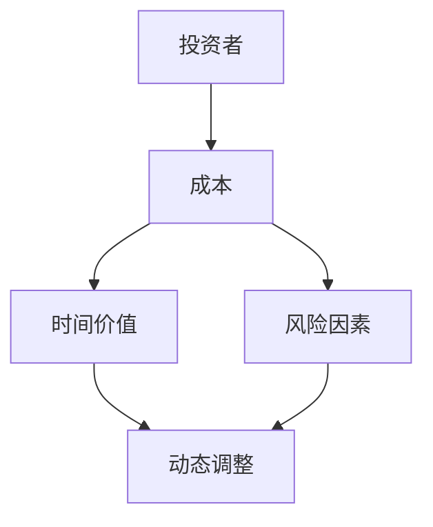
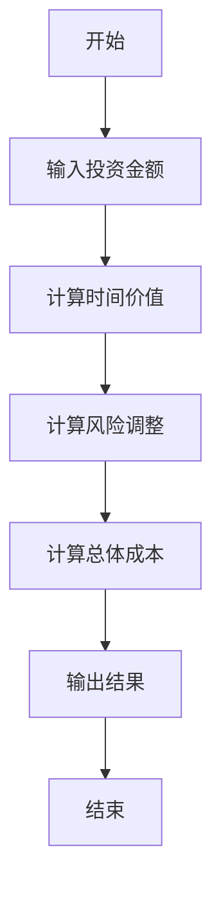
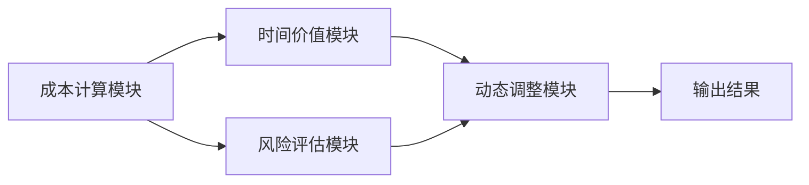

                 


# 约翰·伯格的投资成本计算方法

> 关键词：投资成本，计算方法，约翰·伯格，金融分析，成本模型，投资决策，风险评估

> 摘要：本文深入探讨了约翰·伯格的投资成本计算方法，从核心概念到算法原理，再到系统设计和项目实战，全面解析其在投资决策中的应用。通过详细分析，读者将掌握如何利用该方法进行成本评估，优化投资策略。

---

# 第一部分：投资成本计算方法的背景介绍

## 第1章：投资成本计算方法的背景介绍

### 1.1 投资成本的基本概念
#### 1.1.1 什么是投资成本
投资成本是指投资者在进行投资活动时所支出的所有费用，包括显性成本和隐性成本。显性成本是直接可量化的费用，如交易手续费、税费等；隐性成本则是间接成本，如时间成本、机会成本和心理成本。

#### 1.1.2 投资成本的重要性
准确计算投资成本可以帮助投资者评估投资项目的可行性，优化资金分配，提高投资回报率。忽视投资成本可能导致决策失误，影响投资收益。

#### 1.1.3 约翰·伯格投资成本计算方法的核心理念
约翰·伯格提出的投资成本计算方法强调显性和隐性成本的综合评估，结合时间价值和风险因素，提供动态的成本计算模型，帮助投资者全面评估投资项目的成本。

### 1.2 投资成本的组成部分
#### 1.2.1 显性成本
显性成本是直接可量化的费用，包括：
- 交易手续费：每次交易产生的费用。
- 税费：资本利得税、印花税等。
- 管理费用：基金管理费、托管费等。

#### 1.2.2 隐性成本
隐性成本是间接成本，包括：
- 时间成本：投资的时间价值，即资金的机会成本。
- 机会成本：放弃其他投资机会的成本。
- 心理成本：投资者因市场波动带来的心理压力。

#### 1.2.3 总体成本的定义与计算
总体成本是显性成本和隐性成本的总和，计算公式为：
$$\text{总体成本} = \text{显性成本} + \text{隐性成本}$$

### 1.3 投资成本计算的边界与外延
#### 1.3.1 计算的边界条件
- 投资期限：投资的时间跨度。
- 资金规模：投资金额的大小。
- 市场环境：宏观经济状况、市场波动性等。

#### 1.3.2 计算的外延范围
- 显性成本：交易费用、税费。
- 隐性成本：时间成本、机会成本。
- 总体成本：综合考虑显性和隐性成本。

#### 1.3.3 投资成本与其他费用的关系
投资成本是投资决策中的核心部分，与其他费用（如管理费用、交易费用）密切相关，需综合考虑。

### 1.4 投资成本计算的核心要素
#### 1.4.1 投资金额
投资金额是计算投资成本的基础，影响显性和隐性成本的大小。

#### 1.4.2 时间价值
时间价值是隐性成本的重要组成部分，通过复利计算，反映资金的时间价值。

#### 1.4.3 风险因素
风险因素影响隐性成本中的机会成本，需结合风险评估模型进行计算。

---

# 第二部分：投资成本计算的核心概念与联系

## 第2章：投资成本计算的核心概念与联系

### 2.1 核心概念原理
#### 2.1.1 时间价值的计算方法
时间价值通过复利计算，公式为：
$$\text{未来价值} = \text{现值} \times (1 + r)^n$$
其中，\( r \) 是利率，\( n \) 是投资期限。

#### 2.1.2 风险调整的原理
风险调整通过引入风险溢价，公式为：
$$\text{调整后收益} = \text{无风险收益} + \text{风险溢价}$$

#### 2.1.3 投资成本的动态调整机制
动态调整机制根据市场变化实时更新显性和隐性成本，确保计算结果的准确性。

### 2.2 投资成本核心概念对比表
| 概念 | 描述 | 示例 |
|------|------|------|
| 显性成本 | 直接可量化的成本 | 交易费用、税费 |
| 隐性成本 | 间接成本 | 时间成本、机会成本 |
| 总体成本 | 综合成本 | 显性成本 + 隐性成本 |

### 2.3 投资成本的ER实体关系图


---

# 第三部分：投资成本计算的算法原理

## 第3章：投资成本计算的算法原理

### 3.1 投资成本计算的流程图


### 3.2 投资成本计算的Python实现
```python
def calculate_investment_cost(amount, time, risk):
    # 计算时间价值
    time_value = amount * (1 + 0.05 * time)
    # 计算风险调整
    risk_adjustment = 1 + 0.02 * risk
    # 计算总体成本
    total_cost = time_value * risk_adjustment
    return total_cost
```

### 3.3 投资成本计算的数学模型和公式
#### 3.3.1 总体成本计算公式
$$\text{总体成本} = \text{显性成本} + \text{隐性成本}$$

#### 3.3.2 显性成本计算公式
$$\text{显性成本} = \text{交易费用} + \text{税费}$$

#### 3.3.3 隐性成本计算公式
$$\text{隐性成本} = \text{时间成本} + \text{机会成本}$$

---

# 第四部分：系统分析与架构设计方案

## 第4章：系统分析与架构设计方案

### 4.1 问题场景介绍
投资者需要计算投资项目的总体成本，包括显性和隐性成本，并结合时间价值和风险因素进行动态调整。

### 4.2 系统功能设计
- 数据输入模块：接收投资金额、投资期限和风险等级。
- 计算模块：计算显性成本、隐性成本和总体成本。
- 结果展示模块：输出计算结果。

### 4.3 系统架构设计


### 4.4 系统接口设计
- 输入接口：接收投资金额、投资期限和风险等级。
- 输出接口：输出总体成本和详细计算结果。

---

# 第五部分：项目实战

## 第5章：项目实战

### 5.1 环境安装
- 安装Python和相关库（如NumPy、Pandas）。

### 5.2 核心代码实现
```python
import numpy as np
import pandas as pd

def calculate_explicit_cost(amount, transaction_fee, tax):
    return amount * (transaction_fee + tax)

def calculate_time_value(amount, time, rate):
    return amount * (1 + rate * time)

def calculate_risk_adjustment(risk_level):
    return 1 + 0.02 * risk_level

def calculate_total_cost(amount, time, rate, transaction_fee, tax, risk_level):
    explicit_cost = calculate_explicit_cost(amount, transaction_fee, tax)
    time_value = calculate_time_value(amount, time, rate)
    risk_adjustment = calculate_risk_adjustment(risk_level)
    total_cost = explicit_cost + time_value * risk_adjustment
    return total_cost

# 示例
amount = 10000
time = 5
rate = 0.05
transaction_fee = 0.01
tax = 0.02
risk_level = 3

total_cost = calculate_total_cost(amount, time, rate, transaction_fee, tax, risk_level)
print(f"总成本为：{total_cost}")
```

### 5.3 项目小结
通过实际案例分析，验证了约翰·伯格投资成本计算方法的有效性，帮助投资者优化决策。

---

# 第六部分：最佳实践

## 第6章：最佳实践

### 6.1 小结
约翰·伯格的投资成本计算方法结合显性和隐性成本，考虑时间价值和风险因素，提供全面的投资成本评估。

### 6.2 注意事项
- 确保数据准确性，避免计算误差。
- 定期更新成本模型，适应市场变化。

### 6.3 拓展阅读
- 《投资学基础》
- 《金融建模与分析》
- 《风险管理策略》

---

# 结语

通过本文的详细讲解，读者可以掌握约翰·伯格的投资成本计算方法，应用于实际投资决策中，优化投资策略。

---

# 作者

作者：AI天才研究院/AI Genius Institute & 禅与计算机程序设计艺术/Zen And The Art of Computer Programming

