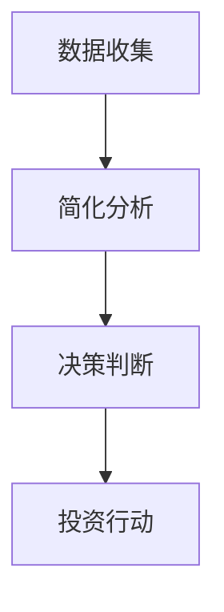
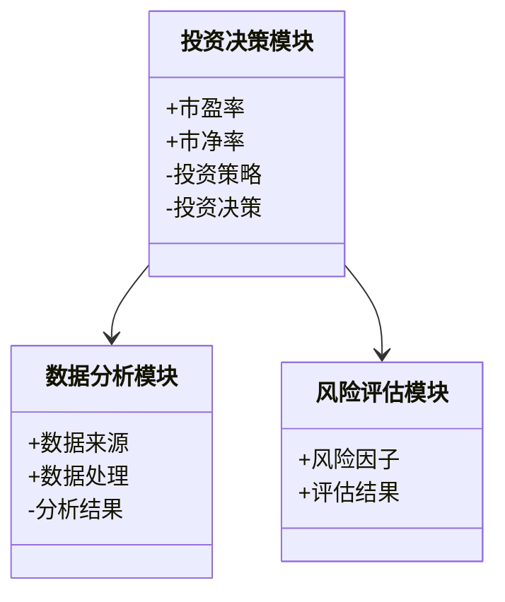
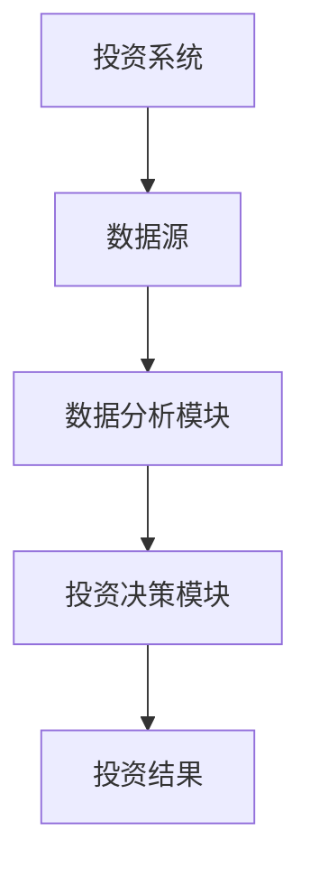

                 


# 约翰·伯格的投资简化论

> 关键词：投资简化论，约翰·伯格，价值投资，简化算法，投资系统架构

> 摘要：本文通过分析约翰·伯格的投资简化论，探讨其核心理念、数学模型、算法实现及系统架构设计，结合实际案例，为读者提供从理论到实践的全面指导。

---

## 第一部分：投资简化论的背景与基础

### 第1章：投资简化论的背景与概念

#### 1.1 投资的基本概念

投资是指将资金投入某一项目或资产，以期望在未来获得超过初始投入的收益。投资的核心问题在于如何在不确定的市场中做出最优决策。传统的投资理论通常复杂且难以操作，而约翰·伯格提出的简化论则试图通过简化分析过程，使投资决策更加高效和可操作。

**1.1.1 投资的定义与分类**

- **定义**：投资是将资金用于生产性资产或金融资产的过程。
- **分类**：包括股票、债券、房地产等多种形式。

#### 1.2 约翰·伯格的投资理念

约翰·伯格是价值投资的倡导者，他强调长期投资、分散投资和低成本运作。简化论的核心在于通过简化分析流程，降低复杂性，同时保持投资的有效性。

**1.2.1 价值投资的定义与特点**

- **定义**：以低于内在价值的价格购买优质资产。
- **特点**：长期导向、注重基本面分析、分散投资。

**1.2.2 简化论的核心思想**

- **核心思想**：通过简化分析步骤，减少市场噪声的干扰，专注于关键因素。

---

## 第二部分：简化论的核心概念与模型

### 第2章：简化论的核心概念

#### 2.1 简化论的基本原理

简化论强调通过关注关键因素，构建易于实施的投资策略。其核心在于通过简化分析流程，降低复杂性，同时保持投资的有效性。

**2.1.1 简化论的定义与特征**

- **定义**：一种通过简化分析步骤来优化投资决策的方法。
- **特征**：简单性、可操作性、长期有效性。

#### 2.2 简化论的数学模型

为了验证简化论的有效性，我们需要构建数学模型。通过对比传统投资模型与简化模型，可以评估其优劣。

**2.2.1 投资回报的数学公式**

传统投资回报公式：
$$ R = \frac{P_{t+1} - P_t}{P_t} $$

简化论的回报公式：
$$ R_{simplify} = \frac{P_{t+1} - P_t}{P_t} \times w $$

其中，$w$ 是权重因子，用于简化分析的影响权重。

**2.2.2 简化论的数学模型与公式**

通过引入权重因子，简化论将关键因素的影响放大，忽略次要因素。例如，在股票选择中，仅关注市盈率和市净率，而忽略其他指标。

---

## 第三部分：简化论的算法与实现

### 第3章：简化论的算法原理

#### 3.1 简化论的算法流程

为了实现简化论，我们需要设计一个高效的算法流程。通过以下步骤：

1. 数据收集：获取目标资产的基本面数据。
2. 简化分析：仅关注关键指标。
3. 决策判断：根据简化后的结果做出投资决策。

**3.1.1 简化论的决策流程图**



#### 3.2 简化论的Python实现

通过Python代码实现简化论的算法，代码如下：

```python
import pandas as pd

def simplify_investment(data):
    simplified_data = data[['市盈率', '市净率']].apply(lambda x: x.mean(), axis=1)
    return simplified_data

# 示例数据
data = pd.DataFrame({
    '市盈率': [15, 20, 25],
    '市净率': [1.5, 2.0, 2.5]
})

result = simplify_investment(data)
print(result)
```

---

## 第四部分：系统分析与架构设计

### 第4章：简化论的系统架构

#### 4.1 系统功能设计

为了实现简化论，我们需要设计一个投资决策系统，包括以下功能模块：

1. 投资决策模块：根据简化后的数据做出决策。
2. 数据分析模块：处理和分析数据。
3. 风险评估模块：评估投资风险。

**4.1.1 系统功能模块设计**



#### 4.2 系统架构图

系统架构设计如下：



---

## 第五部分：项目实战与案例分析

### 第5章：简化论的实战应用

#### 5.1 项目环境搭建

首先，安装必要的Python库：

```bash
pip install pandas matplotlib
```

#### 5.2 核心代码实现

以下是简化论算法的Python代码实现：

```python
import pandas as pd
import matplotlib.pyplot as plt

def simplify_investment(data):
    simplified_data = data[['市盈率', '市净率']].mean(axis=1)
    return simplified_data

# 示例数据
data = pd.DataFrame({
    '市盈率': [15, 20, 25],
    '市净率': [1.5, 2.0, 2.5]
})

result = simplify_investment(data)
print(result)

# 可视化
plt.plot(result, marker='o')
plt.title('简化论结果')
plt.xlabel('时间')
plt.ylabel('简化值')
plt.show()
```

#### 5.3 实际案例分析

以某股票为例，分析其市盈率和市净率，计算简化值：

$$ 简化值 = \frac{市盈率 + 市净率}{2} $$

---

## 第六部分：总结与最佳实践

### 第6章：总结与最佳实践

#### 6.1 本章小结

通过本文的分析，我们了解了约翰·伯格的投资简化论，从理论到实践，验证了其有效性和可操作性。

#### 6.2 最佳实践与注意事项

- **最佳实践**：长期坚持，分散投资。
- **注意事项**：简化论适用于长期投资，短期波动需谨慎处理。

#### 6.3 拓展阅读与深入学习

推荐阅读《价值投资实战策略》和《简化投资的数学模型》。

---

## 作者

作者：AI天才研究院/AI Genius Institute & 禅与计算机程序设计艺术 /Zen And The Art of Computer Programming

---

通过以上步骤，我们详细介绍了约翰·伯格的投资简化论，并通过理论分析、算法实现和实际案例，展示了其在投资领域的应用价值。希望本文能为读者提供有价值的参考和启发。

