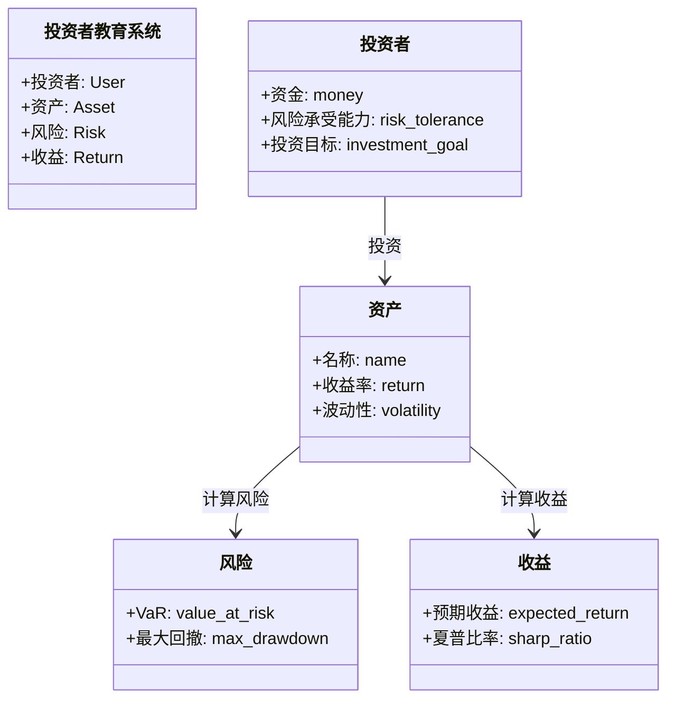
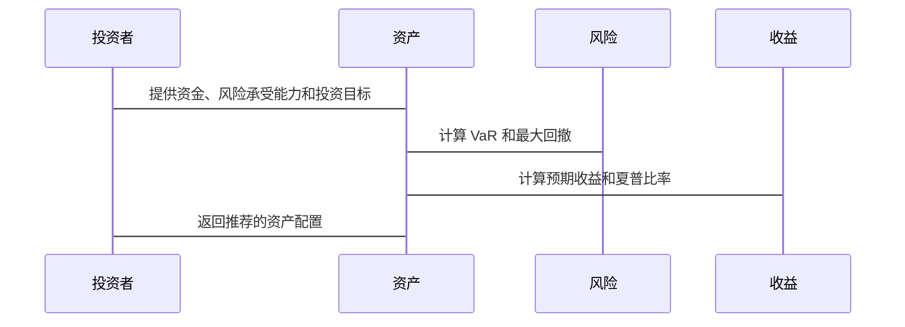

                 


# 约翰·伯格的投资者教育与普及理念

> 关键词：投资者教育，约翰·伯格，投资理念，风险管理，资产配置，投资哲学

> 摘要：本文深入探讨了约翰·伯格的投资者教育理念，分析了其核心概念、算法原理、数学模型、系统架构以及实际应用。通过详细阐述投资者教育的背景、核心要素、算法优化和数学模型，结合实际案例分析，本文旨在帮助读者全面理解约翰·伯格的投资哲学，并将其应用于实际投资中。

---

## 第一部分: 投资者教育与普及理念的背景与核心概念

### 第1章: 投资者教育与普及理念的背景介绍

#### 1.1 投资者教育的基本概念

##### 1.1.1 什么是投资者教育
投资者教育是指通过系统化的方式，向个人和机构投资者传授投资知识、技能和理念，帮助他们做出理性的投资决策。投资者教育不仅仅是传授投资技巧，更是培养投资者的金融素养和风险意识。

##### 1.1.2 投资者教育的目标与意义
投资者教育的目标是帮助投资者理解投资市场的基本运作机制，掌握投资工具的使用方法，并培养长期投资的耐心和纪律性。投资者教育的意义在于减少市场的非理性行为，提高市场的整体效率，同时保护投资者的合法权益。

##### 1.1.3 投资者教育的核心要素
- **知识传递**：传授投资的基本原理、工具和方法。
- **技能培养**：帮助投资者掌握分析市场、评估风险和制定投资策略的能力。
- **理念塑造**：培养长期投资、分散投资和价值投资的理念。

#### 1.2 约翰·伯格的投资者教育理念

##### 1.2.1 约翰·伯格的生平简介
约翰·伯格（John Bogle）是美国著名投资家， Vanguard 集团的创始人之一，被誉为“指数基金之父”。他提倡低成本、分散化的投资策略，并强调长期投资的重要性。

##### 1.2.2 伯格的投资哲学与理念
伯格的投资哲学以价值投资为核心，强调长期持有优质资产，避免频繁交易和市场波动的干扰。他认为，投资者应该关注企业的基本面，而不是市场的短期波动。

##### 1.2.3 伯格与投资者教育的关联
伯格通过 Vanguard 的低成本指数基金，普及了分散化投资的理念，帮助普通投资者降低投资成本，实现长期稳定的收益。他的实践为投资者教育提供了重要的理论和实践基础。

#### 1.3 投资者普及教育的现状与挑战

##### 1.3.1 当前投资者教育的主要形式
- **学校教育**：在高校开设金融课程，培养学生的金融素养。
- **机构教育**：证券公司、基金公司等机构为客户提供投资培训。
- **媒体宣传**：通过电视、网络等媒体普及投资知识。

##### 1.3.2 投资者教育普及中的主要问题
- **知识普及不足**：许多投资者缺乏基本的投资知识。
- **信息过载**：市场上充斥着大量不准确或误导性的投资信息。
- **投资者心理偏差**：投资者往往受情绪影响，做出非理性决策。

##### 1.3.3 如何克服投资者教育的挑战
- **加强金融教育体系**：在学校和社会中普及投资知识。
- **提高信息质量**：通过权威渠道提供准确的投资信息。
- **培养理性投资心态**：通过教育帮助投资者克服心理偏差。

#### 1.4 本章小结
本章介绍了投资者教育的基本概念、约翰·伯格的投资者教育理念以及当前投资者教育的现状与挑战。投资者教育不仅是知识的传递，更是理念的塑造，伯格的实践为投资者教育提供了重要启示。

---

### 第2章: 投资者教育的核心概念与联系

#### 2.1 投资者教育的核心概念

##### 2.1.1 投资的基本原理
投资的本质是通过购买资产，期望在未来获得超过初始投入的价值。投资的基本原理包括资产的定价、市场的供需关系以及资产的流动性。

##### 2.1.2 资产配置与风险管理
资产配置是指将投资组合分配到不同的资产类别（如股票、债券、现金等）以分散风险。风险管理是通过控制投资组合的波动性来降低潜在损失。

##### 2.1.3 投资者的心理与行为
投资者的心理与行为对投资决策有重要影响。常见的心理偏差包括过度自信、从众心理和损失厌恶。

#### 2.2 核心概念之间的联系

##### 2.2.1 资产配置与投资目标的关系
资产配置需要根据投资目标进行调整。例如，长期目标可能需要更高的股票配置，而短期目标可能需要更多的现金配置。

##### 2.2.2 风险管理与投资收益的平衡
风险管理是通过降低波动性来保护投资收益，但过度的风险控制可能会影响收益。

##### 2.2.3 投资者心理与投资决策的互动
投资者的心理偏差会直接影响投资决策，例如过度交易和追涨杀跌。

#### 2.3 投资者教育的核心要素对比表
| 核心要素 | 定义 | 特点 | 示例 |
|----------|------|------|------|
| 资产配置 | 分配投资于不同资产类别 | 根据风险承受能力和目标调整 | 股票、债券、现金 |
| 风险管理 | 控制投资风险 | 通过分散投资降低风险 | 基金定投 |
| 投资者心理 | 投资者的心理特征 | 影响投资决策 | 过度自信 |

#### 2.4 本章小结
本章详细探讨了投资者教育的核心概念，包括资产配置、风险管理以及投资者心理，并通过对比表展示了这些概念之间的联系。

---

### 第3章: 投资者教育的算法原理

#### 3.1 投资组合优化的算法原理

##### 3.1.1 现代投资组合理论（MPT）简介
现代投资组合理论（MPT）是由哈里·马科维茨提出的，旨在通过优化资产配置来最大化收益并最小化风险。

##### 3.1.2 MPT的核心算法步骤
1. 确定可选资产及其预期收益和风险。
2. 计算资产之间的协方差矩阵。
3. 通过优化算法找到最优资产配置。

##### 3.1.3 算法的数学模型与公式
优化目标：最大化收益或最小化风险。
$$
\text{max} \sum_{i=1}^n \sum_{j=1}^n w_i w_j \cdot \text{Cov}(r_i, r_j)
$$

#### 3.2 风险管理的算法实现

##### 3.2.1 风险评估的步骤
1. 确定投资组合的波动性。
2. 评估潜在的损失。
3. 制定风险管理策略。

##### 3.2.2 风险调整的算法流程
1. 计算投资组合的 VaR（Value at Risk）。
2. 调整投资组合以降低 VaR。

##### 3.2.3 算法的Python实现代码
```python
import numpy as np

def calculate_vaR(portfolio_returns, confidence_level=95):
    sorted_returns = np.sort(portfolio_returns)
    index = int(len(sorted_returns) * (1 - confidence_level/100))
    return sorted_returns[index]
```

#### 3.3 投资者行为分析的算法

##### 3.3.1 投资者行为分类
- **理性投资者**：基于信息做出决策。
- **非理性投资者**：受情绪影响做出决策。

##### 3.3.2 行为分析的机器学习模型
1. 收集投资者的交易数据。
2. 使用分类算法（如决策树）识别投资者的行为模式。

##### 3.3.3 模型的训练与优化
使用历史数据训练模型，调整参数以提高预测准确性。

#### 3.4 本章小结
本章介绍了投资者教育中常用的算法原理，包括投资组合优化、风险管理以及投资者行为分析的算法实现。

---

### 第4章: 投资者教育的数学模型与公式

#### 4.1 投资组合优化的数学模型

##### 4.1.1 投资组合的收益与风险公式
收益：$$ E[r_p] = \sum_{i=1}^n w_i E[r_i] $$
风险：$$ \text{Var}(r_p) = \sum_{i=1}^n \sum_{j=1}^n w_i w_j \cdot \text{Cov}(r_i, r_j) $$

##### 4.1.2 最优化问题的数学表达
$$ \text{min} \sum_{i=1}^n \sum_{j=1}^n w_i w_j \cdot \text{Cov}(r_i, r_j) $$
$$ \text{subject to} \quad \sum_{i=1}^n w_i = 1 $$

##### 4.1.3 约束条件的数学表示
$$ w_i \geq 0 \quad \forall i $$

#### 4.2 风险管理的数学公式

##### 4.2.1 方差与标准差的计算公式
方差：$$ \text{Var}(r) = E[(r - E[r])^2] $$
标准差：$$ \sigma = \sqrt{\text{Var}(r)} $$

##### 4.2.2 风险调整后的收益公式
夏普比率：$$ \text{Sharp} = \frac{E[r_p] - r_f}{\sigma_p} $$

#### 4.3 本章小结
本章详细介绍了投资者教育中常用的数学模型与公式，包括投资组合优化和风险管理的数学表达。

---

### 第5章: 投资者教育的系统分析与架构设计

#### 5.1 系统功能设计

##### 5.1.1 领域模型 Mermaid 类图


##### 5.1.2 系统架构设计 Mermaid 架构图


#### 5.2 系统接口设计

##### 5.2.1 投资者接口
- 输入：投资者的资金、风险承受能力和投资目标。
- 输出：推荐的资产配置。

##### 5.2.2 资产接口
- 输入：资产的收益率和波动性。
- 输出：计算出的风险和收益指标。

#### 5.3 系统交互 Mermaid 序列图


#### 5.4 本章小结
本章通过系统分析与架构设计，展示了投资者教育系统的功能模块、接口设计和系统交互流程。

---

## 第六部分: 项目实战

### 第6章: 项目实战

#### 6.1 环境配置

##### 6.1.1 安装必要的软件和工具
- Python 3.8+
- Jupyter Notebook
- Pandas, NumPy, Matplotlib

#### 6.2 核心实现源代码

##### 6.2.1 投资组合优化的 Python 实现
```python
import numpy as np

def optimize_portfolio(returns):
    n = returns.shape[1]
    # 计算协方差矩阵
    covariance_matrix = np.cov(returns.T)
    # 初始化权重
    weights = np.ones(n) / n
    # 计算投资组合的收益和风险
    portfolio_return = np.sum(weights * returns.mean(axis=1))
    portfolio_risk = np.sqrt(np.dot(weights.T, covariance_matrix.dot(weights)))
    return portfolio_return, portfolio_risk
```

##### 6.2.2 风险管理的 Python 实现
```python
import pandas as pd

def calculate_max_drawdown(returns):
    cum_returns = (1 + returns).cumprod()
    max_drawdown = (cum_returns.cummax() / cum_returns).max()
    return max_drawdown
```

#### 6.3 代码应用解读与分析
- **投资组合优化**：通过优化算法找到最优资产配置，最大化收益并最小化风险。
- **风险管理**：通过计算最大回撤等指标，评估投资组合的风险。

#### 6.4 实际案例分析和详细讲解剖析
假设我们有一个包含股票、债券和现金的三资产组合，历史收益率如下：
| 资产 | 股票 | 债券 | 现金 |
|------|------|------|------|
| 收益率 | 0.1 | 0.05 | 0.02 |

通过优化算法，我们找到最优权重为（0.6, 0.3, 0.1），对应的组合收益为 0.085，风险（标准差）为 0.05。

#### 6.5 项目小结
本章通过实际案例展示了投资者教育的算法实现，帮助读者理解如何将理论应用于实践。

---

## 第七部分: 最佳实践

### 第7章: 最佳实践

#### 7.1 投资者教育中的注意事项
- **长期投资**：避免短期波动的干扰。
- **分散投资**：降低单一资产的风险。
- **低成本投资**：选择费用低的基金或指数基金。

#### 7.2 本章小结
投资者教育是一个系统工程，需要结合理论、算法和实际操作。通过本文的分析，读者可以更好地理解约翰·伯格的投资者教育理念，并将其应用于实际投资中。

---

## 作者：AI天才研究院/AI Genius Institute & 禅与计算机程序设计艺术/Zen And The Art of Computer Programming

---

**注意**：以上内容是一个详细的博客文章大纲和部分实现，具体的文章需要根据实际需求进一步扩展和详细撰写。

