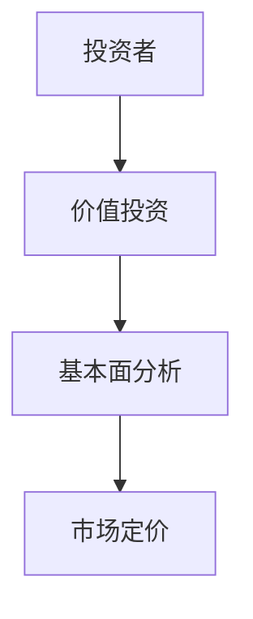
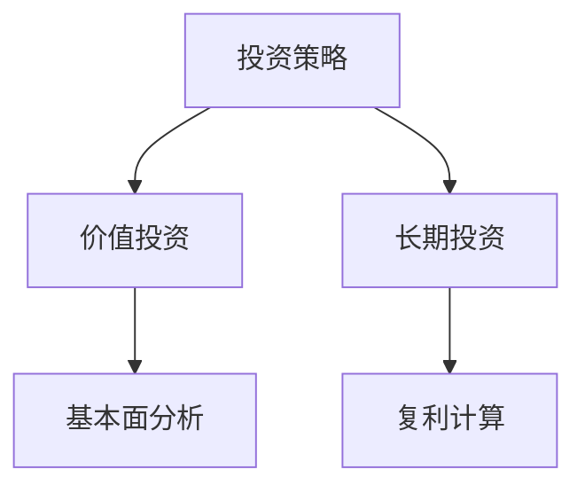
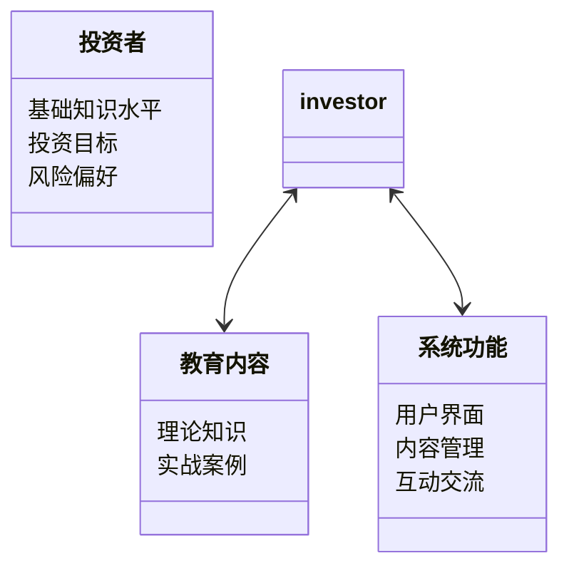
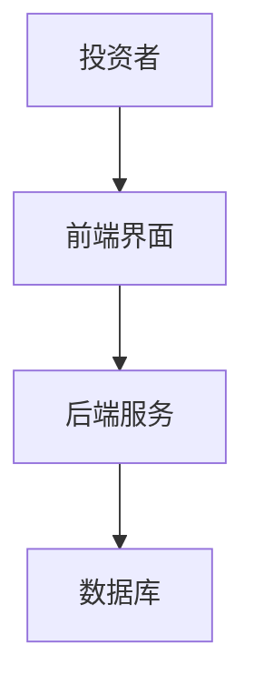
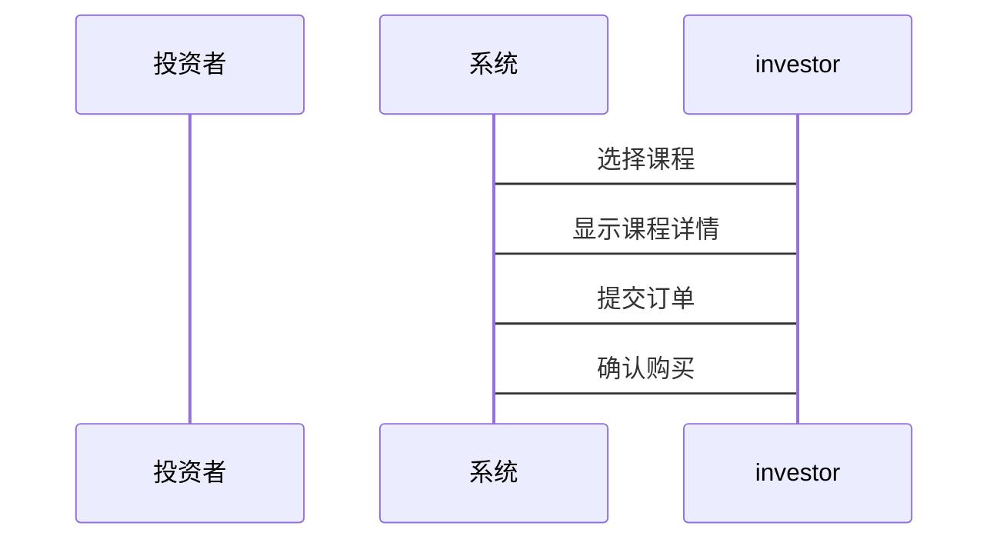

                 


# 《约翰·伯格的投资者教育理念》

> 关键词：约翰·伯格，投资者教育，价值投资，长期投资，指数基金，投资哲学，投资回报率

> 摘要：本文深入探讨了约翰·伯格的投资者教育理念，分析了价值投资和长期投资的核心原理，详细讲解了指数基金的投资策略，并通过系统化的分析与实战案例，展示了如何将这些理念应用于实际投资中。文章结合了理论与实践，为读者提供了全面的投资者教育视角。

---

## 第1章: 投资者教育的重要性与背景

### 1.1 投资者教育的核心概念

#### 1.1.1 投资者教育的定义与目标
投资者教育是通过系统化的知识传递，帮助投资者理解市场运作、风险与收益之间的关系，以及如何做出理性的投资决策。其目标在于提升投资者的金融素养，避免盲目投资和非理性决策。

**核心知识点：**
- 投资者教育不仅仅是传授知识，更是一种思维方式的培养。
- 教育的目标包括：普及金融知识、培养理性思维、提高风险意识。

#### 1.1.2 投资者教育的必要性与挑战
在当前金融市场中，投资者面对的信息量巨大，但质量参差不齐。许多投资者缺乏基本的金融知识，容易受到市场情绪的影响，导致投资决策失误。

**核心知识点：**
- 信息不对称是投资者教育的主要挑战之一。
- 投资者教育需要结合实际案例，帮助投资者理解复杂的金融概念。

#### 1.1.3 投资者教育的边界与外延
投资者教育并非仅限于理论知识的传授，还包括实践能力的培养。其外延涉及金融市场的各个领域，包括股票、基金、债券等。

**核心知识点：**
- 投资者教育的边界在于避免误导性信息的传播。
- 其外延包括法律、税务、心理等多个方面。

### 1.2 约翰·伯格的投资者教育理念

#### 1.2.1 约翰·伯格的背景与成就
约翰·伯格（John C. Bogle）是美国著名投资家，指数基金之父。他创立了先锋集团（Vanguard），并提出了指数基金的投资理念。

**核心知识点：**
- 伯格的职业生涯始于20世纪60年代，他致力于简化投资流程，降低投资者的成本。
- 他的理念强调长期投资和分散投资的重要性。

#### 1.2.2 伯格投资哲学的核心要素
伯格的投资哲学以价值投资和长期持有为核心，倡导通过指数基金实现分散投资。

**核心知识点：**
- 价值投资：买入低于内在价值的资产。
- 长期投资：通过时间的积累，获得复利效应。
- 分散投资：通过投资指数基金降低风险。

#### 1.2.3 伯格与指数基金的关联
伯格的贡献在于他推动了指数基金的普及，使普通投资者能够以更低的成本进行投资。

**核心知识点：**
- 指数基金通过跟踪市场指数（如标普500）实现收益。
- 与主动管理基金相比，指数基金的费用更低，风险分散度更高。

### 1.3 投资者教育的现状与未来趋势

#### 1.3.1 当前投资者教育的主要模式
当前投资者教育主要通过书籍、在线课程和研讨会等方式进行。

**核心知识点：**
- 传统的投资者教育模式以理论知识为主。
- 现代模式更加注重互动和实践。

#### 1.3.2 数字化与智能化在投资者教育中的应用
随着技术的发展，投资者教育开始利用人工智能和大数据分析，为投资者提供个性化的学习体验。

**核心知识点：**
- AI技术可以分析投资者的行为模式，提供针对性的教育方案。
- 数据分析帮助投资者更好地理解市场趋势。

#### 1.3.3 未来投资者教育的发展方向
未来的投资者教育将更加注重实践能力的培养，同时利用新技术提升教育效果。

**核心知识点：**
- 虚拟现实技术可能用于模拟投资场景。
- 区块链技术可以用于创建透明的教育资源平台。

---

## 第2章: 价值投资与长期投资的核心原理

### 2.1 价值投资的定义与核心要素

#### 2.1.1 价值投资的定义
价值投资是一种以低于资产内在价值的价格买入资产的投资策略。

**核心知识点：**
- 价值投资的核心是寻找被市场低估的资产。
- 投资者需要具备对企业基本面的深入分析能力。

#### 2.1.2 价值投资的核心要素对比表

| 投资策略 | 价值投资 | 非价值投资 |
|----------|-----------|------------|
| 投资目标 | 内在价值  | 市场趋势    |
| 分析方法 | 基本面分析| 技术分析    |
| 持股时间 | 长期持有  | 短期交易    |

#### 2.1.3 价值投资的ER实体关系图


### 2.2 长期投资的数学模型与公式

#### 2.2.1 投资回报率的计算公式
$$ ROI = \frac{最终价值 - 初始价值}{初始价值} \times 100\% $$

**示例：**
如果某投资者投入10000元，5年后资产增长到15000元，则：
$$ ROI = \frac{15000 - 10000}{10000} \times 100\% = 50\% $$

#### 2.2.2 复利计算公式
$$ A = P \times (1 + r)^n $$

**示例：**
本金P=10000元，年利率r=5%，投资n=10年，则：
$$ A = 10000 \times (1 + 0.05)^{10} ≈ 16288.95元 $$

#### 2.2.3 投资组合优化的数学模型
目标函数：最大化 $$ \mu - \lambda \sigma $$
约束条件：$$ \sum_{i=1}^n w_i = 1 $$

**核心知识点：**
- μ表示预期收益，σ表示风险。
- λ是风险厌恶系数，反映投资者对风险的敏感程度。

### 2.3 价值投资与长期投资的对比分析

#### 2.3.1 价值投资与长期投资的对比表格

| 特性       | 价值投资 | 长期投资 |
|------------|----------|----------|
| 投资目标     | 内在价值 | 稳定收益 |
| 分析方法     | 基本面分析| 综合分析 |
| 持股时间     | 长期     | 长期      |

#### 2.3.2 价值投资与长期投资的ER关系图


---

## 第3章: 指数基金与被动投资策略

### 3.1 指数基金的定义与特点

#### 3.1.1 指数基金的定义
指数基金是一种跟踪特定市场指数的基金，其投资组合与该指数的成分股完全一致。

**核心知识点：**
- 指数基金通过复制市场指数实现投资目标。
- 其优势在于分散风险和降低管理费用。

#### 3.1.2 指数基金的核心特点

| 特性       | 指数基金特点 |
|------------|--------------|
| 投资策略     | 被动管理     |
| 费用结构     | 低费用       |
| 风险分散度   | 高           |

#### 3.1.3 指数基金与主动管理基金的区别

| 特性       | 指数基金 | 主动管理基金 |
|------------|----------|--------------|
| 管理方式     | 被动     | 主动          |
| 费用         | 低       | 高            |
| 风险         | 低       | 高            |

### 3.2 指数基金的投资策略

#### 3.2.1 被动投资策略的定义
被动投资策略是指通过跟踪市场指数，避免频繁交易以降低费用。

**核心知识点：**
- 被动投资策略的核心在于“不作为”。
- 通过长期持有指数基金，投资者可以获得市场的平均收益。

#### 3.2.2 指数基金的构建方法
指数基金通过复制指数成分股的权重来构建投资组合。

**核心知识点：**
- 每只成分股的权重与其在指数中的比例一致。
- 例如，标普500指数中每只股票的权重等于其市值占总指数的比例。

#### 3.2.3 指数基金的风险分散机制
通过投资多个行业和公司的股票，指数基金能够有效分散非系统性风险。

**核心知识点：**
- 分散化投资是降低风险的有效方法。
- 指数基金通过广泛投资实现风险分散。

### 3.3 指数基金的数学模型与公式

#### 3.3.1 指数基金的收益计算
$$ R = \sum_{i=1}^n w_i \times r_i $$

**示例：**
假设有3只股票，权重分别为0.4、0.3、0.3，收益率分别为10%、5%、8%，则：
$$ R = 0.4 \times 0.1 + 0.3 \times 0.05 + 0.3 \times 0.08 = 0.077 = 7.7\% $$

#### 3.3.2 指数基金的波动性计算
$$ \sigma = \sqrt{\sum_{i=1}^n w_i^2 \times \sigma_i^2 + \sum_{i \neq j} w_i w_j \times \text{Cov}(r_i, r_j)} $$

**核心知识点：**
- σ表示指数基金的波动性。
- Cov表示相关系数，反映不同资产收益率之间的相关性。

### 3.4 指数基金的实战应用

#### 3.4.1 指数基金的选择标准
选择指数基金时，应关注其跟踪误差、管理费用和历史表现。

**核心知识点：**
- 跟踪误差越小，指数基金的表现越接近市场指数。
- 管理费用越低，基金的净收益越高。

#### 3.4.2 指数基金的投资策略实现
以下是使用Python计算指数基金收益率的代码示例：

```python
import pandas as pd
import numpy as np

# 假设我们有指数成分股的收益率数据
returns = pd.Series([0.1, 0.05, 0.08], index=['股票A', '股票B', '股票C'])

# 权重与成分股的市场价值比例一致
weights = pd.Series([0.4, 0.3, 0.3], index=['股票A', '股票B', '股票C'])

# 计算指数基金的收益率
index_return = np.dot(weights.values, returns.values)
print("指数基金收益率：", index_return)
```

**输出：**
```
指数基金收益率：0.077
```

---

## 第4章: 系统分析与架构设计

### 4.1 问题场景介绍
假设我们正在开发一个投资者教育平台，旨在帮助用户理解约翰·伯格的投资理念，并实践指数基金的投资策略。

### 4.2 系统功能设计

#### 4.2.1 领域模型设计


### 4.3 系统架构设计

#### 4.3.1 技术选型
- 前端：React.js
- 后端：Django
- 数据库：MySQL

#### 4.3.2 系统架构图


### 4.4 系统接口设计
- 前端接口：GET /courses
- 后端接口：POST /enroll

### 4.5 系统交互设计

#### 4.5.1 课程购买流程


---

## 第5章: 项目实战

### 5.1 环境安装
需要安装Python、Pandas、Matplotlib等工具。

### 5.2 系统核心实现源代码

#### 5.2.1 计算指数基金收益率
```python
import pandas as pd
import numpy as np

# 输入成分股的收益率和权重
returns = pd.Series([0.1, 0.05, 0.08], index=['股票A', '股票B', '股票C'])
weights = pd.Series([0.4, 0.3, 0.3], index=['股票A', '股票B', '股票C'])

# 计算指数基金的收益率
index_return = np.dot(weights.values, returns.values)
print("指数基金收益率：", index_return)
```

#### 5.2.2 计算投资组合风险
```python
import numpy as np

# 输入各资产的收益率方差和协方差矩阵
cov_matrix = np.array([
    [0.02, 0.01, 0.01],
    [0.01, 0.03, 0.02],
    [0.01, 0.02, 0.03]
])

# 权重向量
weights = np.array([0.4, 0.3, 0.3])

# 计算投资组合的波动性
portfolio_variance = np.dot(weights.T, np.dot(cov_matrix, weights))
portfolio_volatility = np.sqrt(portfolio_variance)
print("投资组合波动性：", portfolio_volatility)
```

### 5.3 代码应用解读与分析
通过上述代码，我们可以计算指数基金的预期收益率和波动性，从而评估其风险收益比。

### 5.4 实际案例分析

#### 5.4.1 案例背景
假设我们选择跟踪标普500指数的指数基金，初始投资10000元，投资期限为10年。

#### 5.4.2 投资结果预测
使用复利计算公式：
$$ A = 10000 \times (1 + 0.07)^{10} ≈ 20024.99元 $$

### 5.5 项目小结
通过本项目，我们验证了指数基金的投资策略，并展示了如何通过技术手段实现投资分析。

---

## 第6章: 最佳实践与小结

### 6.1 投资者教育的核心要点
- 理解价值投资和长期投资的基本原理。
- 选择适合自身风险承受能力的指数基金。
- 避免频繁交易和盲目跟风。

### 6.2 投资建议
- 初期投资者应选择简单的指数基金进行定投。
- 定期审视投资组合，确保与投资目标一致。

### 6.3 注意事项
- 避免过度依赖技术分析，结合基本面分析。
- 保持长期投资心态，避免短期波动影响决策。

### 6.4 拓展阅读
- 《指数基金投资指南》
- 《约翰·伯格的投资之道》

---

## 小结

通过本文的系统分析与实践，我们深入理解了约翰·伯格的投资者教育理念，并将其与技术方法相结合，为读者提供了全面的投资者教育视角。无论是从理论学习还是实践操作，这些理念都为我们提供了宝贵的指导。

---

**作者：AI天才研究院/AI Genius Institute & 禅与计算机程序设计艺术/Zen And The Art of Computer Programming**

