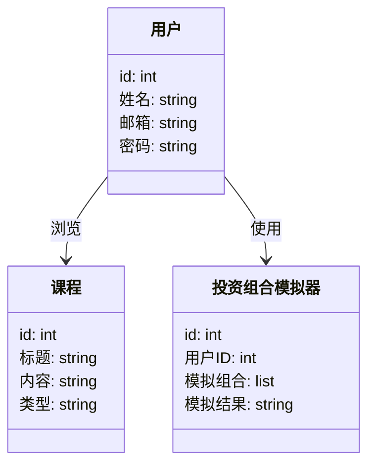
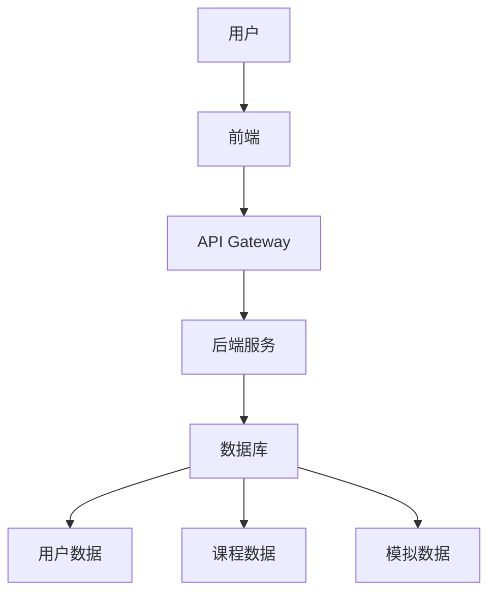
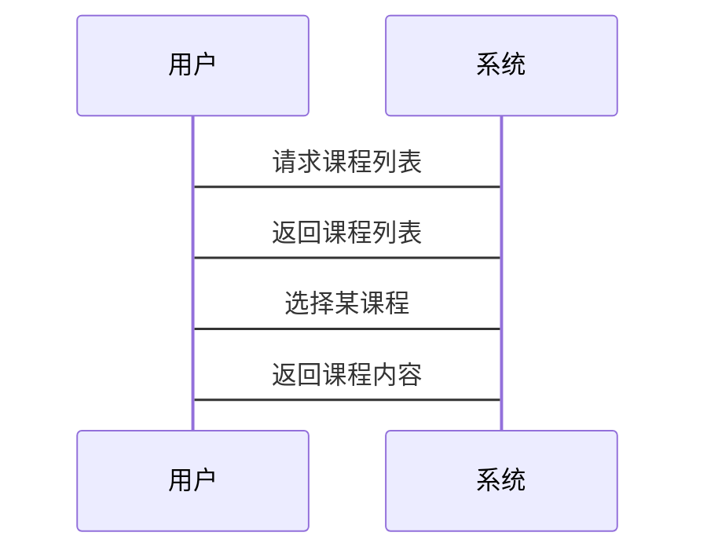

                 


# 约翰·伯格的投资者教育：普及金融知识的重要性

> **关键词**：投资者教育、金融市场、资产配置、投资组合优化、风险管理、心理学与投资行为、技术系统设计  
> **摘要**：本文通过分析约翰·伯格的投资者教育理念，探讨金融知识普及的重要性。从投资者心理、市场机制、投资策略到系统设计，系统性地阐述投资者教育的核心内容，结合实际案例和系统架构，为读者提供全面的投资者教育解决方案。

---

# 正文

## 第一部分：投资者教育的背景与重要性

### 第1章：投资者教育的核心概念

#### 1.1 投资者教育的背景与意义

##### 1.1.1 什么是投资者教育
投资者教育是指通过系统性的知识普及和实践指导，帮助投资者理解金融市场运作机制、投资工具特性以及风险管理方法，从而做出理性的投资决策。约翰·伯格强调，投资者教育不仅是个人财富增长的关键，更是维护金融市场稳定的重要基石。

##### 1.1.2 投资者教育的重要性
- **个人层面**：帮助投资者避免盲目决策，降低投资损失，实现财富保值与增值。
- **市场层面**：提高市场参与者的整体素质，促进市场的公平与高效运行。
- **社会层面**：减少金融诈骗和非理性投资行为，维护金融系统的稳定性。

##### 1.1.3 投资者教育的目标与边界
- **目标**：培养理性投资理念，提升投资技能，增强风险意识。
- **边界**：不直接提供投资建议，而是提供知识和工具，帮助投资者做出决策。

#### 1.2 投资者心理与行为分析

##### 1.2.1 投资者心理偏差
- **过度自信**：投资者往往高估自己的判断能力，导致决策失误。
- **从众心理**：盲目跟随市场潮流，忽视个体分析。
- **损失厌恶**：对潜在损失的恐惧导致投资者错失长期收益。

##### 1.2.2 投资者决策模式
- **情绪驱动**：非理性决策常见于市场波动期。
- **理性分析**：基于基本面和数据的决策更可靠。
- **行为惯性**：投资者往往固守旧有策略，忽视市场变化。

##### 1.2.3 投资者行为对市场的影响
- **羊群效应**：群体行为可能导致市场过度波动。
- **反馈循环**：投资者行为反过来影响市场走势，形成复杂互动。

### 第2章：金融市场的基本概念

#### 2.1 金融市场的构成

##### 2.1.1 金融市场的主要参与者
- **投资者**：包括个人、机构和政府。
- **金融机构**：银行、证券公司、基金公司等。
- **监管机构**：证监会、央行等，确保市场公平。

##### 2.1.2 金融工具的分类
- **股权类**：股票、认股证。
- **债权类**：债券、贷款。
- **衍生品**：期货、期权、掉期。

##### 2.1.3 金融市场的功能与作用
- **资金配置**：引导资金流向高效率领域。
- **价格发现**：市场机制决定资产价格。
- **风险管理**：通过多样化和衍生品降低风险。

#### 2.2 投资的基本原理

##### 2.2.1 资产配置的基本原则
- **分散投资**：避免过度集中，降低风险。
- **长期视角**：投资应基于长期目标，避免短期波动干扰。
- **成本控制**：降低 fees，提高净收益。

##### 2.2.2 风险与收益的平衡
- **风险溢价**：高风险资产应提供更高的预期收益。
- **风险分散**：通过多样化投资降低特定风险。
- **风险评估**：准确评估风险是投资决策的基础。

##### 2.2.3 投资组合管理的核心理念
- **最优配置**：根据风险承受能力和收益目标构建组合。
- **动态调整**：定期审视和优化投资组合。
- **持续监控**：跟踪市场变化和组合表现。

## 第二部分：投资者教育的系统分析与架构设计

### 第3章：投资者教育系统的开发

#### 3.1 项目介绍

##### 3.1.1 项目目标
- 提供在线投资者教育平台，普及金融知识。
- 提供互动学习工具，帮助用户理解投资概念。

##### 3.1.2 项目范围
- 网站/APP开发：包括课程内容展示、互动模拟、个性化学习计划。
- 后台管理：课程管理、用户管理、数据分析。

##### 3.1.3 项目关键成功因素
- 用户体验：界面友好，功能易用。
- 内容质量：课程内容权威、实用。
- 技术支持：系统稳定，数据安全。

#### 3.2 系统功能设计

##### 3.2.1 领域模型设计（Mermaid类图）


##### 3.2.2 系统架构设计（Mermaid架构图）


##### 3.2.3 系统接口设计
- 用户接口：注册、登录、课程浏览、模拟操作。
- 管理接口：课程管理、用户管理、数据统计。

##### 3.2.4 系统交互设计（Mermaid序列图）


## 第三部分：项目实战与系统实现

### 第4章：投资者教育系统的实现

#### 4.1 环境安装与配置

##### 4.1.1 开发环境的选择
- **前端**：React.js 或 Vue.js。
- **后端**：Node.js 或 Python（Django/Flask）。
- **数据库**：MySQL 或 MongoDB。

##### 4.1.2 依赖库的安装
- 前端：npm install。
- 后端：pip install Flask。

##### 4.1.3 系统配置说明
- 确保网络畅通，安装必要的开发工具。

#### 4.2 核心功能实现

##### 4.2.1 投资者教育内容管理系统

##### 4.2.2 用户交互界面设计
- 登录注册页面、课程列表页面、模拟操作页面。

##### 4.2.3 数据分析与可视化
- 使用图表展示用户学习情况、市场数据。

#### 4.3 代码实现与解读

##### 4.3.1 系统核心代码
```python
from flask import Flask, jsonify, request
import sqlite3

app = Flask(__name__)

@app.route('/api/users', methods=['POST'])
def create_user():
    data = request.json
    con = sqlite3.connect('users.db')
    cur = con.cursor()
    cur.execute("INSERT INTO users (name, email, password) VALUES (?, ?, ?)", 
                (data['name'], data['email'], data['password']))
    con.commit()
    return jsonify({'message': 'User created successfully'})

if __name__ == '__main__':
    app.run(debug=True)
```

##### 4.3.2 代码功能解读
- 后端使用Flask框架，提供REST API。
- 数据存储在SQLite数据库中。
- 用户信息通过API进行交互。

#### 4.4 实际案例分析

##### 4.4.1 案例背景
- 假设目标是开发一个在线投资者教育平台。

##### 4.4.2 案例分析
- 需求分析：用户需求调研、功能优先级排序。
- 系统设计：模块划分、流程设计。
- 实施步骤：开发、测试、部署。

#### 4.5 项目小结
- 项目目标达成情况。
- 系统性能与用户体验。
- 后续优化方向。

---

# 作者

作者：AI天才研究院/AI Genius Institute & 禅与计算机程序设计艺术/Zen And The Art of Computer Programming

