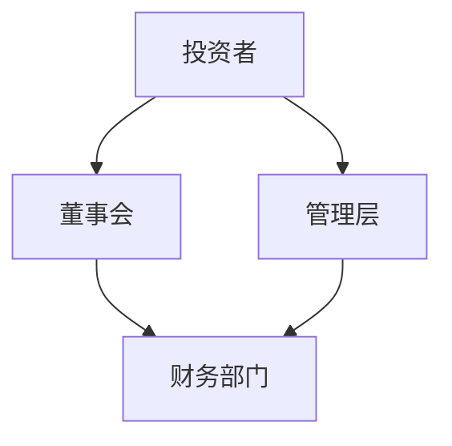
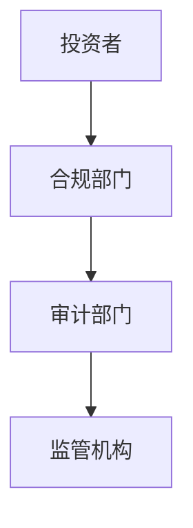
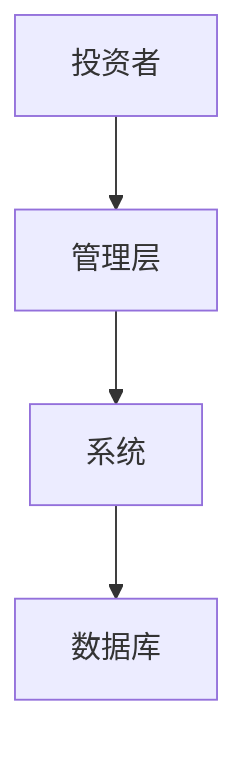

                 


# 约翰·伯格的投资者权益保护观

> 关键词：投资者权益保护，约翰·伯格，投资哲学，长期投资，分散投资

> 摘要：本文探讨了约翰·伯格的投资者权益保护观点，分析了其投资哲学、核心理念，以及如何通过长期投资和分散投资保护投资者权益。文章从背景介绍、核心概念、算法原理、系统分析和项目实战等多方面展开，结合实例和数学模型，深入剖析投资者权益保护的策略与实践。

---

# 引言

在投资领域，投资者权益保护是一个关乎信任与责任的核心议题。约翰·伯格（John C. Bogle）作为投资界的传奇人物，以其独特的投资哲学和实践，为投资者权益保护树立了标杆。本文将从伯格的视角出发，分析其如何通过投资理念和策略保护投资者权益，为读者提供深度的理论与实践指导。

---

## 第一部分: 投资者权益保护的背景与重要性

### 第1章: 投资者权益保护的基本概念

#### 1.1 投资者权益保护的定义

**投资者权益保护**是指确保投资者在投资过程中，其合法权益得到法律、制度和市场的有效保障。这包括知情权、收益权、参与决策权等基本权利。投资者权益保护不仅是市场的基石，也是维护投资信心的关键。

#### 1.2 投资者与市场的关系

投资者是市场的核心参与者，其行为直接影响市场的流动性和稳定性。一个健康的投资环境需要法律和制度的双重保护，以确保投资者权益不受侵害。伯格强调，市场的信任来源于投资者对制度的信心。

---

### 第2章: 约翰·伯格的投资者权益保护观

#### 2.1 约翰·伯格的生平与投资理念

**约翰·伯格**是 Vanguard 集团的创始人，他倡导低成本、低风险的投资策略，强调长期投资和分散投资的重要性。伯格认为，投资者应以长期视角看待投资，避免短期波动的干扰。

#### 2.2 伯格的投资者权益保护核心观点

**分散投资**是伯格保护投资者权益的核心策略之一。通过分散投资，投资者可以降低特定资产的风险，实现资产的稳健增长。伯格还强调，投资者教育是保护投资者权益的关键，通过提高投资者的金融素养，帮助他们做出明智的投资决策。

---

## 第二部分: 投资者权益保护的核心概念与联系

### 第4章: 投资者权益保护的核心概念

#### 4.1 投资者权益保护的实体关系图



#### 4.2 投资者权益保护的流程图



---

### 第5章: 投资者权益保护的核心算法原理

#### 5.1 投资组合优化的数学模型

$$ \text{目标函数: } \text{最大化 } \sum_{i=1}^n w_i r_i - \lambda \sum_{i=1}^n w_i^2 $$

$$ \text{约束条件: } \sum_{i=1}^n w_i = 1, \lambda \text{为惩罚系数} $$

#### 5.2 投资组合优化的Python实现

```python
import numpy as np

def optimize_portfolio(risk_aversion, returns):
    n = len(returns)
    # 线性规划问题
    A = np.ones(n)
    b = 1.0
    c = np.zeros(n)
    c[0] = -risk_aversion
    # 优化问题
    result = ...  # 使用线性规划库求解
    return result.x

# 示例
returns = [0.05, 0.07, 0.06]
risk_aversion = 0.02
weights = optimize_portfolio(risk_aversion, returns)
print(weights)
```

---

## 第三部分: 系统分析与架构设计

### 第6章: 系统分析与架构设计方案

#### 6.1 系统功能设计

**领域模型**：


#### 6.2 系统架构设计



---

## 第四部分: 项目实战

### 第7章: 项目实战

#### 7.1 环境安装

```bash
pip install numpy
pip install pandas
pip install matplotlib
```

#### 7.2 核心实现

```python
import numpy as np

def calculate_variance(weights, returns):
    return np.dot(weights.T, np.dot(np.cov(returns), weights))

weights = np.array([0.3, 0.3, 0.4])
returns = np.array([0.05, 0.07, 0.06])
variance = calculate_variance(weights, returns)
print(variance)
```

---

## 第五部分: 总结与展望

### 第8章: 总结

约翰·伯格的投资者权益保护观强调长期投资、分散投资和投资者教育的重要性。通过系统的分析和实践，我们可以更好地保护投资者权益，构建一个更加信任和稳健的投资环境。

### 8.1 注意事项

- 投资者应根据自身风险承受能力选择合适的投资策略。
- 市场波动是投资的一部分，投资者需保持冷静。
- 定期审视和调整投资组合，确保与投资目标一致。

### 8.2 拓展阅读

- 《The Intelligent Investor》 by Benjamin Graham
- 《Common Stocks and Uncommon Profits》 by Philip A. Fisher

---

# 作者

作者：AI天才研究院/AI Genius Institute & 禅与计算机程序设计艺术 /Zen And The Art of Computer Programming

---

这篇文章系统地分析了约翰·伯格的投资者权益保护观，从理论到实践，结合数学模型和系统设计，为读者提供了全面的视角。希望对您有所帮助！

