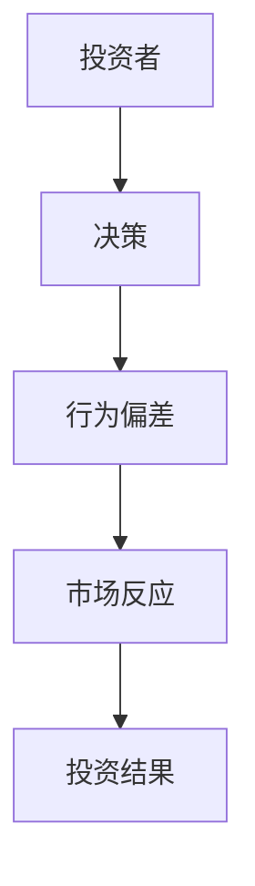

                 


# 约翰·伯格的投资者行为偏差研究

> 关键词：投资者行为偏差，行为金融学，约翰·伯格，投资决策，心理偏差

> 摘要：本文系统地探讨了约翰·伯格提出的投资者行为偏差理论，分析了行为偏差对投资决策的影响，结合算法和数学模型，提出了行为偏差的识别、预测和纠正方法，并通过实际案例展示了如何在投资实践中应用这些理论。

---

## 第一部分: 投资者行为偏差的背景与核心概念

### 第1章: 投资者行为偏差的背景介绍

#### 1.1 投资者行为偏差的定义与问题背景

- **1.1.1 投资者行为偏差的定义**  
  投资者行为偏差是指投资者在决策过程中由于心理、情感或认知的局限性，导致偏离理性投资决策的现象。

- **1.1.2 行为偏差对投资决策的影响**  
  行为偏差可能导致投资者做出非理性的投资决策，如过度交易、从众心理、避免损失等，这些偏差会显著影响投资收益和风险。

- **1.1.3 投资者行为偏差的研究意义**  
  研究行为偏差有助于投资者认识到自身决策中的非理性因素，从而改进投资策略，提高投资绩效。

#### 1.2 投资者行为偏差的分类与特征

- **1.2.1 基本的投资者行为偏差类型**  
  - 过度自信偏差（Overconfidence）  
  - 从众心理偏差（Conformity）  
  - 避免损失偏差（Loss Aversion）  
  - 心理会计偏差（Mental Accounting）  
  - 过度反应偏差（Overreaction）  

- **1.2.2 行为偏差的特征分析**  
  - 时间依赖性：行为偏差可能随时间变化，例如市场波动会加剧某些偏差的影响。  
  - 情境依赖性：不同市场环境和投资产品可能导致不同的行为偏差表现。  
  - 个体差异性：投资者的性格、经验、风险偏好等因素会影响行为偏差的表现。

- **1.2.3 偏差之间的相互关系**  
  不同的行为偏差可能相互作用，例如过度自信可能导致从众心理，而从众心理又可能加剧避免损失偏差。

### 第2章: 投资者行为偏差的核心概念与联系

#### 2.1 行为偏差的核心原理

- **2.1.1 心理学基础**  
  行为偏差源于人类心理机制的局限性，如认知偏差、情绪偏差等。  
  - 认知偏差：例如确认偏差（Confirmation Bias）、可得性偏差（Availability Bias）。  
  - 情绪偏差：例如恐惧和贪婪导致的非理性决策。

- **2.1.2 行为金融学基础**  
  行为金融学（Behavioral Finance）研究投资者心理和行为对金融市场的影响，认为投资者并非总是理性的。

- **2.1.3 偏差与决策的关系**  
  偏差通过影响投资者的信息处理、决策权重和风险评估，最终影响投资决策。

#### 2.2 行为偏差的属性特征对比

- **2.2.1 偏差类型对比表**

| 偏差类型         | 描述                              | 常见表现                          |
|------------------|-----------------------------------|-----------------------------------|
| 过度自信偏差     | 投资者过度相信自己的判断能力      | 频繁交易，忽视风险                 |
| 从众心理偏差     | 投资者跟随市场潮流                | 跟风购买热门股票                   |
| 避免损失偏差     | 投资者厌恶损失，避免亏损          | 抛售亏损股票，避免进一步损失       |
| 心理会计偏差     | 投资者将资金分割，影响决策        | 将资金分成不同“账户”进行操作       |
| 过度反应偏差     | 投资者对市场信息反应过度          | 市场利好时大幅加仓，利好消退后迅速抛售 |

- **2.2.2 偏差强度分析**  
  不同投资者的行为偏差强度不同，这可能与他们的性格、投资经验、风险偏好等因素有关。

- **2.2.3 偏差的影响因素**  
  - 市场环境：牛市可能导致过度自信，熊市可能导致从众心理。  
  - 信息来源：虚假信息或误导性报道可能加剧偏差。  
  - 社交影响：社交媒体和专家意见可能强化从众心理。

#### 2.3 投资者行为偏差的ER实体关系图



---

## 第二部分: 投资者行为偏差的算法与数学模型

### 第3章: 投资者行为偏差的算法原理

#### 3.1 行为偏差的识别算法

- **3.1.1 基于历史数据的行为偏差识别**  
  通过分析投资者的历史交易记录，识别是否存在特定的行为偏差。例如，频繁交易可能表明过度自信偏差。

- **3.1.2 基于机器学习的行为偏差检测**  
  使用监督学习算法（如随机森林、神经网络）训练模型，识别投资者的行为偏差类型。

- **3.1.3 基于统计学的行为偏差分析**  
  使用统计方法（如均值-方差分析）检测投资者决策中的偏差。

#### 3.2 偏差影响的预测算法

- **3.2.1 时间序列分析**  
  使用ARIMA模型预测偏差对投资收益的影响。

- **3.2.2 预测模型构建**  
  构建多元回归模型，预测偏差对投资决策的影响。

- **3.2.3 偏差对投资结果的预测**  
  通过模拟不同偏差情景，预测投资结果的变化。

#### 3.3 偏差纠正的算法设计

- **3.3.1 基于反馈的纠正算法**  
  通过反馈机制调整投资者的决策，减少偏差影响。

- **3.3.2 基于强化学习的纠正策略**  
  使用强化学习算法，优化投资者的决策策略，减少偏差。

- **3.3.3 基于规则的纠正机制**  
  设定规则（如限制频繁交易）来纠正偏差。

### 第4章: 投资者行为偏差的数学模型与公式

#### 4.1 偏差识别的数学模型

- **4.1.1 基于概率论的偏差识别公式**  
  $$ P(B|D) = \frac{P(D|B)P(B)}{P(D)} $$  
  其中，\( P(B|D) \) 是在观测到数据 \( D \) 的情况下，存在行为偏差 \( B \) 的概率。

- **4.1.2 基于回归分析的偏差预测模型**  
  $$ y = \beta_0 + \beta_1x_1 + \beta_2x_2 + \cdots + \beta_nx_n + \epsilon $$  
  其中，\( y \) 是投资收益，\( x_i \) 是行为偏差相关变量，\( \epsilon \) 是误差项。

#### 4.2 偏差影响的数学公式

- **4.2.1 偏差对投资收益的影响公式**  
  $$ R = R_f + \alpha + \beta(R_m - R_f) $$  
  其中，\( R \) 是投资收益，\( R_f \) 是无风险利率，\( \alpha \) 是超额收益，\( \beta \) 是系统性风险系数，\( R_m \) 是市场收益。

- **4.2.2 偏差对风险偏好影响的公式**  
  $$ \text{风险偏好} = \frac{\text{收益} - \text{期望收益}}{\text{标准差}} $$  

---

## 第三部分: 投资者行为偏差的系统分析与架构设计

### 第5章: 系统分析与架构设计方案

#### 5.1 问题场景介绍

- **5.1.1 投资者行为偏差识别系统场景**  
  通过分析投资者的交易行为，识别是否存在行为偏差，并给出改进建议。

#### 5.2 系统功能设计

- **5.2.1 领域模型设计**  
  ```mermaid
  classDiagram
      class 投资者 {
          ID: 整数
          名称: 字符串
          账户余额: 数值
      }
      class 行为偏差 {
          偏差类型: 字符串
          偏差强度: 数值
      }
      class 市场反应 {
          市场指数: 数值
          交易量: 数值
      }
      投资者 --> 行为偏差: 引发
      行为偏差 --> 市场反应: 影响
  ```

- **5.2.2 系统架构设计**  
  ```mermaid
  architecture
      [投资者行为偏差识别系统] 
      [投资者交易数据] --> [数据预处理模块] --> [偏差识别模块] --> [市场反应预测模块] --> [投资建议模块] 
  ```

- **5.2.3 系统接口设计**  
  - 输入接口：投资者交易数据、市场数据。  
  - 输出接口：偏差识别结果、投资建议。

- **5.2.4 系统交互流程**  
  ```mermaid
  sequenceDiagram
      投资者 -> 数据预处理模块: 提供交易数据
      数据预处理模块 -> 偏差识别模块: 提供处理后的数据
      偏差识别模块 -> 市场反应预测模块: 提供偏差识别结果
      市场反应预测模块 -> 投资建议模块: 提供预测结果
      投资建议模块 -> 投资者: 提供投资建议
  ```

---

## 第四部分: 投资者行为偏差的项目实战

### 第6章: 项目实战

#### 6.1 环境安装与配置

- **6.1.1 环境需求**  
  - Python 3.8+  
  - 数据库：MySQL 或 PostgreSQL  
  - 开发工具：PyCharm 或 VS Code  

- **6.1.2 安装依赖**  
  - pip install numpy pandas scikit-learn matplotlib

#### 6.2 系统核心实现源代码

- **6.2.1 数据预处理代码**  
  ```python
  import pandas as pd

  # 加载数据
  df = pd.read_csv('交易数据.csv')
  # 数据清洗
  df.dropna(inplace=True)
  df = df.astype({'ID': 'int64', '名称': 'string', '账户余额': 'float64'})
  ```

- **6.2.2 偏差识别代码**  
  ```python
  from sklearn.ensemble import RandomForestClassifier

  # 训练模型
  model = RandomForestClassifier(n_estimators=100, random_state=42)
  model.fit(X_train, y_train)
  # 预测偏差
  y_pred = model.predict(X_test)
  ```

- **6.2.3 投资建议代码**  
  ```python
  import numpy as np

  # 生成投资建议
 建议 = np.where(概率 > 0.5, '买入', '卖出')
  ```

#### 6.3 实际案例分析

- **6.3.1 案例介绍**  
  某投资者在2020年疫情期间频繁卖出股票，表现出明显的避免损失偏差。

- **6.3.2 数据分析与解读**  
  通过分析该投资者的历史交易数据，识别出其行为偏差，并预测其未来投资决策。

- **6.3.3 项目小结**  
  通过项目实战，验证了行为偏差识别算法的有效性，并提出了相应的纠正策略。

---

## 第五部分: 投资者行为偏差的最佳实践与小结

### 第7章: 最佳实践与小结

#### 7.1 最佳实践 tips

- 定期回顾投资决策，识别潜在的行为偏差。  
- 制定明确的投资计划，避免情绪化决策。  
- 使用工具和技术辅助，减少行为偏差的影响。

#### 7.2 小结

本文系统地探讨了约翰·伯格提出的投资者行为偏差理论，分析了行为偏差对投资决策的影响，并结合算法和数学模型，提出了行为偏差的识别、预测和纠正方法。通过实际案例展示了如何在投资实践中应用这些理论。

#### 7.3 注意事项

- 行为偏差的识别和纠正需要结合具体的投资环境和投资者的个性特征。  
- 投资者应保持理性，避免被情绪和市场噪声左右。

#### 7.4 拓展阅读

- 建议阅读《行为金融学》（Behavioral Finance）相关书籍，深入理解投资者心理与行为的关系。

---

## 作者信息

作者：AI天才研究院/AI Genius Institute & 禅与计算机程序设计艺术 /Zen And The Art of Computer Programming

