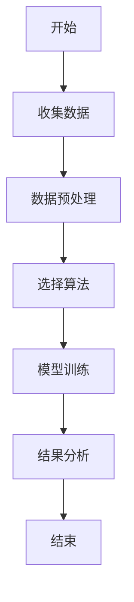

                 


# 《约翰·伯格的投资者行为分析》

> 关键词：投资者行为分析，约翰·伯格，价值投资，算法原理，系统架构

> 摘要：本文系统地分析了约翰·伯格的投资者行为分析方法，结合技术视角，详细探讨了其投资理念、行为模型、算法原理及系统架构，帮助读者深入理解其投资策略。

---

# 第一部分: 投资者行为分析基础

## 第1章: 投资者行为分析概述

### 1.1 投资者行为分析的核心概念

#### 1.1.1 投资者行为分析的定义

投资者行为分析是研究投资者在不同市场环境下的决策过程和行为模式，旨在揭示其行为背后的心理机制和逻辑。通过分析投资者的行为，可以帮助我们更好地理解市场动态和价格波动。

#### 1.1.2 投资者行为分析的背景与意义

在现代金融市场中，投资者的行为对市场走势有着重要影响。传统的市场分析方法往往忽视了投资者行为的复杂性，而约翰·伯格通过其独特的视角，为我们提供了一个全新的分析框架。

#### 1.1.3 约翰·伯格的投资者行为分析框架

伯格的投资理念强调长期价值和基本面分析，其行为分析框架包括以下几个方面：

1. **投资者心理分析**：研究投资者在不同市场环境下的心理变化。
2. **决策过程分析**：分析投资者在决策过程中的逻辑和步骤。
3. **行为模式识别**：识别投资者在特定市场条件下的行为模式。

---

### 1.2 约翰·伯格的投资理念

#### 1.2.1 价值投资的核心思想

伯格的价值投资理念强调以低于内在价值的价格购买优质资产，并长期持有。他认为，市场的短期波动并不影响资产的内在价值，投资者应关注企业的基本面，而非市场的短期波动。

#### 1.2.2 长期投资的重要性

伯格认为，短期交易容易受到市场情绪的影响，而长期投资能够帮助投资者避免短期波动的干扰，实现稳健的收益。

#### 1.2.3 投资者心理与行为的关联

伯格指出，投资者的心理和行为是影响投资决策的重要因素。例如，贪婪和恐惧常常导致投资者做出非理性的决策，从而影响投资结果。

---

### 1.3 投资者行为分析的边界与外延

#### 1.3.1 投资者行为分析的范围

投资者行为分析的范围包括以下几个方面：

1. **个体投资者行为**：分析单个投资者的行为模式。
2. **群体投资者行为**：研究投资者群体的行为特征。
3. **市场行为分析**：从整体市场角度分析投资者行为对市场的影响。

#### 1.3.2 相关领域的区别与联系

投资者行为分析与心理学、经济学、金融学等领域密切相关。例如，心理学研究投资者的心理机制，经济学分析市场的整体行为，而金融学则关注投资者行为对资产价格的影响。

#### 1.3.3 核心要素与组成结构

投资者行为分析的核心要素包括：

1. **投资者心理**：分析投资者的心理状态。
2. **决策过程**：研究投资者的决策逻辑。
3. **行为模式**：识别投资者在不同环境下的行为特征。

---

## 1.4 本章小结

本章通过介绍投资者行为分析的核心概念、约翰·伯格的投资理念以及投资者行为分析的边界与外延，为后续分析奠定了基础。下章将深入探讨投资者行为分析的核心原理。

---

# 第二部分: 投资者行为分析的核心概念与联系

## 第2章: 投资者行为分析的核心原理

### 2.1 投资者行为分析的原理

#### 2.1.1 投资者心理与决策过程

投资者的心理和决策过程是行为分析的核心。伯格认为，投资者的决策过程受到心理因素的严重影响，例如贪婪和恐惧常常导致投资者做出错误的决策。

#### 2.1.2 行为偏差与认知错误

投资者在决策过程中常常会受到行为偏差和认知错误的影响。例如，过度自信会导致投资者低估风险，而从众心理则可能导致投资者盲目跟风。

#### 2.1.3 约翰·伯格的投资者行为模型

伯格提出了一个投资者行为模型，包括以下几个步骤：

1. **信息收集**：投资者收集与投资相关的各种信息。
2. **信息处理**：投资者对收集到的信息进行加工和分析。
3. **决策制定**：投资者基于信息和心理因素做出投资决策。
4. **行为执行**：投资者根据决策采取行动。

---

### 2.2 投资者行为分析的概念属性对比

#### 2.2.1 不同投资者行为的特征对比

投资者行为可以分为不同类型，例如：

1. **价值投资者**：注重资产的内在价值，长期持有优质资产。
2. **趋势投资者**：关注市场趋势，追求短期收益。
3. **情绪化投资者**：受市场情绪影响，决策往往非理性。

#### 2.2.2 投资者行为与市场反应的关系

投资者行为与市场反应密切相关。例如，当投资者情绪乐观时，市场往往上涨；当投资者情绪悲观时，市场往往下跌。

#### 2.2.3 投资者行为分析的维度与层次

投资者行为分析可以从以下几个维度进行：

1. **个体层面**：分析单个投资者的行为。
2. **群体层面**：研究投资者群体的行为特征。
3. **市场层面**：分析市场整体的行为。

---

### 2.3 实体关系图与流程图

#### 2.3.1 投资者行为分析的ER实体关系图

```mermaid
er
  actor: 投资者
  action: 投资行为
  outcome: 投资结果
  relation: 参与
```

#### 2.3.2 投资者行为分析的流程图


---

## 2.4 本章小结

本章通过分析投资者行为的核心原理，探讨了投资者心理、行为偏差以及伯格的投资者行为模型。同时，通过概念属性对比和实体关系图，帮助读者更好地理解投资者行为分析的结构与内容。

---

# 第三部分: 投资者行为分析的算法原理

## 第3章: 投资者行为分析的算法原理

### 3.1 投资者行为分析的算法概述

#### 3.1.1 约翰·伯格的算法思想

伯格的投资者行为分析方法可以看作是一种基于价值的投资算法。他强调通过基本面分析，选择具有持续盈利能力的优质企业，并以合理的价格进行投资。

#### 3.1.2 投资者行为分析的常用算法

投资者行为分析常用的算法包括：

1. **价值评估模型**：基于企业基本面数据，评估其内在价值。
2. **情绪指标分析**：通过市场情绪指标，判断投资者的心理状态。
3. **行为回归分析**：通过统计方法，分析投资者行为与市场表现之间的关系。

#### 3.1.3 算法选择与优化

选择合适的算法需要考虑数据特征、分析目标以及计算效率等因素。例如，对于时间序列数据，可以采用回归分析或时间序列模型。

---

### 3.2 投资者行为分析的数学模型

#### 3.2.1 投资者行为的数学表达

投资者行为可以用以下数学模型进行描述：

$$
V = \sum_{i=1}^{n} w_i x_i
$$

其中，\( V \) 表示投资组合的总价值，\( w_i \) 表示第 \( i \) 种资产的权重，\( x_i \) 表示第 \( i \) 种资产的价格。

#### 3.2.2 算法流程图



---

## 3.3 本章小结

本章通过介绍投资者行为分析的算法原理，探讨了伯格的算法思想以及常用的数学模型。通过流程图和数学公式的展示，帮助读者更好地理解投资者行为分析的技术实现。

---

通过以上目录大纲，我们可以看到《约翰·伯格的投资者行为分析》一书将从背景介绍、核心概念、算法原理等多个方面，系统地探讨投资者行为分析的方法与实践。读者可以通过本书深入理解约翰·伯格的投资理念，并掌握投资者行为分析的技术实现方法。

