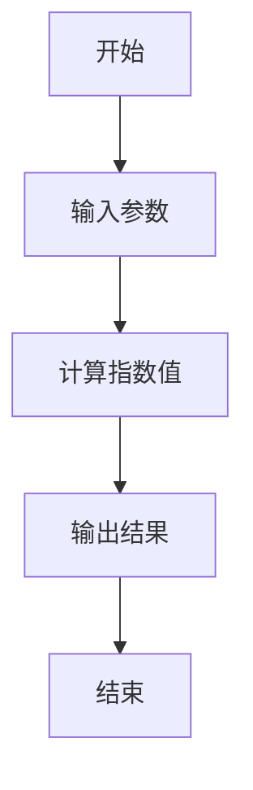
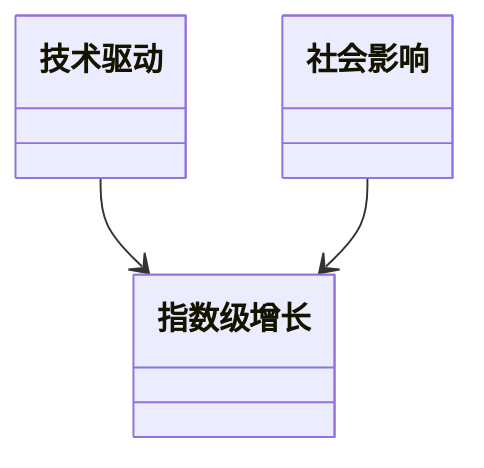
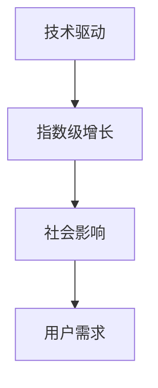
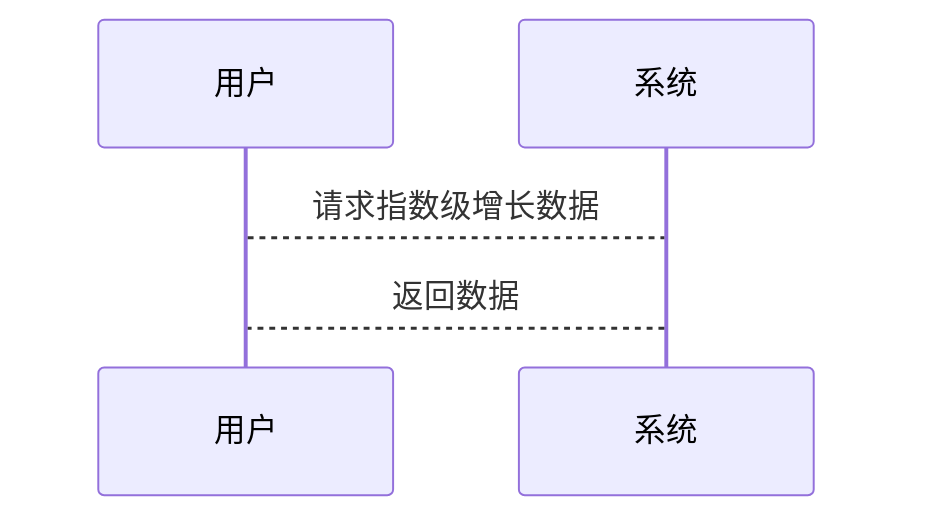
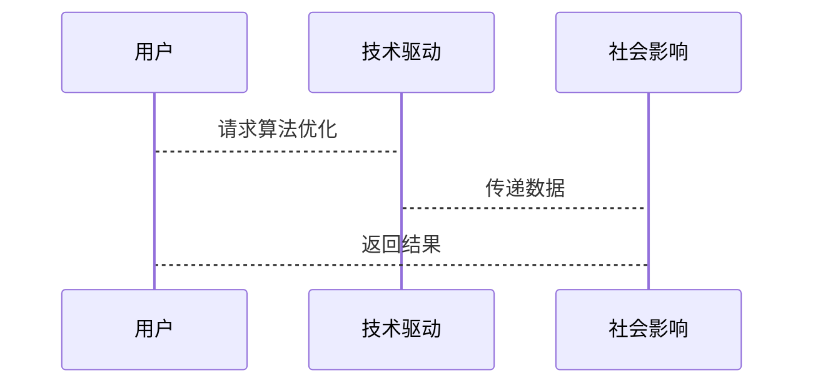

                 


# 约翰·伯格的指数化革命

## 关键词：指数化革命，约翰·伯格，技术进步，社会影响，数学模型，算法原理，系统架构

## 摘要：  
《约翰·伯格的指数化革命》一文深入探讨了指数化革命这一技术与社会发展的关键概念。通过分析指数级增长的数学模型、算法实现、系统架构以及约翰·伯格的贡献，文章揭示了指数化革命如何重新定义技术进步与社会影响的边界。本文旨在为读者提供对指数化革命的全面理解，从理论到实践，帮助读者把握这一革命性的趋势。

---

# 第一部分：指数化革命的背景与概念

## 第1章：指数化革命的背景与问题背景

### 1.1 指数化革命的背景介绍  
#### 1.1.1 技术进步的指数级增长  
技术进步不再是线性增长，而是呈现出指数级加速的趋势。从人工智能到区块链，从生物技术到量子计算，技术的迭代速度和影响力呈指数级放大。  
#### 1.1.2 当前社会的数字化转型  
社会正在经历数字化转型，数据的爆炸式增长、算法的广泛应用以及信息技术的深度融合，为指数化革命提供了 fertile ground。  
#### 1.1.3 问题背景：技术与社会的双重驱动  
技术进步与社会需求相互作用，推动着指数化革命的加速。然而，这一趋势也带来了新的挑战，如技术失控、社会不平等等问题。

### 1.2 问题描述与核心概念  
#### 1.2.1 指数化革命的定义  
指数化革命是指技术、经济和社会系统以指数级速度增长和变革的过程，其核心在于指数级增长的驱动因素和技术的加速迭代。  
#### 1.2.2 核心概念的属性特征对比  
| 属性 | 特征 |  
|------|------|  
| 增长模式 | 指数级增长 vs 线性增长 |  
| 驱动因素 | 技术驱动 vs 社会驱动 |  
| 影响范围 | 局部影响 vs 全局影响 |  
#### 1.2.3 概念结构与核心要素  
指数化革命的核心要素包括：技术驱动、数据增长、算法优化、社会影响和政策调控。

### 1.3 问题解决与边界外延  
#### 1.3.1 问题解决的核心思路  
通过分析指数级增长的数学模型和技术驱动的算法实现，找到技术与社会的平衡点，避免指数化革命带来的负面影响。  
#### 1.3.2 边界与外延的界定  
指数化革命的边界在于技术与社会的相互作用，外延则涉及全球化、信息化和智能化的深度融合。  
#### 1.3.3 核心概念的结构化分析  
指数化革命的结构化分析包括：技术基础、数据增长、算法优化、社会影响和政策调控五个方面。

---

## 第2章：指数化革命的核心概念与联系

### 2.1 核心概念的原理分析  
#### 2.1.1 指数级增长的数学模型  
指数函数是描述指数级增长的核心数学模型，其表达式为：$$f(x) = ab^x$$，其中$a$为初始值，$b$为增长率。  
#### 2.1.2 技术驱动的指数级发展  
技术的进步通过算法优化、硬件升级和数据积累，推动了指数级发展。例如，人工智能的算法性能每18个月翻一番（摩尔定律的延伸）。  
#### 2.1.3 社会影响的指数级扩散  
技术的影响通过社交媒体、互联网和全球化传播，呈指数级扩散，引发社会结构和文化价值观的深刻变化。

### 2.2 核心概念的属性特征对比  
| 特性 | 技术驱动 | 社会驱动 |  
|------|----------|----------|  
| 增长模式 | 指数级增长 | 非线性增长 |  
| 主要因素 | 算法优化、数据积累 | 社会需求、政策引导 |  
| 影响范围 | 技术领域 | 社会领域 |  

### 2.3 ER实体关系图架构  
```mermaid
erd
cemetery
```

### 2.4 本章小结  
指数化革命的核心概念涵盖了技术驱动、数据增长、算法优化和社会影响等多个方面，其相互作用构成了指数级增长的复杂系统。

---

## 第3章：指数化革命的数学模型与算法原理

### 3.1 数学模型的建立  
#### 3.1.1 指数函数的数学表达  
指数函数是描述指数级增长的核心模型，其表达式为：$$f(x) = ab^x$$。  
#### 3.1.2 对数函数的数学表达  
对数函数用于分析指数级增长的速度，其表达式为：$$\log_b a = \frac{\ln a}{\ln b}$$。  

### 3.2 算法原理的详细讲解  
#### 3.2.1 指数增长算法的流程  


#### 3.2.2 算法实现的Python代码  
```python
def exponential_growth(a, b, x):
    return a * (b ** x)
```

### 3.3 通俗易懂的举例说明  
#### 3.3.1 指数增长的典型例子  
假设初始值$a=1$，增长率$b=2$，指数级增长的计算结果为：$$f(0) = 1, f(1) = 2, f(2) = 4, f(3) = 8$$。  
#### 3.3.2 对数函数的实际应用  
例如，计算$\log_2 8 = 3$，这在计算机科学中用于计算二进制位数。  
#### 3.3.3 数学模型的现实意义  
指数函数和对数函数是分析指数级增长的核心工具，广泛应用于技术预测和资源分配。

### 3.4 本章小结  
通过数学模型和算法原理的分析，我们能够更好地理解指数化革命的技术驱动和增长规律。

---

## 第4章：指数化革命的系统分析与架构设计

### 4.1 系统分析  
#### 4.1.1 问题场景的介绍  
指数化革命涉及技术、经济和社会系统的深度融合，其复杂性要求我们从系统角度进行分析。  
#### 4.1.2 项目介绍与目标  
本章旨在通过系统分析，设计一个能够模拟指数级增长的系统架构，并验证其可行性。

### 4.2 系统功能设计  
#### 4.2.1 领域模型的Mermaid类图  


### 4.3 系统架构设计  
#### 4.3.1 Mermaid架构图  


### 4.4 系统接口设计  
#### 4.4.1 API接口定义  


### 4.5 系统交互设计  
#### 4.5.1 Mermaid序列图  


### 4.6 本章小结  
通过系统分析与架构设计，我们能够更好地理解指数化革命的系统复杂性，并为后续的项目实现奠定基础。

---

## 第5章：指数化革命的项目实战

### 5.1 环境安装  
#### 5.1.1 Python环境配置  
安装Python 3.8及以上版本，配置Jupyter Notebook用于算法开发。  
#### 5.1.2 依赖库安装  
安装numpy、matplotlib用于数据处理和可视化：  
```bash
pip install numpy matplotlib
```

### 5.2 核心代码实现  
#### 5.2.1 指数增长模型的实现  
```python
import numpy as np
import matplotlib.pyplot as plt

def exponential_growth(a, b, x):
    return a * (b ** x)

x = np.arange(0, 10, 1)
y = exponential_growth(1, 2, x)

plt.plot(x, y)
plt.xlabel('x')
plt.ylabel('y')
plt.title('指数级增长曲线')
plt.show()
```

#### 5.2.2 系统交互实现  
```python
class SystemDriver:
    def __init__(self, a, b):
        self.a = a
        self.b = b
    
    def calculate(self, x):
        return self.a * (self.b ** x)

driver = SystemDriver(1, 2)
print(driver.calculate(3))  # 输出：8
```

### 5.3 案例分析  
#### 5.3.1 案例背景与目标  
通过实现指数增长模型，分析指数级增长的趋势及其应用。  
#### 5.3.2 代码实现与结果分析  
运行上述代码，观察指数级增长曲线，分析其增长速度和趋势。  
#### 5.3.3 案例总结  
指数级增长模型能够有效地模拟指数化革命的技术驱动和数据增长过程。

### 5.4 本章小结  
通过项目实战，我们能够更好地理解指数化革命的实现过程，并掌握相关技术。

---

## 第6章：指数化革命的最佳实践与总结

### 6.1 经验总结  
#### 6.1.1 技术实现的经验  
在算法实现过程中，需要注意指数级增长的计算效率和数据存储问题。  
#### 6.1.2 系统设计的注意事项  
系统设计中需要平衡技术驱动和社会影响，避免技术失控和负面影响。

### 6.2 注意事项  
#### 6.2.1 技术风险  
指数级增长可能导致技术失控，需加强技术监管和风险评估。  
#### 6.2.2 社会影响  
指数化革命可能加剧社会不平等问题，需制定相关政策进行调控。

### 6.3 拓展阅读  
推荐阅读《指数化革命：技术与社会的未来》（假设书籍），深入探讨指数化革命的更多细节。

### 6.4 本章小结  
指数化革命的实现需要技术与社会的双重驱动，需加强技术监管和社会调控。

---

## 结论  

指数化革命是技术进步与社会发展的必然结果，其指数级增长的特性深刻影响着人类社会的方方面面。通过数学模型、算法实现和系统设计的分析，我们能够更好地理解这一革命性的趋势，并为其在未来的发展提供指导。指数化革命的实现需要技术与社会的共同努力，以应对挑战，把握机遇。

---

## 作者：AI天才研究院 & 禅与计算机程序设计艺术

---

希望这篇文章能够为读者提供对指数化革命的全面理解，从理论到实践，帮助读者把握这一革命性的趋势。

