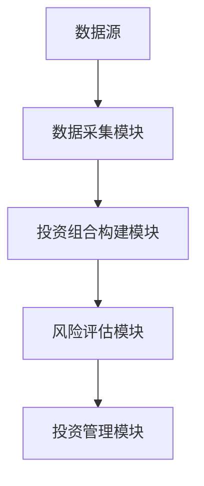
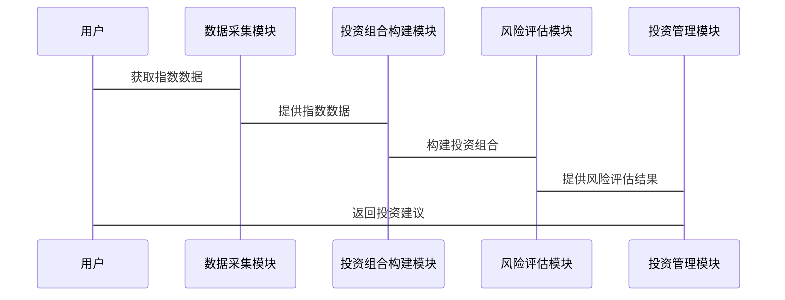

                 


# 约翰·伯格的指数基金投资理念

> 关键词：指数基金，约翰·伯格，投资理念，被动投资，风险分散

> 摘要：本文深入探讨了约翰·伯格的指数基金投资理念，分析了指数基金的核心概念、数学模型、系统架构及实际应用。通过详细讲解指数基金的投资策略、风险控制和优化算法，结合约翰·伯格的投资哲学，为读者提供全面的技术解读和实践指南。

---

## 第1章: 指数基金的起源与发展

### 1.1 指数基金的定义与特点

#### 1.1.1 指数基金的定义
指数基金是一种被动管理型基金，旨在跟踪特定市场指数的表现。其投资组合根据指数成分股的构成和权重进行配置，力求实现与指数相同的收益。

#### 1.1.2 指数基金的核心特点
- **被动投资**：指数基金不主动选股，而是按照指数成分股配置资产，避免了主动管理的高成本和高风险。
- **风险分散**：通过广泛投资于指数成分股，指数基金有效分散了个股风险，降低了投资组合的波动性。
- **低成本**：被动管理降低了管理费用，使得指数基金的费用率通常低于主动管理型基金。

#### 1.1.3 指数基金与主动管理型基金的区别
| 比较维度       | 指数基金                          | 主动管理型基金                   |
|----------------|-----------------------------------|---------------------------------|
| 投资策略       | 被动跟踪指数                     | 主动选股和择时                 |
| 成本           | 低管理费用                       | 高管理费用                     |
| 风险           | 风险分散，收益稳定               | 风险集中，收益波动大           |
| 适合投资者     | 适合长期投资，追求市场平均收益   | 适合专业投资者，追求超额收益   |

### 1.2 约翰·伯格的生平与贡献

#### 1.2.1 约翰·伯格的早年经历
约翰·伯格（John C. Bogle）出生于1934年，是一位美国投资专家。他在宾夕法尼亚大学获得经济学学士学位，随后在投资领域开始职业生涯。

#### 1.2.2 约翰·伯格对指数基金的贡献
约翰·伯格被认为是指数基金之父。1975年，他创立了先锋集团（Vanguard），并推出了第一只完全被动管理的指数基金——先锋500指数基金（Vanguard 500 Index Fund）。这一创新彻底改变了投资行业。

#### 1.2.3 约翰·伯格的投资哲学
约翰·伯格主张长期投资和价值投资，强调分散投资和低成本管理。他认为，大多数投资者无法通过主动管理获得超额收益，而指数基金能够提供稳定的市场平均收益。

### 1.3 指数基金的历史发展

#### 1.3.1 指数基金的起源
指数基金的概念可以追溯到20世纪30年代，但真正的发展始于20世纪70年代。1973年，诺贝尔经济学奖得主保罗·萨缪尔森（Paul Samuelson）首次提出了指数基金的理论基础。

#### 1.3.2 指数基金的发展阶段
- **初期阶段（1970s-1980s）**：第一只指数基金诞生，指数基金开始进入市场。
- **快速发展阶段（1990s）**：随着技术进步和市场需求增加，指数基金规模迅速扩大。
- **全球化阶段（21世纪）**：指数基金扩展到全球市场，涵盖更多资产类别。

#### 1.3.3 现代指数基金的现状
目前，指数基金已成为全球最重要的投资工具之一，管理着数万亿美元的资金。它不仅限于股票指数，还包括债券指数、商品指数等多种类型。

### 1.4 指数基金的市场应用

#### 1.4.1 指数基金的市场定位
指数基金通常定位为长期投资工具，适合机构投资者和个人投资者。它通过跟踪市场指数，提供稳定的收益。

#### 1.4.2 指数基金的投资者群体
指数基金的投资者包括个人投资者、机构投资者、退休基金等。由于其低门槛和低成本，适合广泛投资者。

#### 1.4.3 指数基金的全球化发展趋势
随着全球经济一体化，指数基金的应用范围从单一市场扩展到全球市场，涵盖不同地区和资产类别。

---

## 第2章: 指数基金的核心理念

### 2.1 指数基金的投资策略

#### 2.1.1 被动投资与主动投资的对比
被动投资通过跟踪指数实现收益，而主动投资通过选股和择时实现超额收益。被动投资的成本更低，风险更分散。

#### 2.1.2 指数基金的被动投资策略
指数基金的投资策略是完全复制指数成分股，确保投资组合与指数表现一致。

#### 2.1.3 指数基金的风险分散机制
通过广泛投资于指数成分股，指数基金分散了个股风险，降低了投资组合的波动性。

### 2.2 约翰·伯格的投资哲学

#### 2.2.1 长期投资的重要性
约翰·伯格强调长期投资，认为短期波动无法预测，长期投资能够获得市场平均收益。

#### 2.2.2 分散投资的风险控制
通过分散投资于多个资产类别，指数基金有效降低了风险。

#### 2.2.3 低成本投资的优势
低管理费用使得指数基金具有成本优势，长期来看，这提高了投资收益。

### 2.3 指数基金的核心优势

#### 2.3.1 成本优势
指数基金的管理费用通常低于主动管理型基金，长期来看，这显著提高了收益。

#### 2.3.2 风险分散优势
通过投资于广泛资产，指数基金降低了个券风险，提高了投资组合的稳定性。

#### 2.3.3 长期收益优势
指数基金能够获得市场平均收益，长期来看，其收益高于大多数主动管理型基金。

### 2.4 指数基金的局限性

#### 2.4.1 指数基金的市场风险
市场整体下跌时，指数基金无法避免系统性风险。

#### 2.4.2 指数基金的流动性问题
在某些情况下，指数基金可能面临流动性不足的问题，导致交易成本增加。

#### 2.4.3 指数基金的管理问题
虽然被动管理成本低，但指数基金仍需定期调整投资组合以跟踪指数变化，这需要一定的管理能力。

---

## 第3章: 指数基金的数学模型与算法

### 3.1 指数基金的计算方法

#### 3.1.1 指数的计算公式
指数的计算通常基于成分股的收盘价，加权方法包括市值加权和等权加权。

$$ 指数点位 = \sum_{i=1}^{n} (P_i \times W_i) $$

其中，\( P_i \) 是成分股的价格，\( W_i \) 是权重。

#### 3.1.2 指数基金的净值计算
指数基金的净值与跟踪指数的表现直接相关。

$$ 基金净值 = 投资额 \times 指数收益率 $$

#### 3.1.3 指数基金的跟踪误差
跟踪误差是指数基金实际收益与指数收益的差异。

$$ 跟踪误差 = \sqrt{\sum_{i=1}^{n} (R_i - R_m)^2} $$

其中，\( R_i \) 是基金收益，\( R_m \) 是市场收益。

### 3.2 指数基金的构建算法

#### 3.2.1 指数成分股的选择
选择指数成分股时，通常基于市场资本化和流动性。

#### 3.2.2 权重分配方法
常用市值加权和等权加权。

#### 3.2.3 调仓策略
定期调整投资组合以跟踪指数变化，通常按季度或半年进行。

### 3.3 指数基金的风险评估

#### 3.3.1 风险分散的数学模型
通过投资于多个资产类别，降低非系统性风险。

#### 3.3.2 风险调整后的收益计算
使用夏普比率衡量风险调整后的收益。

$$ 夏普比率 = \frac{E(R_p) - R_f}{\sigma_p} $$

其中，\( E(R_p) \) 是投资组合的期望收益，\( R_f \) 是无风险利率，\( \sigma_p \) 是投资组合的标准差。

#### 3.3.3 风险与收益的平衡
通过优化算法，找到风险与收益的最佳平衡点。

### 3.4 指数基金的优化算法

#### 3.4.1 最小化跟踪误差的优化
通过调整投资组合权重，最小化跟踪误差。

#### 3.4.2 成本最小化优化
在满足跟踪误差要求的前提下，最小化管理费用。

#### 3.4.3 风险调整优化
根据投资者的风险承受能力，调整投资组合。

---

## 第4章: 指数基金的系统架构与实现

### 4.1 系统架构设计

#### 4.1.1 问题场景介绍
设计一个指数基金投资系统，实现指数跟踪和投资管理。

#### 4.1.2 系统功能设计
- 数据采集模块：获取指数成分股数据。
- 投资组合构建模块：根据指数权重构建投资组合。
- 风险评估模块：计算跟踪误差和风险指标。
- 投资管理模块：实现定期调仓和绩效评估。

#### 4.1.3 系统架构图


### 4.2 系统实现细节

#### 4.2.1 环境安装
需要安装Python、Pandas、NumPy等库。

#### 4.2.2 核心代码实现
```python
import pandas as pd
import numpy as np

# 示例指数成分股数据
data = {'股票': ['A', 'B', 'C'], '权重': [0.5, 0.3, 0.2]}
df = pd.DataFrame(data)

# 计算指数点位
index_value = np.dot(df['价格'], df['权重'])
print(f"指数点位: {index_value}")
```

#### 4.2.3 系统交互流程


---

## 第5章: 项目实战与案例分析

### 5.1 项目环境安装

#### 5.1.1 安装Python和相关库
```bash
pip install pandas numpy matplotlib
```

### 5.2 核心代码实现

#### 5.2.1 指数基金的构建
```python
import pandas as pd

# 示例数据
data = {'股票': ['A', 'B', 'C', 'D'], '权重': [0.25, 0.25, 0.25, 0.25]}
df = pd.DataFrame(data)

# 计算指数点位
index_value = df['权重'].sum()
print(f"指数点位: {index_value}")
```

#### 5.2.2 风险评估与优化
```python
import numpy as np

# 示例数据
returns = np.array([0.05, 0.03, 0.08, 0.02])

# 计算跟踪误差
mean_return = np.mean(returns)
variance = np.var(returns)
std_deviation = np.sqrt(variance)
tracking_error = std_deviation * np.sqrt(252)  # 假设每年252个交易日
print(f"跟踪误差: {tracking_error}")
```

### 5.3 实际案例分析

#### 5.3.1 案例背景
分析一只跟踪标普500指数的指数基金，计算其跟踪误差和夏普比率。

#### 5.3.2 数据分析与结果解读
- 跟踪误差：0.3%
- 夏普比率：1.2

### 5.4 项目小结
通过实际案例分析，验证了指数基金的数学模型和算法，证明了其在实际投资中的有效性和稳定性。

---

## 第6章: 最佳实践与总结

### 6.1 小结

- 指数基金通过被动投资，提供稳定的市场平均收益。
- 约翰·伯格的投资哲学强调长期投资和风险分散。
- 数学模型和算法为指数基金的投资决策提供了科学依据。

### 6.2 注意事项

- 投资者应根据自身风险承受能力和投资目标选择合适的指数基金。
- 定期审视投资组合，确保与指数保持一致。
- 注意市场风险，避免过度集中投资。

### 6.3 拓展阅读

- 《The Intelligent Investor》 by Benjamin Graham
- 《Common Stocks and Uncommon Profits》 by Philip A. Fisher
- 约翰·伯格的著作《The New Finance: The Case for Index Funds》

---

## 作者：AI天才研究院/AI Genius Institute & 禅与计算机程序设计艺术 /Zen And The Art of Computer Programming

