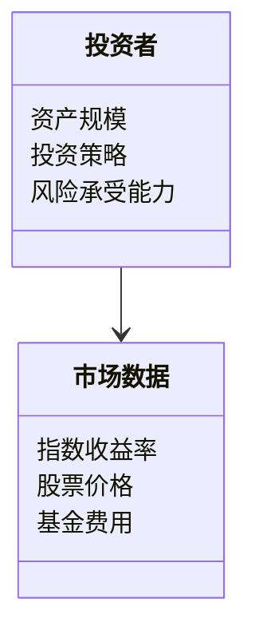
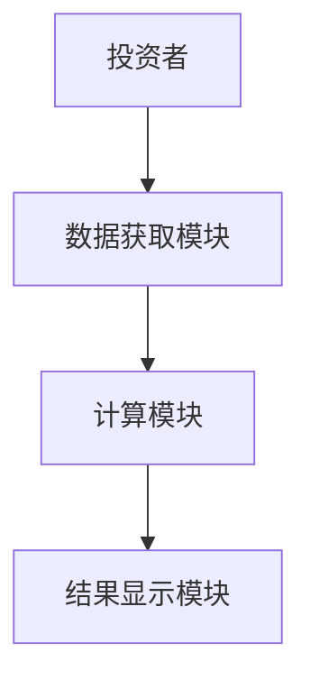

                 


# 《约翰·伯格的指数基金投资理论》

> 关键词：指数基金、被动投资、约翰·伯格、投资理论、数学模型

> 摘要：本文系统地介绍约翰·伯格的指数基金投资理论，涵盖指数基金的核心概念、数学模型、系统架构设计以及实际应用。通过详细分析指数基金的原理、优势与劣势，结合实际案例和代码实现，帮助读者全面理解指数基金的投资策略和实现方法。

---

## 第一部分：背景介绍

### 第1章：指数基金的基本概念

#### 1.1 什么是指数基金
- 指数基金的定义
- 指数基金的起源与发展
- 约翰·伯格的贡献

#### 1.2 指数基金与传统投资的区别
- 主动投资与被动投资的对比
- 指数基金的优势与劣势
- 约翰·伯格的指数基金理念

---

## 第二部分：指数基金的核心概念与原理

### 第2章：被动投资策略

#### 2.1 被动投资的基本原理
- 被动投资的定义与特点
- 指数基金的跟踪误差
- 被动投资的成本优势

#### 2.2 市场有效性与指数基金
- 市场有效性的定义
- 弱有效市场中的指数基金表现
- 强有效市场中的指数基金策略

#### 2.3 指数基金的成本分析
- 管理费用的计算
- 交易成本的影响
- 税收成本的优化

---

### 第3章：指数基金的数学模型与公式

#### 3.1 指数基金的收益计算
- 指数收益率的计算公式
$$ R_{\text{index}} = \frac{P_t - P_{t-1}}{P_{t-1}} $$
- 累计收益的计算
$$ R_{\text{total}} = \prod_{i=1}^{n} (1 + R_i) - 1 $$

#### 3.2 指数基金的成本模型
- 简单的指数基金成本计算
$$ C = T \times A $$
其中，$C$ 表示总成本，$T$ 表示管理费率，$A$ 表示基金资产规模

#### 3.3 指数基金的风险评估
- 夏普比率的计算
$$ \text{夏普比率} = \frac{E[R_p - R_f]}{\sigma_p} $$

---

### 第4章：指数基金的系统分析与架构设计

#### 4.1 投资管理系统概述
- 系统目标
- 系统功能模块
- 系统架构图
```mermaid
graph TD
    A[投资管理系统]
    B[数据获取模块]
    C[计算模块]
    D[结果显示模块]
    A -> B
    B -> C
    C -> D
```

#### 4.2 系统功能设计
- 领域模型类图


#### 4.3 系统架构设计
- 系统架构图


---

## 第三部分：指数基金的项目实战

### 第5章：指数基金的环境配置与代码实现

#### 5.1 环境配置
- 安装必要的Python库
  ```bash
  pip install pandas numpy matplotlib
  ```

#### 5.2 核心代码实现
- 计算指数基金的收益率
```python
import pandas as pd
import numpy as np

def calculate_return(prices):
    returns = prices.pct_change()
    return returns.dropna()

# 示例数据
prices = pd.Series([100, 105, 110, 115, 120])
print(calculate_return(prices))
```

#### 5.3 案例分析
- 计算并分析指数基金的夏普比率

---

## 第四部分：最佳实践与注意事项

### 第6章：指数基金的最佳实践

#### 6.1 指数基金的优势
- 成本低
- 分散风险
- 简单易懂

#### 6.2 投资指数基金的注意事项
- 选择低成本基金
- 分散投资
- 长期持有

#### 6.3 进一步学习的资源
- 推荐书籍：《指数基金投资指南》
- 在线资源：Quantitative Analysis of Asset Pricing

---

## 作者信息

作者：AI天才研究院/AI Genius Institute & 禅与计算机程序设计艺术 /Zen And The Art of Computer Programming

---

通过以上目录大纲，读者可以系统地了解约翰·伯格的指数基金投资理论，从基础概念到实际应用，逐步掌握指数基金的投资策略和实现方法。

