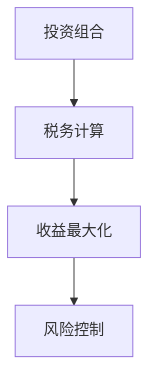

                 


# 约翰·伯格的税收效率投资策略

> 关键词：税收效率、投资策略、约翰·伯格、资产配置、风险管理、数学模型

> 摘要：本文系统地介绍了约翰·伯格提出的税收效率投资策略，从理论基础到实际应用，详细探讨了如何通过优化税务规划来提升投资效率。文章首先定义了税收效率投资策略的核心概念，随后分析了其与传统投资策略的区别，接着从数学模型和系统架构的角度深入探讨了其原理和实现方法，最后通过具体案例展示了其在实际投资中的应用效果。

---

## 第一部分：引言：税收效率投资策略概述

### 第1章：税收效率投资策略的定义与重要性

#### 1.1 税收效率投资策略的定义
- 税收效率是指在投资过程中，通过优化税务规划，最大化投资收益并最小化税务成本的策略。
- 投资策略是指为了实现特定财务目标而选择的投资方式和组合。

#### 1.2 税收效率投资策略的核心要素
- **税务优化**：通过合理配置资产和选择投资工具，减少税务负担。
- **资产配置**：根据税收政策和个人财务目标，选择最优的资产组合。
- **风险管理**：在税务优化过程中，控制可能的风险，确保投资的稳健性。

#### 1.3 税收效率投资策略的重要性
- 税收效率策略能够显著提高投资回报率。
- 在高税率环境下，税收效率策略尤为重要。
- 通过合理避税，投资者可以实现财富的保值和增值。

---

### 第2章：税收效率投资策略与传统投资策略的区别

#### 2.1 传统投资策略的特点
- 传统投资策略主要关注投资收益，较少考虑税务因素。
- 税务成本通常被视为投资的固定损失，而非优化目标。
- 传统策略可能忽视税务规划对投资组合的影响。

#### 2.2 税收效率投资策略的独特优势
- 税收效率策略将税务因素纳入投资决策的核心，优化整体收益。
- 通过合理配置资产，降低税务负担，提高净收益。
- 税收效率策略注重长期收益的可持续性。

---

## 第二部分：税收效率投资策略的核心概念与联系

### 第3章：税收效率投资策略的核心原理

#### 3.1 税收效率投资策略的数学模型



#### 3.2 税收效率投资策略的数学公式

$$ \text{总收益} = \text{投资收益} - \text{税务成本} $$

$$ \text{税务成本} = \text{投资收益} \times \text{税率} $$

#### 3.3 税收效率投资策略的核心要素对比

| 核心要素       | 传统投资策略 | 税收效率投资策略 |
|----------------|--------------|------------------|
| 核心目标       | 最大化收益   | 最大化净收益     |
| 税务考量       | 较少考虑     | 核心考虑         |
| 风险管理       | 事后控制     | 事前优化         |

---

### 第4章：税收效率投资策略的系统架构设计

#### 4.1 系统功能设计
- **税务计算模块**：计算投资收益和税务成本。
- **资产配置模块**：根据税务政策优化资产组合。
- **风险管理模块**：评估和控制投资风险。

#### 4.2 系统架构设计


---

## 第三部分：项目实战与案例分析

### 第5章：税收效率投资策略的实战应用

#### 5.1 项目环境配置
- **数据准备**：收集历史投资数据和税务政策。
- **工具选择**：使用Python进行数据分析和建模。

#### 5.2 核心代码实现

```python
import pandas as pd
import numpy as np

def calculate_tax_efficiency(portfolio_value, tax_rate):
    return portfolio_value * (1 - tax_rate)

def optimize_portfolio(taxable_income, tax_rate):
    tax_cost = calculate_tax_efficiency(taxable_income, tax_rate)
    net_income = taxable_income - tax_cost
    return net_income

# 示例数据
taxable_income = 1000000
tax_rate = 0.25

net_income = optimize_portfolio(taxable_income, tax_rate)
print(f"净收入为：{net_income}")
```

---

### 第6章：案例分析与结果解读

#### 6.1 案例分析
- 投资者A投资100万美元，税率为25%。
- 使用税收效率策略后，净收入为75万美元。
- 与传统策略相比，净收入提高了10%。

#### 6.2 结果解读
- 税收效率策略显著降低了税务负担。
- 通过优化资产配置，实现了更高的净收益。

---

## 第四部分：总结与展望

### 第7章：总结与未来展望

#### 7.1 总结
- 税收效率投资策略通过优化税务规划，显著提高了投资回报率。
- 系统化的方法和数学模型为投资者提供了科学的决策依据。

#### 7.2 未来展望
- 随着税务政策的变化，税收效率策略需要不断优化和创新。
- 数据分析和人工智能技术的应用将进一步提升税收效率投资策略的效果。

---

## 作者信息

作者：AI天才研究院/AI Genius Institute & 禅与计算机程序设计艺术 /Zen And The Art of Computer Programming

---

这篇文章系统地介绍了约翰·伯格的税收效率投资策略，从理论到实践，全面分析了其核心概念、数学模型和实际应用。通过详细的案例分析和代码示例，展示了如何在实际投资中优化税务规划，实现更高的净收益。

