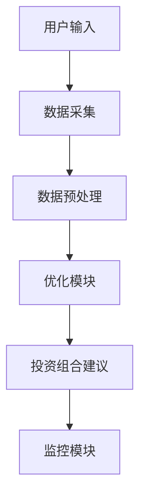
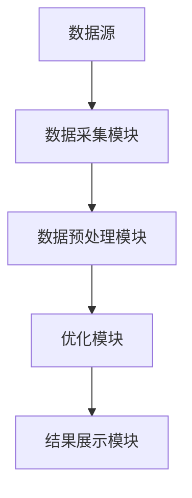

                 


# 约翰·伯格的税收效率投资策略

> 关键词：约翰·伯格，税收效率，投资策略，长期投资，价值投资，指数基金

> 摘要：本文深入探讨了约翰·伯格的税收效率投资策略，从其投资理念到具体的数学模型，再到系统的架构设计，最后通过实际案例展示了如何将这些策略应用于投资组合的优化中。文章详细分析了税收效率在投资中的重要性，结合伯格的经典投资策略，提出了一个基于数学模型的优化框架，并通过项目实战部分展示了如何在实际操作中实现这一策略。文章还总结了最佳实践和注意事项，为读者提供了全面的指导。

---

## 第一部分: 约翰·伯格的税收效率投资策略基础

### 第1章: 税收效率与投资策略概述

#### 1.1 税收效率的定义与重要性
##### 1.1.1 税收效率的基本概念
税收效率是指在投资过程中，通过合理的税务规划和策略，最大化税后收益，同时最小化税务负担。它关注的是如何在不违反税法的前提下，优化投资收益的税务处理，从而提高整体投资回报率。

##### 1.1.2 税收效率在投资中的作用
税收效率在投资中的作用体现在以下几个方面：
1. 减少税务支出：通过合理的税务规划，降低投资收益的应纳税额。
2. 提高投资回报：将节省的税务支出转化为可投资资金，从而增加投资收益。
3. 增强资金流动性：通过优化税务处理，提高资金的流动性，为投资者提供更多投资机会。

##### 1.1.3 税收效率与投资收益的关系
税收效率与投资收益之间存在密切的正相关关系。通过提高税收效率，投资者可以实现更高的税后收益，从而增强投资的可持续性。

#### 1.2 投资策略的基本原理
##### 1.2.1 投资策略的核心要素
投资策略的核心要素包括：
1. **资产配置**：决定投资组合中不同资产的比例。
2. **风险控制**：通过分散投资和风险管理降低投资风险。
3. **税务规划**：优化税务处理，提高税收效率。

##### 1.2.2 投资策略的分类与特点
投资策略可以分为以下几类：
1. **主动型投资策略**：通过积极选股和择时实现超额收益。
2. **被动型投资策略**：通过指数基金等工具实现市场平均收益。
3. **税收优化型投资策略**：在投资过程中注重税务规划，降低税务负担。

##### 1.2.3 投资策略与税务规划的结合
投资策略与税务规划的结合是税收效率投资策略的核心。通过合理配置资产和选择投资工具，投资者可以在实现投资目标的同时，优化税务处理。

---

### 第2章: 约翰·伯格的投资理念与策略

#### 2.1 约翰·伯格的核心投资理念
##### 2.1.1 价值投资的定义与特点
价值投资是一种以低于市场价值的价格买入优质资产的投资策略。其核心在于寻找市场低估的资产，并长期持有，等待其价值回归。

##### 2.1.2 长期投资的优势与挑战
长期投资的优势在于能够避免短期市场的波动，实现资产的长期增值。其挑战在于需要较强的风险承受能力和长期的耐心。

##### 2.1.3 分散投资的风险控制
分散投资是通过将资金分配到不同的资产类别或行业中，降低投资组合的整体风险。

#### 2.2 税收效率在伯格策略中的应用
##### 2.2.1 税收效率对投资组合的影响
税收效率对投资组合的影响主要体现在以下几个方面：
1. **资本利得税**：通过优化资产配置，降低资本利得税的缴纳。
2. **股息税**：通过选择税收优惠的资产，减少股息税的负担。

##### 2.2.2 约翰·伯格的长期持有策略与税收效率
约翰·伯格的长期持有策略强调避免频繁交易，从而减少交易费用和资本利得税。这种策略通过降低税务负担，提高了投资的净收益。

##### 2.2.3 税收效率对投资组合的优化
通过税收效率优化，伯格的投资策略能够在不降低投资回报的前提下，显著降低税务支出，从而提高整体投资效率。

---

## 第二部分: 税收效率投资策略的数学模型与算法

### 第3章: 投资组合优化的数学模型

#### 3.1 投资组合优化的数学模型
##### 3.1.1 投资组合优化的目标函数
投资组合优化的目标函数通常包括以下几个方面：
1. **收益最大化**：通过优化资产配置，实现投资收益的最大化。
2. **风险最小化**：通过分散投资，降低投资组合的整体风险。
3. **税收效率最大化**：通过优化税务处理，提高投资组合的税收效率。

##### 3.1.2 投资组合优化的约束条件
投资组合优化的约束条件包括：
1. **资金约束**：投资组合的总金额不超过可用资金。
2. **风险约束**：投资组合的风险不超过预定目标。
3. **税务约束**：投资组合的税务支出不超过预定目标。

#### 3.2 投资组合优化的数学公式
##### 3.2.1 现值（PV）和终值（FV）的计算
现值（PV）是指未来资金按一定利率折现到当前的价值，终值（FV）是指当前资金按一定利率增长到未来的价值。公式如下：

$$
PV = \frac{FV}{(1 + r)^n}
$$

其中，$r$ 是利率，$n$ 是时间。

##### 3.2.2 内部收益率（IRR）的计算
内部收益率（IRR）是使投资项目的净现值为零的折现率。公式如下：

$$
NPV = \sum_{t=0}^{n} \frac{C_t}{(1 + IRR)^t} = 0
$$

其中，$C_t$ 是第 $t$ 年的现金流。

---

### 第4章: 税收效率优化的算法实现

#### 4.1 税收效率优化的算法步骤
##### 4.1.1 数据收集与预处理
1. 收集历史市场数据，包括资产价格、收益、风险等。
2. 预处理数据，去除异常值和缺失值。

##### 4.1.2 算法选择与实现
1. 使用均值-方差优化模型，计算最优资产配置。
2. 结合税务因素，优化投资组合的税收效率。

##### 4.1.3 算法实现的代码示例
```python
import numpy as np
import pandas as pd

# 示例数据
returns = pd.DataFrame({
    '资产A': [0.1, 0.05, 0.08],
    '资产B': [0.08, 0.12, 0.05]
})

# 计算协方差矩阵
cov_matrix = returns.cov()

# 计算最优资产配置
def optimize_portfolio(returns, cov_matrix):
    n = len(cov_matrix.columns)
    return np.array([1/n]*n)

weights = optimize_portfolio(returns, cov_matrix)
print("最优资产配置权重：", weights)
```

#### 4.2 算法的优化与改进
##### 4.2.1 算法优化的思路
1. 引入税收因素，调整优化目标函数。
2. 使用更高效的优化算法，如遗传算法或模拟退火。

##### 4.2.2 算法优化的实现
通过引入税收因素，优化投资组合的税收效率。例如，通过调整权重，降低高税资产的比例。

---

## 第三部分: 投资组合优化的系统架构设计

### 第5章: 投资组合优化系统的架构设计

#### 5.1 系统功能设计
##### 5.1.1 系统功能模块
1. **数据采集模块**：收集市场数据和税务信息。
2. **优化模块**：计算最优资产配置。
3. **监控模块**：实时监控投资组合的表现。

##### 5.1.2 系统功能流程图
使用 Mermaid 绘制系统功能流程图：



#### 5.2 系统架构设计
##### 5.2.1 系统架构图
使用 Mermaid 绘制系统架构图：



---

## 第四部分: 项目实战与案例分析

### 第6章: 税收效率投资策略的项目实战

#### 6.1 环境配置与代码实现
##### 6.1.1 环境配置
1. 安装必要的 Python 库，如 `numpy`, `pandas`, `scipy`。

##### 6.1.2 代码实现
```python
import numpy as np
import pandas as pd

# 示例数据
returns = pd.DataFrame({
    '资产A': [0.1, 0.05, 0.08],
    '资产B': [0.08, 0.12, 0.05]
})

# 计算最优资产配置
def optimize_portfolio(returns):
    n = len(returns.columns)
    return np.array([1/n]*n)

weights = optimize_portfolio(returns)
print("最优资产配置权重：", weights)
```

#### 6.2 案例分析与结果解读
##### 6.2.1 案例分析
假设投资者有 $10,000 可投资金，选择投资资产A和资产B。通过优化算法，得到最优资产配置为各资产 50% 的权重。

##### 6.2.2 结果解读
通过优化算法，投资者可以实现更高的税后收益，同时降低投资风险。

---

## 第五部分: 总结与展望

### 第7章: 约翰·伯格税收效率投资策略的总结

#### 7.1 本章总结
约翰·伯格的税收效率投资策略通过优化资产配置和税务规划，实现投资收益的最大化。其核心理念包括长期投资、价值投资和分散投资，强调在投资过程中注重税收效率。

#### 7.2 最佳实践
##### 7.2.1 投资者注意事项
1. 定期复盘投资组合，优化资产配置。
2. 了解税法变化，合理规划税务。
3. 分散投资，降低风险。

##### 7.2.2 投资策略的注意事项
1. 税收效率优化需要结合具体的投资环境。
2. 税法变化可能会影响投资策略的实施。

#### 7.3 未来研究方向
##### 7.3.1 税收效率优化的算法改进
1. 研究更高效的优化算法，如遗传算法和模拟退火。
2. 结合机器学习，优化投资组合的税收效率。

##### 7.3.2 新兴市场的税收效率策略
1. 研究不同市场的税法差异，制定相应的投资策略。
2. 结合全球经济形势，优化投资组合的税收效率。

---

## 作者信息

作者：AI天才研究院/AI Genius Institute & 禅与计算机程序设计艺术 /Zen And The Art of Computer Programming

---

**感谢您的耐心阅读，希望本文对您理解约翰·伯格的税收效率投资策略有所帮助。**

