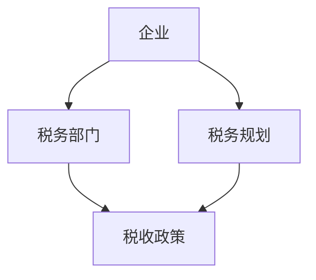
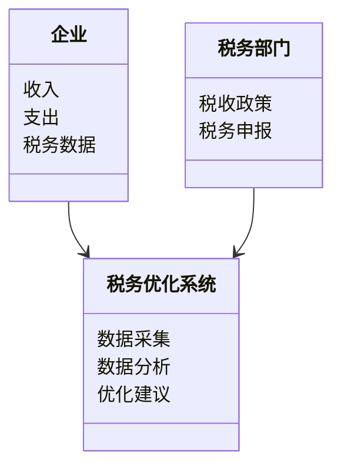
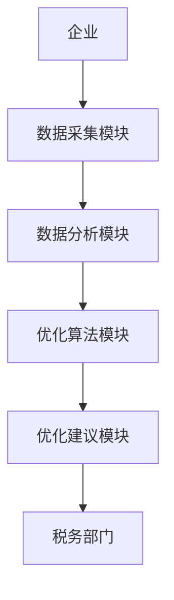
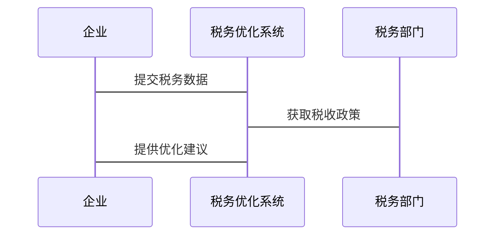

                 


# 约翰·伯格的税收效率投资：国际税收改革下的新策略

## 关键词：税收效率，投资策略，国际税收，优化算法，系统架构

## 摘要：  
在当前国际税收体系不断变化的背景下，如何通过优化税收效率来提升投资回报成为企业面临的重要挑战。本文从约翰·伯格的税收效率投资理论出发，结合国际税收改革的新趋势，系统分析了税收效率优化的核心概念、算法原理、系统架构，并通过实际案例展示了如何在跨国企业中应用这些策略。文章最后总结了最佳实践和未来的发展方向。

---

# 第一部分: 税收效率投资的背景与基础

## 第1章: 税收效率投资概述

### 1.1 税收效率的基本概念

#### 1.1.1 税收效率的定义  
税收效率是指在税收征纳过程中，实现税款的最小化损失和最大化合规性。它关注的是如何通过科学的税务规划和优化，降低企业的税务负担，同时避免税务风险。

#### 1.1.2 税收效率的核心要素  
税收效率的核心要素包括税收政策的理解、税务规划的合理性、税务风险的可控性以及税收合规性。企业需要在这些要素之间找到平衡点，以实现税收效率的最大化。

#### 1.1.3 税收效率与投资的关系  
税收效率直接影响企业的投资回报率。通过优化税收效率，企业可以降低税负，释放更多资金用于再投资，从而提升整体盈利能力。

### 1.2 国际税收改革的背景

#### 1.2.1 全球税收体系的变化  
近年来，全球税收体系发生了显著变化。各国政府为了应对全球化和数字化带来的挑战，纷纷调整税收政策，推动更加透明和高效的税收体系。

#### 1.2.2 税收透明化与数字化趋势  
随着数字化技术的发展，税务部门能够更高效地收集和处理数据，推动税收管理的透明化和自动化。这一趋势对企业税务管理提出了更高的要求。

#### 1.2.3 税收政策对企业投资的影响  
税收政策的变化直接影响企业的投资决策。例如，降低企业所得税率或提供税收优惠政策可以激励企业增加投资，而严格的税收监管则要求企业更加谨慎地规划税务。

### 1.3 税收效率投资的必要性

#### 1.3.1 税收不效率对企业的影响  
税收不效率可能导致企业税负加重，影响企业的利润和竞争力。此外，不合规的税务行为还可能引发法律风险。

#### 1.3.2 提高税收效率的经济意义  
提高税收效率有助于降低企业的税负，释放更多的资金用于发展和创新，从而推动经济的可持续增长。

#### 1.3.3 国际税收改革对企业投资策略的挑战  
国际税收改革要求企业在跨国投资中更加关注税收政策的差异和变化，这对企业的税务规划能力提出了更高的要求。

---

## 第2章: 税收效率投资的核心概念与联系

### 2.1 税收效率优化的核心原理

#### 2.1.1 税收优化的基本原则  
税收优化需要遵循合法性、合规性和经济性原则。企业必须在合法合规的前提下，通过合理的税务规划降低税负。

#### 2.1.2 税收政策的分析框架  
企业需要从宏观和微观两个层面分析税收政策。宏观层面包括国家税收政策的变化，微观层面则关注企业的具体业务和财务状况。

#### 2.1.3 税收效率与企业利润的关系  
税收效率直接影响企业的净利润。通过优化税务结构，企业可以减少税负，提升整体利润水平。

### 2.2 税收效率优化的关键因素

#### 2.2.1 税收政策的解读  
企业需要准确解读税收政策，包括税率、优惠政策和监管要求。这需要专业的税务知识和数据分析能力。

#### 2.2.2 企业税务规划的策略  
企业可以通过多种策略优化税务，例如利用税收优惠政策、合理分配收入和支出、优化资本结构等。

#### 2.2.3 税收风险的评估与管理  
企业需要识别和评估税收风险，并采取有效的风险管理措施，例如建立内部审计机制、定期进行税务审查等。

### 2.3 税收效率优化的实体关系图



---

## 第3章: 税收效率优化的算法原理

### 3.1 税收优化算法概述

#### 3.1.1 税收优化的基本算法  
常见的税收优化算法包括线性规划、动态规划和遗传算法等。这些算法可以帮助企业找到最优的税务规划方案。

#### 3.1.2 常用优化算法的比较  
以下是几种常用优化算法的对比：

| 算法名称 | 特点 | 适用场景 |
|----------|------|----------|
| 线性规划  | 解决线性问题，计算简单 | 税率固定的场景 |
| 动态规划  | 分阶段决策，适合复杂问题 | 税收政策变化较大的场景 |
| 遗传算法  | 具有较强的全局搜索能力 | 多变量优化的场景 |

#### 3.1.3 税收优化算法的适用场景  
税收优化算法适用于多种场景，例如跨国企业的税务规划、复杂税收政策下的最优解计算等。

### 3.2 基于线性规划的税收优化算法

#### 3.2.1 算法原理  
线性规划是一种优化技术，适用于解决线性目标函数和约束条件的问题。在税收优化中，线性规划可以用于确定最优的税务分配方案。

#### 3.2.2 算法实现  
以下是基于线性规划的税收优化算法的Python实现：

```python
import numpy as np
from scipy.optimize import linprog

# 定义目标函数
c = [-1, -1]  # 最小化目标函数：-x - y

# 定义约束条件
A = [[1, 0], [0, 1], [1, 1]]  # 约束矩阵
b = [20, 30, 15]  # 约束右侧

# 定义变量的非负约束
x_bounds = (0, None)
y_bounds = (0, None)

# 求解线性规划问题
result = linprog(c, A, b, bounds=(x_bounds, y_bounds), method='highs')

# 输出结果
print("最优解：", result.x)
```

#### 3.2.3 算法的数学模型  
线性规划的数学模型如下：

$$
\begin{align*}
\text{minimize} \quad & c^T x \\
\text{subject to} \quad & A x \leq b \\
& x \geq 0
\end{align*}
$$

其中，$c$ 是目标函数的系数，$A$ 是约束条件的矩阵，$b$ 是约束条件的右侧向量，$x$ 是决策变量。

---

## 第4章: 税收效率优化的系统架构设计

### 4.1 问题场景介绍

#### 4.1.1 跨国企业的税务规划  
跨国企业需要在全球范围内进行税务规划，以降低整体税负。这需要考虑不同国家的税收政策和法规。

#### 4.1.2 税务系统的复杂性  
现代税务系统涉及多个部门和多种业务，需要一个高效的系统来管理税务数据和优化税务策略。

### 4.2 税务优化系统的设计

#### 4.2.1 领域模型设计  
以下是税务优化系统的领域模型：



#### 4.2.2 系统架构设计  
以下是税务优化系统的架构图：



#### 4.2.3 系统接口设计  
系统需要与企业的财务系统、税务部门的数据库以及其他第三方服务进行接口对接。以下是系统接口设计的示意图：



---

## 第5章: 税收效率优化的项目实战

### 5.1 环境安装

#### 5.1.1 系统环境  
建议使用Python 3.8及以上版本，安装必要的库，如NumPy和SciPy。

#### 5.1.2 工具安装  
安装必要的开发工具，如Jupyter Notebook、PyCharm等。

### 5.2 核心实现

#### 5.2.1 税务数据采集  
以下是税务数据采集的代码示例：

```python
import pandas as pd

# 读取Excel文件
df = pd.read_excel('tax_data.xlsx')

# 数据清洗
df = df.dropna()
df = df[~df['收入'].str.contains('None')]
```

#### 5.2.2 数据分析  
以下是数据分析的代码示例：

```python
import matplotlib.pyplot as plt

# 绘制税收分布图
plt.hist(df['税率'], bins=10)
plt.xlabel('税率')
plt.ylabel('频数')
plt.title('税率分布图')
plt.show()
```

#### 5.2.3 优化算法实现  
以下是优化算法的实现：

```python
from scipy.optimize import minimize

# 定义目标函数
def tax_optimization(x):
    return np.sum(x * (1 - 0.2))  # 假设税率为20%

# 定义约束条件
def constraint(x):
    return np.sum(x) - 100000  # 总收入为100,000

# 求解优化问题
result = minimize(tax_optimization, [100000], method='SLSQP', constraints={'type': 'eq', 'fun': constraint})

# 输出结果
print("最优解：", result.x)
```

### 5.3 案例分析

#### 5.3.1 案例背景  
某跨国企业在全球多个国家设有分支机构，需要优化其税务结构，降低整体税负。

#### 5.3.2 实施步骤  
1. 数据采集：收集各分支机构的收入和支出数据。
2. 数据分析：分析各国家的税收政策和税率。
3. 优化算法：使用线性规划算法确定最优的税务分配方案。
4. 实施与监控：根据优化建议调整税务结构，并定期监控优化效果。

#### 5.3.3 优化效果  
通过优化算法，该企业成功降低了整体税负，提升了净利润。

---

## 第6章: 总结与展望

### 6.1 总结

#### 6.1.1 核心内容回顾  
本文系统介绍了税收效率优化的核心概念、算法原理和系统架构，并通过实际案例展示了如何在跨国企业中应用这些策略。

#### 6.1.2 最佳实践  
企业应结合自身的业务特点，选择合适的税收优化算法，并建立完善的税务管理系统。

### 6.2 展望

#### 6.2.1 未来发展方向  
随着人工智能和大数据技术的发展，税收效率优化将更加智能化和自动化。

#### 6.2.2 拓展阅读  
建议读者进一步阅读《税收优化与企业财务管理》和《国际税收政策与投资策略》等书籍，以深入了解相关领域的最新发展。

---

## 作者：AI天才研究院/AI Genius Institute & 禅与计算机程序设计艺术 /Zen And The Art of Computer Programming

---

以上是《约翰·伯格的税收效率投资：国际税收改革下的新策略》的完整目录和内容框架，希望对您有所帮助！

