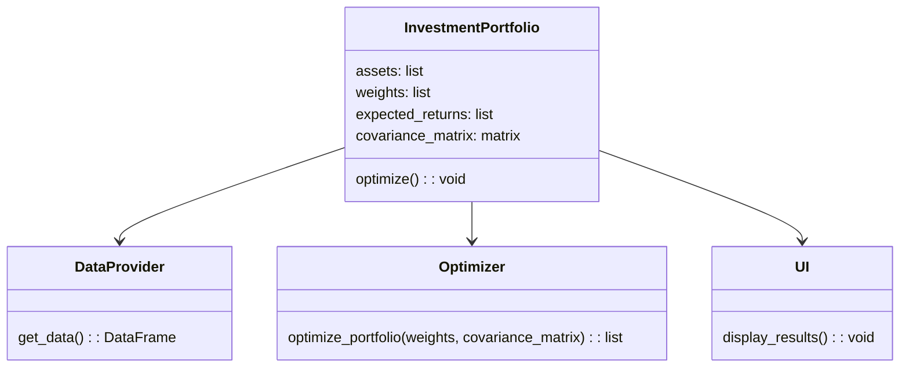
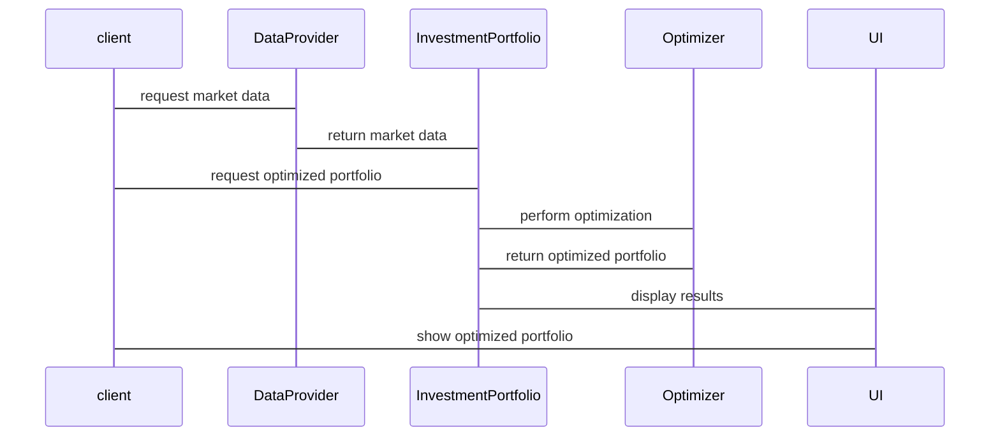

                 


# 约翰·伯格的简单投资法则

> 关键词：投资法则，约翰·伯格，长期投资，价值投资，分散投资，投资组合优化，简单投资法则

> 摘要：本文深入探讨了约翰·伯格的简单投资法则，分析其核心概念、算法原理、数学模型和系统架构，结合实际案例和最佳实践，为投资者提供科学的投资方法论。文章内容涵盖投资基础知识、简单投资法则的核心思想、投资组合优化的算法实现、数学模型分析、系统架构设计、项目实战和最佳实践等内容。

---

## 第1章: 投资的基础概念

### 1.1 投资的基本定义
- 1.1.1 投资的定义与分类  
  投资是指将资金投入到某个项目或资产中，以期获得未来收益的行为。投资可以分为短期投资和长期投资，也可以分为实物投资和金融投资。

- 1.1.2 投资的基本原则  
  投资的核心原则包括分散投资、长期持有、价值投资和成本控制。

- 1.1.3 投资与投机的区别  
  投资注重长期价值，而投机则追求短期价格波动的利润。

### 1.2 约翰·伯格的生平简介
- 1.2.1 伯格的早年经历  
  约翰·伯格出生于美国宾夕法尼亚州，早年对投资产生了浓厚的兴趣。

- 1.2.2 伯格的职业生涯  
  伯格在投资领域有着丰富的经验，致力于研究简单而有效的投资策略。

- 1.2.3 伯格的投资理念  
  伯格主张长期持有优质资产，避免频繁交易，以降低交易成本和风险。

### 1.3 简单投资法则的核心思想
- 1.3.1 长期投资的重要性  
  长期投资能够摊薄成本，降低市场波动的影响。

- 1.3.2 分散投资的风险控制  
  通过分散投资不同资产类别，可以有效降低投资组合的整体风险。

- 1.3.3 价值投资的本质  
  价值投资注重购买具有内在价值的资产，而非关注短期价格波动。

---

## 第2章: 简单投资法则的核心概念

### 2.1 投资组合的构建原理
- 2.1.1 投资组合的定义  
  投资组合是指将多种资产按一定比例配置在一起的投资方式。

- 2.1.2 投资组合的风险与收益  
  投资组合的收益与风险是相互关联的，风险较高的组合通常具有较高的预期收益。

- 2.1.3 投资组合的优化方法  
  通过优化投资组合的资产配置，可以在风险可控的前提下，最大化预期收益。

### 2.2 简单投资法则的数学模型
- 2.2.1 投资组合的数学表达  
  投资组合的收益可以用期望收益来衡量，风险则可以用方差或标准差来表示。

- 2.2.2 风险与收益的量化分析  
  通过量化分析，可以更科学地评估不同投资组合的风险收益比。

- 2.2.3 投资组合的优化算法  
  简单投资法则通过长期持有和分散投资的方式，优化投资组合的风险收益比。

### 2.3 简单投资法则与现代投资组合理论的对比
- 2.3.1 现代投资组合理论的核心思想  
  现代投资组合理论强调通过分散投资降低风险，同时优化投资组合的收益。

- 2.3.2 简单投资法则的优势与劣势  
  简单投资法则的优势在于其简单易行，劣势在于其在极端市场条件下的表现可能不如复杂的投资策略。

- 2.3.3 两者的适用场景分析  
  简单投资法则适用于长期稳健的投资，而现代投资组合理论更适合复杂多变的市场环境。

---

## 第3章: 投资组合优化的算法原理

### 3.1 投资组合优化的基本原理
- 3.1.1 现代投资组合理论的基石  
  现代投资组合理论以均值-方差模型为基础，通过优化投资组合的风险和收益来实现投资目标。

- 3.1.2 均值-方差优化模型  
  通过均值-方差优化模型，可以找到最优的投资组合，使风险最小化或收益最大化。

- 3.1.3 马科维茨的有效前沿  
  马科维茨的有效前沿是指在给定风险下，收益最高的投资组合，或在给定收益下，风险最低的投资组合。

### 3.2 简单投资法则的优化算法
- 3.2.1 简单投资法则的优化步骤  
  简单投资法则的优化步骤包括确定投资目标、选择优质资产、分散投资、长期持有等。

- 3.2.2 投资组合的分散化策略  
  通过分散投资不同的资产类别，可以有效降低投资组合的整体风险。

- 3.2.3 风险调整后的收益最大化  
  在风险调整的基础上，最大化投资组合的预期收益。

### 3.3 算法实现与代码示例
- 3.3.1 环境安装与配置  
  需要安装Python和相关库，如NumPy和Pandas。

- 3.3.2 投资组合优化的Python代码实现  
  使用Python代码实现均值-方差优化模型，计算最优投资组合。

- 3.3.3 代码的功能解读与分析  
  通过代码实现，可以更直观地理解投资组合优化的算法原理。

---

## 第4章: 投资组合优化的数学模型与公式

### 4.1 投资组合优化的数学模型
- 4.1.1 投资组合的收益与风险模型  
  投资组合的收益可以用期望收益表示，风险可以用方差或标准差表示。

- 4.1.2 风险调整后的收益最大化公式  
  通过优化算法，找到在风险调整后收益最大的投资组合。

- 4.1.3 投资组合的夏普比率计算  
  夏普比率是衡量投资组合风险调整后收益的重要指标。

### 4.2 投资组合优化的数学公式
- 4.2.1 投资组合的期望收益公式  
  投资组合的期望收益可以通过资产的权重和期望收益计算。

- 4.2.2 投资组合的风险公式  
  投资组合的风险可以通过资产的权重和协方差矩阵计算。

- 4.2.3 投资组合的夏普比率公式  
  夏普比率 = (投资组合的期望收益 - 无风险利率) / 投资组合的风险（标准差）。

### 4.3 数学模型的实际应用案例
- 4.3.1 案例分析与公式应用  
  通过具体案例分析，展示数学模型在投资组合优化中的应用。

- 4.3.2 投资组合优化的数学模型实现  
  通过Python代码实现投资组合优化的数学模型。

- 4.3.3 数学模型的优缺点分析  
  讨论数学模型在实际应用中的优缺点，以及其适用场景。

---

## 第5章: 投资组合优化的系统分析与架构设计

### 5.1 系统分析与需求定义
- 5.1.1 系统分析的背景与目标  
  系统分析的背景是投资组合优化的需求，目标是设计一个高效的系统来实现投资组合优化。

- 5.1.2 系统功能需求  
  系统需要实现投资组合优化的算法，包括数据输入、优化计算和结果输出。

### 5.2 系统功能设计（领域模型Mermaid类图）


### 5.3 系统架构设计（Mermaid架构图）


### 5.4 系统接口设计
- 系统接口包括数据输入接口、优化算法接口和结果展示接口。

### 5.5 系统交互设计（Mermaid序列图）


---

## 第6章: 项目实战

### 6.1 环境安装与配置
- 安装Python、NumPy、Pandas和Matplotlib。

### 6.2 核心实现源代码
```python
import numpy as np
import pandas as pd

def optimize_portfolio(returns):
    # 计算协方差矩阵
    covariance_matrix = returns.cov()
    
    # 计算资产的权重
    weights = np.random.random(len(returns.columns))
    weights = weights / weights.sum()
    
    # 计算投资组合的收益和风险
    portfolio_return = np.dot(weights, returns.mean())
    portfolio_variance = np.dot(weights.T, np.dot(covariance_matrix, weights))
    
    return portfolio_return, np.sqrt(portfolio_variance)

# 示例数据
data = pd.DataFrame({
    '资产1': [0.1, 0.2, 0.15, 0.05, 0.2],
    '资产2': [0.05, 0.1, 0.08, 0.03, 0.07],
    '资产3': [0.15, 0.12, 0.1, 0.08, 0.1]
})
```

### 6.3 代码应用解读与分析
- 代码实现了一个简单的投资组合优化算法，计算投资组合的收益和风险。

### 6.4 实际案例分析
- 通过具体案例分析，展示如何使用简单投资法则优化投资组合。

### 6.5 项目小结
- 总结项目实现的过程和结果，强调简单投资法则的实际应用价值。

---

## 第7章: 最佳实践、小结与注意事项

### 7.1 小结
- 总结全文，强调简单投资法则的核心思想和实际应用价值。

### 7.2 注意事项
- 提醒读者在实际投资中注意分散投资、长期持有和成本控制。

### 7.3 拓展阅读
- 推荐相关书籍和资源，供读者进一步学习和研究。

---

## 作者信息

作者：AI天才研究院/AI Genius Institute & 禅与计算机程序设计艺术 /Zen And The Art of Computer Programming

---

通过以上目录结构，您可以按照每章内容逐步撰写详细的博客文章，确保每一部分都深入浅出，逻辑清晰，内容详实。

