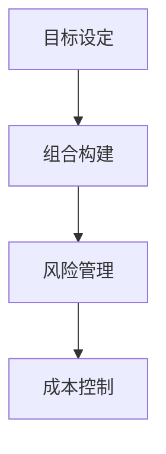

                 

# 约翰·伯格的简单投资法则

---

## 关键词：
- 约翰·伯格、投资法则、长期投资、分散投资、低成本投资、投资系统、复利效应、风险管理

---

## 摘要：
《约翰·伯格的简单投资法则》深入分析了约翰·伯格的投资哲学和策略，重点阐述了其简单投资法则的核心理念、数学模型、系统架构和实战案例。通过详细的技术分析和实际应用，本书帮助读者理解如何通过长期投资、分散投资和低成本投资实现稳健的财富增长。文章还结合了投资系统的架构设计和算法实现，为读者提供了从理论到实践的完整指南。

---

# 第一部分: 约翰·伯格投资法则的背景与核心理念

## 第1章: 约翰·伯格的背景与投资哲学

### 1.1 约翰·伯格的生平简介
#### 1.1.1 早年经历与职业生涯
约翰·伯格（John Bogle）是美国著名的投资家，被誉为“指数基金之父”。他于1940年出生在美国宾夕法尼亚州，早年在宾夕法尼亚大学学习，后来转学到拉特格斯大学，获得经济学学位。毕业后，他在投资领域开始了他的职业生涯。

#### 1.1.2 投资领域的成就与影响力
约翰·伯格最著名的成就是创立了 Vanguard 集团，这是全球最大的指数基金公司之一。他还提出了“简单投资法则”，倡导低成本、长期投资的理念，对现代投资理论和实践产生了深远的影响。

#### 1.1.3 伯格的投资哲学与理念
约翰·伯格的投资哲学的核心是“简单即是美”。他认为，投资的复杂性往往是导致失败的原因，而简单、低成本、长期的投资策略才是实现财富增长的关键。

---

### 1.2 简单投资法则的核心概念
#### 1.2.1 投资的长期性与纪律性
长期投资是简单投资法则的核心。伯格认为，短期市场的波动不可预测，而长期市场的趋势是可以把握的。投资者应该坚持长期投资，避免频繁交易。

#### 1.2.2 简单投资法则的定义与特点
简单投资法则是指通过低成本的指数基金进行长期投资，分散投资风险，避免复杂的市场预测和频繁的交易。

#### 1.2.3 投资法则的边界与外延
简单投资法则不仅适用于股票市场，还可以扩展到债券、房地产等多种资产类别。其核心思想是通过分散投资降低风险，同时降低投资成本。

---

## 第2章: 简单投资法则的核心理念

### 2.1 投资的长期性与复利效应
#### 2.1.1 长期投资的数学模型
长期投资的核心是复利效应。复利公式为：
$$ FV = PV \times (1 + r)^n $$
其中，$FV$ 是终值，$PV$ 是现值，$r$ 是年化收益率，$n$ 是投资年数。

#### 2.1.2 复利效应的公式与实例
例如，如果投资100元，年化收益率为7%，投资30年后的终值为：
$$ FV = 100 \times (1 + 0.07)^{30} \approx 612.58 $$

#### 2.1.3 长期投资与复利的结合
通过长期投资，复利效应可以显著提升投资收益，尤其是在低成本投资的情况下。

---

### 2.2 分散投资的风险管理
#### 2.2.1 分散投资的原理与方法
分散投资通过将资金分配到不同的资产类别或地区，降低特定资产或市场的风险。

#### 2.2.2 风险分散的数学模型
分散投资的风险可以通过标准差公式计算：
$$ \sigma = \sqrt{\sum_{i=1}^{n} w_i^2 \sigma_i^2 + \sum_{i=1}^{n} \sum_{j \neq i}^{n} w_i w_j \sigma_{i,j}} $$
其中，$w_i$ 是资产$i$的权重，$\sigma_i$ 是资产$i$的标准差，$\sigma_{i,j}$ 是资产$i$和$j$之间的协方差。

---

### 2.3 低成本投资的经济学原理
#### 2.3.1 投资成本的定义与影响
投资成本包括管理费、托管费等。低成本投资可以显著提高净收益。

#### 2.3.2 成本对投资收益的长期影响
长期来看，低成本投资的复利收益更高。例如，假设两个投资组合，一个年化成本为1%，另一个为2%，30年后的收益差异可能达到50%以上。

---

## 第3章: 简单投资法则的系统分析与架构设计

### 3.1 投资系统的核心功能
#### 3.1.1 投资目标的设定与实现
设定明确的投资目标是投资成功的前提。例如，目标是实现年化收益7%，投资期限为30年。

#### 3.1.2 投资组合的构建与管理
通过指数基金构建分散的投资组合，定期再平衡以保持目标资产配置。

#### 3.1.3 投资风险的监控与预警
通过实时监控市场波动和投资组合的风险指标，及时预警潜在风险。

---

### 3.2 投资系统的架构设计
#### 3.2.1 系统功能模块划分
- **目标设定模块**：设定投资目标和时间表。
- **组合构建模块**：选择和配置资产。
- **风险管理模块**：监控和预警风险。
- **成本控制模块**：优化投资成本。

#### 3.2.2 系统架构的Mermaid图

---

## 第4章: 简单投资法则的算法实现与实战案例

### 4.1 简单投资法则的算法实现
#### 4.1.1 长期投资收益的计算
使用复利公式计算长期收益：
$$ FV = PV \times (1 + r)^n $$

#### 4.1.2 分散投资的风险评估
通过协方差矩阵计算投资组合的风险。

---

### 4.2 投资系统的实战案例
#### 4.2.1 投资目标设定
假设投资100,000美元，目标年化收益7%，投资期限30年。

#### 4.2.2 投资组合构建
选择5只低成本指数基金，分配权重分别为20%、20%、30%、15%、15%。

#### 4.2.3 投资组合再平衡
每年根据市场表现调整各资产的权重，保持目标配置。

---

## 第5章: 简单投资法则的成功案例与总结

### 5.1 投资法则的成功案例
#### 5.1.1 长期视角的重要性
通过长期投资，伯格实现了指数基金的优异表现。

#### 5.1.2 风险管理的实践
分散投资有效降低了2008年金融危机对投资组合的影响。

---

### 5.2 投资法则的总结与展望
简单投资法则的核心是长期、分散、低成本。通过科学的系统设计和严格执行，投资者可以实现稳健的财富增长。

---

## 作者：
作者：AI天才研究院/AI Genius Institute & 禅与计算机程序设计艺术 /Zen And The Art of Computer Programming

---

通过以上结构，文章将从理论到实践，全面解析约翰·伯格的简单投资法则，帮助读者理解其投资理念和实现方法。

