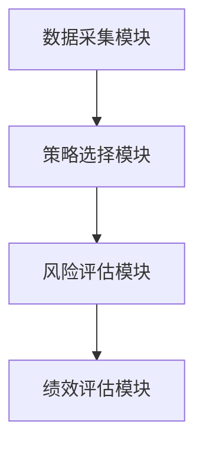

                 


# 约翰·伯格的被动投资 vs 主动投资 debate

> 关键词：被动投资、主动投资、约翰·伯格、指数基金、资产配置、投资策略、风险管理

> 摘要：本文深入探讨了被动投资与主动投资的优劣，以约翰·伯格的被动投资理念为核心，分析了两种投资策略的数学模型、系统架构和实际案例，帮助读者理解在不同场景下选择合适的投资策略。

---

## 第一部分：被动投资与主动投资概述

### 第1章：投资的基本概念与策略

#### 1.1 投资的基本概念

投资是指将资金投入某个项目或资产，以期在未来获得收益或资本增值的行为。投资的核心目标是实现资产的保值和增值，同时需要承担相应的风险。

- **投资的目标**：追求资产的增值，包括资本收益和分红收益。
- **投资的风险**：市场风险、流动性风险、信用风险等。

#### 1.2 投资的分类与形式

投资可以分为以下几种形式：

- **股票投资**：购买公司股份，成为股东，享有分红和资本增值。
- **债券投资**：购买政府或企业的债券，定期获得利息收益。
- **基金投资**：通过购买基金份额，间接投资于股票、债券或其他资产。
- **指数基金**：一种被动投资工具，跟踪特定指数的表现。

#### 1.3 投资策略的分类

投资策略可以分为两类：

- **被动投资**：通过投资指数基金等工具，长期持有，不频繁交易。
- **主动投资**：通过精选个股或调整资产配置，试图跑赢市场指数。

---

### 第2章：被动投资的核心理念与实践

#### 2.1 被动投资的起源与发展

被动投资的起源可以追溯到20世纪70年代，约翰·伯格在《投资的常识》一书中提出了指数投资的理念。他认为，大多数主动管理的基金难以跑赢市场指数，而指数基金由于低成本和分散风险，长期来看具有优势。

- **指数基金的定义**：一种跟踪特定市场指数的基金，如标普500指数基金。
- **指数基金的优势**：分散风险、低成本、简单易懂。

#### 2.2 被动投资的主要策略

被动投资的核心是通过投资指数基金，长期持有，不频繁交易。以下是被动投资的主要策略：

1. **选择合适的指数基金**：根据投资目标选择跟踪的指数。
2. **定期定额投资**：通过定期定额投资，分散投资风险。
3. **长期持有**：避免频繁交易，降低交易成本和税务负担。

#### 2.3 被动投资的数学模型与公式

指数基金的回报可以用以下公式计算：

$$ R_{\text{基金}} = R_{\text{指数}} $$

其中，\( R_{\text{基金}} \) 是指数基金的回报，\( R_{\text{指数}} \) 是跟踪的市场指数的回报。

指数基金的长期回报可以用以下公式计算：

$$ R_{\text{长期}} = \mu - \frac{1}{2}\sigma^2 $$

其中，\( \mu \) 是指数基金的平均回报率，\( \sigma \) 是指数基金的波动率。

---

### 第3章：主动投资的核心理念与实践

#### 3.1 主动投资的起源与发展

主动投资起源于20世纪中期，其核心理念是通过精选个股或优化资产配置，以跑赢市场指数。主动投资强调基金经理的主动管理能力，认为市场存在短期可预测的波动性。

#### 3.2 主动投资的主要策略

主动投资的主要策略包括：

1. **资产配置**：根据市场状况调整股票、债券等资产的比例。
2. **选股策略**：精选具有成长潜力的个股。
3. **风险管理**：通过分散投资和对冲策略降低风险。

#### 3.3 主动投资的数学模型与公式

主动投资的回报可以用以下公式计算：

$$ R_{\text{主动}} = \alpha + \beta R_{\text{市场}} $$

其中，\( \alpha \) 是主动投资的超额回报，\( \beta \) 是投资组合的贝塔系数，\( R_{\text{市场}} \) 是市场指数的回报。

主动投资的风险可以用贝塔系数来衡量：

$$ \beta = \frac{\text{协方差}(R_{\text{主动}}, R_{\text{市场}})}{\text{方差}(R_{\text{市场}})} $$

---

### 第4章：被动投资与主动投资的优劣势对比

#### 4.1 成本与费用对比

- **被动投资的成本**：低管理费用，通常为指数基金的管理费和托管费。
- **主动投资的成本**：高管理费用，通常为基金经理的管理费和交易费用。

#### 4.2 风险与收益对比

- **被动投资的风险**：低风险，由于分散投资，风险相对较低。
- **主动投资的风险**：高风险，由于集中投资和频繁交易，风险较高。

#### 4.3 简单与复杂对比

- **被动投资的简单性**：易于理解和操作，适合长期投资者。
- **主动投资的复杂性**：需要专业的知识和技能，适合经验丰富的投资者。

---

## 第二部分：系统分析与架构设计

### 第5章：投资组合的构建与管理

#### 5.1 投资组合的构建

投资组合的构建需要考虑以下因素：

1. **投资目标**：长期增值还是短期收益。
2. **风险承受能力**：投资者的风险偏好。
3. **投资期限**：长期还是短期。

#### 5.2 系统架构设计

投资组合管理系统可以分为以下几个模块：

1. **数据采集模块**：采集市场数据和经济指标。
2. **策略选择模块**：根据投资者需求选择被动或主动策略。
3. **风险评估模块**：评估投资组合的风险。
4. **绩效评估模块**：评估投资组合的绩效。

#### 5.3 系统架构图

以下是一个简化的系统架构图：



---

## 第三部分：项目实战

### 第6章：被动投资与主动投资的实战案例

#### 6.1 环境安装

为了进行投资模拟，我们需要安装以下工具：

1. **数据采集工具**：如Yahoo Finance API。
2. **数据分析工具**：如Python的Pandas库。
3. **可视化工具**：如Matplotlib或Plotly。

#### 6.2 核心实现代码

以下是一个被动投资策略的Python代码示例：

```python
import pandas as pd
import numpy as np
import matplotlib.pyplot as plt

# 数据采集
data = pd.read_csv('index.csv')

# 计算指数基金的回报
data['回报率'] = data['收盘价'].pct_change()

# 计算长期回报
mu = data['回报率'].mean()
sigma = data['回报率'].std()

长期回报 = mu - 0.5 * sigma**2

print('长期回报:',长期回报)
```

#### 6.3 案例分析

假设我们选择标普500指数基金进行被动投资，过去10年的年化回报率为7%。而主动投资策略选择的基金年化回报率为8%，但管理费用较高，年化管理费为1.5%。因此，被动投资的实际回报为7%，而主动投资的实际回报为8% - 1.5% = 6.5%。在这种情况下，被动投资优于主动投资。

---

## 第四部分：总结与建议

### 第7章：投资策略的选择与优化

#### 7.1 总结

- **被动投资的优势**：低成本、分散风险、简单易懂。
- **主动投资的优势**：潜在的高回报、灵活性。

#### 7.2 投资建议

1. **长期投资者**：选择被动投资，尤其是指数基金。
2. **短期投资者**：考虑主动投资，但需谨慎选择基金经理。
3. **风险管理**：无论选择哪种策略，都需要注重风险控制。

#### 7.3 注意事项

- **市场波动**：被动投资在市场剧烈波动时表现稳定，而主动投资可能面临更大的波动。
- **费用控制**：主动投资的高费用可能侵蚀收益。

---

## 作者

作者：AI天才研究院（AI Genius Institute）  
& 禅与计算机程序设计艺术（Zen And The Art of Computer Programming）

---

通过本文的分析，读者可以全面了解被动投资与主动投资的优劣势，并根据自身需求选择合适的投资策略。

