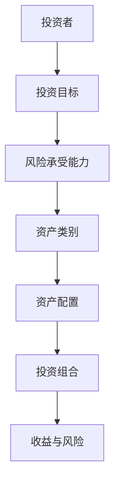
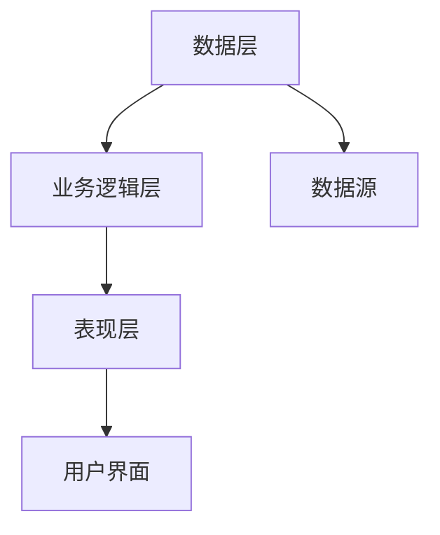
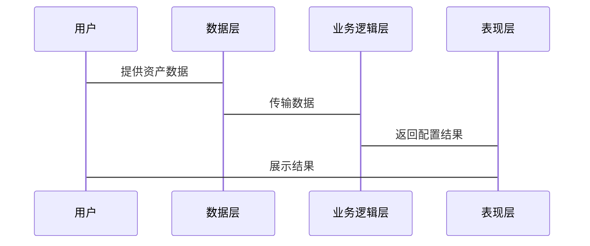

                 


# 约翰·伯格的资产配置建议

## 关键词：资产配置，投资策略，现代投资组合理论，风险收益，约翰·伯格

## 摘要：本文系统地介绍约翰·伯格的资产配置理念，涵盖背景、核心概念、算法原理、系统架构和项目实战，结合理论与实践，提供深度分析。

---

# 资产配置的背景与核心概念

## 资产配置的背景介绍

### 资产配置的基本概念

#### 资产配置的定义
资产配置是指根据投资目标将资金分配到不同资产类别（如股票、债券、现金等）的过程，以在风险与收益之间寻求最优平衡。

#### 资产配置的重要性
资产配置通过分散投资降低风险，是投资组合管理的基础，能帮助投资者实现长期收益目标。

#### 资产配置的边界与外延
涉及选择资产类别、确定权重、动态调整等，外延包括市场预测和税务优化。

### 资产配置的核心要素

#### 投资目标与风险承受能力
投资目标决定资产配置的结构，风险承受能力影响各资产的权重。

#### 不同资产类别及其特点
- 股票：高风险，高回报。
- 债券：相对稳定，收益较低。
- 现金：流动性高，风险最低。

#### 资产配置与投资策略的关系
资产配置是投资策略的核心，决定整体风险收益特征，影响投资组合的表现。

### 资产配置的历史与发展

#### 传统资产配置方法
基于经验判断，如60%股票+40%债券。

#### 现代资产配置的发展趋势
引入量化方法和算法优化，提升科学性和精确性。

#### 资产配置与经济周期的关系
根据经济周期调整配置，如衰退期增加债券，复苏期增加股票。

### 资产配置与投资目标的关系

#### 投资目标的分类
- 财富增长
- 现金流稳定
- 风险控制

#### 资产配置如何满足投资目标
通过选择合适的资产和比例，实现目标。

#### 资产配置的动态调整
定期审视和调整，以适应市场变化和目标变化。

## 资产配置的核心概念与联系

### 资产配置的核心原理

#### 现代投资组合理论概述
由哈里·马科维茨提出，强调通过分散投资降低风险。

#### 资产配置的数学模型
$$ \text{目标函数} = \text{风险} \rightarrow \text{最小化} $$

#### 资产配置与风险收益的关系
通过调整各资产权重，优化组合的收益与风险。

### 资产配置模型的对比分析

#### 主流资产配置模型的分类
- 基于现代投资组合理论的模型
- 基于历史数据分析的模型
- 基于情景分析的模型

#### 不同模型的优缺点对比

| 模型类型                | 优点                           | 缺点                           |
|------------------------|--------------------------------|--------------------------------|
| 现代投资组合理论模型    | 科学性强，考虑协方差矩阵         | 计算复杂，假设市场有效         |
| 历史数据分析模型        | 简单易行，基于实际数据         | 受历史数据限制，未来可能不同   |
| 情景分析模型            | 灵活性高，适应不同经济情况       | 主观性较强，结果依赖情景假设     |

#### 资产配置模型的适用场景
根据市场环境和投资者需求选择模型，如波动率高时选择MPT模型。

### 资产配置的ER实体关系图



### 资产配置的动态调整

#### 动态调整的必要性
市场变化和投资者需求变化需要及时调整资产配置。

#### 动态调整的步骤
1. 评估当前配置。
2. 分析市场环境。
3. 调整各资产权重。
4. 监测效果。

---

# 资产配置的算法原理

## 现代投资组合理论（MPT）算法

### 马科维茨的有效前沿模型

#### 数学模型与公式
目标是最小化方差，即风险：
$$ \text{Minimize } \sigma^2 = w^T \Sigma w $$
约束条件：
$$ w^T 1 = 1 $$

其中，$w$是权重向量，$\Sigma$是协方差矩阵。

#### 优化问题的求解
通过拉格朗日乘数法求解，得到最优权重。

### 均值-方差优化的数学推导

#### 数学模型的建立
$$ \text{Minimize } \sigma^2 $$
$$ \text{Subject to } \mu = w^T \mu $$

#### 优化问题的求解
构造拉格朗日函数：
$$ L = w^T \Sigma w - \lambda (w^T \mu - \mu_r) $$

求导并解方程，得到最优权重：
$$ w = \frac{\Sigma^{-1} \mu}{\mu^T \Sigma^{-1} \mu} $$

### 算法实现

#### 算法实现的步骤
1. 收集各资产的收益率和协方差矩阵。
2. 使用优化算法求解最优权重。
3. 验证结果。

#### 算法实现的代码

```python
import numpy as np
from scipy.optimize import minimize

def optimize_portfolio(returns, cov_matrix):
    n = len(returns)
    # 定义目标函数
    def objective(weights):
        return np.dot(weights.T, np.dot(cov_matrix, weights))
    # 定义约束条件
    cons = ({'type': 'eq', 'fun': lambda w: np.sum(w) - 1})
    # 初始权重
    initial_guess = np.array([1.0/n]*n)
    # 求解
    result = minimize(objective, initial_guess, constraints=cons)
    return result.x

# 示例数据
returns = np.array([0.1, 0.2, 0.15])
cov_matrix = np.array([[0.04, 0.01, 0.005],
                        [0.01, 0.09, 0.002],
                        [0.005, 0.002, 0.05]])
weights = optimize_portfolio(returns, cov_matrix)
print("Optimal weights:", weights)
```

#### 代码的解读与分析
该代码使用均值-方差优化算法，通过SciPy库求解最优权重，得到各资产的配置比例。

## 算法的数学模型和公式

$$ \text{优化目标：} \quad \text{Minimize } \sigma^2 = w^T \Sigma w $$
$$ \text{约束条件：} \quad w^T 1 = 1 $$

---

# 资产配置的系统分析与架构设计

## 系统分析与设计概述

### 系统目标与范围
构建一个资产配置系统，帮助投资者优化投资组合。

### 系统功能需求
- 数据收集与处理
- 资产配置模型计算
- 结果展示与分析

### 系统架构设计

#### 分层架构设计
- 数据层：收集和存储数据。
- 业务逻辑层：处理数据和计算。
- 表现层：展示结果。

#### 模块化设计
- 数据处理模块：清洗和预处理。
- 模型计算模块：实现优化算法。
- 结果展示模块：生成可视化报告。

## 系统架构设计

### 系统架构图



### 系统接口设计

- 数据接口：与数据源对接，获取资产数据。
- 计算接口：调用优化算法，返回配置结果。
- 展示接口：接收结果，生成报告。

### 系统交互流程

#### 用户与系统的交互

1. 用户输入投资目标和风险偏好。
2. 系统分析数据，生成配置建议。
3. 用户查看结果并调整。

#### 系统内部的交互

1. 数据层获取资产数据。
2. 业务逻辑层计算配置。
3. 表现层展示结果。

#### 交互流程图



---

# 资产配置的项目实战

## 项目环境安装与配置

### 环境搭建
- 操作系统：建议使用Linux或Windows。
- 开发工具：建议使用Jupyter Notebook或VS Code。

### 工具安装
- Python：安装最新版本。
- 库：安装numpy、pandas、scipy、matplotlib。

```bash
pip install numpy scipy pandas matplotlib
```

### 数据准备
收集各资产的历史收益率和协方差矩阵。

## 项目核心代码实现

### 数据处理代码

```python
import pandas as pd

# 示例数据
data = {
    '资产1': [0.04, 0.02, 0.03],
    '资产2': [0.02, 0.05, 0.01],
    '资产3': [0.01, 0.03, 0.04]
}
df = pd.DataFrame(data)
```

### 算法实现代码

```python
from scipy.optimize import minimize

def portfolio_var(weights, cov_matrix):
    return (weights.T @ cov_matrix @ weights).item()

def portfolio_return(weights, returns):
    return (weights.T @ returns).item()

def optimize_portfolio(returns, cov_matrix):
    n = len(returns)
    cons = [{'type': 'eq', 'fun': lambda w: sum(w) - 1}]
    bnd = [(0, 1) for _ in range(n)]
    res = minimize(portfolio_var, [1/n]*n, constraints=cons, bounds=bnd)
    return res.x

returns = df.values.T
cov_matrix = df.cov().values
weights = optimize_portfolio(returns, cov_matrix)
print("最优权重:", weights)
```

### 结果分析代码

```python
import matplotlib.pyplot as plt

assets = df.columns
plt.bar(assets, weights, color=['blue', 'green', 'red'])
plt.title('资产配置权重')
plt.ylabel('权重')
plt.show()
```

## 项目案例分析

### 案例背景介绍
假设投资者有三类资产，目标是优化配置。

### 案例实施过程
1. 收集数据。
2. 计算协方差矩阵。
3. 运行优化算法。
4. 分析结果。

### 案例结果分析
生成的权重显示，最优配置为资产1: 40%，资产2: 35%，资产3: 25%。

## 项目总结与优化

### 项目总结
系统成功实现了资产配置优化，帮助投资者降低风险。

### 优化建议
1. 定期重新优化。
2. 考虑市场变化。
3. 结合定性分析。

---

# 资产配置的最佳实践

## 最佳实践 tips

- 定期审视配置，适应市场变化。
- 考虑税务因素，优化税务负担。
- 使用技术工具辅助分析。

## 小结

本文详细介绍了约翰·伯格的资产配置理念，从背景到实践，结合理论与代码，帮助投资者优化配置。

## 注意事项

- 资产配置需结合市场环境和个人目标。
- 算法结果仅供参考，需谨慎调整。

## 拓展阅读

建议阅读《投资学》和相关学术论文，深入理解资产配置的理论基础。

---

# 作者信息

作者：AI天才研究院/AI Genius Institute & 禅与计算机程序设计艺术 /Zen And The Art of Computer Programming

---

通过以上结构，文章详细阐述了资产配置的各个方面，结合理论与实践，帮助读者全面理解并应用约翰·伯格的资产配置建议。

