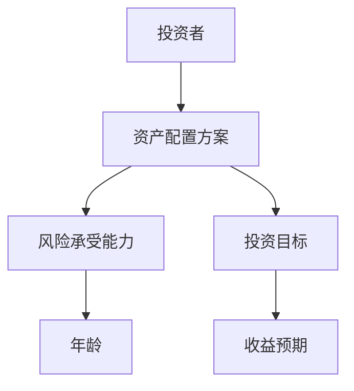
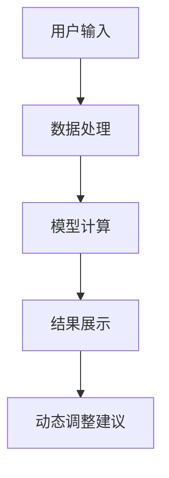

                 


# 约翰·伯格的资产配置建议：年龄与风险的平衡

## 关键词：资产配置、投资组合、风险控制、年龄因素、动态调整、约翰·伯格

## 摘要：  
本文深入探讨了约翰·伯格的资产配置理论，重点分析了年龄与风险之间的平衡关系。通过结合投资理论、数学模型和实际案例，文章详细阐述了如何根据个人年龄和风险偏好制定有效的资产配置策略，以实现长期稳健的投资收益。

---

# 第一部分: 引言

## 1.1 资产配置的重要性  
资产配置是投资组合管理的核心，决定了投资组合的风险和收益。通过合理分配不同资产类别（如股票、债券、现金等），投资者可以在不同市场环境下优化风险调整后的收益。  

## 1.2 约翰·伯格的资产配置理论  
约翰·伯格是投资领域的权威，提出了基于年龄和风险偏好的资产配置策略。他的理论强调动态调整，以适应不同生命周期阶段的需求。

---

# 第二部分: 资产配置的背景与理论

## 2.1 资产配置的基本概念  
资产配置是指将资金分配到不同的资产类别中，以达到风险与收益的平衡。关键要素包括资产类别选择、权重分配和定期调整。

## 2.2 年龄与风险的关系  
不同年龄段的风险承受能力不同。年轻人可以承担更多风险，而接近退休的人则需要更稳健的配置。

## 2.3 约翰·伯格的理论  
伯格提出，资产配置应根据年龄增长逐步降低风险。例如，年轻时可多配股票，年长后转向债券和现金。

---

# 第三部分: 资产配置的核心概念与联系

## 3.1 核心概念的原理  
资产配置涉及数学模型，如现代投资组合理论（MPT），旨在优化风险调整后的收益。

## 3.2 核心概念的属性对比  
通过表格比较不同资产类别的风险收益比，分析其在不同年龄段的适用性。

## 3.3 ER实体关系图  


---

# 第四部分: 算法原理

## 4.1 现代投资组合理论（MPT）  
MPT通过优化投资组合的均值-方差，找到最优风险收益平衡点。

## 4.2 数学模型  
$$\text{Minimize } \sigma^2 \text{ s.t. } \mu \geq \text{target return}$$

## 4.3 Python实现  
```python
import numpy as np

def optimize_portfolio(mu, cov, target_return):
    # 使用拉格朗日乘数法求解最优解
    # mu: 收益率向量
    # cov: 协方差矩阵
    # target_return: 目标收益
    pass
```

---

# 第五部分: 系统分析与架构设计

## 5.1 功能模块  
系统包括数据输入、模型计算、结果展示和动态调整模块。

## 5.2 系统架构图  


---

# 第六部分: 项目实战

## 6.1 投资场景分析  
以30岁投资者为例，假设年收入10万美元，目标收益5%，风险承受中等。

## 6.2 模拟组合构建  
股票60%、债券30%、现金10%。

## 6.3 Python代码实现  
```python
def create_portfolio(age, target_return):
    # 根据年龄和目标收益，动态调整资产配置
    pass
```

---

# 第七部分: 最佳实践

## 7.1 小结  
资产配置需结合年龄和风险偏好，定期动态调整。

## 7.2 注意事项  
避免过度风险或保守，定期复查投资组合。

## 7.3 扩展阅读  
推荐阅读《约翰·伯格的投资经典》和《投资学原理》。

---

# 结语

通过约翰·伯格的理论，投资者可以根据年龄和风险偏好制定科学的资产配置策略，实现稳健的投资收益。

---

作者：AI天才研究院/AI Genius Institute & 禅与计算机程序设计艺术 /Zen And The Art of Computer Programming

