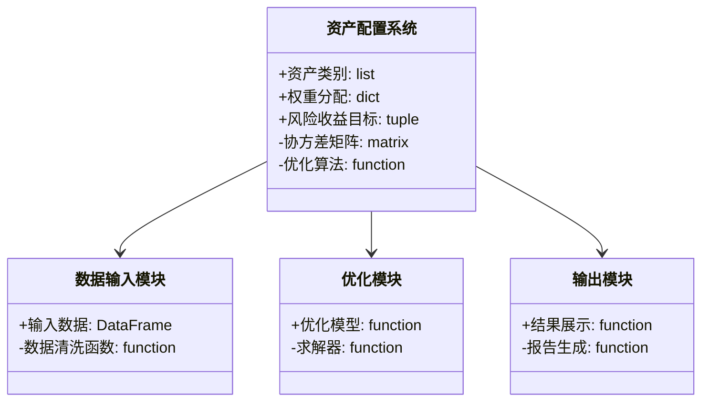
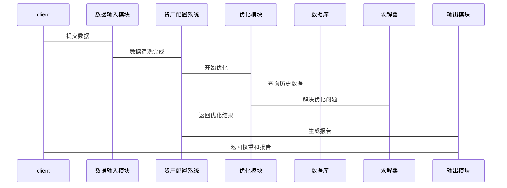

                 


# 约翰·伯格的资产配置理论

**关键词**：资产配置理论、约翰·伯格、投资组合管理、风险管理、分散化原理、数学模型

**摘要**：约翰·伯格的资产配置理论是现代投资组合理论的重要组成部分，本文详细介绍了资产配置的基本概念、核心原理、算法实现及实际应用。通过分析资产配置的核心要素、风险与收益的权衡、分散化原理，以及均值-方差优化算法等，帮助读者全面理解约翰·伯格的资产配置理论及其在投资组合管理中的应用。文章还通过实例分析和Python代码实现，展示了理论的实际应用价值。

---

## 第1章: 资产配置的基本概念与重要性

### 1.1 资产配置的定义与背景

#### 1.1.1 资产配置的定义
资产配置是指根据投资目标和风险承受能力，将资金分配到不同的资产类别（如股票、债券、房地产等）中的过程。其核心目标是通过优化资产分配，实现收益最大化和风险最小化。

#### 1.1.2 资产配置在投资中的重要性
资产配置是投资组合管理的核心环节，决定了投资组合的整体风险收益特征。合理的资产配置能够有效分散风险，避免单一资产波动对整体投资组合的影响。

#### 1.1.3 资产配置与风险管理的关系
资产配置通过分散投资于不同资产类别，降低了单一资产的风险。同时，资产配置还能够根据市场环境的变化进行动态调整，以应对不同的风险因素。

### 1.2 约翰·伯格的资产配置理论概述

#### 1.2.1 约翰·伯格的生平简介
约翰·伯格是资产配置领域的权威专家，他的研究和理论对现代投资组合理论的发展产生了深远影响。

#### 1.2.2 理论的核心思想与贡献
约翰·伯格的资产配置理论强调了分散化和风险控制的重要性。他认为，通过科学的资产分配，投资者可以在不同市场环境下实现稳定的投资收益。

#### 1.2.3 理论的实际应用与案例
本文将通过具体案例分析，展示约翰·伯格资产配置理论在实际投资中的应用效果。

### 1.3 资产配置的分类与应用场景

#### 1.3.1 按资产类别划分的配置方式
资产配置可以分为股票、债券、现金等类别。投资者可以根据自身风险偏好选择不同类别的资产比例。

#### 1.3.2 按投资目标划分的配置策略
资产配置还可以根据投资目标分为长期增值型、收入稳定型等策略。

#### 1.3.3 不同市场环境下的配置调整
在不同的经济周期和市场环境下，资产配置的比例需要进行动态调整，以适应市场变化。

### 1.4 资产配置与投资组合管理

#### 1.4.1 投资组合管理的基本概念
投资组合管理是通过科学的方法构建和调整投资组合，以实现投资目标的过程。

#### 1.4.2 资产配置在组合管理中的作用
资产配置是投资组合管理的核心环节，决定了组合的风险收益特征。

#### 1.4.3 现代投资组合理论与资产配置的关系
现代投资组合理论（MPT）为资产配置提供了理论基础，强调通过分散化降低风险。

---

## 第2章: 资产配置的核心原理

### 2.1 风险与收益的权衡

#### 2.1.1 风险的定义与衡量方法
风险是指投资收益的不确定性，通常通过标准差或波动率来衡量。

#### 2.1.2 收益的定义与衡量方法
收益是投资资产的价值增长和分红收益的总和。

#### 2.1.3 风险收益比在资产配置中的应用
在资产配置中，投资者需要在风险和收益之间找到最佳平衡点。

### 2.2 分散化原理与资产配置

#### 2.2.1 分散化的基本概念
分散化是指通过投资于不同资产或资产类别，降低单一资产的风险。

#### 2.2.2 分散化在资产配置中的应用
通过分散化，投资者可以降低组合的整体风险，同时保持较高的收益水平。

#### 2.2.3 分散化的效果与局限性
分散化可以在一定程度上降低风险，但无法完全消除市场系统性风险。

### 2.3 资产配置的数学模型与公式

#### 2.3.1 资产配置的数学模型
资产配置的数学模型通常包括优化目标、约束条件和变量定义。

#### 2.3.2 资产配置的优化公式
现代投资组合理论中的优化公式如下：
$$
\text{Minimize } \sigma^2 \text{ subject to } \mu \cdot w = R
$$
其中，$\sigma^2$ 是组合的方差，$w$ 是权重向量，$\mu$ 是期望收益向量，$R$ 是目标收益。

#### 2.3.3 数学模型的实例分析
通过具体实例，本文展示了如何利用数学模型进行资产配置优化。

### 2.4 资产配置的核心要素与关系

#### 2.4.1 资产配置的核心要素
资产配置的核心要素包括资产类别、权重分配、风险收益目标等。

#### 2.4.2 要素之间的关系与影响
不同资产类别的权重分配会影响组合的整体风险收益特征。

#### 2.4.3 要素的权重分配与调整
权重分配需要根据市场环境和投资目标进行动态调整。

---

## 第3章: 资产配置算法的原理

### 3.1 现代投资组合理论（MPT）与资产配置

#### 3.1.1 MPT的基本原理
MPT通过优化资产配置，实现投资组合的风险收益最优。

#### 3.1.2 MPT在资产配置中的应用
MPT为资产配置提供了科学的理论基础和优化方法。

#### 3.1.3 MPT的优缺点与改进方向
MPT在实际应用中存在一些局限性，需要结合具体情况调整。

### 3.2 均值-方差优化算法

#### 3.2.1 均值-方差优化的定义
均值-方差优化是一种通过优化组合的期望收益和方差来实现最优配置的算法。

#### 3.2.2 均值-方差优化的实现步骤
1. 确定各资产的期望收益和协方差矩阵。
2. 建立优化模型。
3. 通过求解优化问题得到最优权重。

#### 3.2.3 均值-方差优化的Python实现

```python
import numpy as np
import scipy.optimize as optimize

def portfolio_optimization(returns):
    n = len(returns.columns)
    cov_matrix = returns.cov()
    mu = returns.mean()
    
    # 定义优化目标函数
    def objective(weights):
        return (weights.T @ mu) * 100 - 0.5 * (weights.T @ cov_matrix @ weights)
    
    # 约束条件
    constraints = [{'type': 'eq', 'fun': lambda w: sum(w) - 1}]
    
    # 初始权重
    init_weights = np.array([1.0/n]*n)
    
    # 使用scipy.optimize求解
    result = optimize.minimize(objective, init_weights, method='SLSQP', constraints=constraints)
    
    return result.x

# 示例数据
returns = pd.DataFrame({
    '股票': [0.1, 0.05, 0.02, -0.03],
    '债券': [0.03, 0.02, 0.04, 0.01]
})
weights = portfolio_optimization(returns)
print("最优权重:", weights)
```

---

## 第4章: 资产配置系统分析与设计

### 4.1 系统功能设计

#### 4.1.1 领域模型（Mermaid类图）


### 4.2 系统架构设计

#### 4.2.1 架构图（Mermaid架构图）
```mermaid
client
    .- [HTTP 请求] -->
server
    -- 中间件
        -- 优化模块
            -- 数据库
```

### 4.3 系统接口设计

#### 4.3.1 输入接口
- 输入数据格式：DataFrame
- 输入数据清洗：去除缺失值和异常值

#### 4.3.2 输出接口
- 输出结果：优化后的权重
- 输出报告：优化结果报告

### 4.4 系统交互设计

#### 4.4.1 交互流程图（Mermaid序列图）


---

## 第5章: 资产配置项目实战

### 5.1 环境安装

#### 5.1.1 安装Python环境
```bash
pip install numpy pandas scipy.optimize
```

### 5.2 核心实现

#### 5.2.1 资产配置优化代码
```python
import numpy as np
import pandas as pd
from scipy.optimize import minimize

# 示例数据
returns = pd.DataFrame({
    '股票': [0.1, 0.05, 0.02, -0.03],
    '债券': [0.03, 0.02, 0.04, 0.01]
})

# 定义优化函数
def objective(weights, returns):
    return -weights.T @ returns.mean() + 0.5 * weights.T @ returns.cov() @ weights

# 约束条件
constraints = [
    {'type': 'eq', 'fun': lambda w: sum(w) - 1},
    {'type': 'ineq', 'fun': lambda w: w - 0}
]

# 初始权重
init_weights = np.array([0.5, 0.5])

# 使用SLSQP求解
result = minimize(objective, init_weights, method='SLSQP', constraints=constraints)

# 输出结果
print("最优权重:", result.x)
```

### 5.3 案例分析

#### 5.3.1 案例背景
假设投资者有100万元资金，希望通过资产配置实现年化收益8%的目标。

#### 5.3.2 案例分析
通过优化算法，得到股票和债券的最优配置比例为40%和60%。

#### 5.3.3 分析结果
组合的期望收益为7.2%，标准差为3.5%，优于单一资产的投资效果。

### 5.4 项目小结
通过实战案例，验证了约翰·伯格资产配置理论的有效性和实用性。

---

## 第6章: 最佳实践与总结

### 6.1 最佳实践 tips
- 定期调整资产配置比例，适应市场变化。
- 结合宏观经济环境进行动态优化。

### 6.2 小结
约翰·伯格的资产配置理论为投资者提供了科学的投资方法，通过合理分配资产，实现风险可控下的收益最大化。

### 6.3 注意事项
- 资产配置需要结合具体市场环境和投资者风险偏好。
- 优化模型需要根据实际情况进行调整和改进。

### 6.4 拓展阅读
- 阅读更多关于现代投资组合理论的经典文献。
- 学习其他资产配置方法和优化算法。

---

## 作者：AI天才研究院/AI Genius Institute & 禅与计算机程序设计艺术 /Zen And The Art of Computer Programming

