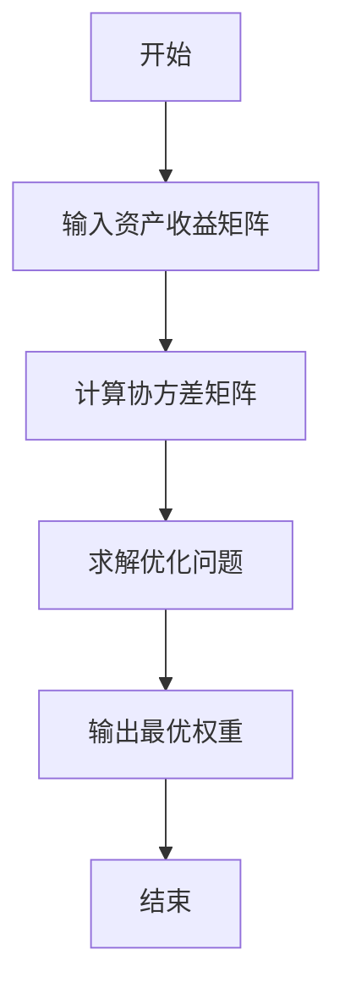
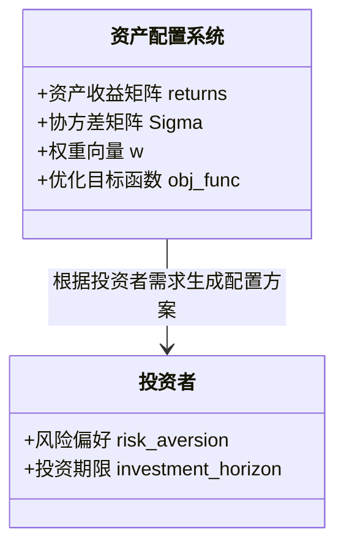

                 


# 《约翰·伯格的资产配置理论》

> 关键词：资产配置理论、投资组合优化、风险收益平衡、均值-方差模型、现代投资组合理论

> 摘要：本文系统阐述了约翰·伯格的资产配置理论，从理论基础、数学模型、算法实现到系统架构，详细分析了资产配置的核心原理和应用场景。文章结合实际案例，深入探讨了资产配置的策略选择和风险控制，并通过代码实现和图表展示，为读者提供了全面的理解和应用指导。

---

## 第一部分: 资产配置理论概述

### 第1章: 资产配置理论的背景与定义

#### 1.1 资产配置的基本概念

##### 1.1.1 资产配置的定义与核心要素
资产配置是指将投资组合中的资金分配到不同的资产类别（如股票、债券、现金等）中，以实现风险和收益的优化平衡。其核心要素包括：
1. **资产类别**：股票、债券、现金等。
2. **权重分配**：每类资产在组合中的比例。
3. **目标函数**：最大化收益或最小化风险。
4. **约束条件**：如总权重为1，流动性要求等。

##### 1.1.2 资产配置与投资组合管理的关系
资产配置是投资组合管理的核心步骤，决定了组合的风险收益特征。通过科学的资产配置，投资者可以在不同市场环境下调整组合的敏感性，实现长期收益目标。

##### 1.1.3 资产配置的分类与应用场景
资产配置可分为**战略配置**（长期目标驱动）和**战术配置**（短期调整）。其应用场景包括养老金管理、保险资金配置和机构投资组合优化。

#### 1.2 资产配置的理论基础

##### 1.2.1 马科维茨的现代投资组合理论（MPT）
现代投资组合理论由哈里·马科维茨提出，认为最优资产配置是使风险最小化（在给定收益下）或收益最大化（在给定风险下）的组合。其数学模型如下：

$$
\min_w \left( w^T \Sigma w \right) \quad \text{subject to} \quad \sum_{i=1}^n w_i = 1
$$

其中，$w$ 是权重向量，$\Sigma$ 是协方差矩阵。

##### 1.2.2 均值-方差优化模型
均值-方差模型是MPT的核心，通过优化组合的方差（风险）来实现收益与风险的最优平衡。

##### 1.2.3 资产配置与风险收益平衡
资产配置的核心在于在风险与收益之间找到平衡点。通过调整各类资产的权重，投资者可以在不同市场环境下优化组合的风险收益比。

---

### 第2章: 资产配置的核心原理

#### 2.1 资产配置的数学模型

##### 2.1.1 投资组合优化的数学公式
目标函数：$$ \text{最小化风险} \quad \rightarrow \quad w^T \Sigma w $$
约束条件：
1. $$ \sum_{i=1}^n w_i = 1 $$
2. $$ w \geq 0 $$

##### 2.1.2 资产配置的约束条件与目标函数
资产配置的目标函数通常是风险的最小化或收益的最大化。约束条件包括权重的非负性和总和为1。

#### 2.2 资产配置的属性特征对比
不同资产类别的风险收益特征如下表所示：

| 资产类别 | 风险 | 收益 |
|----------|------|------|
| 股票     | 高   | 高   |
| 债券     | 中   | 中   |
| 现金     | 低   | 低   |

#### 2.3 资产配置的ER实体关系图


---

## 第二部分: 资产配置策略与算法

### 第3章: 资产配置策略

#### 3.1 基于现代投资组合理论的资产配置

##### 3.1.1 均值-方差优化
均值-方差优化是MPT的核心方法，通过优化权重矩阵来实现风险收益的平衡。

##### 3.1.2 投资者风险偏好与有效前沿
投资者的风险偏好决定了其在有效前沿上的位置。有效前沿是所有最优组合的集合，代表在给定风险下收益最高或在给定收益下风险最低的组合。

#### 3.2 基于风险平价的资产配置

##### 3.2.1 风险平价的概念
风险平价是一种资产配置方法，旨在将组合的总风险在不同资产类别间分配为相等的贡献。

##### 3.2.2 风险平价的实现步骤
1. 计算各资产的风险贡献。
2. 调整各资产的权重，使风险贡献相等。

#### 3.3 基于情景分析的资产配置

##### 3.3.1 情景分析法的原理
情景分析法通过模拟不同经济环境下的资产表现，调整组合权重以适应不同场景。

##### 3.3.2 不同经济周期下的资产配置策略
经济周期不同，资产配置策略应相应调整。例如，在经济衰退期增加债券配置，在经济复苏期增加股票配置。

---

### 第4章: 资产配置算法实现

#### 4.1 均值-方差优化算法

##### 4.1.1 算法流程图


##### 4.1.2 Python代码实现
```python
import numpy as np

def mean_variance_optimization(returns):
    n = len(returns.columns)
    Sigma = returns.cov()
    mu = returns.mean()
    inv_Sigma = np.linalg.inv(Sigma)
    w = inv_Sigma @ mu / (mu.T @ inv_Sigma @ mu)
    return w
```

---

## 第三部分: 系统架构与实现

### 第5章: 系统架构与实现

#### 5.1 系统功能设计

##### 5.1.1 领域模型


#### 5.2 系统架构设计

##### 5.2.1 系统架构图


---

## 第四部分: 项目实战

### 第6章: 项目实战

#### 6.1 环境安装
```bash
pip install numpy pandas scikit-learn
```

#### 6.2 核心实现代码
```python
import numpy as np
import pandas as pd

# 示例数据：资产收益矩阵
returns = pd.DataFrame({
    '股票': [0.05, 0.03, 0.04],
    '债券': [0.02, 0.03, 0.02],
    '现金': [0.01, 0.01, 0.01]
})

# 资产配置优化
def mean_variance_optimization(returns):
    n = len(returns.columns)
    Sigma = returns.cov()
    mu = returns.mean()
    inv_Sigma = np.linalg.inv(Sigma)
    w = inv_Sigma @ mu / (mu.T @ inv_Sigma @ mu)
    return w

weights = mean_variance_optimization(returns)
print(weights)
```

---

## 总结

### 6.3 实战总结与注意事项

通过本文的详细讲解，读者可以全面理解约翰·伯格的资产配置理论，并掌握其在实际投资中的应用。在实现过程中，需注意以下几点：
- 数据的准确性和完整性。
- 优化算法的收敛性。
- 风险管理的重要性。

### 最佳实践 Tips

- 定期回顾和调整资产配置方案。
- 结合市场环境动态优化。
- 使用工具辅助计算和分析。

---

作者：AI天才研究院/AI Genius Institute & 禅与计算机程序设计艺术 /Zen And The Art of Computer Programming

---

通过本文的系统阐述，读者可以深入理解资产配置理论的核心原理和实际应用。从理论到实践，从算法到系统，本文为读者提供了一套完整的资产配置解决方案。

