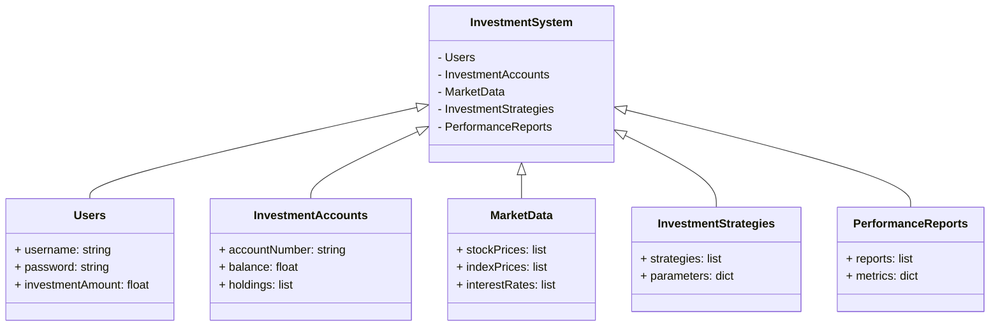
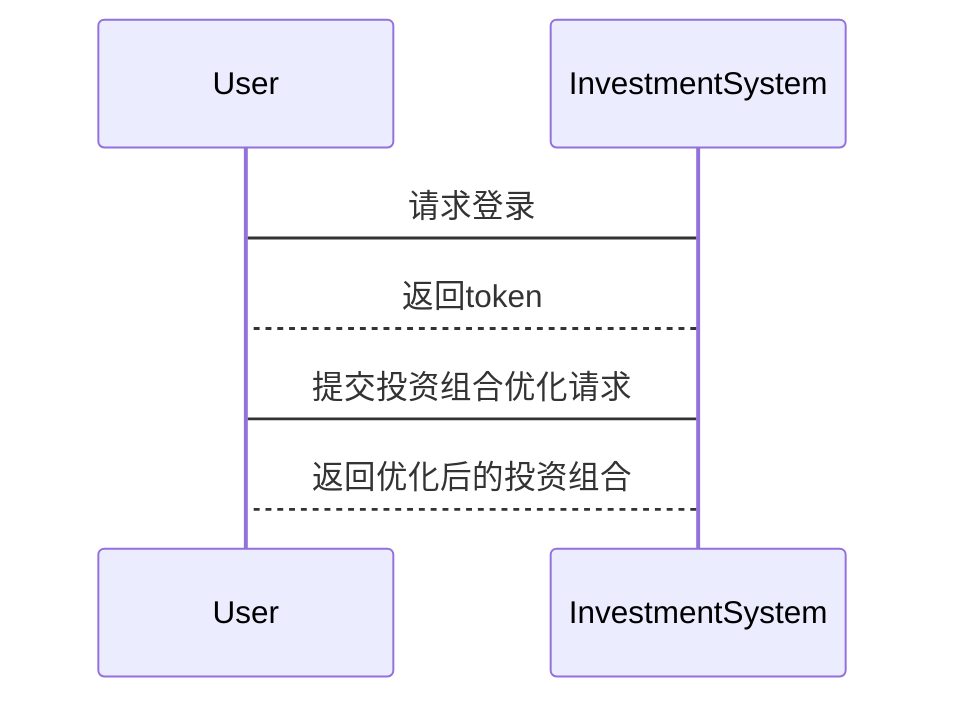

                 


# 约翰·伯格的遗产：被动投资的未来

> 关键词：被动投资、指数基金、约翰·伯格、资本资产定价模型（CAPM）、现代投资组合理论（MPT）

> 摘要：被动投资是一种通过指数基金或交易所交易基金（ETF）等工具，以市场平均收益为目标的投资策略。本文将探讨被动投资的背景、核心概念、算法原理、系统架构，并通过项目实战案例，分析约翰·伯格的遗产对被动投资未来的影响。我们将从理论到实践，逐步深入，揭示被动投资在技术与市场环境下的发展。

---

## 第1章：被动投资的兴起与约翰·伯格的遗产

### 1.1 被动投资的定义与背景

#### 1.1.1 从主动投资到被动投资的演变

被动投资是一种长期投资策略，其核心理念是通过投资于市场指数或代表性股票组合，以获得市场平均收益。这种方法与主动投资不同，后者依赖于精选个股、市场时机选择和积极的交易策略。被动投资的兴起源于对市场有效性的认可，即市场的价格通常是合理的，主动管理难以持续跑赢市场。

#### 1.1.2 约翰·伯格的贡献与影响

约翰·伯格（John C. Bogle）被誉为被动投资的先驱。他是 Vanguard 集团的创始人，于 1975 年推出了第一只现代指数基金——Vanguard 指数基金。伯格的贡献在于他证明了指数基金的长期收益潜力，并强调了低成本和分散化的重要性。他的理念颠覆了传统的主动投资模式，推动了被动投资的普及。

#### 1.1.3 当前的市场环境

截至2023年，被动投资在全球范围内呈现指数级增长。投资者越来越倾向于选择低成本、低风险的投资工具。ETF市场的扩张和机构投资者的多样化需求进一步推动了被动投资的发展。然而，被动投资并非没有挑战，如市场波动、费用结构和税收效率等问题仍需解决。

### 1.2 约翰·伯格的遗产

#### 1.2.1 约翰·伯格的生平简介

约翰·伯格于1934年出生，早年在宾夕法尼亚大学学习，后来转向沃顿商学院。他最初在FIDELITY工作，后来在1974年创立了Vanguard集团，专注于低成本指数基金。他的职业生涯致力于推广被动投资理念，强调长期投资和分散化的重要性。

#### 1.2.2 指数基金的起源与发展

指数基金的概念可以追溯到20世纪30年代，但真正的发展始于1975年。伯格的Vanguard指数基金是第一只追踪市场指数的低成本基金。随后，ETF的出现进一步推动了被动投资的发展。ETF允许投资者在交易所像股票一样买卖基金，提高了流动性和透明度。

#### 1.2.3 约翰·伯格的投资理念与策略

伯格的理念基于以下几点：
1. **市场有效性**：市场通常是有效的，难以通过主动管理持续跑赢市场。
2. **低成本**：降低费用是实现长期收益的关键因素。
3. **分散化**：通过投资于广泛市场的指数，分散个券风险。
4. **长期投资**：避免频繁交易，减少成本和税收影响。

---

## 第2章：被动投资的核心概念与理论基础

### 2.1 投资理论基础

#### 2.1.1 马科维茨的现代投资组合理论

哈里·马科维茨（Harry Markowitz）提出的现代投资组合理论（MPT）是被动投资的重要理论基础。MPT指出，通过合理配置资产，可以实现风险最小化的同时获得最大收益。这一理论强调分散化的重要性，即通过投资不同资产或资产类别来降低风险。

#### 2.1.2 坍缩资产定价模型（CAPM）

CAPM是另一个关键的理论工具，用于计算资产的预期收益。公式为：

$$
E(R_i) = R_f + \beta_i (E(R_m) - R_f)
$$

其中：
- \( E(R_i) \) 是资产的预期收益率。
- \( R_f \) 是无风险利率。
- \( \beta_i \) 是资产的贝塔系数，衡量其相对于市场的波动性。
- \( E(R_m) \) 是市场预期收益率。

CAPM帮助投资者评估资产的定价是否合理，从而为被动投资提供了理论依据。

#### 2.1.3 资本资产定价模型（CAPM）的公式与应用

CAPM不仅用于评估单个资产，还可以用于评估投资组合的预期收益。通过比较实际收益与预期收益，投资者可以判断市场是否被高估或低估。

### 2.2 被动投资的核心概念与理论

#### 2.2.1 指数基金的定义与特点

指数基金通过追踪特定指数（如标普500）来实现投资目标。其特点包括：
- **低成本**：管理费用低。
- **分散化**：投资于广泛市场，降低风险。
- **被动管理**：定期再平衡，无需频繁交易。

#### 2.2.2 ETF（交易所交易基金）的运作机制

ETF是一种在交易所上市交易的基金，具有以下特点：
- **透明性**：投资者可以实时查看其净值。
- **流动性**：可以在交易所随时买卖。
- **多样性**：涵盖股票、债券等多种资产。

#### 2.2.3 被动投资与主动投资的对比分析

| **方面**         | **被动投资**                          | **主动投资**                          |
|------------------|-------------------------------------|--------------------------------------|
| 管理方式         | 跟踪指数或市场组合                   | 主动选择个股或时机                   |
| 成本             | 通常较低                             | 通常较高（管理费、交易费）           |
| 风险             | 分散化风险较低                        | 集中风险较高                        |
| 业绩             | 通常接近市场平均收益                 | 可能跑赢或跑输市场                   |

### 2.3 约翰·伯格的指数基金策略

#### 2.3.1 指数基金的成本优势

低成本是被动投资的核心优势。指数基金的管理费用（ expense ratio）通常远低于主动管理基金。例如，Vanguard的指数基金费用率仅为0.1%。

#### 2.3.2 指数基金的风险分散特性

通过广泛分散投资，指数基金降低了非系统性风险。例如，投资于标普500指数的基金几乎涵盖了美国最大的500家公司，减少了单一股票的风险。

#### 2.3.3 约翰·伯格的长期投资理念

伯格强调长期投资的重要性，认为短期波动不应影响投资决策。他提倡定期定额投资，以平滑市场波动带来的影响。

---

## 第3章：被动投资的算法与数学模型

### 3.1 被动投资的数学模型与算法

#### 3.1.1 资本资产定价模型（CAPM）的公式与实现

CAPM的公式可以用于计算指数基金的预期收益率。例如，假设无风险利率为2%，市场预期收益率为8%，贝塔系数为1（市场平均），则预期收益率为：

$$
E(R_i) = 2\% + 1 \times (8\% - 2\%) = 8\%
$$

#### 3.1.2 使用Python实现CAPM模型

以下是一个简单的Python代码示例：

```python
def capm(risk_free_rate, market_return, beta):
    return risk_free_rate + beta * (market_return - risk_free_rate)

# 示例计算
rf = 0.02  # 无风险利率，2%
rm = 0.08  # 市场预期收益率，8%
beta = 1.0  # 贝塔系数

expected_return = capm(rf, rm, beta)
print(f"预期收益率为：{expected_return * 100}%")
```

#### 3.1.3 CAPM在被动投资中的应用

CAPM可以帮助投资者评估指数基金的预期收益，从而做出投资决策。例如，如果实际收益率低于预期，可能意味着市场被高估。

### 3.2 现代投资组合理论（MPT）的实现

#### 3.2.1 使用MPT进行投资组合优化

MPT的目标是通过优化资产配置，实现风险最小化或收益最大化。以下是一个简单的优化算法：

```python
import numpy as np

def optimize_portfolio(returns, covariance):
    n = len(returns)
    ones = np.ones(n)
    inv_covariance = np.linalg.inv(covariance)
    weights = inv_covariance @ ones / (ones.T @ inv_covariance @ ones)
    return weights

# 示例数据
returns = np.array([0.1, 0.12, 0.08])
covariance = np.array([[0.04, 0.01, 0.02],
                       [0.01, 0.06, 0.015],
                       [0.02, 0.015, 0.08]])

weights = optimize_portfolio(returns, covariance)
print("最优权重为：", weights)
```

#### 3.2.2 使用MPT优化被动投资组合

通过MPT优化，投资者可以找到最优的资产配置，从而在风险和收益之间找到平衡点。这在被动投资中尤为重要，因为指数基金通常覆盖多个资产类别。

---

## 第4章：被动投资的系统架构与设计

### 4.1 系统分析与设计

#### 4.1.1 投资管理系统的需求分析

- **目标**：实现被动投资策略的自动化管理。
- **功能**：数据采集、风险评估、投资组合优化、绩效评估。
- **用户**：个人投资者、机构投资者。

#### 4.1.2 系统功能设计（领域模型）



#### 4.1.3 系统架构设计（分层架构）


### 4.2 系统接口与交互设计

#### 4.2.1 系统接口设计

- **API端点**：
  - `/api/login`
  - `/api/register`
  - `/api/portfolio/optimization`
  - `/api/reports/performance`

- **数据格式**：JSON

#### 4.2.2 系统交互流程（序列图）



---

## 第5章：被动投资的项目实战

### 5.1 环境配置与安装

#### 5.1.1 Python环境的搭建

安装Python和必要的库：

```bash
pip install numpy pandas matplotlib
```

#### 5.1.2 数据库与工具的安装

- **数据库**：使用SQLite或MySQL。
- **工具**：Jupyter Notebook、IDE（如PyCharm）。

#### 5.1.3 开发环境的配置

配置虚拟环境：

```bash
python -m venv env
source env/bin/activate
```

### 5.2 核心代码实现

#### 5.2.1 指数基金的选取与计算

```python
import pandas as pd

# 假设我们有指数成分股的历史数据
data = pd.read_csv('index_data.csv')
returns = data['Adj Close'].pct_change().dropna()
mean_return = returns.mean() * 100
print(f"平均收益率为：{mean_return}%")
```

#### 5.2.2 投资组合优化算法的实现

```python
import numpy as np
from scipy.optimize import minimize

def portfolio_optimization(returns, n_assets, covariance_matrix):
    n = n_assets
    ones = np.ones(n)
    inv_covariance = np.linalg.inv(covariance_matrix)
    weights = inv_covariance @ ones / (ones.T @ inv_covariance @ ones)
    return weights

# 示例数据
n_assets = 5
returns = np.random.rand(n_assets, 100) * 0.1
covariance_matrix = np.cov(returns.T)

weights = portfolio_optimization(returns.mean(), n_assets, covariance_matrix)
print("最优权重为：", weights)
```

#### 5.2.3 系统功能模块的实现

实现投资管理系统的核心功能模块，包括用户认证、数据采集、投资组合优化和绩效评估。

### 5.3 项目案例分析

#### 5.3.1 约翰·伯格指数基金的案例分析

分析Vanguard指数基金的历史表现，验证其低成本和分散化的优势。

#### 5.3.2 ETF投资组合优化的案例分析

使用实际市场数据优化一个ETF投资组合，评估其风险和收益。

#### 5.3.3 项目实现的优缺点分析

- **优点**：低成本、高透明度、自动化。
- **缺点**：需要依赖数据源和算法的准确性，市场波动可能影响表现。

---

## 第6章：被动投资的未来与发展

### 6.1 被动投资的未来趋势

#### 6.1.1 技术驱动的被动投资

人工智能和大数据技术的应用将推动被动投资的进一步发展，如智能指数化投资和动态风险评估。

#### 6.1.2 区块链技术的影响

区块链技术可以提高交易透明度和安全性，降低交易成本，进一步推动被动投资的发展。

#### 6.1.3 约翰·伯格的遗产

伯格的低成本和分散化理念将继续影响被动投资的发展，推动更多投资者采用指数基金策略。

### 6.2 约翰·伯格的遗产对被动投资未来的影响

约翰·伯格的遗产不仅仅是指数基金的发明，更是对投资理念的革新。他的低成本、分散化和长期投资的理念将继续指导未来的被动投资策略。

### 6.3 对被动投资的展望

随着技术的进步和市场的成熟，被动投资将继续占据重要地位。投资者将更多地依赖技术手段进行投资决策，被动投资也将更加个性化和智能化。

---

## 作者：AI天才研究院 & 禅与计算机程序设计艺术

---

通过以上思考过程，我们可以看到，被动投资的未来将更加依赖于技术的进步和理论的深化。约翰·伯格的遗产不仅为被动投资奠定了基础，也为未来的投资策略提供了丰富的理论和实践基础。

