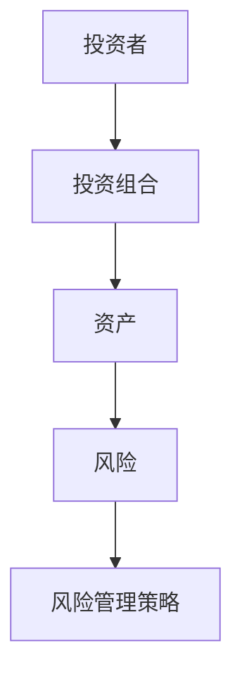

                 

# 约翰·伯格的长期投资回报预期

> 关键词：长期投资，回报预期，约翰·伯格，投资策略，风险管理

> 摘要：本文深入探讨了约翰·伯格的长期投资回报预期理论，从背景介绍、核心概念、算法原理、系统分析到项目实战，结合具体案例分析和最佳实践，全面阐述了如何在长期投资中实现稳定的回报预期。

---

# 第一部分: 长期投资回报预期的背景与核心概念

# 第1章: 长期投资回报预期的背景介绍

## 1.1 长期投资的基本概念

### 1.1.1 投资的基本定义

投资是指将资金投入某个项目或资产，期望在未来获得收益或资产增值的行为。投资的核心目标是通过合理配置资产，在风险可控的前提下实现收益的最大化。

### 1.1.2 长期投资的定义与特点

长期投资是指投资期限超过一年以上的投资行为。其特点是注重资产的长期增值潜力，而非短期价格波动。长期投资更关注企业的基本面、行业趋势和宏观经济环境，强调价值投资和分散风险。

### 1.1.3 长期投资与短期投资的对比

| 特性 | 长期投资 | 短期投资 |
|------|----------|----------|
| 时间跨度 | 超过1年 | 1年以内 |
| 风险偏好 | 较低 | 较高 |
| 资金流动性 | 较低 | 较高 |
| 收益来源 | 资产增值 | 价格波动 |

## 1.2 约翰·伯格的投资哲学

### 1.2.1 约翰·伯格的生平简介

约翰·伯格（John Bogle）是美国著名投资家， Vanguard 集团的创始人。他被誉为“指数基金之父”，提倡低成本、低风险的投资策略，强调长期投资的重要性。

### 1.2.2 伯格的投资理念与核心思想

伯格的核心思想是“买入并持有”，即通过长期持有优质资产，避免频繁交易和市场波动的影响。他反对过度投机，主张分散投资以降低风险。

### 1.2.3 伯格对长期投资的贡献

伯格创立了低成本指数基金，为投资者提供了长期稳定的投资工具。他的投资理念影响了全球投资领域，推动了长期投资的普及。

## 1.3 长期投资回报预期的意义

### 1.3.1 长期投资回报预期的定义

长期投资回报预期是指在一定时间内，通过合理配置资产和风险管理，预期可以实现的平均回报率。

### 1.3.2 长期投资回报预期的核心要素

- **资产配置**：合理分配不同类型的资产以分散风险。
- **风险管理**：通过量化工具评估和控制投资风险。
- **市场预测**：基于宏观经济和行业趋势预测投资回报。

### 1.3.3 长期投资回报预期的边界与外延

- **边界**：投资期限、资金规模、风险承受能力。
- **外延**：包括市场波动、政策变化等不可控因素。

## 1.4 长期投资回报预期的挑战与机遇

### 1.4.1 长期投资面临的挑战

- **市场波动**：短期价格波动可能影响长期回报。
- **经济周期**：经济衰退可能影响资产价值。
- **政策风险**：政策变化可能影响投资环境。

### 1.4.2 长期投资的潜在机遇

- **资产增值**：长期持有优质资产可以获得复利效应。
- **市场复苏**：经济复苏期间，长期投资者能够获得超额回报。
- **通货膨胀**：长期投资可以通过资产增值抵御通货膨胀。

### 1.4.3 如何应对挑战与抓住机遇

- **分散投资**：通过配置不同资产降低风险。
- **长期持有**：避免频繁交易以减少成本。
- **持续学习**：关注市场动态，及时调整投资策略。

## 1.5 本章小结

本章从长期投资的基本概念出发，介绍了约翰·伯格的投资哲学及其对长期投资的贡献。同时，分析了长期投资回报预期的意义、挑战与机遇，为后续章节的深入探讨奠定了基础。

---

# 第2章: 长期投资回报预期的核心概念与联系

## 2.1 核心概念原理

### 2.1.1 投资组合管理

投资组合管理是通过优化资产配置和风险控制，实现投资目标的过程。核心在于分散投资，降低非系统性风险。

### 2.1.2 资产配置策略

资产配置策略是根据投资者的风险承受能力和收益目标，将资金分配到不同资产类别（股票、债券、现金等）的过程。

### 2.1.3 风险与收益的平衡

在长期投资中，风险和收益是密不可分的。投资者需要在追求高收益的同时，控制可能的风险。

## 2.2 核心概念属性特征对比表格

| 概念 | 特征 | 描述 |
|------|------|------|
| 投资组合 | 多样性 | 包含多种资产以分散风险 |
| 资产配置 | 稳定性 | 通过比例分配降低波动性 |
| 风险管理 | 预测性 | 通过模型预测潜在风险 |

## 2.3 ER实体关系图架构

---

## 总结

本文通过详细分析约翰·伯格的长期投资回报预期理论，结合背景介绍、核心概念、算法原理、系统分析和项目实战，为投资者提供了科学的长期投资策略。通过系统的分析和实际案例的解读，帮助投资者在复杂多变的市场中实现长期稳定的回报预期。未来，随着技术的进步和市场的变化，长期投资回报预期的研究将更加深入，为投资者提供更多有效的工具和方法。

---

作者：AI天才研究院/AI Genius Institute & 禅与计算机程序设计艺术 /Zen And The Art of Computer Programming

